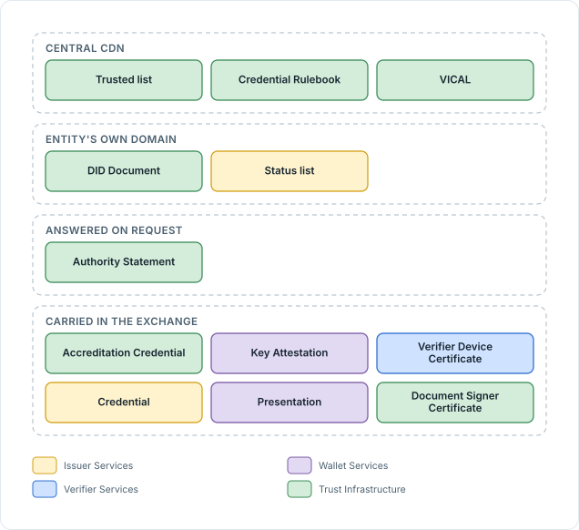

<!-- Sumber: Arsitektur Ekosistem Identitas Digital v0.2, §4.6 -->

# 4. Artifacts exchanged

An artifact is something one party produces and another relies on: a signed
list, a certificate, a credential, an answer to a query. Twelve of them exist in
the ecosystem and there are no others.

The table names each one and says what it is. The section it points to answers
it in full, opening with who publishes it, what reads it, where it lives and how
long a copy stays good. Where an artifact lives is what decides most about it,
because one published to a single national address fails differently from one
each entity serves itself, and differently again from one that is never
published anywhere.

| Artifact | Description | Section |
|---|---|---|
| Trusted list | The roll of accredited entities, naming each one along with the certificate authorities it issues from. A party absent from it is rejected however well everything else about it checks out. | [Section 4.1.1](#411-trusted-list) |
| Credential Rulebook | The rules for one credential type: its schema, its attributes, and the assurance each side has to meet. A version is frozen when it is published, so two parties holding the same version hold the same rules. | [Section 4.1.2](#412-credential-rulebook) |
| VICAL | The signed list of certificate roots allowed to sign an mdoc. It is what lets a reader with no network accept a credential from an issuer it has never met. | [Section 4.1.3](#413-vical) |
| DID Document | An entity's public keys and the methods for verifying against them. It proves a signature belongs to the entity that claims it, and answers nothing else. | [Section 4.2.1](#421-did-document) |
| Status list | Which of one issuer's credentials have been revoked. Each issuer publishes its own, so revocation data never accumulates in a single national service. | [Section 4.2.2](#422-status-list) |
| Authority Statement | One permission granted to one entity, an `action` on a `resource`. It is asked for over TRQP rather than published, and an entity holding several roles has several statements. | [Section 4.3.1](#431-authority-statement) |
| Accreditation Credential | An entity's own proof that it was accredited, carried by that entity. It is evidence about itself, and everyone else checks the trusted list instead. | [Section 4.4.1](#441-accreditation-credential) |
| Key Attestation | Proof that a wallet installation's keys sit in storage the device platform vouches for. An issuer demands one before issuing a credential whose Rulebook asks for `substantial` or `high`. | [Section 4.4.2](#442-key-attestation) |
| Verifier Device Certificate | The certificate standing behind one reading device, carrying the attributes that device may ask for. It is what lets a wallet trust a merchant that appears in no trusted list, and it vouches for a Relying Party's own counter device the same way. | [Section 4.4.3](#443-verifier-device-certificate) |
| Credential | The signed claims about a citizen that an issuer built from its own records. It lives on the citizen's device and in no register, so a verifier checks a signature rather than a lookup. | [Section 4.4.4](#444-credential) |
| Presentation | The attributes a citizen chose to disclose in one exchange, bound to the request that asked for them. It is good for a single use and kept by nobody. | [Section 4.4.5](#445-presentation) |
| Document Signer Certificate, Verifier Issuing CA, CRL | The X.509 certificates that chain an issuer's signature to the Issuer Root CA and a merchant's reader to the Verifier Root CA, and the list that withdraws either one early. | [Section 4.4.6](#446-document-signer-certificate-verifier-issuing-ca-and-crl) |

Trust SDK is named as a reader in four of the sections below, and it is not a
Module. It is a library embedded inside four of them, and what it holds is in
[Section 2.5, Trust SDK](../software-architecture/components-inside-a-module.md#25-trust-sdk).
Which identifier appears inside which artifact is in
[Section 2, Identifier](identifier.md), and the message each protocol wraps them
in is in [Section 3.1, Protocols per interaction](protocols-and-modes.md#31-protocols-per-interaction).

The four sections below take the twelve one at a time, grouped by where each
one lives. There are four places: fetched from the center, fetched from the
entity, asked for and answered, or never fetched at all. Where an artifact
lives is what decides how it behaves when something is unreachable. Which of
them cross between the two planes,
and what each does for that crossing, is a different question, answered in
[Section 2.4, What connects the two planes](../high-level-architecture/transaction-path-and-trust-path.md#24-what-connects-the-two-planes).

<figure markdown="1" id="figure-4-1">
  { loading=lazy }
  <figcaption>Figure 4.1 The four places an artifact can live.</figcaption>
</figure>

## 4.1 Published to the central CDN

Three artifacts are published once for everyone. Trust Registry signs all three
and puts them behind a content delivery network, and every Module that needs one
keeps its own copy. None of the three carries citizen data, and a static file
behind a CDN fails more gracefully than an interface does.

### 4.1.1 Trusted list

- **Published by** Trust Registry, as a LoTE JSON document signed with a JWS.
- **Read by** Issuer Core, Verifier Core, Mobile Wallet and Mobile Verifier,
  each from its own cached copy.
- **Where it lives** on the central CDN, as a static file anyone may fetch.
- **Lifetime** until the `NextUpdate` it carries. How long a copy may be trusted
  past that is set in
  [Section 4, Trusted list and cache](../trust-model/trusted-list-and-cache.md).

The trusted list is the roll of accredited entities, naming each one along with
the intermediary certificate authorities they issue from, so an RP
Intermediary's Verifier Issuing CA appears beside the entity itself.

It answers one question and no other. Whether a party is recognized is its
answer; which key that party signs with is the DID Document's, and what the
party may do is the Authority Statement's. Keeping the three apart is what lets
all three be cached. A DID absent from the trusted list is rejected however well
its DID Document resolves, which is the whole defense against a forger who makes
a DID in five minutes.

The ecosystem publishes the LoTE JSON encoding only, and does not publish the
eIDAS TSL XML.

### 4.1.2 Credential Rulebook

- **Published by** Trust Registry, from a Rulebook that a Credential Rulebook
  Provider proposed and the Root Authority approved.
- **Read by** Issuer Core to know what to build, Verifier Core to know what to
  expect and which attributes it may ask for at all, and Issuer Console to
  configure a credential type in the first place.
- **Where it lives** on the central CDN.
- **Lifetime** frozen the moment a version is published. A change becomes a new
  version rather than an edit.

A Credential Rulebook holds the rules for one credential type: its schema, its
attributes, the minimization class of each attribute, the display metadata, the
assurance demanded of the holder key, and the assurance demanded of the issuer's
signing key.

Freezing a version is what lets a cache be trusted. A reader holding version 2
never has to wonder whether version 2 changed underneath it. Where the Rulebook
sits among the three levels of rules is in
[Section 1.6, The Credential Rulebook](credential-formats.md#16-the-credential-rulebook).

### 4.1.3 VICAL

- **Published by** Trust Registry, as a `COSE_Sign1` structure defined in
  ISO/IEC 18013-5 Annex C.
- **Read by** any mdoc reader, including one operated in another country.
- **Where it lives** on the central CDN.
- **Lifetime** one registration period at a time.

VICAL is the signed list of certificate roots that sign mdoc credentials, and it
exists for the reader that has no network. A reader holding a cached VICAL can
accept an mdoc from an issuer it has never met, because the issuer's root is in
the list and the list is signed.

It is also the one artifact here written for readers outside the ecosystem as
well as inside it, which is how a reader in another country can check an
Indonesian mdoc.

## 4.2 Hosted by the entity that owns it

Two artifacts are never published centrally. Each is served by the entity it
describes, so neither depends on the center being reachable, and neither
accumulates in one place as the ecosystem grows.

### 4.2.1 DID Document

- **Published by** DID Service, which composes and signs the `did.jsonl` log.
  The entity itself serves the file.
- **Read by** Issuer Core, Verifier Core, Mobile Wallet and Mobile Verifier,
  through the Trust SDK embedded in each.
- **Where it lives** at the entity's own domain rather than the central CDN,
  because `did:webvh` derives the address from the DID itself.
- **Lifetime** versioned, with a history a reader can follow through a key
  rotation.

A DID Document holds an entity's public keys and verification methods, and it is
what proves a signature belongs to the entity that claims it.

The center signs and the center does not host. `did:webvh:<scid>:kampus.ac.id`
resolves at that university's own domain and nowhere else. A merchant has none,
because it has no entity of its own and borrows its cryptographic identity from
the device certificate its intermediary issues. How the identifiers are formed
is in [Section 2, Identifier](identifier.md), and the two routes a verifier can
take to an anchor are in
[Section 2, Two trust anchor paths](../trust-model/two-trust-anchor-paths.md).

### 4.2.2 Status list

- **Published by** Issuer Core, one list per issuer.
- **Read by** Verifier Core and Mobile Verifier.
- **Where it lives** at the issuer's own domain.
- **Lifetime** a time to live set by how much risk a stale answer carries.

A status list says which of an issuer's credentials have been revoked. The
encoding follows IETF Token Status List for SD-JWT VC and mdoc, and W3C
Bitstring Status List for `ldp_vc`. Only issuers have one, since only they issue
credentials that can be revoked.

Publishing it per issuer rather than centrally buys three things at once.
Revocation data scales with the number of issuers instead of accumulating
nationally. It survives a central outage, because it never lived at the center.
And it keeps a count off the center, since a national revocation service would
know how many credentials are in circulation.

It is also the only thing an issuer ever gives a verifier. The two never speak,
and a static file is all that passes between them.

## 4.3 Answered rather than published

One artifact is no file at all. It is not published like the five above it and
not carried like the six below it. It is asked for, one question at a time, and
answered.

### 4.3.1 Authority Statement

- **Published by** Trust Authority, which writes one each time it grants a role.
- **Read by** any participant, through a TRQP query that Trust Registry answers.
- **Where it lives** as a row in the registry's own database. It is never a file
  and nobody hosts it.
- **Lifetime** until it is withdrawn. An answer is cached like everything else.

An Authority Statement records a single permission granted to a single entity:
an `action` on a `resource`. Because each statement covers one permission, an
entity holding several roles receives several statements rather than one
combined record.

Caching the answer is what lets a verifier still check a permission while the
registry is unreachable. What a statement covers, and how one is granted, is in
[Section 2.3, Authorization](../roles/three-stages-of-authority.md#23-authorization).

## 4.4 Carried in the exchange itself

The remaining six reach the party that needs them inside the exchange, rather
than being fetched from an address beforehand. Nobody publishes them to a place
a reader goes looking, so there is nothing about them that can be unreachable.

Two of the six have three parties rather than two, and that is the easy thing to
misread. A Key Attestation is carried by Mobile Wallet and read by Issuer Core;
a Verifier Device Certificate is carried by Mobile Verifier and read by Mobile
Wallet. In each case the artifact travels to the party being vouched for and is
read by the party on the other side of the transaction, so for those two the
Module that carries the artifact is deliberately not the Module that reads it.
The mechanism is in
[Section 2.3, The operations layer](../high-level-architecture/transaction-path-and-trust-path.md#23-the-operations-layer).

### 4.4.1 Accreditation Credential

- **Published by** Trust Authority, as an SD-JWT VC, when an accreditation is
  granted.
- **Read by** the entity it was issued to, and by nobody else.
- **Where it lives** with that entity, carried rather than published.
- **Lifetime** the accreditation period.

An Accreditation Credential is evidence the entity holds about itself rather
than something others rely on, and that is why the only consumer recorded for it
is the entity it was issued to.

For everyone else the source of truth stays the trusted list, so a party absent
from that list is rejected however valid the Accreditation Credential it
presents.

### 4.4.2 Key Attestation

- **Published by** Wallet Backend Service, as a JWT of type
  `keyattestation+jwt`, to each wallet installation.
- **Read by** Issuer Core, before it issues a credential whose Credential
  Rulebook demands `substantial` or `high`.
- **Where it lives** with the Mobile Wallet installation it was issued to.
- **Lifetime** one day.

A Key Attestation states that the keys it covers sit in storage the device
platform vouches for, and it carries the resistance values the Governance
Profile maps assurance onto. For a Rulebook that asks only for `low`, an
ordinary proof JWT is enough and no attestation is needed.

The daily cadence is itself the revocation mechanism. An installation that stops
being reissued stops working when its current attestation expires, with no
revocation list to distribute and no message that has to arrive.

### 4.4.3 Verifier Device Certificate

- **Published by** the Verifier Core that answers for the device, as an X.509
  certificate bound to one device: an RP Intermediary's for a merchant's
  device, a Relying Party's own for its counter device.
- **Read by** Mobile Wallet, before it releases an attribute to that device.
- **Where it lives** with the Mobile Verifier installation on that device.
- **Lifetime** set by the Governance Profile, and withdrawn early through a CRL.

A Verifier Device Certificate carries the `ReaderAuthRole` that bounds which
attributes the party behind the device may ask for, which is how a limit
written into a certificate becomes provable rather than merely configured.

Before releasing an attribute, the wallet validates the chain up to the Verifier
Root CA, confirms the Verifier Issuing CA is on the trusted list, and rejects any
attribute outside the role in the certificate. Because the certificate lives
longer than a day it is withdrawn the ordinary X.509 way: the operator publishes
a CRL and a reader checks its cached copy. The arrangement is set out in
[Section 3, RP Intermediary and merchant](../roles/rp-intermediary-and-merchant.md).

### 4.4.4 Credential

- **Published by** Issuer Core, signed as a JWS or as COSE depending on the
  format.
- **Read by** Verifier Core and Mobile Verifier.
- **Where it lives** on the citizen's device, and in no register anywhere.
- **Lifetime** until its `exp` passes or its issuer revokes it.

A credential is the thing the whole ecosystem exists to move: a set of claims
about a citizen, signed by the issuer that holds the records behind them. The
three formats are in
[Section 1.2, Three credential formats](credential-formats.md#12-three-credential-formats).

There is no directory of holders and no record that a given person holds a given
credential, so what a verifier checks is a signature rather than a lookup, and
revocation is read from that issuer's status list rather than from the center.

### 4.4.5 Presentation

- **Published by** Mobile Wallet, built from a credential when somebody asks.
- **Read by** Verifier Core or Mobile Verifier, once.
- **Where it lives** nowhere. A verifier keeps a digest for its archive and not
  the attributes themselves.
- **Lifetime** one use, bound to one session.

A presentation carries the attributes the citizen agreed to disclose, bound to
the request through a holder key the wallet controls.

Binding it to one session is what stops a captured presentation being replayed
somewhere else.

### 4.4.6 Document Signer Certificate, Verifier Issuing CA, and CRL

- **Published by** Trust Authority, which issues all three.
- **Read by** Issuer Core, Verifier Core, Mobile Wallet and Mobile Verifier,
  through the Trust SDK.
- **Where it lives** in an entity's own keystore and inside the `x5chain` of a
  message. The Verifier Issuing CA also appears in the trusted list.
- **Lifetime** 457 days for a signer certificate for an mDL, 3650 days
  otherwise.

These three are the X.509 plumbing that holds the certificate chains together. A
Document Signer Certificate is what an issuer signs mdoc credentials with, and it
chains to the Issuer Root CA. A Verifier Issuing CA is the intermediate an RP
Intermediary signs merchant device certificates with, and it chains to the
Verifier Root CA. A CRL withdraws either one early.

The Verifier Issuing CA appearing in the trusted list is how a wallet can tell a
genuine intermediary from an invented one. The two roots never sign each other,
and both chains are set out in
[Section 2, Two trust anchor paths](../trust-model/two-trust-anchor-paths.md).
