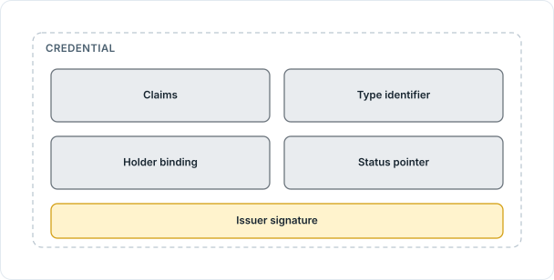
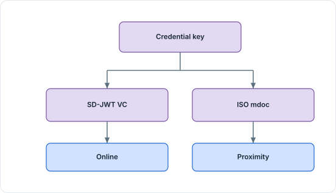

<!-- Sumber: Arsitektur Ekosistem Identitas Digital v0.2, §4.2 (Kep. 3), §4.4, §2.5, §4.7 -->

# 1. Credential formats

A credential is the set of signed statements an issuer hands to a citizen, and
it lives on that citizen's device rather than in a register anyone can query.
This section says what one carries, which three shapes it may take, which
participant handles which shape, and where the choice is written down.

Nothing here was designed for this ecosystem. All three formats are published
standards with implementations outside Indonesia, which is what makes a
credential issued here readable by software nobody here wrote.

## 1.1 What one credential carries

Whatever format it takes, a credential carries the same five things, and a
verifier that receives one checks all five.

<figure markdown="1" id="figure-1-1">
  { loading=lazy }
  <figcaption><span class="ekdn-fignum">Figure 1.1</span> What one credential carries, inside the issuer's signature.</figcaption>
</figure>

- **Claims** are the data inside: the values an institution holds about the
  citizen, supplied by Claims Provider from that institution's own source system
  and assembled by Credential Builder. Claims and attributes are the same values
  seen from opposite sides. A claim is what the issuer put in. An attribute is
  what a verifier asks for, and what that verifier's accreditation is measured
  against. One claim can be an attribute, and the two words stay separate
  because the authority question attaches only to the second.
- **The type identifier** says which Credential Rulebook governs the credential.
  SD-JWT VC carries it as `vct`, ISO mdoc as `docType`, and both values come
  from the Rulebook rather than from the issuer's own software.
- **The holder binding** names a key the citizen's device controls, so a
  credential copied off that device proves nothing on its own. Each format binds
  differently, and [Section 1.2](#12-three-credential-formats) gives the three
  mechanisms.
- **The status pointer** is how a verifier learns that a credential was
  withdrawn before it expired. SD-JWT VC and ISO mdoc point at an
  IETF Token Status List, `ldp_vc` at a W3C Bitstring Status List. Each issuer
  publishes its own on its own domain, described in
  [Section 4.2.2, Status list](artifacts-exchanged.md#422-status-list).
- **The issuer's signature** closes the envelope around the other four. SD-JWT
  VC is a JWS, ISO mdoc is COSE, and `ldp_vc` carries a Data Integrity proof
  using the `ecdsa-jcs-2019` cryptosuite.

## 1.2 Three credential formats

| Format | Used for | Holder binding | Status |
|---|---|---|---|
| SD-JWT VC | The main online path, every credential type | `cnf` carrying a did:key | Token Status List |
| ISO mdoc | Proximity, no signal, international readers | `DeviceKey` inside the MSO | Token Status List |
| W3C VCDM 2.0 (`ldp_vc`) | Interoperability with JSON-LD ecosystems | Data Integrity proof at presentation level, with `challenge` and `domain` | Bitstring Status List |

Two of the three support selective disclosure, which lets a holder reveal one
attribute without revealing the ones beside it. SD-JWT VC does it with salted
hashes, ISO mdoc with digests in the MSO. `ldp_vc` secured with
`ecdsa-jcs-2019` has no such mechanism, and the ecosystem answers by limiting
where the format may be used rather than by accepting the disclosure. A
credential type whose Rulebook classifies any attribute as `restricted` may not
list `ldp_vc` among its formats at all, a rule
[Section 1.6](#16-the-credential-rulebook) returns to.

Several formats that would have fitted are deliberately absent: AnonCreds,
JWT-VC 1.1 (`jwt_vc_json`), SD-JWT VCLD, and BBS signatures. Each one would
have added a second way of doing something one of the three above already does,
and a second way is a second implementation in every wallet and every verifier.

## 1.3 One credential, two representations

A citizen holds one credential in the ordinary sense of the word, and the wallet
may hold it twice. The same credential can exist as an SD-JWT VC and as an ISO
mdoc at the same time, bound to a single credential key, so the two
representations are provably the same credential rather than two credentials
that happen to agree.

<figure markdown="1" id="figure-1-2">
  { loading=lazy }
  <figcaption><span class="ekdn-fignum">Figure 1.2</span> One credential key, two representations, two modes.</figcaption>
</figure>

- **The credential key** is minted once for the credential, not once per format.
- **SD-JWT VC** is the representation the online path reads.
- **ISO mdoc** is the representation a reader in proximity reads, and the only
  one that works with no signal.

This is not decoration. SD-JWT VC has no offline path, and ISO mdoc is not used
online, so a credential type that has to be checked where there is no signal
needs an mdoc representation or it cannot be checked at all. Which of the two
modes applies where is in
[Section 3.2, Online and offline](protocols-and-modes.md#32-online-and-offline).

The Credential Rulebook for a type names the formats that type must take, so
whether a citizen gets one representation or two is settled per credential type
and not per wallet.

## 1.4 Which format each role issues

No participant handles all three formats in every direction, and the two
tables below say who handles what.

Both tables read as **capability**, not authority: who is able to issue a
format, and who has to be able to read one. Neither answers what a party is
allowed to ask for, which is settled by its accreditation and covered in
[Section 2, Three stages of authority](../roles/three-stages-of-authority.md).
Both bind implementations, and both are announced in metadata so the other side
knows from the first request. Issuers announce theirs in
`credential_configurations_supported`, verifiers in `vp_formats_supported`.

On the issuing side the limit is which keys and certificates the issuer holds,
and the two issuer roles differ on one format only.

| Format | Identity Issuer | Attribute Issuer |
|---|---|---|
| SD-JWT VC | Yes | Yes |
| W3C VCDM 2.0 (`ldp_vc`) | No | Yes, if its Rulebook has no `restricted` attribute |
| ISO mdoc | Yes | Yes |

An Identity Issuer does not use `ldp_vc` because a basic identity credential
carries `restricted` attributes, and `ldp_vc` secured with `ecdsa-jcs-2019` has
no selective disclosure.

## 1.5 Which format each role verifies

On the verifying side the limit is implementation cost, not authority. All
three verifier roles read the same two formats, and one of them stops there.

| Format | Relying Party | RP Intermediary | Merchant |
|---|---|---|---|
| SD-JWT VC, online | Yes | Yes | Yes |
| W3C VCDM 2.0 (`ldp_vc`), online | Yes | Yes | **No** |
| ISO mdoc, in proximity | Yes | Yes | Yes |

A merchant announces only `dc+sd-jwt` and `mso_mdoc`. Verifying `ldp_vc` means
processing JSON-LD and checking a Data Integrity proof in two places at once,
on the credential and again on the presentation. That is heavy for software
running on a merchant's phone, and `ldp_vc` exists for interoperability between
systems rather than for a transaction at a counter.

## 1.6 The Credential Rulebook

Everything above is a menu. The Credential Rulebook is where one credential type
picks from it, and it is the single file an issuer's `.well-known` metadata is
generated from:

```json
{
  "id": "id.go.credential.KTPDigital.v1",
  "authority": "did:webvh:QmScid...:kemendagri.go.id",
  "formats": {
    "sd-jwt-vc": { "vct": "..." },
    "mdoc": { "docType": "id.go.ktp.1" },
    "ldp_vc": {
      "context": "https://catalog.trust.go.id/ctx/ktp-v1.jsonld",
      "cryptosuite": "ecdsa-jcs-2019"
    }
  },
  "schema": "https://catalog.trust.go.id/schema/ktp-digital-v1.json",
  "display": "https://catalog.trust.go.id/oca/ktp-digital-v1.json",
  "attributes": [
    { "name": "nik", "minimization": "restricted" },
    { "name": "tanggal_lahir", "minimization": "normal" },
    { "name": "usia_di_atas_17", "minimization": "open", "derived_from": "tanggal_lahir" }
  ],
  "min_assurance": "high",
  "issuer_assurance": "high"
}
```

Four fields carry weight beyond their own line.

`min_assurance` binds the holder's key, and it is what turns into a demand for a
Key Attestation at issuance time. `issuer_assurance` binds the signing key on
the other side, at the issuer.

`minimization` sets the approval route a verifier has to walk before it may ask
for that attribute: `open` is granted automatically, `normal` needs one
reviewer, `restricted` needs a committee. It is also what decides whether the
type may offer `ldp_vc` at all. A Rulebook that lists a `restricted` attribute
alongside `ldp_vc` in its `formats` is rejected by Trust Registry at submission,
so the restriction is enforced when the rules are filed rather than trusted to
hold at runtime.

`derived_from` marks an attribute computed rather than stored. The value
`usia_di_atas_17` is calculated in Issuer Core from `tanggal_lahir`, which keeps
the derivation inside the issuer and out of the institution's source system.

A version is frozen when it is published, so two parties holding
`id.go.credential.KTPDigital.v1` hold the same rules. A change is a new version,
never an edit. How that identifier is built is in
[Section 2, Identifier](identifier.md), how the file is distributed is in
[Section 4.1.2, Credential Rulebook](artifacts-exchanged.md#412-credential-rulebook),
and the rulebooks themselves live in their own document,
[Credential Rulebook Catalog](../../credential-rulebook/index.md).
