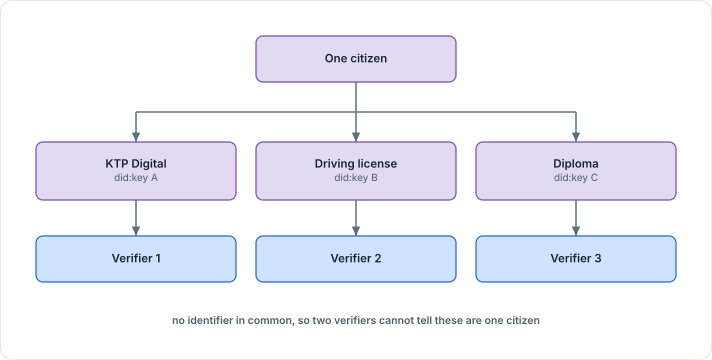

<!-- Sumber: Arsitektur Ekosistem Identitas Digital v0.2, §4.2, §4.3 (Kep. 4, 5, 14), §9.2; Rincian Module dan Operasi, DID Service; Bentuk Data Attestation, §3 -->

# 2. Identifier

Five different things in the ecosystem carry an identifier: an entity, a
holder, a credential type, an attribute inside that type, and a device. Each
gets a different shape, because each is asked to do a different job. An
entity's identifier has to resolve to a full history of keys. A holder's
identifier has to stop two verifiers from recognizing the same citizen. A
credential type's identifier has to stay fixed for one version and change only
by becoming a new one. A device's identifier has to name a piece of hardware
without ever exposing the key that hardware holds.

| Object | Identifier | Why this shape |
|---|---|---|
| Entity (issuer, verifier, Wallet Provider) | did:webvh | An append-only `did.jsonl` log with pre-rotation, so a resolver can walk a key through its full history |
| Holder | A new did:key for every credential | Nothing links two presentations back to the same citizen |
| Credential type | `id.go.credential.<TypeName>.v<N>` | A name that stays fixed for one version, and changes only by becoming a new version |
| Attribute in scope | `<type>#<attribute>`, for example `id.go.credential.KTPDigital.v1#usia_di_atas_17` | Names one attribute wherever a rule needs to point at it without pointing at the whole credential |
| Wallet or merchant device | JWK thumbprint of the device key (RFC 7638) | Identifies the device without transmitting the key it names |

## 2.1 Entities: did:webvh

Every issuer, verifier, and Wallet Provider identifies itself with did:webvh.
Its address is not looked up in a directory: `did:webvh:<scid>:<domain>`
resolves at the entity's own domain, backed by a signed, append-only log
called `did.jsonl`. The self-certifying identifier inside the address is
derived from that log's own first entry, so the identifier and the log
backing it cannot be pulled apart. What the log holds and how a verifier
reads it is in
[Section 4.2.1, DID Document](artifacts-exchanged.md#421-did-document).

The log being append-only, with pre-rotation, is what makes the identifier
survive a key rotation. An entity that rotates its signing key still needs
every past signature to verify against whichever key was active when that
signature was made, so a resolver has to walk the entity's full key history
rather than trust only the current key. Pre-rotation lets the entity commit to
its next key before that key is ever used, so a thief who steals the current
key cannot also claim the one coming after it.

The identifier proves only that a signature belongs to the entity claiming
it. Whether that entity is allowed to issue or verify at all is a separate
question, answered by the trusted list and by the Authority Statement it can
be asked for, not by did:webvh itself.

## 2.2 Holder: a new did:key per credential

did:key needs nothing did:webvh needs. It is derived entirely from a public
key, so there is no log to sign, no domain to host it on, and no resolver
call beyond decoding the identifier itself. That is what makes minting a new
one for every credential practical: the wallet generates a key pair, and the
identifier falls out of it for free.

A fresh did:key per credential is what stops two verifiers from recognizing
the same citizen. If a holder presented the same identifier to a grocery
store and to a bank, the two could compare notes and know the same person
visited both, even without either one reading a single disclosed attribute. A
new key per credential removes the shared anchor they would need to do that.

<figure markdown="1" id="figure-2-1">
  { loading=lazy }
  <figcaption>Figure 2.1 One citizen, three credentials, three holder identifiers.</figcaption>
</figure>

- **Each credential** carries a did:key minted for it alone, so the wallet holds
  as many holder identifiers as it holds credentials.
- **Each verifier** sees one of them and no more.
- **Comparing notes** gets two verifiers nothing, because the identifiers they
  hold have nothing in common to match on.

This key is what the rest of the ecosystem calls the credential key: one key
per credential, used for holder binding and for presentation, kept separate
from the device key that identifies the hardware itself (covered in
[Section 2.4](#24-devices)). Each credential format asserts the same holder
binding differently. SD-JWT VC carries it in the `cnf` claim. ISO mdoc carries
the same key as the `DeviceKey` field inside the MSO, a name that belongs to
the mdoc specification's own vocabulary rather than to the physical device.
W3C VCDM 2.0 (`ldp_vc`) has no claim to carry it in at all, so it proves
possession with a Data Integrity proof at the presentation level, signed over
a `challenge` and a `domain` the verifier supplies.

Because the credential key is shared rather than tied to one format, a
credential type that ships as both SD-JWT VC and ISO mdoc, per
[Section 1.3, One credential, two representations](credential-formats.md#13-one-credential-two-representations),
binds both representations to the same did:key. The wallet does not mint a
second identifier just because a Credential Rulebook demands a second format.

## 2.3 Credential types and attributes

A credential type is named `id.go.credential.<TypeName>.v<N>`. `TypeName`
capitalizes the start of each word and drops every separator, so a national
ID digital credential type is written `KTPDigital`, and the version number is
never left implicit. The `id.go` namespace is not open for anyone to mint
into: Trust Authority holds it, so a credential type name cannot come
from whoever happens to write a Credential Rulebook.

This identifier anchors the Credential Rulebook that governs the type: it is
the value of the Rulebook's own `id` field, for example
`"id.go.credential.KTPDigital.v1"`. A version is frozen once its Rulebook is
published, so `.v1` never changes meaning underneath a party that already
checked it. A schema change, a new attribute, or a different assurance
requirement is published as `.v2` instead. What else a Rulebook freezes under
that same version is in
[Section 1.6, The Credential Rulebook](credential-formats.md#16-the-credential-rulebook).

An attribute inside a credential type gets its own identifier, built by
appending `#<attribute>` to the type's own:
`id.go.credential.KTPDigital.v1#usia_di_atas_17` names one derived attribute
rather than the whole credential. This is what lets a rule point at a single
attribute instead of at the credential that carries it. An Authority Statement
can grant a role permission over one attribute, and the `ReaderAuthRole`
extension can bound a reader's certificate to that same attribute. Neither has
to enumerate the whole credential type.

## 2.4 Devices

The wallet installation on a citizen's phone and the reader on a merchant's
device are each identified the same way: the JWK thumbprint of their device
key, computed the way RFC 7638 defines it. A thumbprint is a hash over the
public key's own JSON fields, so anyone holding the public key can compute
the identical identifier without asking a registry for it.

This device key is not the credential key from
[Section 2.2](#22-holder-a-new-didkey-per-credential). One belongs to the
hardware and is minted once, held in the device's secure element from
provisioning onward. The other is minted per credential and never touches
the device's own identity. A phone carrying ten credentials has ten
credential keys behind one device key.

Publishing only the thumbprint, and never the key, is deliberate: the
identifier is safe to carry inside a request or write to a log, because it
gives an attacker nothing to impersonate the device with, while the private
key stays wherever it was generated. The identifier surfaces in two places: in
registering a wallet installation, and in the messages that ask for a Key
Attestation. Both follow the same protocol paths as everything else a wallet
exchanges with its backend, covered in
[Section 3.1, Protocols per interaction](protocols-and-modes.md#31-protocols-per-interaction).
