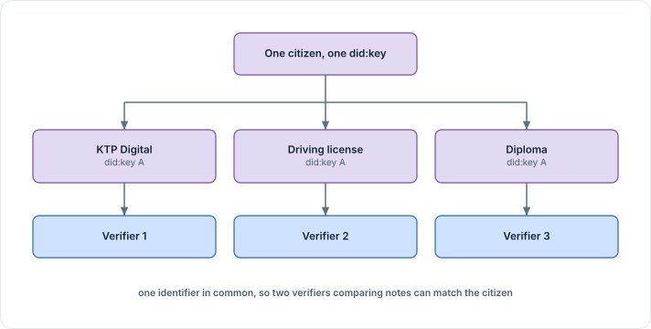

<!-- Sumber: Arsitektur Ekosistem Identitas Digital v0.2, §4.2, §4.3 (Kep. 4, 5, 14, 30), §9.2; Rincian Module dan Operasi, DID Service, siklus scope verifier; Bentuk Data Attestation, §3 -->

# Identifier {#identifier}

Six different things in the ecosystem carry an identifier: an entity, a
holder, a credential type, an attribute inside that type, a registered use, and
a device. Each gets a different shape, because each is asked to do a different
job. An entity's identifier has to resolve to a full history of keys. A holder's
identifier has to bind every credential to the phone that holds it. A
credential type's identifier has to stay fixed for one version and change only
by becoming a new one. A device's identifier has to name one wallet installation or one verifier device
without ever exposing the key that installation holds.

<figure markdown="1" class="ekdn-table">

| Object | Identifier | Why this shape |
|---|---|---|
| Entity (issuer, verifier, Wallet Provider) | [did:webvh][identifiers-and-keys] | An append-only `did.jsonl` log with pre-rotation, so a resolver can walk a key through its full history |
| Holder | One [did:key][identifiers-and-keys] per wallet installation, shared by every credential | The simplest binding to run in this phase |
| Credential type | `id.idctf.<type>.<N>` | A name that stays fixed for one version, and changes only by becoming a new version |
| Attribute in scope | `<type>#<attribute>`, for example `id.idctf.ktp.1#usia_di_atas_17` | Names one attribute wherever a rule needs to point at it without pointing at the whole credential |
| Registered use of a verifier | `use_id`, set by Trust Authority when the use is approved, unique within one entity | Lets a request template and a verification record name the approved use they were run under |
| Wallet installation or verifier device | JWK thumbprint of the device key ([RFC 7638][identifiers-and-keys]) | Identifies the device without transmitting the key it names |

</figure>

## Entities: did:webvh {#entities-didwebvh}

Every issuer, verifier, and Wallet Provider identifies itself with did:webvh.
Its address is not looked up in a directory: `did:webvh:<scid>:<domain>`
resolves at the entity's own domain, backed by a signed, append-only log
called `did.jsonl`. The self-certifying identifier inside the address is
derived from that log's own first entry, so the identifier and the log
backing it cannot be pulled apart. What the log holds and how a verifier
reads it is in
[DID Document][did-document].

The log being append-only, with pre-rotation, is what makes the identifier
survive a key rotation. An entity that rotates its signing key still needs
every past signature to verify against whichever key was active when that
signature was made, so a resolver has to walk the entity's full key history
rather than trust only the current key. Pre-rotation lets the entity commit to
its next key before that key is ever used, so a thief who steals the current
key cannot also claim the one coming after it.

The identifier proves only that a signature belongs to the entity claiming
it. Whether that entity is allowed to issue or verify at all is a separate
question, answered by the trusted list and by the Authority Statement it can
be asked for, not by did:webvh itself.

## Holder: one did:key per wallet installation {#holder-one-didkey-per-wallet-installation}

did:key needs nothing did:webvh needs. It is derived entirely from a public
key, so there is no log to sign, no domain to host it on, and no resolver
call beyond decoding the identifier itself. The wallet generates one key pair
in the secure element at its first issuance, and the identifier falls out of
it for free.

In this phase that one key serves every credential on the installation, and it
is not created again per issuance. The decision is marked temporary because it
has a known cost. A holder who presents the same identifier to a grocery store
and to a bank can be recognized by the two of them comparing notes, even
without either one reading a single disclosed attribute.

{ #fig-holder-identifier }

<figure markdown="1">
  { loading=lazy }
  <figcaption> One citizen, three credentials, one holder identifier.</figcaption>
</figure>

- **Every credential** carries the same did:key, so the wallet holds one holder
  identifier however many credentials it holds.
- **Each verifier** sees that identifier.
- **Comparing notes** lets two verifiers match the holder, which is the exposure
  this phase accepts.

The way out is prepared. Each stored credential records which key binds it, so
a later move to a key per credential, or to the batch issuance OpenID4VCI 1.0
already defines, changes the wallet's key handling and no credential format.

This key is what the rest of the ecosystem calls the credential key: one key
per wallet installation, used for holder binding and for presentation, kept
separate from the device key that identifies the installation itself (covered in
[devices][devices]). Each credential format asserts the same holder
binding differently. [SD-JWT
VC][credential-formats-and-their-signatures] carries it in the
`cnf` claim. [ISO
mdoc][credential-formats-and-their-signatures] carries the
same key as the `DeviceKey` field inside the Mobile Security Object (MSO), a
name that belongs to the mdoc specification's own vocabulary rather than to the
physical device. [W3C VCDM
2.0][credential-formats-and-their-signatures] (`ldp_vc`) has
no claim to carry it in at all, so it proves possession with a [Data
Integrity][credential-formats-and-their-signatures] proof at
the presentation level, signed over a `challenge` and a `domain` the verifier
supplies.

Because the credential key is shared across formats as well, a
credential type that ships as both SD-JWT VC and ISO mdoc, per
[one credential, two representations][one-credential-two-representations],
binds both representations to the same did:key. The wallet does not mint a
second identifier just because a Credential Rulebook demands a second format.

## Credential types and attributes {#credential-types-and-attributes}

A credential type is named `id.idctf.<type>.<N>`. The type is lowercase and
the version is a bare integer, so the national ID digital credential is
`id.idctf.ktp.1` and never `id.idctf.KTPDigital.v1`. One identifier serves all
three places a type is named: the `vct` of an SD-JWT VC, the `docType` of an
mdoc, and the mdoc namespace its attributes sit in. The two representations of
one credential therefore carry the same name, which is what keeps them
recognizable as the same credential.

`id.idctf` is the ecosystem's own root and Trust Authority holds it, so a
credential type name cannot come from whoever happens to write a Credential
Rulebook. It says nothing about who issues: an Attribute Issuer may be a
university, a hospital, or a bank, and which institution issued a given
credential is carried in the issuer's decentralized identifier (DID), never in
the type. A type another body already owns keeps that body's namespace, so a
mobile driving license stays `org.iso.18013.5.1.mDL`.

This identifier anchors the Credential Rulebook that governs the type: it is
the value of the Rulebook's own `id` field, for example `"id.idctf.ktp.1"`. A
version is frozen once its Rulebook is published, so `.1` never changes meaning
underneath a party that already checked it. A schema change, a new attribute,
or a different assurance requirement is published as `.2` instead. What else a
Rulebook freezes under that same version is in
[The Credential Rulebook][the-credential-rulebook].

An attribute inside a credential type gets its own identifier, built by
appending `#<attribute>` to the type's own:
`id.idctf.ktp.1#usia_di_atas_17` names one derived attribute rather than the
whole credential. This is what lets a rule point at a single
attribute instead of at the credential that carries it. An Authority Statement
can grant a role permission over one attribute, a Use Statement can narrow that
down to the attribute a registered use is approved for, and the `ReaderAuthRole`
extension can bound a Verifier Device Certificate to that same attribute. None of the
three has to enumerate the whole credential type.

## Registered use of a verifier {#registered-use-of-a-verifier}

A verifier's registered use carries a `use_id`, set by Trust Authority when the
use is approved. It is a string set per entity rather than per ecosystem, so
two verifiers may both call a use `kyc-pembukaan-rekening` without colliding.

It is the only identifier here that names a decision rather than a thing. What
it is for is pointing back at that decision from the places where the use shows
up later: a request template in Verifier Console names the `use_id` it was
built under, and a verification record keeps it so a transaction can be traced
to the purpose it was run for years afterward. What the approval grants, and
what the verifier then carries in its request, is the
[Use Statement][use-statement].

## Devices {#devices}

The wallet installation on a citizen's phone, and a verifier device, whether a
merchant's or a Relying Party's own counter device, are each identified the
same way: the JSON Web Key (JWK) thumbprint of their device key, computed the
way RFC 7638 defines it. A thumbprint is a hash
over the public key's own JSON fields, so anyone holding the public key can
compute the identical identifier without asking a registry for it.

This device key is not the credential key from [the holder
identifier][holder-one-didkey-per-wallet-installation]. One is minted once per
installation, when the wallet enrolls or the device is provisioned, and stays in
the device's secure element from then on. The other is minted at the first
issuance, binds every credential, and never touches the device's own identity. A
phone carrying ten credentials has one credential key beside one device key, and
the two are never the same key.

Publishing only the thumbprint, and never the key, is deliberate: the
identifier is safe to carry inside a request or write to a log, because it
gives an attacker nothing to impersonate the device with, while the private
key stays wherever it was generated. The identifier surfaces in two places: in
registering a wallet installation, and in the messages that ask for a Key
Attestation. Both follow the same protocol paths as everything else a wallet
exchanges with its backend, covered in
[Protocols per interaction][protocols-per-interaction].
