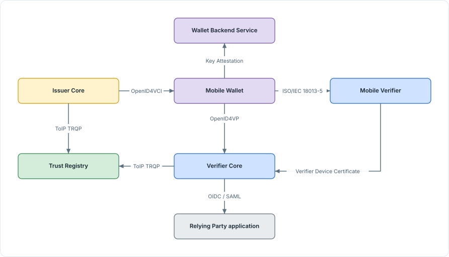
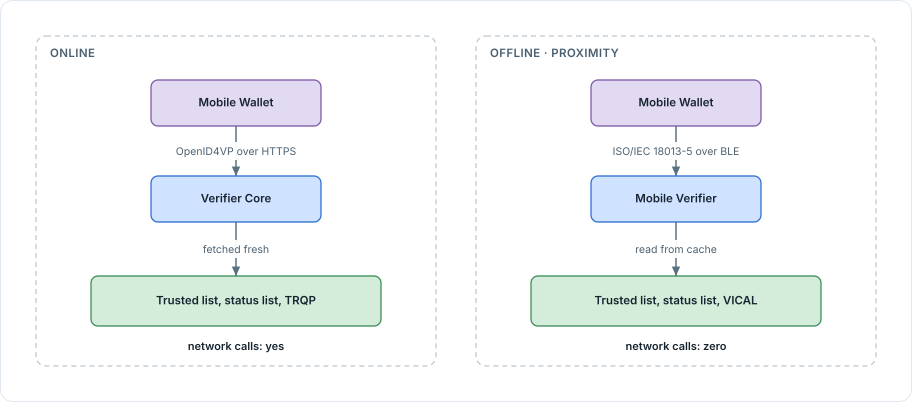

<!-- Sumber: Arsitektur Ekosistem Identitas Digital v0.2, §4.5, §4.7 (Kep. 19, 21, 26, 28); JWT di OpenID4VCI dan OpenID4VP -->

# 3. Protocols and modes

The ecosystem takes its protocols and formats from existing standards rather
than writing new ones: what is written here is IDCTF's own rules for using
them, never a new wire format. This page names the standard behind every
interaction, and what changes when a transaction has no network at all.

## 3.1 Protocols per interaction

Seven interactions cross the ecosystem, each carried by one standard.

<figure markdown="1" id="figure-3-1">
  { loading=lazy }
  <figcaption>Figure 3.1 The protocol behind each interaction.</figcaption>
</figure>

| Interaction | Protocol | Standards |
|---|---|---|
| Issuer to Wallet | Credential offer; PAR mandatory plus PKCE; pre-authorized code with `tx_code`, or authorization code; DPoP; nonce endpoint; credential request with proof type `attestation` or `jwt`; deferred issuance | OpenID4VCI 1.0 (§8.2, §12.2.4, App. D.1, F.1, F.3), OAuth 2.0, RFC 9126, RFC 7636, RFC 9449 |
| Wallet to Verifier, online | Authorization request with DCQL, `request_uri`, `direct_post.jwt`, Key Binding JWT. `client_id` opens with `decentralized_identifier` for an accredited verifier, `x509_hash` for a merchant | OpenID4VP 1.0 |
| Wallet to Reader, proximity | Engagement over QR or NFC, an encrypted BLE session, DeviceRequest with ReaderAuth, DeviceResponse with DeviceAuth (`deviceSignature`) | ISO/IEC 18013-5 |
| Entity to Trust Registry | `POST /authorization`, `POST /recognition` | ToIP TRQP v2.0, RFC 7807 |
| Wallet to Wallet Backend Service | Instance registration; a platform attestation exchanged for a Key Attestation, only for credentials rated `substantial` or `high` | OpenID4VCI 1.0 Appendix D.1, Play Integrity, App Attest |
| Mobile Verifier to Verifier Core | A Verifier Device Certificate with a limited lifetime per device, with a CRL from the Verifier Core that vouches for it (online, an accredited verifier uses a DID instead, with no attestation) | ISO/IEC 18013-5 Annex B, OpenID4VP 1.0 `x509_hash` |
| Verifier to RP application | An OpenID Connect or SAML session | OpenID Connect Core, SAML 2.0 |

### 3.1.1 Issuer to Wallet

Issuance starts with a credential offer and runs on OpenID4VCI 1.0. The
authorization step is secured by PKCE, the `tx_code` a citizen types in, and
DPoP binding the access token to the key that requested it. An attestation
plays no part in it: attestation-based client authentication at the PAR and
token endpoints is still an Internet-Draft, so it stays out. Proof of the
wallet's
own key waits for the credential request itself, where the proof type is
`attestation` or `jwt` and, for a `substantial` or `high` credential, is backed
by a [Key Attestation](artifacts-exchanged.md#442-key-attestation) from the
Wallet Backend Service. An issuer that cannot finish immediately returns a
deferred issuance response and the wallet polls for the credential later.

### 3.1.2 Wallet to Verifier, online

Presentation runs on OpenID4VP 1.0. The verifier states what it wants with
DCQL, which replaced Presentation Exchange, and sends the request as a
`request_uri` with the response returned through `direct_post.jwt`. The wallet
proves the presented credential is bound to a key it holds with a Key Binding
JWT. How the verifier introduces itself is carried in the shape of `client_id`.
A Relying Party or an RP Intermediary uses `decentralized_identifier` and
resolves to a DID from [Section 2, Identifier](identifier.md). A merchant uses
`x509_hash`, because it carries no DID at all, and introduces itself with the
same
[Verifier Device Certificate](artifacts-exchanged.md#443-verifier-device-certificate)
it uses in proximity.

### 3.1.3 Wallet to Reader, proximity

Proximity presentation runs on ISO/IEC 18013-5. A reader and a wallet find
each other through device engagement over QR or NFC, then open an encrypted
BLE session between them. The reader sends a DeviceRequest carrying ReaderAuth,
its own certificate-backed authentication; the wallet answers with a
DeviceResponse carrying DeviceAuth, a `deviceSignature` that proves it holds
the credential's `DeviceKey`. Both messages are signed over the same
SessionTranscript, which is what stops a captured DeviceResponse from being
replayed in a different session.

### 3.1.4 Entity to Trust Registry

Every entity asks Trust Registry questions over TRQP rather than downloading
an answer in advance. `POST /authorization` answers whether an entity holds a
given permission, the same query that resolves an
[Authority Statement](artifacts-exchanged.md#431-authority-statement); how a
permission is granted in the first place is in
[Section 2.3, Authorization](../roles/three-stages-of-authority.md#23-authorization).
`POST /recognition` answers whether another ecosystem is recognized. Errors
from either endpoint follow RFC 7807.

### 3.1.5 Wallet to Wallet Backend Service

A Mobile Wallet registers its installation with the Wallet Backend Service
that issued it, then exchanges a platform attestation, Play Integrity on
Android or App Attest on iOS, for a
[Key Attestation](artifacts-exchanged.md#442-key-attestation) built on
OpenID4VCI 1.0 Appendix D.1. That exchange only happens for a credential whose
Credential Rulebook demands `substantial` or `high`; a Rulebook that asks for
`low` accepts an ordinary proof JWT instead, and no attestation is requested.

### 3.1.6 Mobile Verifier to Verifier Core

A Mobile Verifier gets its device identity from the Verifier Core that
guarantees it: a
[Verifier Device Certificate](artifacts-exchanged.md#443-verifier-device-certificate)
with a limited lifetime, following ISO/IEC 18013-5 Annex B, withdrawn early
through a CRL the guarantor publishes. This is how a merchant's device gets an
identity it does not otherwise have. An accredited verifier operating online
skips this exchange: it already has a DID, and OpenID4VP 1.0 lets its
`client_id` carry the `decentralized_identifier` scheme with no certificate
and no attestation at all.

### 3.1.7 Verifier to RP application

Once a verifier has checked a presentation, it hands the result to the
application that asked for it over an ordinary OpenID Connect or SAML
session. This is
the one interaction in the table that carries no ecosystem-specific artifact:
by this point the credential has already been checked, and what crosses here
is the outcome.

## 3.2 Online and offline

Online and offline presentation use different protocols, different formats,
and different trust anchors. Verifier Core serves online presentation. Only
Mobile Verifier serves offline, run from a merchant's counter device or from a
Relying Party's own, which is why "zero network calls" in the offline column
holds for both kinds of device.

<figure markdown="1" id="figure-3-2">
  { loading=lazy }
  <figcaption>Figure 3.2 Online and offline: where the network calls go.</figcaption>
</figure>

| | Online | Offline (proximity) |
|---|---|---|
| Protocol | OpenID4VP 1.0 with DCQL | ISO/IEC 18013-5 |
| Transport | HTTPS: QR code or deep link, `request_uri`, `direct_post.jwt` | Engagement over QR or NFC, an encrypted BLE session |
| Format | SD-JWT VC (primary) and `ldp_vc`; mdoc is not used online | mdoc only |
| Holder binding | Key Binding JWT (`nonce`, `aud`) checked against `cnf` | DeviceAuth checked against `DeviceKey` and SessionTranscript |
| Wallet checks the verifier | Accredited verifier: `client_id` carries a `decentralized_identifier`, no further artifact needed. Merchant: a Verifier Device Certificate in `x5c`, chained to the Verifier Issuing CA on the trusted list | ReaderAuth: a Verifier Device Certificate chained to the Verifier Root CA, read from cache. Applies at every level, including an accredited verifier: ISO/IEC 18013-5 has no notion of a DID, so anyone reading an mdoc in proximity needs its own X.509 chain |
| Verifier checks the issuer | The issuer's DID Document, the trusted list, and a TRQP query | `x5chain` chained to the Issuer Root CA, or checked against VICAL |
| Status | Status list fetched fresh, with a TTL set by risk | Status list read from cache; how stale a copy may be before it is rejected, the tolerance limit, is not yet set |
| Network calls | Yes | Zero |
| Result | Passed to the RP application over OpenID Connect or SAML | Read on the reader's screen |

Three of these rows carry a cost the table alone does not spell out. SD-JWT VC
has no offline path: a credential type that has to be checked with no signal
needs an mdoc representation in its Credential Rulebook alongside SD-JWT VC,
the two bound to
[one credential key](credential-formats.md#13-one-credential-two-representations).
Checking the verifier in proximity needs an X.509 chain even for a Relying
Party that is otherwise a fully accredited, DID-holding entity online, because
the standard the reader runs on was never written with a DID in mind. That is
the one place a merchant and an accredited verifier carry the same kind of
proof. And a proximity transaction makes no network call in either direction,
which is what makes the status list row the hardest one. The copy a reader
checks against can be as stale as its cache allows, and how stale it is
allowed to get is a limit the ecosystem has not yet set.
