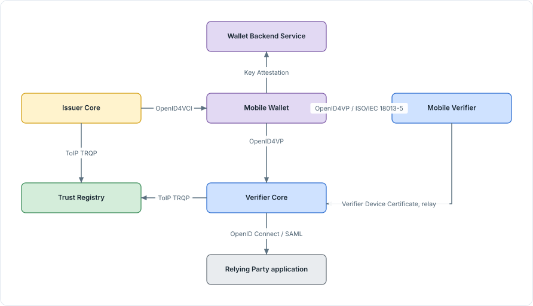
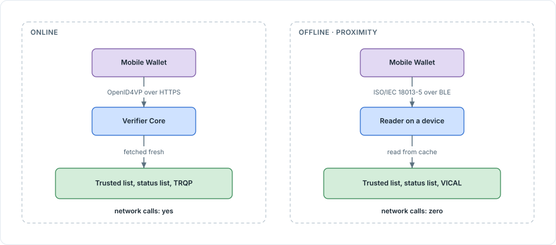

<!-- Sumber: Arsitektur Ekosistem Identitas Digital v0.2, §4.5, §4.7 (Kep. 19, 21, 26, 28, 30), §7.5; JWT di OpenID4VCI dan OpenID4VP -->

# Protocols and modes {#protocols-and-modes}

The ecosystem takes its protocols and formats from existing standards rather
than writing new ones: what is written here is IDCTF's own rules for using
them, never a new wire format. This page names the standard behind every
interaction, and what changes when a transaction has no network at all.

## Protocols per interaction {#protocols-per-interaction}

Seven interactions cross the ecosystem, each carried by one standard.

{ #fig-protocol-per-interaction }

<figure markdown="1">
  { loading=lazy }
  <figcaption> The protocol behind each interaction.</figcaption>
</figure>

{ #tbl-protocols-per-interaction }

<figure markdown="1" class="ekdn-table">

| Interaction | Protocol | Standards |
|---|---|---|
| Issuer to Wallet | Credential offer, authorization, then a credential request | [OpenID4VCI 1.0][exchange-protocols] (§8.2, §12.2.4, App. D.1, F.1, F.3), [OAuth 2.0][oauth-20-and-the-endpoints-it-secures], [RFC 9126][oauth-20-and-the-endpoints-it-secures], [RFC 7636][oauth-20-and-the-endpoints-it-secures], [RFC 9449][oauth-20-and-the-endpoints-it-secures] |
| Wallet to Verifier, online | A signed request with DCQL, an encrypted response | [OpenID4VP 1.0][exchange-protocols] |
| Wallet to Mobile Verifier, proximity | DeviceRequest with ReaderAuth and the Use Statement, DeviceResponse with DeviceAuth, over an encrypted BLE session | [ISO/IEC 18013-5][exchange-protocols] |
| Entity to Trust Registry | `POST /authorization`, `POST /recognition` | [ToIP TRQP v2.0][exchange-protocols], [RFC 7807][oauth-20-and-the-endpoints-it-secures] |
| Wallet to Wallet Backend Service | Instance registration, then a platform attestation exchanged for a Key Attestation | [OpenID4VCI 1.0 Appendix D.1][device-attestation-and-assurance], [Play Integrity][device-attestation-and-assurance], [App Attest][device-attestation-and-assurance] |
| Mobile Verifier to Verifier Core | Device provisioning and renewal, and a relay for a merchant's online check | [ISO/IEC 18013-5 Annex B][certificates-and-revocation], OpenID4VP 1.0 `x509_hash` |
| Verifier to RP application | An OpenID Connect or SAML session | [OpenID Connect Core][exchange-protocols], [SAML 2.0][exchange-protocols] |

</figure>

### Issuer to Wallet {#issuer-to-wallet}

Issuance starts with a credential offer and runs on OpenID4VCI 1.0, with the
pushed authorization request (PAR) endpoint mandatory. The authorization step
is secured by Proof Key for Code Exchange (PKCE); depending on the offer, the
wallet redeems either a pre-authorized code with the `tx_code` a citizen types
in, or an authorization code. Either way, Demonstrating Proof of Possession
(DPoP) binds the access token to the
key that requested it, using a nonce the issuer's nonce endpoint supplies. An
attestation plays no part in it: attestation-based client authentication at the
PAR and token endpoints is still an Internet-Draft, so it stays out. Proof of
the wallet's own key waits
for the credential request itself, where the proof type is `attestation` or
`jwt` and, for a `substantial` or `high` credential, is backed by a [Key
Attestation][key-attestation] from the Wallet
Backend Service. An issuer that cannot finish immediately returns a deferred
issuance response and the wallet polls for the credential later.

### Wallet to Verifier, online {#wallet-to-verifier-online}

Presentation runs on OpenID4VP 1.0. The verifier states what it wants with
Digital Credentials Query Language (DCQL), which replaced Presentation
Exchange, and sends the request as a `request_uri` with the response returned
through `direct_post.jwt`. The wallet proves the presented credential is bound
to a key it holds with a Key Binding JWT (KB-JWT). How the verifier
introduces itself is carried in the shape of `client_id`. A Relying Party or an
RP Intermediary uses `decentralized_identifier` and resolves to a decentralized
identifier (DID) from [Identifier](identifier.md). A merchant uses
`x509_hash`, because it carries no DID at all, and introduces itself with the
same [Verifier Device
Certificate][verifier-device-certificate] it uses in
proximity.

Whichever of the two it is, the request also carries a `verifier_info` entry
holding the verifier's [Use Statement][use-statement], which is what tells the
wallet the purpose on the consent screen was approved rather than written by the
verifier that moment. A merchant attaches the Use Statement for whichever
business category the cashier selects for that transaction, one of the
categories its intermediary bound the device to at provisioning. The parameter
is OpenID4VP's own, defined for attestations about the verifier, so nothing
here extends the protocol.

### Wallet to Mobile Verifier, proximity {#wallet-to-mobile-verifier-proximity}

Proximity presentation runs on ISO/IEC 18013-5 between Mobile Wallet and
Mobile Verifier (or a Relying Party's own application embedding the
Reader SDK). The certificate Mobile Verifier presents is the Verifier Device
Certificate, which ISO/IEC 18013-5 calls an mdoc reader authentication
certificate. Both applications embed the same proximity library, so what crosses
the air is the same exchange whichever of the two is held at the counter.

Mobile Verifier and a wallet find each
other through device engagement over QR or Near Field Communication (NFC), then
open an encrypted Bluetooth Low Energy (BLE) session between them. Mobile Verifier
sends a DeviceRequest carrying ReaderAuth, its own certificate-backed
authentication; the wallet answers with a DeviceResponse carrying DeviceAuth, a
`deviceSignature` that proves it holds the credential's `DeviceKey`. Both
messages are signed over the same SessionTranscript, which is what stops a
captured DeviceResponse from being replayed in a different session.

Each `ItemsRequest` the DeviceRequest carries also holds the verifier's [Use
Statement][use-statement]: the same JWT it is online, in the `requestInfo` map
under the key `idUseStatement`, wrapped in a CBOR byte string. `ItemsRequestBytes`
is the detached payload ReaderAuth signs, so the statement rides into the
device's own signature and into the SessionTranscript binding at no extra cost.
The wallet runs the same checks it runs online, with one difference:
there is no `client_id` to match `sub` against, so it matches the holder of the
Verifier Issuing CA in `x5chain` instead (which for an accredited Relying Party's
counter device is that Relying Party itself, and for a merchant is its RP
Intermediary). Every `ItemsRequest` in one
DeviceRequest carries the same statement, because ReaderAuth and `requestInfo`
attach per DocRequest rather than once for the whole message; a DeviceRequest
that carries two different statements is refused whole, not partially.

### Entity to Trust Registry {#entity-to-trust-registry}

Every entity asks Trust Registry questions over Trust Registry Query Protocol
(TRQP) rather than downloading
an answer in advance. `POST /authorization` answers whether an entity holds a
given permission, the same query that resolves an
[Authority Statement][authority-statement]; how a
permission is granted in the first place is in [Authorization][authorization].
`POST /recognition` answers whether another ecosystem is recognized. Errors
from either endpoint follow RFC 7807.

### Wallet to Wallet Backend Service {#wallet-to-wallet-backend-service}

A Mobile Wallet registers its installation with the Wallet Backend Service
that issued it, then exchanges a platform attestation, Play Integrity on
Android or App Attest on iOS, for a
[Key Attestation][key-attestation] built on
OpenID4VCI 1.0 Appendix D.1. That exchange only happens for a credential whose
Credential Rulebook demands `substantial` or `high`; a Rulebook that asks for
`low` accepts an ordinary proof JWT instead, and no attestation is requested.

### Mobile Verifier to Verifier Core {#mobile-verifier-to-verifier-core}

A Mobile Verifier gets its device identity from the Verifier Core that
guarantees it: a [Verifier Device
Certificate][verifier-device-certificate] with a
limited lifetime, following ISO/IEC 18013-5 Annex B, withdrawn early through a
certificate revocation list (CRL) the guarantor publishes. This is how a
merchant's device gets an identity it does not otherwise have. Provisioning and
every renewal hand over both at once: the certificate, and, for a merchant, the
[Use Statement][use-statement]s for the business categories its device is
bound to, with the certificate's `ReaderAuthRole` held to a subset of their
union. A Relying Party
that reads face to face issues the same certificate to its own counter devices,
from its own Verifier Issuing CA, whether the device runs Mobile Verifier or
that Relying Party's own application. The same
Verifier Core also relays a merchant's online check. The device leaves its
signed Request Object there, and the wallet fetches it through `request_uri`
and posts an encrypted response to `response_uri`. Verifier Core hands the
ciphertext to the device and deletes it, with a short lifetime and no logging.
An accredited verifier operating online skips this exchange: it already has a
DID, and OpenID4VP 1.0 lets its `client_id` carry the
`decentralized_identifier` scheme with no certificate and no attestation at
all.

### Verifier to RP application {#verifier-to-rp-application}

Once a verifier has checked a presentation, it hands the result to the
application that asked for it over an ordinary OpenID Connect or Security
Assertion Markup Language (SAML)
session. This is
the one interaction among [the seven][tbl-protocols-per-interaction] that
carries no ecosystem-specific artifact:
by this point the credential has already been checked, and what crosses here
is the outcome.

## Online and offline {#online-and-offline}

Online and offline presentation use different protocols, different formats,
and different trust anchors. Online presentation is handled by Verifier Core
for server-based Relying Parties, and by Mobile Verifier for merchants and
counter operators (with Verifier Core relaying the exchange). Offline
presentation is served only on a device: Mobile Verifier, run from a
merchant's counter device or from a Relying Party's own, or a Relying Party's
own app built on the Reader SDK. That is why "zero network calls" in the
offline column holds for every offline device.

What does not differ is where the trust data comes from. Neither path asks
Trust Infrastructure anything while a transaction runs, which is
[the two paths never cross][the-two-paths-never-cross]: the trusted list, the
status list, and the answer to a permission query are all read from a local
cache filled beforehand. Online the verifier is reachable and offline it is
not, so what separates the two columns is how stale that cache is allowed to
get, not whether it is used.

Three things keep it current, and none of them runs inside a transaction. A
[scheduled sync][trust-registry-and-status-list-sync] pulls the trusted list,
the VICAL, and the status list on a timer, every twenty-four hours or when the
device reaches an unmetered network. A Time to Live (TTL) set by the
credential's risk profile decides how long a cached copy still counts, which
is short for a verifier that is online anyway and runs to the tolerance limit
the Governance Framework sets for one that is not. And an incident waits for
neither: on a key compromise Trust Registry publishes an emergency trusted
list within the hour and notifies verifiers directly, the first phase of
[entity key revocation][entity-key-revocation].

{ #fig-online-and-offline }

<figure markdown="1">
  { loading=lazy }
  <figcaption> Online and offline: where the network calls go.</figcaption>
</figure>

{ #tbl-online-versus-offline }

<figure markdown="1" class="ekdn-table">

| | Online | Offline (proximity) |
|---|---|---|
| Verifier | Verifier Core, or Mobile Verifier | Mobile Verifier, or a Relying Party's own app built on the Reader SDK |
| Protocol | OpenID4VP 1.0 with DCQL | ISO/IEC 18013-5 |
| Transport | HTTPS: QR code or deep link, `request_uri`, `direct_post.jwt` | Engagement over QR or NFC, an encrypted BLE session |
| Format | SD-JWT VC and `ldp_vc` | mdoc only |
| Holder binding | SD-JWT VC: a KB-JWT (`nonce`, `aud`) checked against `cnf`. `ldp_vc`: a Data Integrity proof at presentation level, checked against `challenge` and `domain` | DeviceAuth checked against `DeviceKey` and SessionTranscript |
| Wallet checks the verifier | A DID for an accredited verifier, a certificate for a merchant | A certificate, for every device |
| Wallet checks the purpose | The Use Statement, in `verifier_info` | The same Use Statement, in `requestInfo` |
| Verifier checks the issuer | The issuer's DID Document, the trusted list, and a cached TRQP answer | `x5chain` chained to the Issuer Root CA, or checked against VICAL |
| Status | Read from cache, on a short TTL | Read from cache, until the next sync |
| Network calls | The presentation exchange only | Zero |
| Result | Passed to the RP application over OpenID Connect or SAML, or read on the Mobile Verifier screen | Read on the Mobile Verifier screen |

</figure>

Three rows of [the row-by-row comparison][tbl-online-versus-offline] carry a
cost the table alone does not spell out. SD-JWT VC, the primary format, has no
offline path: a credential type that has to be checked with no signal needs an
mdoc representation in its Credential Rulebook alongside SD-JWT VC, the two
bound to [one credential key][one-credential-two-representations]. Checking the verifier in proximity
needs an X.509 chain even for a Relying Party that is otherwise a fully
accredited, DID-holding entity online. Online, such a verifier needs no
artifact beyond its own DID, and only a merchant's certificate travels, in
`x5c`. The standard proximity verification runs on was never written with a DID
in mind, so every device there chains its certificate to the Verifier Root CA,
with the issuing CA on the trusted list. That is the one place a merchant and
an accredited verifier carry the same kind of proof. And the status list is the
hardest of the three, because a proximity transaction makes no network call in
either direction. Both columns read it from cache, so the cost is the window
between the last sync and the presentation: online that window is one short
TTL, because the device is reachable and refreshes on its own; offline it runs
to whatever tolerance limit the Governance Framework sets, and that number is
not fixed yet. A credential revoked inside the window still verifies.

The purpose row carries no cost of its own. The wallet checks the
citizen-facing purpose the same way face to face as it does online: the same
Use Statement, signed, unrevoked, and bounding the requested attributes, only
carried in `requestInfo` instead of `verifier_info`. What proximity adds on top
is the certificate: because every device offline carries one, where online
only a merchant does, the `ReaderAuthRole` written into it is a second bound
alongside the Use Statement, not a replacement for it, and it is also the
fallback layer for a wallet outside IDCTF that ignores `requestInfo`
altogether.
