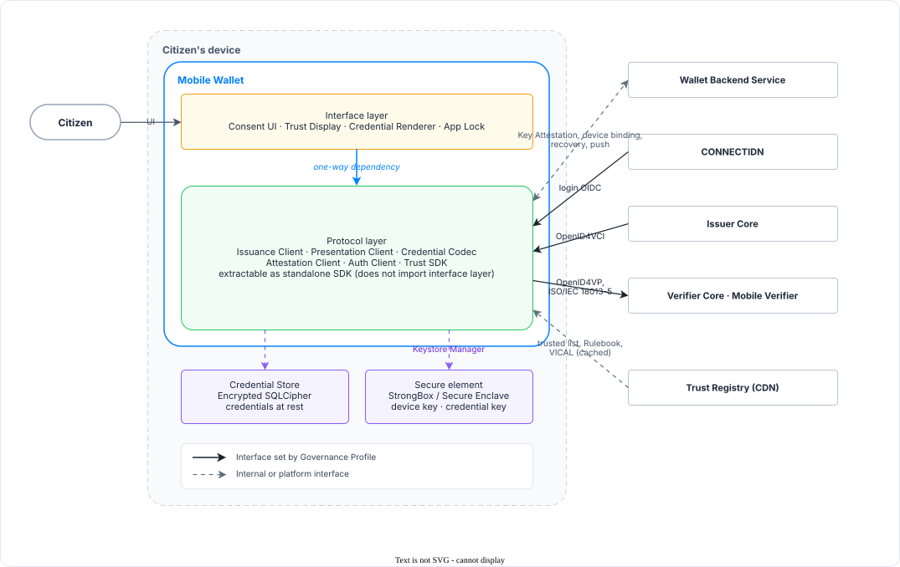

<!-- Sumber: Arsitektur Ekosistem Identitas Digital v0.2, §3.4, §7.5, Kep. 5, 10, 20, 25, 30 -->

# Architecture on the device: Mobile Wallet and Mobile Verifier {#architecture-on-the-device}

Mobile Wallet and Mobile Verifier have the same shape. Each is an
interface layer over a protocol layer, with encrypted storage and a secure
element beside them, all on a device the ecosystem does not own.

## The four parts {#the-four-parts}

In Mobile Wallet, the interface layer holds Consent UI, Trust Display,
Credential Renderer, and App Lock. The protocol layer under it holds Issuance
Client, Presentation Client, Credential Codec, Attestation Client, Auth Client,
and the Trust SDK. The Credential Store sits alongside, encrypted with
SQLCipher. The secure element, StrongBox on Android or the Secure Enclave on
iOS, holds the device key and the single credential key that binds every
credential the wallet carries. The component-by-component breakdown of both applications is in
[Mobile Wallet][sa-mobile-wallet] and [Mobile Verifier][sa-mobile-verifier].

{ #fig-architecture-on-the-device }

<figure markdown="1">
  { loading=lazy }
  <figcaption> The four parts on the device, their connections, and their external counterparties.</figcaption>
</figure>

- **Solid arrows are interfaces set by the Governance Profile.** OpenID4VCI from
  Issuer Core, OpenID4VP and ISO/IEC 18013-5 to verifiers, and OpenID Connect from
  CONNECTIDN are ecosystem standards that every implementation must meet.
- **Dashed arrows are internal or platform interfaces.** The storage interface to
  Credential Store, the Keystore Manager interface to the secure element, the
  cache feed from Trust Registry, and the proprietary protocol to Wallet Backend
  Service are internal to each provider.
- **The protocol layer does not import the interface layer.** The dependency runs
  strictly inward from the UI, keeping the protocol layer extractable as a
  standalone SDK.

[The architecture on the device][fig-architecture-on-the-device] shows the four
parts and the counterparties they talk to. The citizen touches only the interface
layer. Everything that leaves the device leaves through the protocol layer, which
is also the only part that reaches the secure element, through a Keystore
Manager, and the Credential Store. What that one layer talks to falls into four
kinds.

1. The transaction itself, which reaches three counterparties. CONNECTIDN
   authenticates the citizen over [OpenID Connect][exchange-protocols]. Issuer Core delivers a
   credential over [OpenID4VCI][exchange-protocols]. The verifier side receives a presentation in two
   forms: Verifier Core over [OpenID4VP][exchange-protocols], and Mobile Verifier, at a merchant or
   at a Relying Party's counter, over OpenID4VP online, relayed by the RP
   Intermediary's Verifier Core for a merchant, and over [ISO/IEC 18013-5][exchange-protocols]
   in proximity.
2. The application's own backing. Wallet Backend Service carries Key
   Attestation, device binding, recovery, and push notification, and no issuer
   or verifier is party to any of it.
3. A read-only feed. Trust Registry supplies the trusted list, the Credential
   Rulebook, and [Verified Issuer Certificate Authority List
   (VICAL)][trust-lists-and-credential-status], all of which
   the application reads from its local cache
   rather than fetching mid-transaction.
4. What is not remote at all. The secure element and the Credential Store are
   reached on the device, and what passes between them and the protocol layer
   never leaves it.

Which Module is allowed to call which is set out in
[who may call whom][who-may-call-whom].

Which of these interfaces the Governance Profile fixes, and to what degree, is a
separate question from who talks to whom. It is answered in
[which interfaces the Governance Profile
sets][which-interfaces-the-governance-profile-sets].

## The protocol layer does not import the interface layer {#the-protocol-layer-does-not-import-the-interface-layer}

The dependency runs one way. The protocol layer must not import anything from
the interface layer, which is what lets it be pulled out as a standalone SDK.

That is the reason the rule exists. The ecosystem takes many Wallet Providers,
each publishing a Mobile Wallet of its own, and every one of them has to get the
same protocols right against the same issuers and verifiers. A shared protocol
layer is how a second provider starts from a proven implementation instead of a
specification, and this one-way dependency is what keeps that extraction
affordable.

## Where the two applications differ {#where-the-two-applications-differ}

Both applications have the layout above, and one part of it behaves identically
in each: the Trust SDK reads from a local cache on both, so neither application
queries Trust Registry while a citizen waits.

The differences are elsewhere. They come down to who vouches for the
application, what its secure element holds, which side of a presentation it
plays, what it stores, and how its user signs in.
[The comparison][tbl-wallet-verifier-comparison] takes those one row at a time.

{ #tbl-wallet-verifier-comparison }

<figure markdown="1" class="ekdn-table">

| | Mobile Wallet | Mobile Verifier |
|---|---|---|
| Backed by | Wallet Backend Service (Wallet Provider) | Verifier Core (the RP Intermediary for a merchant's device, the Relying Party for its own counter device) |
| What vouches for the device | Key Attestation, daily | Verifier Device Certificate, limited lifetime plus a CRL |
| Keys in the secure element | Device key, plus one credential key for all credentials | Device key |
| Role in the protocol | Presents, as holder | Requests, as a [Relying Party Instance][relying-party-instance]; as verifier in proximity |
| Storage | Encrypted Credential Store | On-device Activity Repository |
| User login | The identity provider of that Mobile Wallet, CONNECTIDN among them | Merchant account at the RP Intermediary, or a staff account at the Relying Party |

</figure>

That single credential key, shared by all of a wallet's credentials, is a
decision marked temporary.

## Which interfaces the Governance Profile sets {#which-interfaces-the-governance-profile-sets}

Not every connection is fixed to the same degree, and two are not the
Governance Profile's to fix at all. [The interface table][tbl-interfaces-and-standards]
answers that single question for each interface, alongside the standard the
interface runs on.

{ #tbl-interfaces-and-standards }

<figure markdown="1" class="ekdn-table">

| Interface | Standard | Set by the Governance Profile |
|---|---|---|
| Issuer Core to Mobile Wallet | OpenID4VCI 1.0 | Yes |
| Mobile Wallet to Verifier Core | OpenID4VP 1.0 | Yes |
| Mobile Wallet to Mobile Verifier | OpenID4VP 1.0, ISO/IEC 18013-5 | Yes |
| Mobile Wallet and Mobile Verifier to Trust Registry | LoTE JSON, [TRQP][exchange-protocols], Credential Rulebook, VICAL | Yes |
| Mobile Wallet to Wallet Backend Service | Key Attestation, [OpenID4VCI Appendix D.1][device-attestation-and-assurance] | Partly |
| Mobile Verifier to Verifier Core | Verifier Device Certificate and the category Use Statements bound to the device, [ISO/IEC 18013-5 Annex B][certificates-and-revocation]; relayed `request_uri` and `response_uri` for a merchant's online check | Partly |
| Mobile Wallet to CONNECTIDN | OpenID Connect | Set by BSSN |
| Application to secure element | Google and Apple platform APIs | No |

</figure>

The two partial rows are where the ecosystem stops short on purpose. On each of
them the artifact is specified and the protocol carrying it is not. What a Key
Attestation or a Verifier Device Certificate looks like has to be fixed, because
another party verifies it: an issuer reads the attestation a wallet sends, and a
wallet reads the certificate a Mobile Verifier presents. The rest stays with
the party that runs it: how a Wallet Provider registers and recovers its own
installations, and how a Verifier Core provisions the devices it answers for.
Nobody outside that party ever sees those messages.

The last two rows are fixed somewhere else entirely. Badan Siber dan Sandi
Negara (BSSN) sets CONNECTIDN's interface; Balai Layanan Penghubung Identitas
Digital (BLPID), a technical unit of BSSN, runs the service. The platform APIs
belong to Google and Apple. The Governance Profile takes both as given.