<!-- Sumber: Arsitektur Ekosistem Identitas Digital v0.2, Section 7, Kep. 5, 9, 28, 30 -->

# Flows per use case {#flows-per-use-case}

*This section is informative.*

Each flow below is the minimum path, not a complete protocol trace. The steps
name who acts and what they send, and stop where the
[Technical Specifications](../../technical-specifications/index.md) take over
with the wire format.

Every flow holds to [the two paths never cross][the-two-paths-never-cross]:
nothing in Trust Infrastructure is called while a transaction runs.

## Trust ecosystem and infrastructure {#trust-ecosystem-and-infrastructure}

### Entity onboarding {#entity-onboarding}

Onboarding brings a new entity into the control plane, the step that has to
happen before the entity can sign anything on the transaction path. The entity
generates its own keys, and Trust Authority, Decentralized Identifier (DID)
Service, and Trust Registry each play a distinct part in accepting them.

{ #fig-entity-onboarding }

<figure markdown="1">

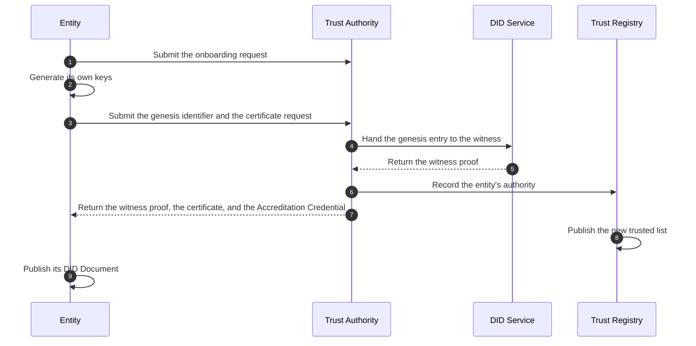

<figcaption> Entity onboarding, from the request to Trust Authority through to the DID Document the entity publishes.</figcaption>
</figure>

1. The entity sends `POST /entities` to Trust Authority, supplying its
   legal-entity documentation and a conformance test.

2. The entity's Key Manager generates `issuance-jose`, `issuance-cose`, and an
   Ed25519 update key in whichever driver the entity uses: an encrypted
   software keystore, a cloud Key Management Service (KMS), or a Hardware
   Security Module (HSM). The keys shown are an Issuer's; a Relying Party or a
   Wallet Provider generates the keys of its own registered role.

3. The entity submits its keys to Trust Authority in one request, through
   `POST /entities/me/keys`: the genesis `did.jsonl` entry, a proof of
   possession for each key, the `keyStorage` value, and a Certificate Signing
   Request (CSR) from the `issuance-cose` key, for the mdoc path. Trust
   Authority checks the `keyStorage` value against the `issuer_assurance` the
   entity is to be granted, and the CSR against the certificate profile.

4. Trust Authority hands the genesis entry to DID Service, which checks the
   chain and each proof of possession.

5. DID Service returns a witness proof signed with `eddsa-jcs-2022` to Trust
   Authority.

6. Trust Authority records an Authority Statement in Trust Registry, naming
   the action and the resource, together with the public keys and the
   `keyStorage` value, and records the new keys in its Public Key Registry.

7. Trust Authority returns the witness proof, a Document Signer Certificate
   (DSC), and the entity's Accreditation Credential in the same exchange.

8. Trust Registry publishes the new trusted list, which now carries the
   entity's keys.

9. The entity publishes its DID Document on its own domain.

Rotation follows the same path, through the same door: a new log entry, signed
with the current update key and matching the pre-rotation hash, is submitted
to Trust Authority and witnessed before it counts. The entity never submits an
entry to DID Service itself. After onboarding, the entity signs through its own
Key Manager, and Trust Infrastructure is not called once transactions start.

### Multi-tenant merchant onboarding {#multi-tenant-merchant-onboarding}

This flow lets an RP Intermediary, which runs a Verifier Core, onboard a new
merchant. It establishes the trust binding between the merchant's device
certificate and the RP Intermediary's Verifier Issuing CA, without requiring
the merchant to run infrastructure of its own.

{ #fig-multi-tenant-merchant-onboarding }

<figure markdown="1">

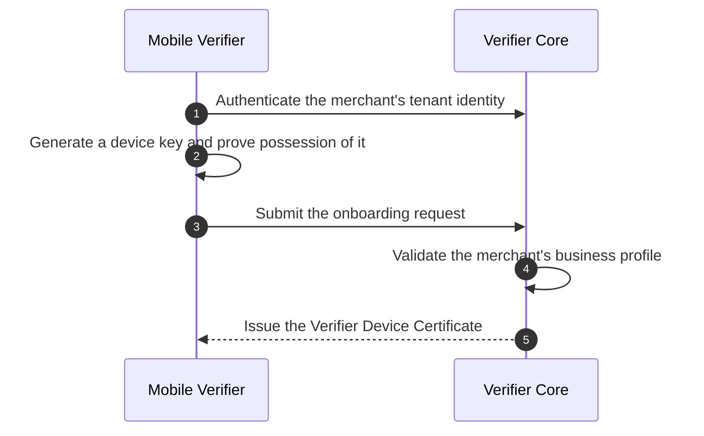

<figcaption> Multi-tenant merchant onboarding, from tenant authentication through to the Verifier Device Certificate the merchant receives.</figcaption>
</figure>

1. Mobile Verifier authenticates the merchant's tenant identity against the
   RP Intermediary's portal, using OAuth or an API key.

2. Mobile Verifier generates a key pair in the device's secure hardware,
   producing a Proof of Possession (PoP) for the new key.

3. Mobile Verifier submits an onboarding request to Verifier Core, attaching
   the PoP and the merchant's business profile.

4. Verifier Core validates the merchant's business status and permissions
   against its own tenant database, checking that the merchant is authorized
   for the attributes it will request.

5. Verifier Core issues the merchant a Verifier Device Certificate, cut from
   the RP Intermediary's Verifier Issuing CA. Its `Subject` names the
   merchant, and its `ReaderAuthRole` extension binds the certificate to the
   allowed attribute request scope.

### Merchant certificate withdrawal {#merchant-certificate-withdrawal}

This flow lets an RP Intermediary stop a merchant it registered. It is the
counterpart of the onboarding above, and it runs on the one part of a relayed
transaction the intermediary can read: the request. What the intermediary
observes, and what it may keep, is in
[RP Intermediary and merchant](../roles/rp-intermediary-and-merchant.md).

{ #fig-merchant-certificate-withdrawal }

<figure markdown="1">

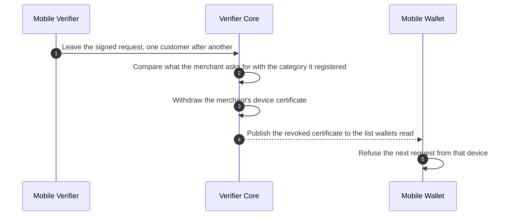

<figcaption> Withdrawal of a merchant's certificate, from the requests the relay holds through to the wallet that refuses the device.</figcaption>
</figure>

1. Mobile Verifier leaves a signed request with Verifier Core for each
   customer it serves, as [verification by a merchant][verification-by-a-merchant]
   sets out. The request is signed and not encrypted, so it is readable to the
   RP Intermediary; the response never is.

2. Verifier Core compares the attributes a merchant asks for against the
   Use Statement of the business category its device was bound to. A merchant
   that asks beyond its category is refused by every wallet it approaches, and
   without this comparison nobody would learn that it kept trying.

3. Verifier Core withdraws that merchant's Verifier Device Certificate, within
   the deadline the Governance Framework sets, and the merchant's other
   permissions are untouched because it has none beyond that certificate.

4. Verifier Core publishes the withdrawn certificate to the certificate
   revocation list (CRL) it maintains for the certificates it issues. Nothing
   is published centrally, and no other merchant is affected.

5. Mobile Wallet checks the certificate against its cached copy of that list
   and refuses the next request from the device. The refusal happens on the
   citizen's phone, so no part of it waits on Trust Infrastructure.

### Wallet registration and attestation {#wallet-registration-and-attestation}

This flow registers a wallet installation with Wallet Backend Service and
keeps it supplied with a Key Attestation, drawing on the device's own
operating system or chip and on CONNECTIDN.

{ #fig-wallet-registration-and-attestation }

<figure markdown="1">

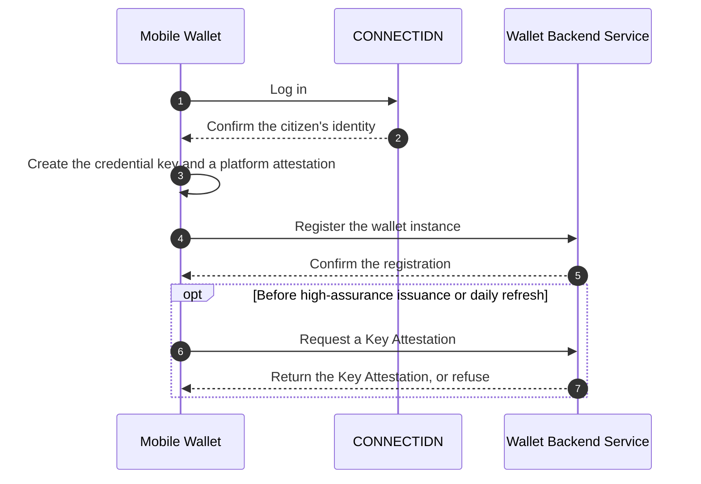

<figcaption> Wallet registration and attestation, from the CONNECTIDN login through to the Key Attestation Wallet Backend Service issues.</figcaption>
</figure>

1. Mobile Wallet logs in to CONNECTIDN over OpenID Connect.

2. CONNECTIDN returns an `id_token` verifying the user's identity.

3. Mobile Wallet creates a key and a platform attestation in the device's
   operating system or secure element, producing an integrity verdict.

4. Mobile Wallet registers the wallet instance with Wallet Backend Service,
   sending the public key, the platform attestation, and the CONNECTIDN
   `id_token`.

5. Wallet Backend Service confirms the registration, marking the instance
   active.

6. Before issuing a credential that requires substantial or high assurance,
   or on a daily refresh, Mobile Wallet requests a new Key Attestation from
   Wallet Backend Service, sending PoP of the device key, the holder's
   credential key to be attested, an integrity token, and the issuer's nonce.
   For low assurance credentials, Wallet Backend Service is not contacted.

7. Wallet Backend Service returns the Key Attestation, attesting the
   credential key in `attested_keys`, or refuses if the device is marked
   revoked.

Wallet Backend Service knows the account and the device. It knows neither the
credential, the issuer, nor the verifier. Replacing the phone means
re-issuance, because a hardware key cannot be backed up.

### Entity key revocation {#entity-key-revocation}

This flow runs when an entity's signing key is compromised, moving through
five phases from the freeze to the post-mortem.

{ #fig-entity-key-revocation }

<figure markdown="1">

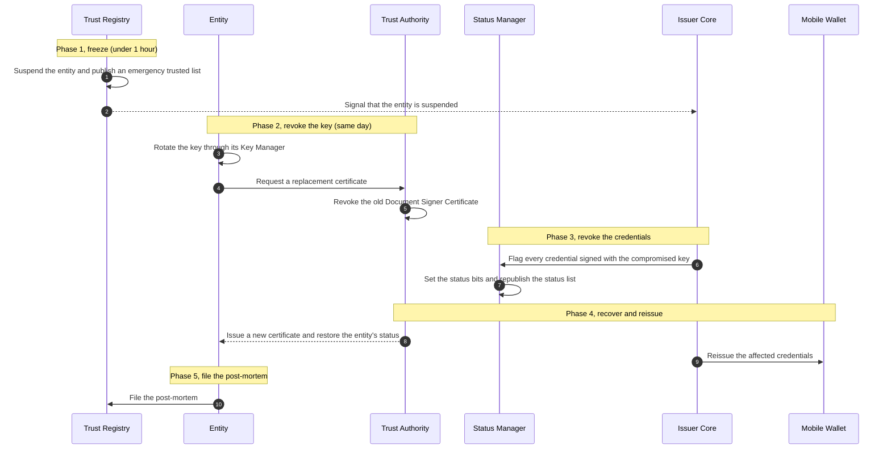

<figcaption> Entity key revocation, the five phases as the messages exchanged among Trust Registry, the entity, Trust Authority, Status Manager, Issuer Core, and Mobile Wallet.</figcaption>
</figure>

1. Trust Registry sets the entity's status to suspended and publishes an
   emergency trusted list, within an hour of the compromise being reported.

2. Trust Registry signals Issuer Core that the entity is suspended; Issuer
   Core stops issuing, and verifiers are notified directly.

3. The entity rotates its key at once through its own Key Manager, with
   pre-rotation in `did:webvh` witnessed by DID Service before it counts.

4. The entity submits a new CSR from the rotated key to Trust Authority, the
   same day.

5. Trust Authority adds the old DSC to the CRL.
   The old key leaves `assertionMethod` without the entry being deleted, and
   the witness refuses any new entry signed by the revoked key.

6. Issuer Core flags the `issuance_record` of every credential signed with
   the compromised key, pointing Status Manager at each credential's index in
   the status list.

7. Status Manager sets the status bit for each flagged index and republishes
   the Status List Token.

8. Trust Authority issues the entity a new DSC and sets its status to
   granted.

9. Issuer Core reissues the affected credentials; Mobile Wallet can receive a
   push notice to update.

10. The entity files a post-mortem to the transparency log, and its Key
    Manager driver is reviewed.

<figure markdown="1" class="ekdn-table">

| Phase | Target | Action |
|---|---|---|
| **1. Freeze** | Under 1 hour | Trust Registry sets the entity's status to suspended and issues an emergency trusted list; Issuer Core stops issuing; verifiers are notified directly. |
| **2. Revoke key** | Same day | The entity rotates the key at once through its Key Manager, with pre-rotation in `did:webvh` and DID Service's witness; Trust Authority adds the DSC to the CRL; the old key leaves `assertionMethod` without the entry being deleted; the witness refuses any new entry signed by the revoked key. |
| **3. Revoke credentials** | No fixed target | Every credential signed with the compromised key is revoked: `issuance_record` points to that credential's index in the status list, and Status Manager sets the bit and republishes the Status List Token. Periodic key rotation limits how many credentials this reaches. |
| **4. Recover & reissue** | No fixed target | A new key and a new DSC are issued, status is set to granted, and affected credentials are reissued; the wallet can receive a push notice to update its credential. |
| **5. File post-mortem** | No fixed target | A post-mortem is filed to the transparency log; the issuer's Key Manager driver is reviewed. |

</figure>

Two things have to exist from phase 1 for this flow to run at all: an
`issuance_record` that records a `signing_key_ref` per credential, and a DID
Service that keeps history and holds two active keys at once. Scheduled key
rotation, with a DSC valid at most 457 days for a Mobile Driving License
(mDL), decides how many credentials get caught up when one key leaks: the
more often a key rotates, the fewer credentials need reissuing. Revoking the
DSC in phase 2 blocks offline mdoc presentations immediately through the CRL
check; online SD-JWT VC validity ends only when the Status List Token is
republished in phase 3.

### Trust registry and status list sync {#trust-registry-and-status-list-sync}

Nothing on the transaction path asks Trust Infrastructure anything while a
transaction runs, so every verifying party works from a local cache this sync
fills. Mobile Wallet and Mobile Verifier need it because they operate in fully
offline settings; Verifier Core runs the same sync on a shorter timer, because
being reachable shortens how stale its copy may get but does not let it query
the center mid-transaction. Mobile Wallet runs the sync shown here.

{ #fig-trust-registry-and-status-list-sync }

<figure markdown="1">

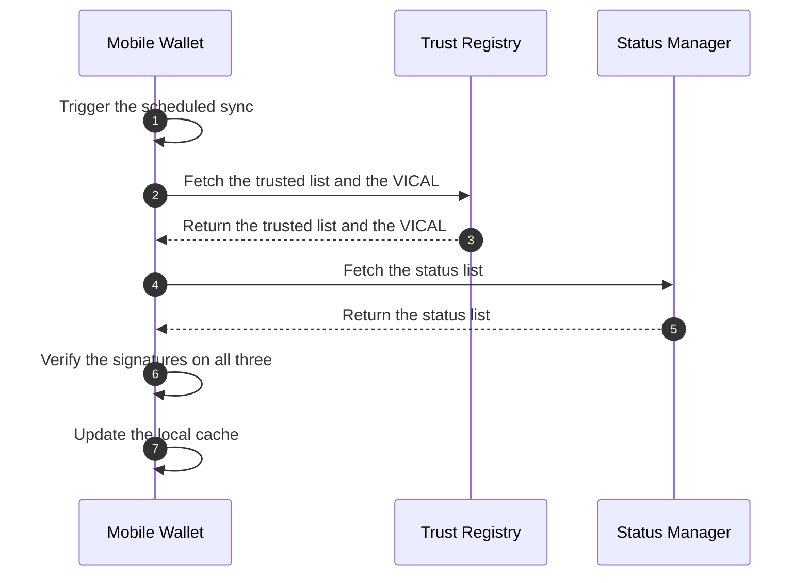

<figcaption> Trust registry and status list sync, from the scheduled trigger through to the refreshed local cache.</figcaption>
</figure>

1. Mobile Wallet triggers a scheduled background sync, for example every 24
   hours or when it detects an unmetered network connection.

2. Mobile Wallet requests Trust Registry for the latest trusted list and the
   Verified Issuer Certificate Authority List (VICAL).

3. Trust Registry returns the trusted list, carrying the public keys and
   accredited entities, and the VICAL, the signed list of mdoc issuer root
   certificates from ISO/IEC 18013-5 Annex C.

4. Mobile Wallet requests Status Manager for the latest status list.

5. Status Manager returns the status list, the bitstring that marks every
   revoked or suspended credential and withdraws a revoked Use Statement.

6. Mobile Wallet verifies the signatures on the trusted list, the VICAL, and
   the status list, confirming each comes from its legitimate authority and
   has not been tampered with.

7. Mobile Wallet overwrites its local cache with the fresh data, ready for
   the next offline presentation.

## Credential issuance {#credential-issuance}

### Authorization Code flow {#authorization-code-flow}

This flow issues a credential to a citizen's wallet over
[OpenID4VCI][exchange-protocols], online, using the Authorization Code flow.
The wallet redirects the citizen to the issuer's portal to log in and prove
their identity before requesting a token. Mobile Wallet, Wallet Backend
Service, Issuer Core, and Claims Provider take part, and the trusted list is
read from cache throughout.

{ #fig-authorization-code-flow }

<figure markdown="1">

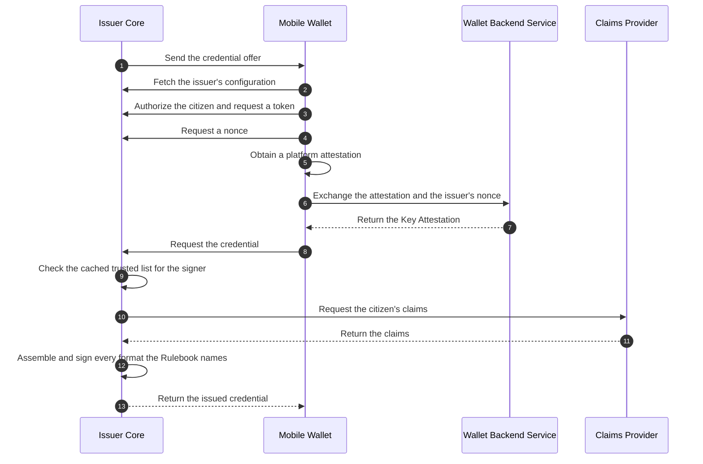

<figcaption> Credential issuance over OpenID4VCI with the Authorization Code flow, from the credential offer to Mobile Wallet receiving the issued credential.</figcaption>
</figure>

1. Issuer Core sends a credential offer to Mobile Wallet, using a QR code or
   a deeplink.

2. Mobile Wallet sends `GET /.well-known/openid-credential-issuer` to Issuer
   Core, reading `proof_types_supported` and `key_attestations_required`
   from the response, and checks the issuer's identity and authority
   against its local cache of the trusted list.

3. Mobile Wallet authorizes and requests a token through the Authorization
   Code flow, sending a pushed authorization request (PAR) and a Proof Key
   for Code Exchange (PKCE) to Issuer Core, bound with Demonstrating Proof
   of Possession (DPoP).

4. Mobile Wallet requests a nonce, sending `POST /nonce` to Issuer Core.

5. Mobile Wallet obtains a platform attestation for its credential key,
   created inside the secure element at first issuance and reused
   afterward.

6. Mobile Wallet exchanges the platform attestation and the issuer's nonce
   with Wallet Backend Service.

7. Wallet Backend Service returns a Key Attestation, carrying
   `attested_keys` and `key_storage`.

8. Mobile Wallet requests the credential, sending `POST /credential` to
   Issuer Core with `proofs.attestation` attached.

9. Issuer Core checks its local cache of the trusted list to confirm the
   Key Attestation's signer is present.

10. Issuer Core requests claims, calling `getClaims(subjectRef,
    credentialType)` on Claims Provider.

11. Claims Provider returns the claims with a `data_as_of` value.

12. Issuer Core assembles and signs the credential locally, in every format
    the [Credential Rulebook][the-credential-rulebook] names for that
    credential type. There are three to choose from: an SD-JWT Verifiable
    Credential (VC) carrying `cnf`, an mdoc carrying a Mobile Security Object
    (MSO) and a DeviceKey, and a W3C Verifiable Credentials Data Model (VCDM)
    credential in `ldp_vc` form carrying a Data Integrity proof. The common
    case is the first two together, because a type that has to be checked
    where there is no signal needs the mdoc and a type with a `restricted`
    attribute cannot take `ldp_vc` at all. Which formats a given type takes,
    and which role may issue each, is in
    [Credential formats](../data-model-and-protocols/credential-formats.md).

13. Issuer Core returns the issued credential to Mobile Wallet, in each
    format it signed.

{ #subjectref-origin }

`subjectRef` never arrives from the wallet. It comes from how the citizen
was authenticated: the citizen logs into an agency's own system, an officer
selects a record and creates the offer on the citizen's behalf, or the
offer chains from a credential the citizen already holds, with Issuer Core
verifying that credential (a KTP Digital) first. When the source system
answers slowly, issuance is deferred and Issuer Core returns a
`transaction_id` instead of the credential.

### Pre-Authorized Code flow {#pre-authorized-code-flow}

This flow issues a credential over OpenID4VCI using the Pre-Authorized Code
flow, for when Issuer Core already knows the citizen's identity and pushes
a credential offer on its own. Instead of redirecting the citizen to a
login page, Mobile Wallet exchanges the offer's `pre-authorized_code` and
an out-of-band factor, such as an SMS PIN or a One-Time Password (OTP),
directly for the credential.

{ #fig-pre-authorized-code-flow }

<figure markdown="1">

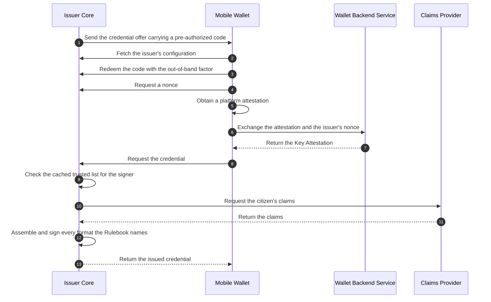

<figcaption> Credential issuance over OpenID4VCI with the Pre-Authorized Code flow, from the credential offer to Mobile Wallet receiving the issued credential.</figcaption>
</figure>

1. Issuer Core sends a credential offer carrying a `pre-authorized_code` to
   Mobile Wallet, using a QR code or a deeplink.

2. Mobile Wallet sends `GET /.well-known/openid-credential-issuer` to Issuer
   Core, reading `proof_types_supported` and `key_attestations_required`
   from the response, and checks the issuer's identity and authority
   against its local cache of the trusted list.

3. Mobile Wallet bypasses the authorization endpoint and requests a token
   directly, sending `POST /token` to Issuer Core with the
   `pre-authorized_code` and an out-of-band factor, such as a PIN or a
   One-Time Password (OTP), serving as the `tx_code`, bound with DPoP.

4. Mobile Wallet requests a nonce, sending `POST /nonce` to Issuer Core.

5. Mobile Wallet obtains a platform attestation for its credential key,
   created inside the secure element at first issuance and reused
   afterward.

6. Mobile Wallet exchanges the platform attestation and the issuer's nonce
   with Wallet Backend Service.

7. Wallet Backend Service returns a Key Attestation, carrying
   `attested_keys` and `key_storage`.

8. Mobile Wallet requests the credential, sending `POST /credential` to
   Issuer Core with `proofs.attestation` attached.

9. Issuer Core checks its local cache of the trusted list to confirm the
   Key Attestation's signer is present.

10. Issuer Core requests claims, calling `getClaims(subjectRef,
    credentialType)` on Claims Provider.

11. Claims Provider returns the claims with a `data_as_of` value.

12. Issuer Core assembles and signs the credential locally, in every format
    the Credential Rulebook names for that credential type, exactly as on the
    interactive path.

13. Issuer Core returns the issued credential to Mobile Wallet, in each
    format it signed.

Issuer Core already knows the citizen before it creates the offer; [how
`subjectRef` reaches Issuer Core][subjectref-origin] applies the same way
here.

## Presentation and verification {#presentation-and-verification}

### Online verification {#online-verification}

This flow lets a Relying Party (RP) application verify a credential over
[OpenID4VP][exchange-protocols], with Verifier Core mediating between it and
Mobile Wallet. The trusted list and the status list are both read from cache.

{ #fig-online-verification }

<figure markdown="1">

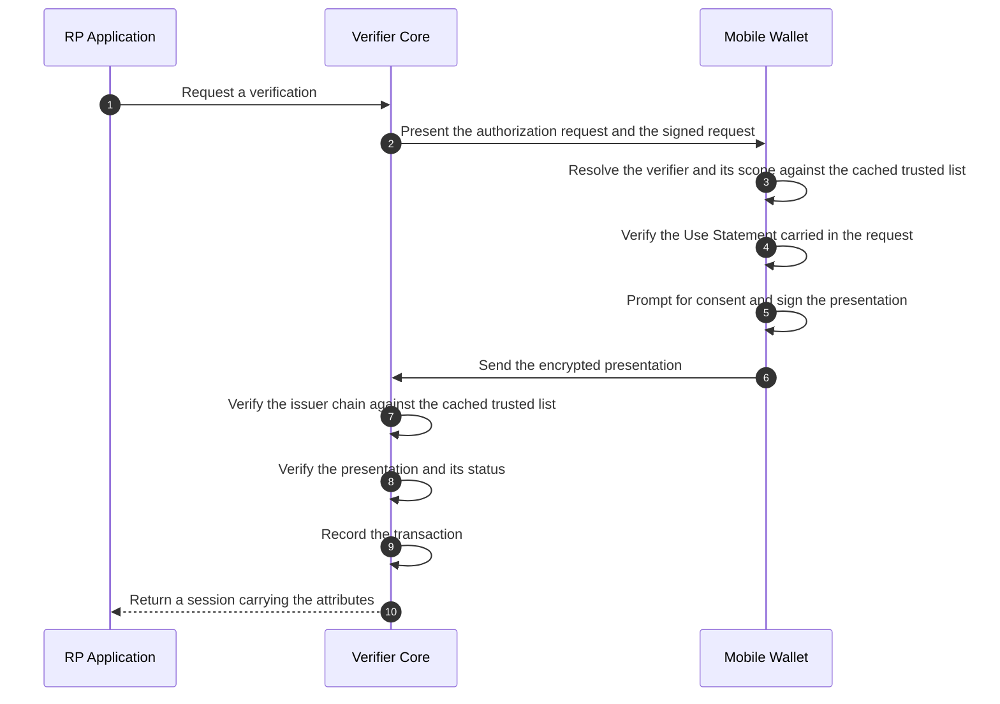

<figcaption> Online verification, from the RP application's request to Verifier Core through to the session it returns.</figcaption>
</figure>

1. The RP application asks Verifier Core to run a check using a template.

2. Verifier Core sends Mobile Wallet an authorization request (a QR code or a
   deeplink) carrying `request_uri` and `client_id`, prefixed with
   `decentralized_identifier:`. Mobile Wallet retrieves the signed Request
   Object via `GET request_uri`, which carries the Digital Credentials Query
   Language (DCQL) query, the nonce, the verifier's encryption key, and the
   Use Statement in `verifier_info`.

3. Mobile Wallet resolves `client_id` against the trusted list and checks the
   requested scope through Trust Registry Query Protocol (TRQP), reading both
   from the local cache.

4. Mobile Wallet reads the Use Statement out of `verifier_info` in the signed
   Request Object it fetched at step 2, verifies Trust Authority's signature
   on it, checks its revocation against the cached status list, and confirms
   the requested attributes are a subset of the ones it lists.

5. Mobile Wallet shows the citizen the consent request (for example, that Bank
   XYZ asks to confirm age over 17, per the purpose in the Use Statement) and
   signs a Key Binding JWT (KB-JWT) over the nonce and the
   audience.

6. Mobile Wallet delivers the `vp_token` to Verifier Core's `response_uri` via
   `direct_post.jwt`, encrypted as a JWE using the verifier's key from
   `client_metadata.jwks`.

7. Verifier Core verifies the issuer chain by running Chain 1 against the
   cached trusted list, checking E1 through E4.

8. Verifier Core verifies the presentation and status by running Chain 2
   against the trusted list: T1 (the signature), T2 (the status list), T3
   (the KB-JWT against `cnf`), T4 (the nonce and audience), and T5 (the
   scope).

9. Verifier Core records the transaction internally, keeping the transaction
   ID, the `use_id` the request ran under, and the consent receipt as T6,
   storing only the `vp_digest`.

10. Verifier Core returns a session (OpenID Connect or a Security Assertion
    Markup Language (SAML) session) carrying the attributes to the RP
    application.

Verifier Core does not store the resulting attributes. Keeping them is the RP
application's responsibility.

### Offline verification {#offline-verification}

This flow verifies a credential over [ISO/IEC 18013-5][exchange-protocols], in
proximity, between Mobile Verifier and Mobile Wallet. The verifying
application is always on a device: Mobile Verifier on a merchant's phone or a
Relying Party's counter device, or a Relying Party's own app built on the
Reader SDK. It is never Verifier Core. No network is reachable during it at
all.

{ #fig-offline-verification }

<figure markdown="1">

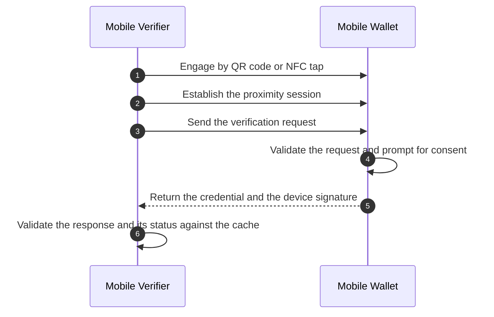

<figcaption> Offline verification, from the proximity engagement through to Mobile Verifier's check of the response.</figcaption>
</figure>

1. Mobile Verifier engages Mobile Wallet with a QR code or a Near Field
   Communication (NFC) tap.

2. Mobile Verifier and Mobile Wallet establish a session over Bluetooth Low
   Energy (BLE), using ephemeral Elliptic Curve Diffie-Hellman (ECDH).

3. Mobile Verifier sends Mobile Wallet a `DeviceRequest` containing
   `ItemsRequest` (carrying the Use Statement in
   `requestInfo.idUseStatement`) and `ReaderAuth` (a COSE_Sign1 structure
   holding the Verifier Device Certificate in `x5chain` and signing the
   request and the `SessionTranscript`).

4. Mobile Wallet validates the certificate chain up to the Verifier Root CA
   embedded at build time, confirms from the cached trusted list that the
   Verifier Issuing CA is granted, verifies that the Use Statement holds (its
   `sub` names the holder of that issuing CA), checks that the requested
   attributes are a subset of both `ReaderAuthRole` and the Use Statement,
   and asks the citizen to select which attributes to release.

5. Mobile Wallet returns the mdoc and DeviceAuth encapsulated in a
   DeviceResponse.

6. Mobile Verifier chains `x5chain` to the Issuer Root CA from its cache to
   validate IssuerAuth, recomputes the digest, checks DeviceAuth against the
   SessionTranscript, and checks the status list from its cache.

Zero network calls happen during this flow. The status list can be stale by
the time it runs, up to the tolerance limit the Governance Framework sets,
seven days for example; the trusted list is good until the `NextUpdate` Trust
Registry wrote into it and is discarded after. DeviceAuth is a
`deviceSignature`; `deviceMac` is out of scope. The consequence is that a
presentation cannot be denied afterward: a verifier can prove to a third
party that the citizen presented. That is accepted as the price of easier
audit and dispute settlement.

### Verification by a merchant {#verification-by-a-merchant}

This flow lets a merchant verify a credential through Mobile Verifier,
standing in for the Verifier Core it does not run itself. Three parties take
part: Mobile Verifier on the merchant's own device, Verifier Core run by the
RP Intermediary that registered the merchant, and Mobile Wallet.

{ #fig-verification-by-a-merchant }

<figure markdown="1">

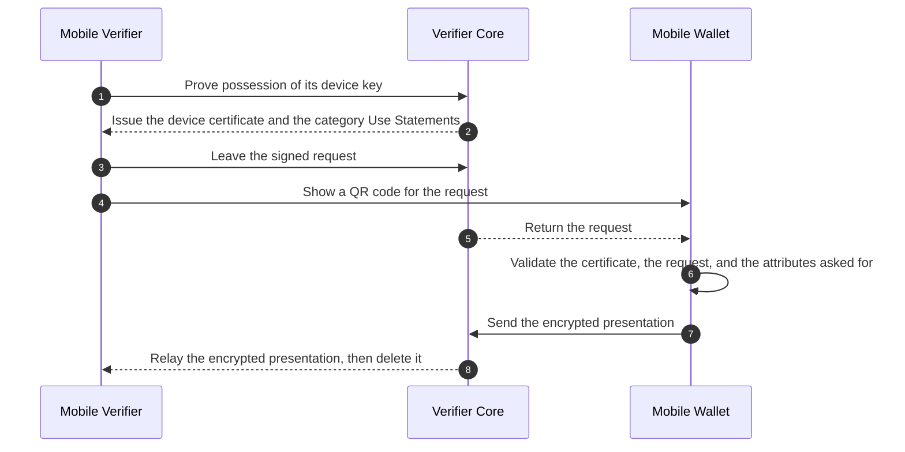

<figcaption> Verification by a merchant, from the device certificate request through to the relayed presentation.</figcaption>
</figure>

1. Mobile Verifier sends Verifier Core a PoP of its device key and an
   integrity token, to set up or renew its certificate.

2. Verifier Core returns a Verifier Device Certificate, with the device key
   as the Subject Public Key Info (SPKI) and carrying the `ReaderAuthRole`
   extension, along with the Use Statements for the business categories its
   device is bound to. The
   [multi-tenant merchant onboarding flow][multi-tenant-merchant-onboarding]
   covers this certificate issuance in full.

3. When a customer arrives, Mobile Verifier leaves a Request Object with
   Verifier Core, signed with the device key and carrying the certificate.

4. Mobile Verifier shows Mobile Wallet a QR code for the request.

5. Verifier Core returns the Request Object to Mobile Wallet.

6. Mobile Wallet validates the certificate chain against the embedded
   Verifier Root CA with the Issuing CA granted in the cached trusted list,
   checks that the certificate is valid and not on the CRL, matches the
   Request Object signature and the SHA-256 hash of the Verifier Device
   Certificate against the `client_id`, confirms the requested attributes
   are a subset of `ReaderAuthRole` and never include `restricted`
   attributes, and checks that the requested attributes align with the
   category Use Statement.

7. Mobile Wallet sends the encrypted presentation to Verifier Core via
   `direct_post.jwt`, keeping the data encrypted to the merchant's device
   key.

8. Verifier Core relays the ciphertext back to Mobile Verifier and deletes
   it, so Mobile Verifier decrypts and verifies the data locally on the
   merchant's device.

The key is born on the merchant's own device and signs there too. The RP
Intermediary's Verifier Core holds only the Request Object and the encrypted
response, for a short time and without logging them; it vouches for the
merchant but never sees the citizen's data. A merchant is registered, not
accredited. The consent screen shows the citizen the merchant's name, taken
from the Subject of its Verifier Device Certificate, and the purpose of the
category Use Statement in use, for example age verification for buying
tobacco products; the RP Intermediary's name appears only in the transaction
history.

## Wallet and holder lifecycle {#wallet-and-holder-lifecycle}

### Device migration and recovery {#device-migration}

Hardware keys cannot be exported from the secure element. When a citizen
moves to a new device or recovers from a lost phone, the wallet instance is
re-registered and the credentials are reissued. Wallet Backend Service
revokes the old instance's Key Attestation, so only the new device can
authenticate.

{ #fig-device-migration }

<figure markdown="1">

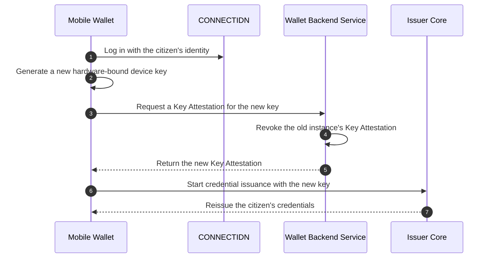

<figcaption> Device migration, from the new device's Key Attestation request through to the reissued credentials.</figcaption>
</figure>

1. Mobile Wallet logs in with the citizen's CONNECTIDN identity on the new
   device.

2. Mobile Wallet generates a new hardware-bound device key.

3. Mobile Wallet requests a Key Attestation for the new key from Wallet
   Backend Service.

4. Wallet Backend Service revokes the old instance's Key Attestation,
   permanently disabling its ability to authenticate against Issuer Cores.

5. Wallet Backend Service returns the new Key Attestation to Mobile Wallet.

6. Mobile Wallet starts the [Authorization Code flow][authorization-code-flow]
   with Issuer Core, using the new key.

7. Issuer Core verifies the new Key Attestation and reissues the credential
   in each format its Rulebook names, bound to the new device.

### Credential renewal {#credential-renewal}

Credentials such as the KTP Digital carry an expiration date. Mobile Wallet
refreshes a credential before it expires, so offline and online
presentations keep working without sending the citizen through a new
authorization flow.

{ #fig-credential-renewal }

<figure markdown="1">

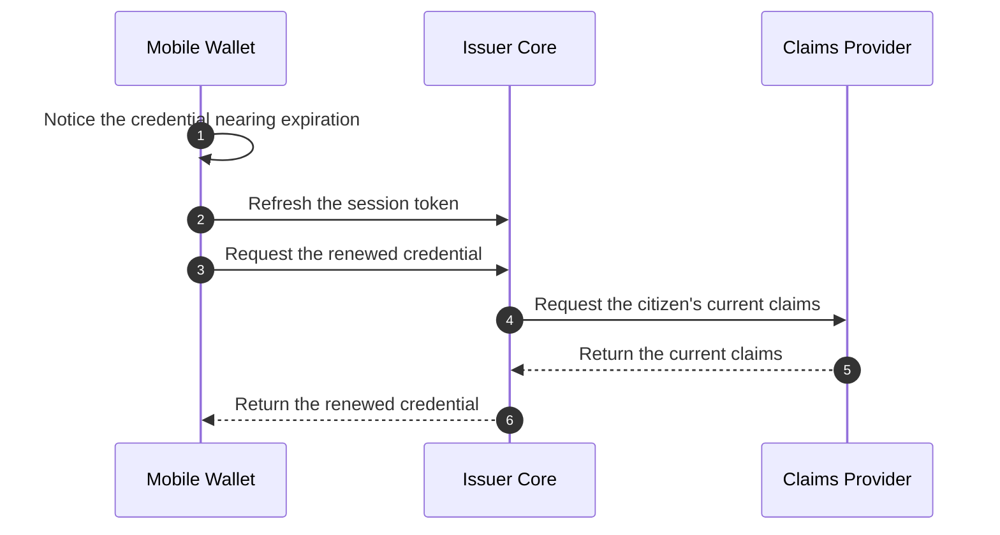

<figcaption> Credential renewal, from detecting impending expiry through to the reissued credential.</figcaption>
</figure>

1. Mobile Wallet notices that a stored credential is nearing its expiration
   date.

2. Mobile Wallet refreshes its token with Issuer Core, without sending the
   citizen back through the issuer's login, where the session policy
   permits it.

3. Mobile Wallet sends a `POST /credential` request to Issuer Core, with its
   existing device key and valid Key Attestation, to renew the credential.

4. Issuer Core queries Claims Provider to check that the citizen's source
   data has not changed or been flagged.

5. Claims Provider returns the latest claims and the current `data_as_of`
   timestamp.

6. Issuer Core signs the credential again in each format its Rulebook names,
   with extended expiration dates, and returns it to Mobile Wallet.

### Citizen-initiated revocation {#citizen-initiated-revocation}

A citizen can revoke their credentials before replacing a lost or
compromised device, through the Issuer's web portal or its call center
rather than through Mobile Wallet.

{ #fig-citizen-initiated-revocation }

<figure markdown="1">

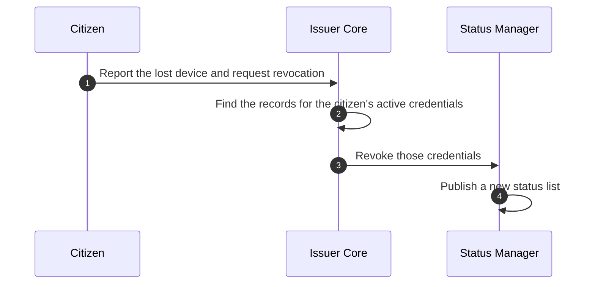

<figcaption> Citizen-initiated revocation, from the web portal report through to the published Status List Token.</figcaption>
</figure>

1. The citizen reports the lost device and requests revocation, through the
   Issuer's web portal or by contacting the call center.

2. Issuer Core retrieves the `issuance_record` for the citizen's active
   credentials, identifying their index positions in the status list.

3. Issuer Core instructs Status Manager to flip the status bit for those
   indices to revoked.

4. Status Manager publishes a new Status List Token reflecting the revoked
   status.

Verifiers and wallets do not see the change right away. They pick up the new
Status List Token at their next
[trust registry and status list sync][trust-registry-and-status-list-sync]
and reject presentations from the lost device from that point on.
