<!-- Sumber: Arsitektur Ekosistem Identitas Digital v0.2, Section 7, Kep. 5, 9, 28, 30; siklus hidup kredensial belum ada di draft -->

# Flows per use case {#flows-per-use-case}

*This section is informative.*

Each flow below is the minimum path, not a complete protocol trace. The steps
name who acts and what they send, and stop where the
[Technical Specifications](../../technical-specifications/index.md) take over
with the wire format.

Every flow holds to [the two paths never cross][the-two-paths-never-cross]:
nothing in Trust Infrastructure is called while a transaction runs.

## 1. Trust Ecosystem & Infrastructure

### Entity onboarding {#entity-onboarding}

Onboarding brings a new entity into the control plane, the step that has to
happen before the entity can sign anything on the transaction path. The entity
generates its own keys, and Trust Authority, Decentralized Identifier (DID) Service, and Trust Registry
each play a distinct part in accepting them. The entity onboarding flow is shown in Figure 1.

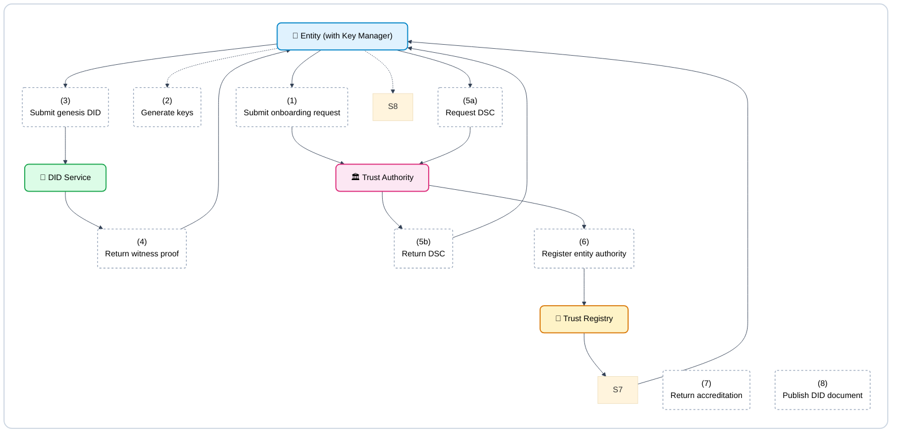

**Figure 1 Entity Onboarding Flow**

1. The entity initiates the process to submit an onboarding request by sending `POST /entities` to Trust Authority, supplying its legal-entity documentation and a conformance test.

2. The entity's Key Manager proceeds to generate keys—specifically `issuance-jose`, `issuance-cose`, and an Ed25519 update key—in whichever driver the entity uses, such as an encrypted software keystore, a cloud Key Management Service (KMS), or a Hardware Security Module (HSM). (Illustrated for an Issuer; Relying Parties and Wallet Providers generate their respective keys according to their registered role).

3. The entity then must submit its genesis DID by sending the `did.jsonl` document, a proof of possession for each key, and the `keyStorage` to the DID Service.

4. In response, the DID Service will return a witness proof signed with `eddsa-jcs-2022`.

5. The entity will then request, and Trust Authority will return, a Document Signer Certificate (DSC) for the mdoc path after receiving a certificate signing request (CSR) from the `issuance-cose` key.

6. To register entity authority, Trust Authority sends an Authority Statement to Trust Registry, naming the specific action and resource, together with the public keys and `keyStorage`.

7. Trust Registry returns the new trusted list and the Accreditation Credential to the entity.

8. Finally, the entity can publish the DID document on its own domain.

Rotation follows the same path: a new log entry, signed with the current update
key and matching the pre-rotation hash, is witnessed before it counts. After
onboarding, the entity signs through its own Key Manager, and Trust
Infrastructure is not called once transactions start.

### Multi-tenant merchant onboarding {#multi-tenant-merchant-onboarding}

This flow describes how a Relying Party Intermediary (acting as a Verifier Core) securely onboards a new sub-merchant. It establishes the trust binding between the merchant's physical device and the Intermediary's root authority without requiring the merchant to run complex backend infrastructure. The multi-tenant merchant onboarding flow is shown in Figure 2.

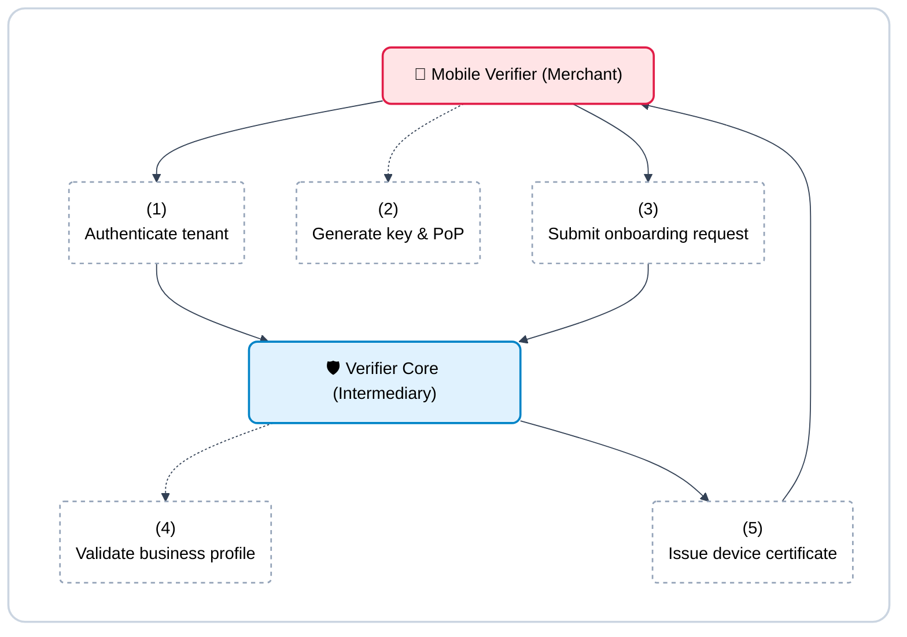

**Figure 2 Multi-Tenant Merchant Onboarding Flow**

1. The merchant downloads the Mobile Verifier application and authenticates their tenant identity against the Intermediary's portal (e.g., using standard OAuth or API keys).

2. Upon successful login, the Mobile Verifier interacts with the device's secure hardware to generate a new key pair and a corresponding Proof of Possession (PoP).

3. The Mobile Verifier submits an onboarding request to the Verifier Core, attaching the PoP and the merchant's business profile.

4. The Verifier Core validates the merchant's business status and permissions against its own internal tenant database, ensuring the merchant is authorized to request specific credential attributes.

5. Finally, the Verifier Core acts as an issuing authority (Sub-CA) and issues a Verifier Device Certificate to the Mobile Verifier. The certificate's `Subject` identifies the specific merchant, and its `ReaderAuthRole` extension cryptographically binds the allowed attribute request scope.

### Wallet registration and attestation {#wallet-registration-and-attestation}

This flow registers a wallet installation with Wallet Backend Service and
keeps it supplied with a Key Attestation, drawing on the device's own operating
system or chip and on CONNECTIDN. The wallet registration flow is shown in Figure 3.

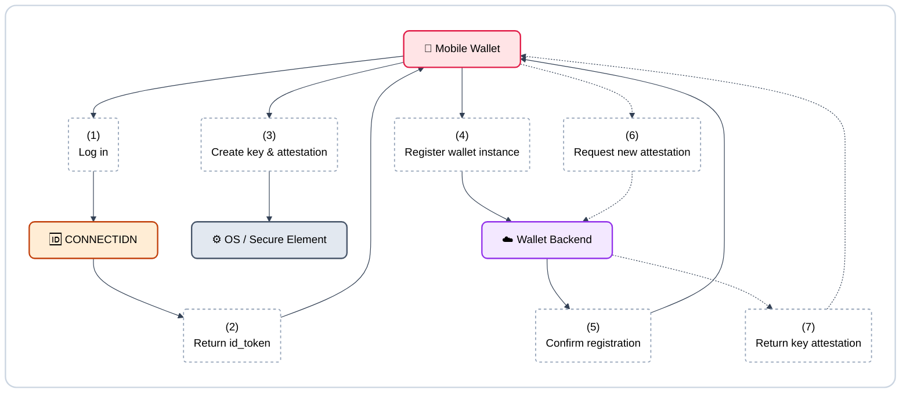

**Figure 3 Wallet Registration Flow**

1. To initiate, the Mobile Wallet will log in to CONNECTIDN over OpenID Connect.

2. In response, CONNECTIDN will return an `id_token` verifying the user's identity.

3. The Mobile Wallet then interacts with the hardware to create a key and an attestation, prompting the operating system to produce a platform attestation and return an integrity verdict.

4. The Mobile Wallet will proceed to register the wallet instance by sending the public key, the platform attestation, and the CONNECTIDN token to the Wallet Backend Service.

5. The Wallet Backend Service will confirm the registration, signaling that the instance is active.

6. Before issuing a credential requiring substantial or high assurance (or upon daily refresh), the Mobile Wallet requests a new Key Attestation from Wallet Backend Service by sending proof of possession of the device key, the holder's credential key (to be attested), an integrity token, and the issuer's nonce. For low assurance credentials, Wallet Backend Service is not contacted.

7. The Wallet Backend Service will then return a key attestation (attesting the credential key in `attested_keys`), or refuse if the device has been marked as revoked.

Wallet Backend Service knows the account and the device. It knows neither the
credential, the issuer, nor the verifier. Replacing the phone means
re-issuance, because a hardware key cannot be backed up.

### Entity key revocation {#entity-key-revocation}

This flow runs when an entity's signing key is compromised, moving through
five phases from the freeze to the post-mortem. The entity key revocation timeline is shown in Figure 4.

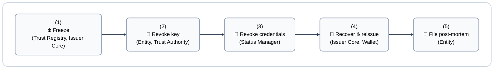

**Figure 4 Entity Key Revocation Flow**

<figure markdown="1" class="ekdn-table">

| Phase | Target | Action |
|---|---|---|
| **1. Freeze** | Under 1 hour | Trust Registry sets the entity's status to suspended and issues an emergency trusted list; Issuer Core stops issuing; verifiers are notified directly. |
| **2. Revoke key** | Same day | The entity rotates the key at once through its Key Manager, with pre-rotation in `did:webvh` and DID Service's witness; Trust Authority adds the DSC to the CRL; the old key leaves `assertionMethod` without the entry being deleted; the witness refuses any new entry signed by the revoked key. |
| **3. Revoke credentials** | No fixed target | Every credential signed with the compromised key is revoked: `issuance_record` points to that credential's index in the status list, and Status Manager sets the bit and republishes the Status List Token. Periodic key rotation limits how many credentials this reaches. |
| **4. Recover & reissue** | No fixed target | A new key and a new DSC are issued, status is set to granted, and affected credentials are reissued; the wallet can receive a push notice to update its credential. |
| **5. File post-mortem** | No fixed target | A post-mortem is filed to the transparency log; the issuer's Key Manager driver is reviewed. |

</figure>

Two things have to exist from phase 1 for this flow to run at all: an
`issuance_record` that records a `signing_key_ref` per credential, and a DID
Service that keeps history and holds two active keys at once. Scheduled key
rotation, a DSC valid at most 457 days for an mDL, decides how many
credentials get caught up when one key leaks: the more often a key rotates,
the fewer credentials need reissuing. Note that revoking the DSC in Phase 2 immediately blocks offline mdoc presentations via the CRL check, while online SD-JWT VC validity is terminated when the Status List Token is republished in Phase 3.

### Trust registry and status list sync {#cache-sync}

Edge components such as the Mobile Wallet and Mobile Verifier must operate reliably in fully offline environments. To ensure they can validate signatures and check for revoked credentials without an active internet connection, these devices rely on a background synchronization mechanism. The trust registry and status list sync flow is shown in Figure 5.

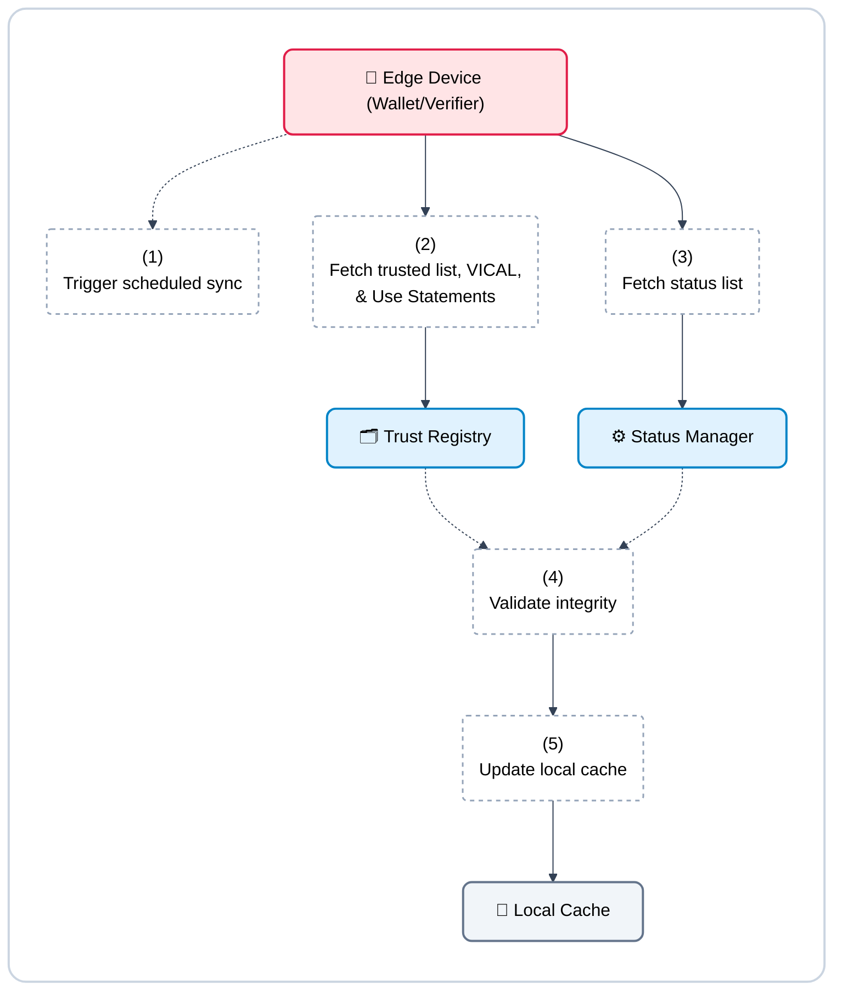

**Figure 5 Trust Registry and Status List Sync Flow**

1. An automated background job triggers on the edge device (e.g., every 24 hours or when the device detects an unmetered Wi-Fi connection).

2. The edge device sends a request to the Trust Registry to download the latest published Trusted List (which contains the public keys and permissions of all accredited issuers and verifiers), the Vehicle for Issuer CA List (VICAL), and the valid Use Statements.

3. Concurrently, the edge device calls the Status Manager to fetch the latest Status List Token, which contains the bitstring representing all revoked or suspended credentials.

4. The edge device cryptographically verifies the signatures on the Trusted List, VICAL, Use Statements, and the Status List Token to ensure they originated from the legitimate authorities and have not been tampered with.

5. Upon successful validation, the edge device overwrites its Local Cache with the fresh data, ensuring it is fully prepared for the next offline presentation.

## 2. Credential Issuance

### Credential issuance {#credential-issuance}

This flow issues a credential to a citizen's wallet over [OpenID4VCI][exchange-protocols], online. It serves as the standard, interactive route utilized when a citizen requests a credential from scratch. Because it relies on the Authorization Code flow, the wallet must redirect the user to the Issuer's portal to explicitly log in and prove their identity. Mobile Wallet, Wallet Backend Service, Issuer Core, and Claims Provider each take part, and the trusted list is read from cache throughout. The credential issuance flow is shown in Figure 6.

**Figure 6 Credential Issuance Flow**

1. To begin, Issuer Core will send a credential offer to the Mobile Wallet, usually by presenting a QR code or a deeplink.

2. The Mobile Wallet then needs to fetch the configuration by sending `GET /.well-known/openid-credential-issuer` to Issuer Core, reading `proof_types_supported` and `key_attestations_required` from the response. Before proceeding, the Mobile Wallet verifies the issuer's identity and authority from its local cache of the trusted list.

3. Next, the Mobile Wallet will authorize and request a token using the Authorization Code flow by sending a pushed authorization request (PAR) and Proof Key for Code Exchange (PKCE) to Issuer Core, securing the exchange with Demonstrating Proof of Possession (DPoP).

4. The Mobile Wallet proceeds to request a nonce by sending a `POST /nonce` to Issuer Core.

5. Taking its credential key (created inside the secure element at its first issuance and reused subsequently), the Mobile Wallet acts to obtain a platform attestation.

6. The Mobile Wallet will exchange this attestation and the issuer's nonce by interacting with the Wallet Backend Service.

7. In response, the Wallet Backend Service will return a key attestation, carrying the `attested_keys` and `key_storage`.

8. The Mobile Wallet can now request the credential by sending `POST /credential` to Issuer Core, attaching the `proofs.attestation`.

9. The Issuer Core must verify the signer by checking the local cache of the trusted list to ensure the Key Attestation's signer is present.

10. The Issuer Core then proceeds to request claims by calling `getClaims(subjectRef, credentialType)` on the Claims Provider.

11. The Claims Provider will return the claims along with a `data_as_of` value.

12. The Issuer Core will assemble and sign the credentials locally, producing an SD-JWT Verifiable Credential (VC) carrying `cnf`, and an mdoc carrying a Mobile Security Object (MSO) and a DeviceKey. This dual issuance is standard for credentials like KTP Digital.

13. Finally, the Issuer Core will return the credentials (the SD-JWT VC and the mdoc) to the Mobile Wallet.

`subjectRef` never arrives from the wallet. It comes from how the citizen was
authenticated: the citizen logs into an agency's own system, an officer
selects a record and creates the offer on the citizen's behalf, or the offer
chains from a credential the citizen already holds, with Issuer Core
verifying that credential (a KTP Digital) first. When the source system
answers slowly, issuance is deferred and Issuer Core returns a
`transaction_id` instead of the credential.

### Pre-Authorized credential issuance {#pre-authorized-issuance}

This flow issues a credential over OpenID4VCI utilizing the Pre-Authorized Code flow. It acts as a non-interactive fast track, primarily deployed when the Issuer already knows the citizen's identity and proactively pushes a credential offer. Instead of redirecting the user to a login page, the wallet bypasses the authorization endpoint entirely and exchanges the offer's code—secured by an out-of-band factor like an SMS PIN or OTP—directly for the credential. The pre-authorized credential issuance flow is shown in Figure 7.

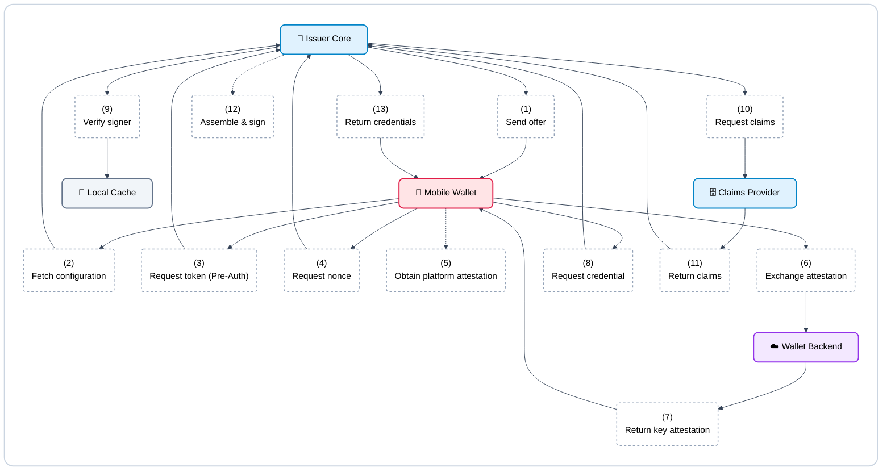

**Figure 7 Pre-Authorized Credential Issuance Flow**

1. To begin, Issuer Core will send a credential offer (carrying a `pre-authorized_code`) to the Mobile Wallet, usually by presenting a QR code or a deeplink.

2. The Mobile Wallet then needs to fetch the configuration by sending `GET /.well-known/openid-credential-issuer` to Issuer Core, reading `proof_types_supported` and `key_attestations_required` from the response. Before proceeding, the Mobile Wallet verifies the issuer's identity and authority from its local cache of the trusted list.

3. Next, the Mobile Wallet bypasses the interactive authorization step and requests a token directly by sending `POST /token` to Issuer Core. It utilizes the `pre-authorized_code` and a generalized additional authentication factor (such as a PIN or OTP serving as the `tx_code`), along with Demonstrating Proof of Possession (DPoP).

4. The Mobile Wallet proceeds to request a nonce by sending a `POST /nonce` to Issuer Core.

5. Taking its credential key (created inside the secure element at its first issuance and reused subsequently), the Mobile Wallet acts to obtain a platform attestation.

6. The Mobile Wallet will exchange this attestation and the issuer's nonce by interacting with the Wallet Backend Service.

7. In response, the Wallet Backend Service will return a key attestation, carrying the `attested_keys` and `key_storage`.

8. The Mobile Wallet can now request the credential by sending `POST /credential` to Issuer Core, attaching the `proofs.attestation`.

9. The Issuer Core must verify the signer by checking the local cache of the trusted list to ensure the Key Attestation's signer is present.

10. The Issuer Core then proceeds to request claims by calling `getClaims(subjectRef, credentialType)` on the Claims Provider.

11. The Claims Provider will return the claims along with a `data_as_of` value.

12. The Issuer Core will assemble and sign the credentials locally, producing an SD-JWT Verifiable Credential (VC) carrying `cnf`, and an mdoc carrying a Mobile Security Object (MSO) and a DeviceKey. This dual issuance is standard for credentials like KTP Digital.

13. Finally, the Issuer Core will return the credentials (the SD-JWT VC and the mdoc) to the Mobile Wallet.

`subjectRef` never arrives from the wallet. It comes from how the citizen was
authenticated: the citizen logs into an agency's own system, an officer
selects a record and creates the offer on the citizen's behalf, or the offer
chains from a credential the citizen already holds, with Issuer Core
verifying that credential (a KTP Digital) first. When the source system
answers slowly, issuance is deferred and Issuer Core returns a
`transaction_id` instead of the credential.

## 3. Presentation & Verification

### Online verification {#online-verification}

This flow lets a Relying Party (RP) application verify a credential over
[OpenID4VP][exchange-protocols], with Verifier Core mediating between it and Mobile Wallet. The
trusted list and the status list are both read from cache. The online verification flow is shown in Figure 8.

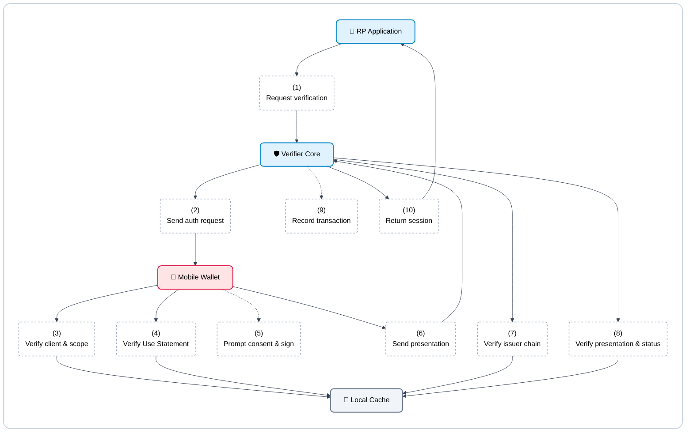

**Figure 8 Online Verification Flow**

1. First, the RP application will request verification by asking Verifier Core to run a check using a template.

2. Verifier Core presents an authorization request (via QR code or deeplink) carrying `request_uri` and `client_id` (prefixed with `decentralized_identifier:`). The Mobile Wallet retrieves the signed Request Object via `GET request_uri`, which delivers the Digital Credentials Query Language (DCQL) query, nonce, verifier encryption key, and Use Statement in `verifier_info`.

3. The Mobile Wallet will verify the client and scope by resolving the `client_id` against the trusted list and checking the requested scope through Trust Registry Query Protocol (TRQP), utilizing the local cache for both.

4. The Mobile Wallet also proceeds to verify the Use Statement from the cache, checking the Trust Authority's signature, its revocation status, and ensuring that the requested attributes are a subset of the ones it lists.

5. Next, the Mobile Wallet will prompt for consent and sign by showing the citizen the consent request (for example, that Bank XYZ is requesting confirmation of age over 17, as per the purpose shown in the Use Statement), and signing a Key Binding JSON Web Token (KB-JWT) over the nonce and the audience.

6. The Mobile Wallet delivers the `vp_token` to Verifier Core's `response_uri` via `direct_post.jwt`, encrypted as a JWE using the verifier's key from `client_metadata.jwks`.

7. Verifier Core then verifies the issuer chain by running Chain 1 against the cached trusted list, checking E1 through E4.

8. Following this, Verifier Core verifies the presentation and status by running Chain 2 against the trusted list: checking T1 (the signature), T2 (the status list), T3 (the KB-JWT against `cnf`), T4 (the nonce and audience), and T5 (the scope).

9. Verifier Core will internally record the transaction, keeping track of the transaction ID, the `use_id` under which the request ran, and the consent receipt as T6, storing only the `vp_digest`.

10. Finally, Verifier Core will return a session (such as OpenID Connect or a Security Assertion Markup Language (SAML) session) carrying the attributes back to the RP application.

Verifier Core does not store the resulting attributes. Keeping them is the RP
application's responsibility.

### Offline verification {#offline-verification}

This flow verifies a credential over [ISO/IEC 18013-5][exchange-protocols], in proximity, between
Mobile Verifier and Mobile Wallet. The verifying application is always on a
device: Mobile Verifier on a merchant's phone or a Relying Party's counter
device, or a Relying Party's own app built on the Reader SDK. It is never Verifier
Core. No network is reachable during it at all. The offline verification flow is shown in Figure 9.

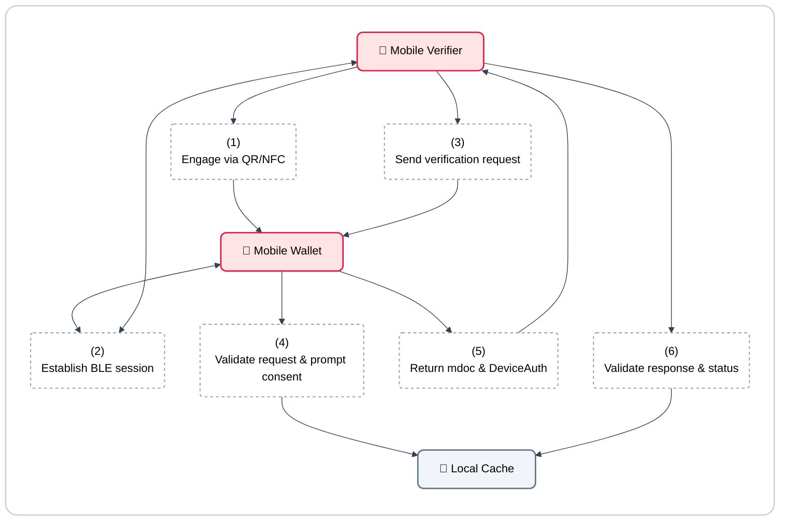

**Figure 9 Offline Verification Flow**

1. The interaction begins when the Mobile Verifier engages via QR or NFC tap with the Mobile Wallet.

2. Both the Mobile Verifier and Mobile Wallet then establish a BLE session, communicating over Bluetooth Low Energy (BLE) using ephemeral Elliptic Curve Diffie-Hellman (ECDH).

3. The Mobile Verifier sends a `DeviceRequest` to the Mobile Wallet containing `ItemsRequest` (carrying the Use Statement in `requestInfo.idUseStatement`) and `ReaderAuth` (COSE_Sign1 containing the Verifier Device Certificate in `x5chain` and signing the request and `SessionTranscript`).

4. The Mobile Wallet will validate the request and prompt for consent by validating the certificate chain up to the Verifier Root CA embedded at build time. It confirms from the cached trusted list that the Verifier Issuing CA is granted, verifies that the Use Statement holds (with its `sub` naming the holder of that issuing CA), checks that the requested attributes are a subset of both `ReaderAuthRole` and the Use Statement, and finally asks the citizen to select which attributes to release.

5. After consent, the Mobile Wallet will return the mdoc and DeviceAuth encapsulated in a DeviceResponse.

6. Finally, the Mobile Verifier will validate the response and status by chaining `x5chain` to the Issuer Root CA (from cache) to validate IssuerAuth, recomputing the digest, checking DeviceAuth against the SessionTranscript, and checking the status list from cache.

Zero network calls happen during this flow. The status list and the trusted
list can both be stale by the time it runs; the tolerance limit, seven days for
example, is set by the Governance Framework. DeviceAuth is a `deviceSignature`;
`deviceMac` is out of scope. The consequence is that a presentation cannot be
denied afterward: a verifier can prove to a third party that the citizen
presented. That is accepted as the price of easier audit and dispute
settlement.

### Verification by a merchant {#verification-by-a-merchant}

This flow lets a merchant verify a credential through Mobile Verifier,
standing in for the Verifier Core it does not run itself. Three parties take
part: Mobile Verifier on the merchant's own device, Verifier Core run by the
RP Intermediary that registered the merchant, and Mobile Wallet. The merchant verification flow is shown in Figure 10.

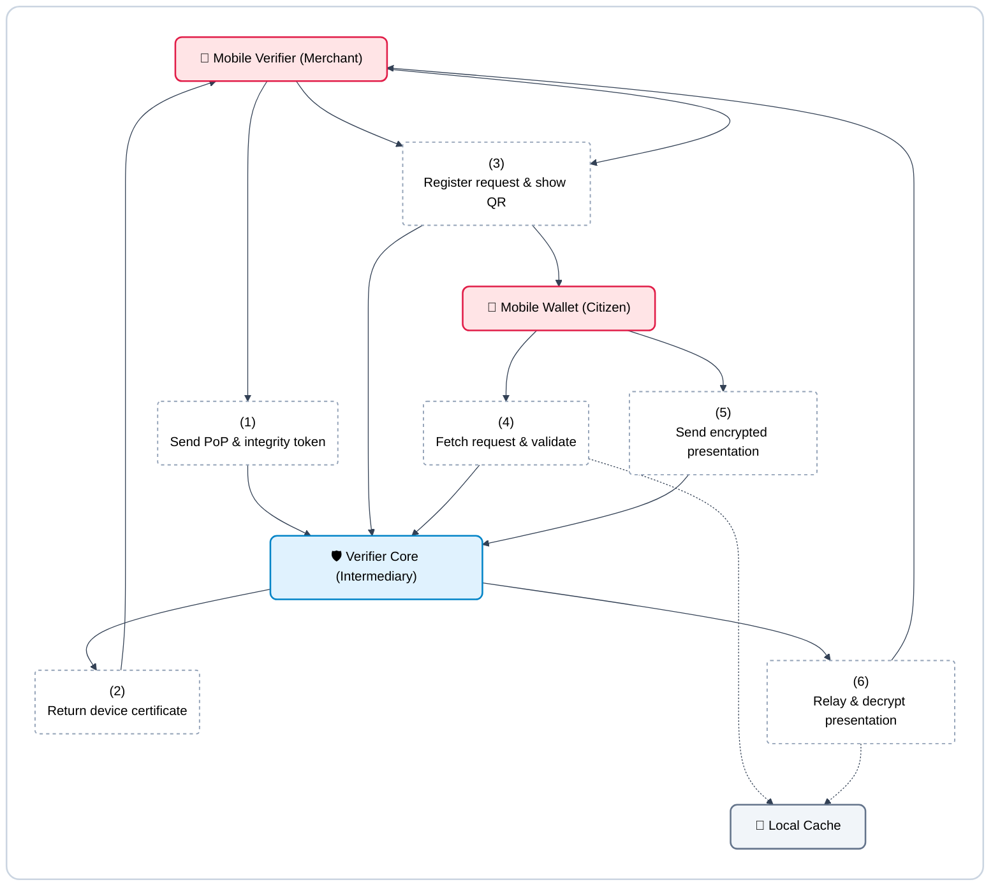

**Figure 10 Merchant Verification Flow**

1. To set up or renew, the Mobile Verifier will send proof of possession (PoP) of its device key and an integrity token to the Verifier Core.

2. Verifier Core will then return a Verifier Device Certificate where the device key is the Subject Public Key Info (SPKI), carrying the `ReaderAuthRole` extension, along with the Use Statements for the business categories its device is bound to.

3. When a customer arrives, the Mobile Verifier registers a request by leaving a Request Object with Verifier Core (signed with the device key and carrying the certificate) and subsequently shows the Mobile Wallet a QR code.

4. The Mobile Wallet will fetch the request and perform 5 validation checks: (1) the certificate chain ends at the embedded Verifier Root CA with the Issuing CA granted in the cached trusted list, (2) the certificate is valid and not on the CRL, (3) the Request Object signature matches the public key and the SHA-256 hash of the Verifier Device Certificate matches the `client_id`, (4) the requested attributes are a subset of `ReaderAuthRole` and never contain `restricted` attributes, and (5) the requested attributes align with the category Use Statement.

5. After consent, the Mobile Wallet will send the encrypted presentation to Verifier Core via `direct_post.jwt`, keeping the data encrypted to the merchant's specific device key.

6. Finally, Verifier Core acts merely to relay the presentation, passing the ciphertext back to the Mobile Verifier before deleting it, allowing the Mobile Verifier to decrypt and verify the data locally on the merchant's device.

The key is born on the merchant's own device and signs there too. The RP
Intermediary's Verifier Core holds only the Request Object and the encrypted
response, for a short time and without logging them; it vouches for the
merchant but never sees the citizen's data. A merchant is registered, not
accredited. The consent screen shows the citizen the merchant's name, taken
from the Subject of its Verifier Device Certificate, and the purpose of the
category Use Statement in use, for example age verification for buying
tobacco products; the RP Intermediary's name appears only in the transaction
history.

## 4. Wallet & Holder Lifecycle

### Device migration and recovery {#device-migration}

Hardware keys cannot be exported from the secure element. Therefore, when a citizen moves to a new device or recovers from a lost phone, the wallet instance must be re-registered and credentials re-issued. The Wallet Backend Service plays a critical role in preventing cloning by ensuring only the active device holds a valid Key Attestation. The device migration flow is shown in Figure 11.

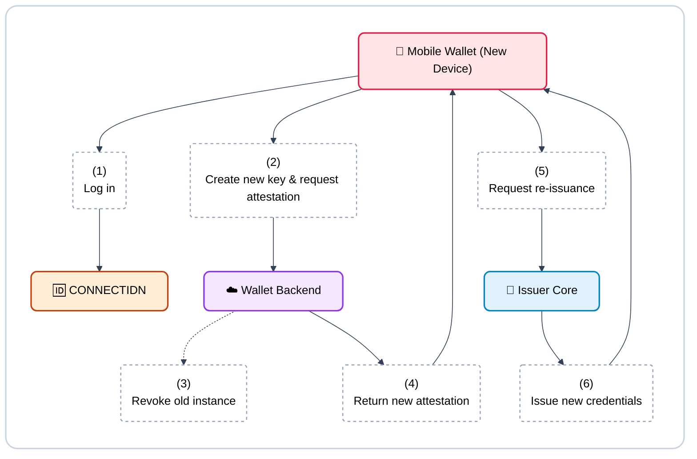

**Figure 11 Device Migration Flow**

1. The citizen logs in to the Mobile Wallet on their new device using their CONNECTIDN identity.

2. The Mobile Wallet generates a fresh hardware-bound device key and sends a request for a new Key Attestation to the Wallet Backend Service.

3. Recognizing the identity is now bound to a new device, the Wallet Backend Service explicitly revokes the Key Attestation of the old wallet instance, permanently disabling its ability to authenticate against Issuer Cores.

4. The Wallet Backend Service returns the new Key Attestation to the new Mobile Wallet.

5. The Mobile Wallet initiates a credential issuance flow (acting over OpenID4VCI) to the Issuer Core, utilizing the new key.

6. The Issuer Core verifies the new Key Attestation and re-issues the credentials (SD-JWT VC and mdoc), securely binding them to the new device.

### Credential renewal {#credential-renewal}

Credentials such as the digital KTP have an expiration date. This proactive flow allows the Mobile Wallet to refresh a credential before it expires, ensuring uninterrupted offline and online presentations without forcing the citizen through a lengthy authorization process from scratch. The credential renewal flow is shown in Figure 12.

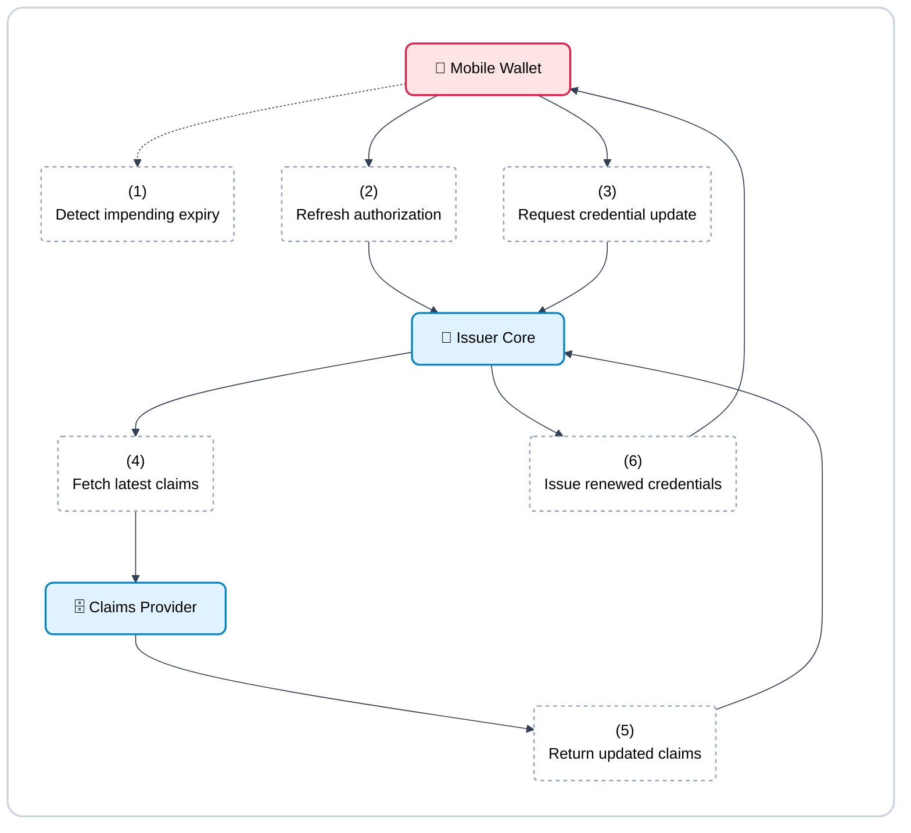

**Figure 12 Credential Renewal Flow**

1. The Mobile Wallet proactively detects that a stored credential is approaching its expiration date.

2. The Mobile Wallet performs a lightweight token refresh (or pre-authorized refresh) with the Issuer Core, bypassing full user-interactive SSO if the session policy permits.

3. Utilizing the existing device key and a valid Key Attestation, the Mobile Wallet sends a `POST /credential` request to update the credential.

4. The Issuer Core queries the Claims Provider to ensure the citizen's source data has not fundamentally changed or been flagged.

5. The Claims Provider returns the latest claims and the current `data_as_of` timestamp.

6. The Issuer Core generates a renewed SD-JWT VC and mdoc with extended expiration dates and returns them to the Mobile Wallet.

### Citizen-initiated revocation {#citizen-initiated-revocation}

When a citizen realizes their device is compromised or lost—even before purchasing a new device—they must be able to revoke their credentials immediately. This flow operates independently of the Mobile Wallet, relying on a web portal or customer service intervention. The citizen-initiated revocation flow is shown in Figure 13.

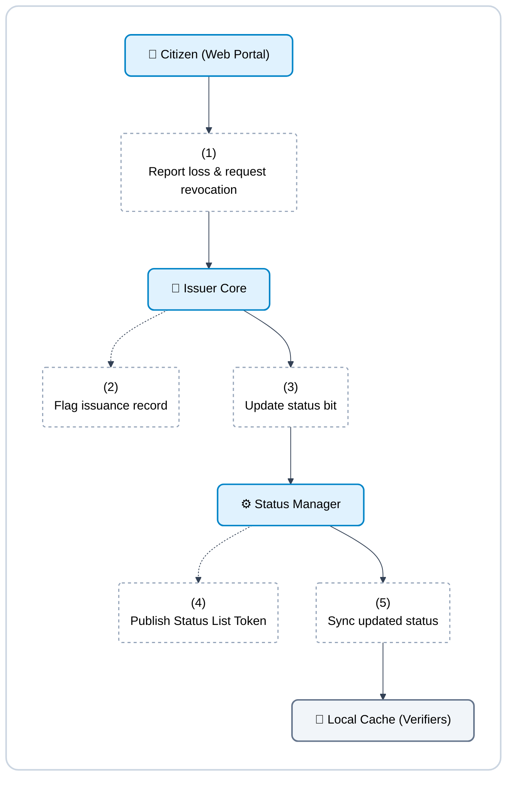

**Figure 13 Citizen-Initiated Revocation Flow**

1. The citizen logs into the Issuer's web portal (or contacts a designated call center) to report a lost device and explicitly request revocation of their credentials.

2. The Issuer Core retrieves the `issuance_record` associated with that citizen's active credentials, identifying their exact index positions.

3. The Issuer Core instructs the Status Manager to flip the status bit for those specific indices to "revoked".

4. The Status Manager generates and publishes a new Status List Token (e.g., using Token Status List) reflecting the revoked status.

5. Relying Parties and Mobile Verifiers, which periodically sync the Status List to their Local Cache, will subsequently reject any presentations originating from the lost device.

## 5. Credential Lifecycle

The lifecycle of a credential is bounded by the expiration of the credential itself, the lifetime of the keys that signed it, and the physical device that holds it. It is governed by rules drawn from the Architecture Framework to ensure compromises are contained and revocations are decentralized.

### Expiry and validity periods

A credential remains valid until its `exp` (expiration) timestamp is reached, unless it is revoked earlier. The validity period varies by credential type and format:
- **mDL (mdoc)**: Governed strictly by the ISO/IEC 18013-5 standard, which limits the Document Signer Certificate (DSC) lifetime to at most 457 days.
- **SD-JWT VC**: Follows the expiration rules set by the specific Credential Rulebook for that credential type.

### Status list checking and revocation

Status lists are decentralized. Each Issuer hosts its own Status List Token on its own domain, rather than in a central CDN. This design choice ensures that Trust Infrastructure cannot infer the number of circulating credentials or track citizen activity.

A credential is tied to its status via its `issuance_record`, which points to a specific bit index in the status list. When a credential needs to be revoked, the Issuer's Status Manager flips this bit and republishes the Status List Token. Verifiers and wallets cache these tokens based on a Time-To-Live (TTL) appropriate to the credential's risk profile.

### Scheduled key rotation and blast radius

The lifecycle of a credential is tied to the lifecycle of the Issuer's key (the Document Signer Certificate). If an Issuer's signing key is compromised, every credential signed by that key must be explicitly revoked in the status list and reissued.

To limit this "blast radius," Issuers must perform scheduled key rotation. The more frequently an Issuer rotates its keys, the fewer credentials share the same key, drastically reducing the number of credentials that require emergency reissuance during an incident.

### Device migration and reissuance

Holder keys are hardware-bound and born inside the device's secure element. Because they cannot be exported or backed up, a citizen changing or losing their phone terminates the credential's lifecycle on that device.

Upon device loss or change:
1. The old wallet instance's Key Attestation is explicitly revoked by the Wallet Backend Service.
2. The citizen registers a new device, generating a new hardware-bound key.
3. The credential cannot be restored from a backup; it must be requested anew from the Issuer Core and reissued to the new device.
