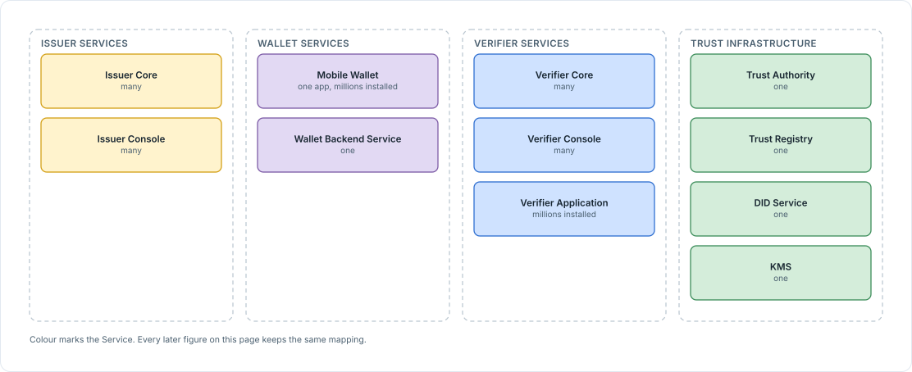
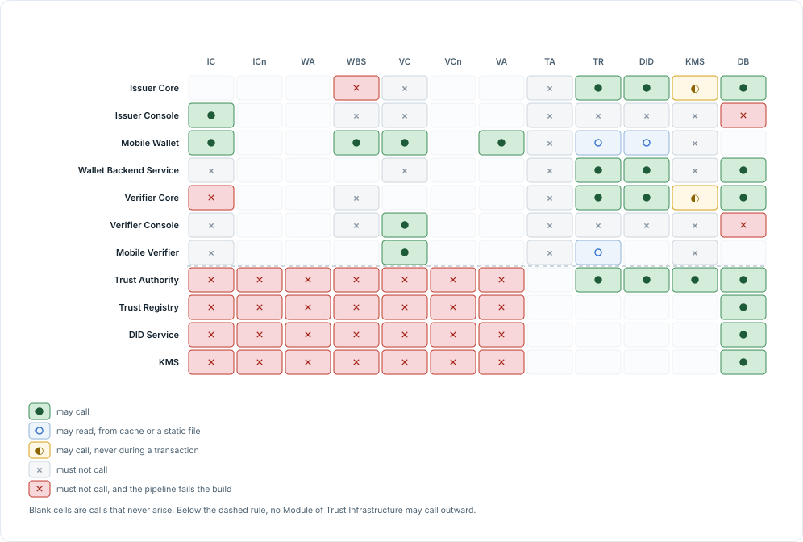
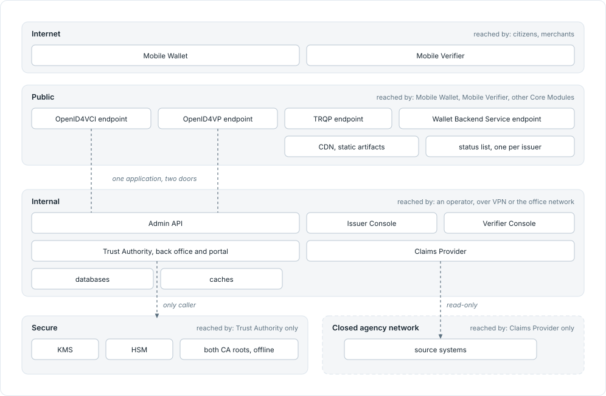

<!-- Sumber: Arsitektur Ekosistem Identitas Digital v0.2, §3.1, §3.2, §3.3 -->

# 3. Module Map

A Module is a unit of deployable software. One Module is packaged as one
container image, which is what separates a Module from the pieces inside it:
if it does not ship on its own, it is not a Module.

There are eleven. Which role runs each Service is on
[Section 1, System Models](system-models.md), and which plane each Module sits
on is on
[Section 2, The transaction path and the trust path](transaction-path-and-trust-path.md).

## 3.1 The eleven Modules

Each entry below opens with what the Module is and what it does, then gives the
four facts that place it on the map: the Service it belongs to, what it is built
as, who runs it, and how many instances the ecosystem has. Those four do most of
the explaining on their own, because a web application run by one national
authority and a mobile application installed millions of times are not
constrained by the same things. The last line of each entry points at the
components inside that Module.

<figure markdown="1" id="figure-3-1">
  { loading=lazy }
  <figcaption>Figure 3.1 The eleven Modules, grouped by the Service each belongs to, with the interface named on each line outside Trust Infrastructure.</figcaption>
</figure>

- **Mobile Verifier is drawn lighter** because it runs with no server of its
  own. The Verifier Core it checks in with belongs to whoever answers for the
  device: the RP Intermediary for a merchant, the Relying Party itself for a
  counter device.
- **No line runs from the three Services to Trust Infrastructure**, and that is
  the design rather than an omission. What the three consume from it is a
  published file read from a local cache, not a call made while a citizen is
  being served, which is
  [Principle 1, The two paths never cross](index.md#1-the-two-paths-never-cross).
- **A line names an interface, not a permission.** Which Module may call which
  is [Section 3.3, Who may call whom](#33-who-may-call-whom).

### 3.1.1 Issuer Core

Issuer Core is where a credential is created and then kept alive. It issues over
OpenID4VCI, assembles whichever of the three formats the Credential Rulebook
names for that credential type, signs with the issuer's own local keystore, and
manages and hosts that issuer's status list, which is what tells a verifier
later whether the credential still stands.

- **Service:** Issuer Services
- **Built as:** REST API, cache, database
- **Run by:** Identity Issuer, Attribute Issuer
- **How many:** Many, one per issuer
- **Inside it:** [Section 2.1.1, Issuer Core](../software-architecture/components-inside-a-module.md#211-issuer-core)

### 3.1.2 Issuer Console

Issuer Console is the staff side of Issuer Core. Credential types are configured
here from their Credential Rulebook, batches are issued, credentials are
revoked, and reports are read. It works through the Admin API alone and opens no
database connection of its own.

- **Service:** Issuer Services
- **Built as:** Web application
- **Run by:** The same entity that runs Issuer Core
- **How many:** Many
- **Inside it:** [Section 2.1.2, Issuer Console](../software-architecture/components-inside-a-module.md#212-issuer-console)

### 3.1.3 Mobile Wallet

Mobile Wallet is the citizen's copy of everything issued to them. It stores
credentials, creates a separate credential key for each one, shows which
verifier is asking and what for, and signs the presentation once the citizen
agrees. It runs on hardware nobody in the ecosystem owns, which is why a secure
element and a backend that vouches for the installation are both part of the
design.

- **Service:** Wallet Services
- **Built as:** Android and iOS application, secure element
- **Run by:** Published by a Wallet Provider, installed by the citizen
- **How many:** Many, one per Wallet Provider, millions of installations
- **Inside it:** [Section 2.2.1, Mobile Wallet](../software-architecture/components-inside-a-module.md#221-mobile-wallet)

### 3.1.4 Wallet Backend Service

Wallet Backend Service stands behind the wallet and vouches for it. It issues
the daily Key Attestation, binds an installation to its device, carries the
CONNECTIDN account link and push notification, and handles recovery onto a
replacement device and revocation of a lost one. It stores no credential of its
own.

- **Service:** Wallet Services
- **Built as:** REST API, database
- **Run by:** Wallet Provider
- **How many:** Many, one per Wallet Provider
- **Inside it:** [Section 2.2.2, Wallet Backend Service](../software-architecture/components-inside-a-module.md#222-wallet-backend-service)

### 3.1.5 Verifier Core

Verifier Core is where a credential is checked and turned into a decision. It
requests over OpenID4VP, tests what comes back against both chains of trust, and
passes the result to the Relying Party's own service system over OpenID Connect
or SAML.
It reads nothing in proximity. A Relying Party that checks credentials face to
face runs [Mobile Verifier](#317-mobile-verifier) on its own counter device, and
Verifier Core issues that device the limited-life Verifier Device Certificate it
carries. An RP Intermediary issues the same certificate to each of its
merchants' devices.

- **Service:** Verifier Services
- **Built as:** REST API, cache, database
- **Run by:** Relying Party; a Relying Party that also serves merchants is an
  RP Intermediary
- **How many:** Many
- **Inside it:** [Section 2.3.1, Verifier Core](../software-architecture/components-inside-a-module.md#231-verifier-core)

### 3.1.6 Verifier Console

Verifier Console is the operator's side of Verifier Core. Request templates live
here, merchants are onboarded and their `allowed_attrs` set, a merchant device
is revoked, consent receipts are archived, and reports are read. Like Issuer
Console it reaches its Core through the Admin API and nothing else.

- **Service:** Verifier Services
- **Built as:** Web application
- **Run by:** Relying Party, RP Intermediary
- **How many:** Many
- **Inside it:** [Section 2.3.2, Verifier Console](../software-architecture/components-inside-a-module.md#232-verifier-console)

### 3.1.7 Mobile Verifier

Mobile Verifier verifies with no server at all. The keys stay on the device,
the result appears on its screen, and the check runs both online and in
proximity. It is the only Module that reads a credential in proximity, so a
merchant runs it, and so does a Relying Party at its own counter. It reads
`dc+sd-jwt` and `mso_mdoc` and not `ldp_vc`, for the reason given in
[Section 1.5, Which format each role verifies](../data-model-and-protocols/credential-formats.md#15-which-format-each-role-verifies),
and there is no web version of it.

- **Service:** Verifier Services
- **Built as:** Android and iOS application, secure element
- **Run by:** Merchants, registered by an RP Intermediary; a Relying Party or
  RP Intermediary on its own counter devices
- **How many:** Millions of installations
- **Inside it:** [Section 2.3.3, Mobile Verifier](../software-architecture/components-inside-a-module.md#233-mobile-verifier)

### 3.1.8 Trust Authority

Trust Authority is where an entity is registered, accredited, and authorized. It
is also the certificate authority behind Issuer Root CA, Verifier Root CA, every
Document Signer Certificate, Verifier Issuing CA, and the CRL; it sends key
lifecycle commands to KMS; and it holds the governance registry, incident
handling, and the transparency log. Its portal is the one part of it every
entity touches.

- **Service:** Trust Infrastructure
- **Built as:** Web application, REST API, database, offline HSM
- **Run by:** Root Authority, though every entity uses its portal
- **How many:** One
- **Inside it:** [Section 2.4.1, Trust Authority](../software-architecture/components-inside-a-module.md#241-trust-authority)

### 3.1.9 Trust Registry

Trust Registry publishes what the rest of the ecosystem has to agree on. It
answers TRQP for `authorization` and `recognition`, publishes the trusted list
as LoTE JSON and publishes VICAL, stores every Credential Rulebook, and runs the
conformance crawler. What it publishes leaves as a static file through a CDN,
which is what keeps it off the transaction path.

- **Service:** Trust Infrastructure
- **Built as:** REST API, database, object storage, CDN
- **Run by:** Root Authority
- **How many:** One
- **Inside it:** [Section 2.4.2, Trust Registry](../software-architecture/components-inside-a-module.md#242-trust-registry)

### 3.1.10 DID Service

DID Service is where an entity's identifier comes from. It issues and resolves
the `did:webvh` of every entity, along with the key history behind it, and
publishes through the same CDN Trust Registry uses.

- **Service:** Trust Infrastructure
- **Built as:** REST API, database, object storage, CDN
- **Run by:** Root Authority
- **How many:** One
- **Inside it:** [Section 2.4.3, DID Service](../software-architecture/components-inside-a-module.md#243-did-service)

### 3.1.11 KMS

KMS carries the lifecycle of entity keys and nothing else. It generates,
rotates, and revokes them, hands over an encrypted private key exactly once, and
builds certificate signing requests. It carries no signing operation, so nothing
in the ecosystem can ask KMS to produce a signature.

- **Service:** Trust Infrastructure
- **Built as:** REST API, database, Cryptographic Provider
- **Run by:** Root Authority
- **How many:** One
- **Inside it:** [Section 2.4.4, KMS](../software-architecture/components-inside-a-module.md#244-kms)

## 3.2 What is not a Module

Four things get called Modules in conversation and are not. Each is a component
or a library living inside a Module, and none of them ships or is deployed on
its own.

| Name | What it actually is | Described in |
|---|---|---|
| Claims Provider | The component in Issuer Core that faces an institution's own source system | [Section 2.1](../software-architecture/components-inside-a-module.md#21-issuer-services) |
| Signing Provider | The component that signs using an entity's local keystore | [Section 2.1](../software-architecture/components-inside-a-module.md#21-issuer-services) and [Section 2.3](../software-architecture/components-inside-a-module.md#23-verifier-services) |
| Cryptographic Provider | The driver inside KMS that reaches an HSM, a cloud KMS, or a vault | [Section 2.4](../software-architecture/components-inside-a-module.md#24-trust-infrastructure) |
| Trust SDK | A library, published in Go and Dart, embedded in four Modules | [Section 2.5](../software-architecture/components-inside-a-module.md#25-trust-sdk) |

Claims Provider is the interesting case, because it is the one component whose
contents differ at every installation: each institution's source system is its
own. It may be deployed as a separate process when that source system is heavy
enough to warrant it, and it still belongs to Issuer Core. Deploying something
separately does not make it a Module.

## 3.3 Who may call whom

Nothing in the code stops one Module from calling another. The architecture
therefore states, for every Module, which Modules it may call and which it may
not, so that the boundary is something a test can check rather than something a
developer has to remember.

The table below states that permission once for each Module. Trust Registry, DID
Service, and KMS share one row, because the rule is identical for all three of
them.

| Module | May call | May not call |
|---|---|---|
| Issuer Core | The source system, through Claims Provider; Trust Registry; DID Service; its local keystore | Wallet Backend Service, Verifier Core, KMS during a transaction |
| Issuer Console | Issuer Core's Admin API | Any database, any other Module |
| Mobile Wallet | Issuer Core, Verifier Core, Mobile Verifier, Wallet Backend Service, Trust Registry (cache), DID Service (cache), CONNECTIDN | Trust Authority, KMS |
| Wallet Backend Service | CONNECTIDN, Trust Registry, DID Service, the device platform | Issuer Core, Verifier Core |
| Verifier Core | Trust Registry, DID Service, the issuer's status list (a static file), the Relying Party application, its local keystore | Issuer Core, KMS during a transaction |
| Verifier Console | Verifier Core's Admin API | Any database, any other Module |
| Mobile Verifier | Verifier Core, for attestation; Trust Registry (cache); the issuer's status list (cache) | Trust Authority, Issuer Core |
| Trust Authority | Trust Registry, DID Service, KMS | Any Module outside Trust Infrastructure |
| Trust Registry, DID Service, KMS | Nothing | Any Module outside Trust Infrastructure; none of them ever calls an entity back |

Four of the prohibitions above are not left to code review either. The pipeline
tests them automatically, and a violation fails the build: Verifier Core calling
Issuer Core, Issuer Core calling Wallet Backend Service, a Console calling a
database directly, and a Module inside Trust Infrastructure calling a Module
outside it.

<figure markdown="1" id="figure-3-2">
  { loading=lazy }
  <figcaption>Figure 3.2 Every permitted and forbidden call in one grid.</figcaption>
</figure>

Read the last four rows of [Figure 3.2](#figure-3-2) across. No Module of Trust
Infrastructure may call anything outside it, which is the claim
[Section 2.2, The trust path](transaction-path-and-trust-path.md#22-the-trust-path)
makes in prose.

What sits inside each Module is a separate question, answered in
[Section 2, Components inside a Module](../software-architecture/components-inside-a-module.md).

## 3.4 Network zones and placement

Every Module sits in one of five network zones, and the zone is what decides
who can reach it. The zones are ordered by exposure. The two applications sit
in the open Internet, and each step inward admits fewer callers, ending in a
zone that admits exactly one.

Read the third column first. It is the one that carries the design, because a
zone is defined by who is let in rather than by where the hardware is.

<figure markdown="1" id="figure-3-3">
  { loading=lazy }
  <figcaption>Figure 3.3 The five network zones, with each Module placed in the zone that decides who can reach it.</figcaption>
</figure>

- **The two dotted risers are one Module, not two.** Issuer Core and Verifier
  Core answer their protocol endpoint in the public zone and their Admin API in
  the internal one, which is [Section 3.4.1](#341-one-application-two-doors).
- **The secure zone admits one caller.** Everything in it is reached by Trust
  Authority and by nothing else, which is why KMS, the HSM, and both CA roots
  sit behind the same boundary.
- **The last zone is drawn detached** because it is not the ecosystem's
  network. Claims Provider is the one thing that enters it, and it only reads.

| Zone | What is in it | Who reaches it |
|---|---|---|
| Internet | Mobile Wallet, Mobile Verifier | Citizens, merchants, counter staff of a Relying Party |
| Public | Issuer Core's OpenID4VCI endpoint, Verifier Core's OpenID4VP endpoint, Trust Registry's TRQP endpoint, Wallet Backend Service's endpoint, the CDN for static artifacts, each issuer's status list | Mobile Wallet, Mobile Verifier, other Core Modules |
| Internal | Issuer Console, Verifier Console, Admin API, Trust Authority (back office and portal), databases, caches, Claims Provider | An operator, over VPN or the office network |
| Secure | KMS, HSM, both offline CA roots | Trust Authority only |
| Closed agency network | Source systems | Claims Provider only, and read-only |

Only protocol endpoints are public. Nothing is placed in the public zone for
convenience, which is why the databases, the Consoles, and the Admin API all
sit one zone further in, and why Trust Authority's portal is internal even
though the entities that use it are not.

The last zone is not the ecosystem's at all. A source system belongs to the
agency that runs it, and the architecture reaches into that network at exactly
one point: Claims Provider, reading and never writing. That is the only
component in the ecosystem that crosses an organizational boundary.

### 3.4.1 One application, two doors

A Core Module answers two kinds of caller that have nothing in common. A wallet
arrives from the Internet with no credentials of its own; an operator arrives
from the office network already authenticated. Issuer Core and Verifier Core
therefore expose their public protocol endpoint on one ingress and their Admin
API on a separate one.

The separation is what makes the placement enforceable. Without it, the Admin
API would be reachable from wherever the protocol endpoint is reachable, and a
zone boundary that exists only in a diagram is not a boundary.
