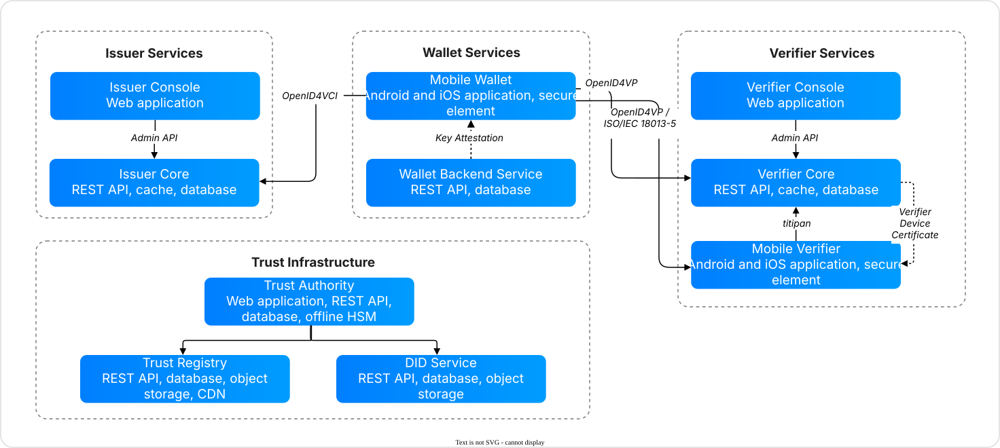
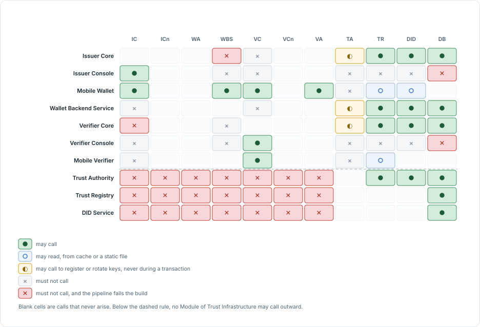
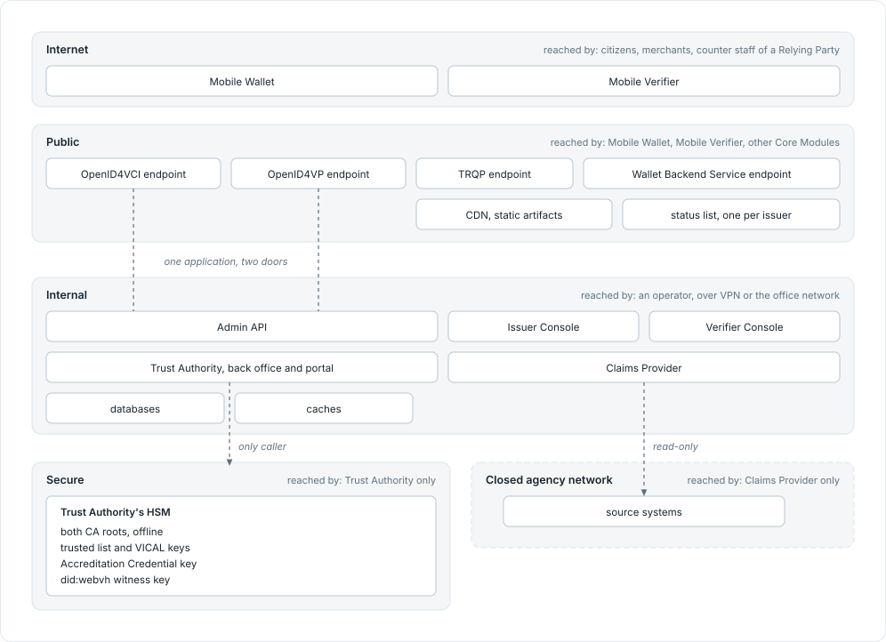

<!-- Sumber: Arsitektur Ekosistem Identitas Digital v0.2, §1 (Kep. 5, 9, 25, 28, 29), §3.1, §3.2, §3.3, §3.5 -->

# Module Map {#module-map}

A Module is what ships as one container image. [System Models](system-models.md)
defines the scale in full.

There are ten. Which role runs each Service is on
[System Models](system-models.md), and which plane each Module sits on is on
[The transaction path and the trust path](transaction-path-and-trust-path.md).

## The ten Modules {#the-ten-modules}

Each entry below opens with what the Module is and what it does, then gives the
four facts that place it on the map: the Service it belongs to, what it is built
as, who runs it, and how many instances the ecosystem has. The last line of
each entry points at the components inside that Module. Built as names the
shape rather than the product; what each shape is built from is in
[Technology choices per layer](../software-architecture/technology-choices-per-layer.md).
[The ten Modules by Service][fig-ten-modules-by-service] draws the map the
entries fill in.

{ #fig-ten-modules-by-service }

<figure markdown="1">
  { loading=lazy }
  <figcaption> The ten Modules, grouped by the Service each belongs to, with the interface named on each line outside Trust Infrastructure.</figcaption>
</figure>

- **Mobile Verifier runs with no server of its own.** The Verifier Core it
  checks in with belongs to whoever answers for the device: the RP Intermediary
  for a merchant, the Relying Party itself for a counter device.
- **No line runs from the three Services to Trust Infrastructure**, and that is
  the design rather than an omission. What the three consume from it is a
  published file read from a local cache, not a call made while a citizen is
  being served, which is the design principle
  [the two paths never cross][the-two-paths-never-cross].
- **A line names an interface, not a permission.** Which Module may call which
  is [who may call whom][who-may-call-whom].

### Issuer Core {#hla-issuer-core}

Issuer Core is where a credential is created and then kept alive. It issues
over [OpenID4VCI][exchange-protocols] and assembles whichever of the three formats the Credential
Rulebook names for that credential type. It signs through its Key Manager, which
generates and holds the issuer's keys on the issuer's own side. It also manages
and hosts that issuer's status list, which is what tells a verifier later
whether the credential still stands.

- **System Model:** Issuer Services
- **Built as:** REST API, cache, database
- **Run by:** Identity Issuer, Attribute Issuer
- **How many:** Many, one per issuer
- **Inside it:** [Issuer Core][sa-issuer-core]

### Issuer Console {#hla-issuer-console}

Issuer Console is the staff side of Issuer Core. Credential types are configured
here from their Credential Rulebook, batches are issued, credentials are
revoked, and reports are read. It works through the Admin API alone and opens no
database connection of its own.

- **System Model:** Issuer Services
- **Built as:** Web application
- **Run by:** The same entity that runs Issuer Core
- **How many:** Many
- **Inside it:** [Issuer Console][sa-issuer-console]

### Mobile Wallet {#hla-mobile-wallet}

Mobile Wallet is the citizen's copy of everything issued to them. It stores
credentials, holds one credential key that binds all of them, shows which
verifier is asking and what for, and signs the presentation online and
offline once the citizen agrees. It runs on hardware nobody in the ecosystem owns, which is why a secure
element and a backend that vouches for the installation are both part of the
design.

- **System Model:** Wallet Services
- **Built as:** Android and iOS application, secure element
- **Run by:** Published by a Wallet Provider, installed by the citizen
- **How many:** Many, one per Wallet Provider, millions of installations
- **Inside it:** [Mobile Wallet][sa-mobile-wallet]

### Wallet Backend Service {#hla-wallet-backend-service}

Wallet Backend Service stands behind the wallet and vouches for it. It issues
the daily Key Attestation, binds an installation to its device, carries the
CONNECTIDN account link and push notification, and handles recovery onto a
replacement device and revocation of a lost one. It stores no credential of its
own.

- **System Model:** Wallet Services
- **Built as:** REST API, database
- **Run by:** Wallet Provider
- **How many:** Many, one per Wallet Provider
- **Inside it:** [Wallet Backend Service][sa-wallet-backend-service]

### Verifier Core {#hla-verifier-core}

Verifier Core is where a credential is checked and turned into a decision. It is
a backend with no front end of its own: the web page, kiosk, or app in front of
it belongs to the Relying Party. It requests over [OpenID4VP][exchange-protocols], tests what comes
back against both chains of trust, and passes the result to the Relying Party's
own service system over [OpenID Connect][exchange-protocols]
or [Security Assertion Markup Language
(SAML)][exchange-protocols]. A deployment of it is the remote form of a
[Relying Party Instance][relying-party-instance], and it introduces itself to a
wallet with the did:webvh of the entity running it.

It reads nothing in proximity. A Relying Party that checks credentials face to
face uses [Mobile Verifier][hla-mobile-verifier], or its own app built on the Reader SDK, on its own
counter device, and Verifier Core issues that device the limited-life Verifier
Device Certificate it carries, from the Relying Party's own Verifier Issuing CA.
An RP Intermediary issues the same certificate to each of its merchants'
devices. For a merchant's online check, the RP Intermediary's Verifier Core
also holds the signed request and the encrypted response in transit, and it
cannot read the response.

- **System Model:** Verifier Services
- **Built as:** REST API, cache, database
- **Run by:** Relying Party; a Relying Party that also serves merchants is an
  RP Intermediary
- **How many:** Many
- **Inside it:** [Verifier Core][sa-verifier-core]

### Verifier Console {#hla-verifier-console}

Verifier Console is the operator's side of Verifier Core. Request templates
live here, each naming one `use_id` of a [Use Statement][use-statement] that
the Console validates the template against; merchants are onboarded and their
`allowed_attrs` set, a merchant device is revoked, consent receipts are
archived, and reports are read. Like Issuer Console it reaches its Core
through the Admin API and nothing else.

- **System Model:** Verifier Services
- **Built as:** Web application
- **Run by:** Relying Party, RP Intermediary
- **How many:** Many
- **Inside it:** [Verifier Console][sa-verifier-console]

### Mobile Verifier {#hla-mobile-verifier}

Mobile Verifier is the verifier app for merchants, and it does its own
checking. Running it is the on-device form of a
[Relying Party Instance][relying-party-instance], which is the only form a
merchant has. The keys stay on the device and the result appears on its screen,
online and in proximity alike. Online, the device leaves its signed request
with the RP Intermediary's Verifier Core and collects the encrypted response
from it; decryption and verification happen on the phone. In proximity it reads
through the Reader SDK. It is the only Module that reads a credential in
proximity, although a Relying Party's own app may do the same with that
library. It reads `dc+sd-jwt`, `mso_mdoc` and `ldp_vc`, as
[which format each role verifies][which-format-each-role-verifies]
sets out. There is no web version of it.

- **System Model:** Verifier Services
- **Built as:** Android and iOS application, secure element
- **Run by:** Merchants, registered by an RP Intermediary; a Relying Party or
  RP Intermediary on its own counter devices
- **How many:** Millions of installations
- **Inside it:** [Mobile Verifier][sa-mobile-verifier]

### Trust Authority {#hla-trust-authority}

Trust Authority is where an entity is registered, accredited, and authorized. It
is also the certificate authority behind Issuer Root CA, Verifier Root CA, every
Document Signer Certificate, and Verifier Issuing CA, and it publishes the
revocation lists for the certificates it issues, each issued from
a certificate request the entity sends. It keeps every entity's public keys in
the Public Key Registry and holds none of their private keys, and it holds the
governance registry, incident handling, and the transparency log. Its portal is the one part of it every
entity touches.

- **System Model:** Trust Infrastructure
- **Built as:** Web application, REST API, database, offline hardware security
  module (HSM)
- **Run by:** Root Authority, though every entity uses its portal
- **How many:** One
- **Inside it:** [Trust Authority][sa-trust-authority]

### Trust Registry {#hla-trust-registry}

Trust Registry publishes what the rest of the ecosystem has to agree on. It
answers [Trust Registry Query Protocol
(TRQP)][exchange-protocols] for `authorization` and
`recognition`, publishes the trusted list as LoTE JSON and publishes [Verified
Issuer Certificate Authority List
(VICAL)][trust-lists-and-credential-status], stores every
Credential Rulebook, and runs the conformance crawler. What it publishes leaves
as a static file through a content delivery network (CDN), which is what keeps
it off the transaction path.

- **System Model:** Trust Infrastructure
- **Built as:** REST API, database, object storage, CDN
- **Run by:** Root Authority
- **How many:** One
- **Inside it:** [Trust Registry][sa-trust-registry]

### DID Service {#hla-did-service}

DID Service is the witness behind every entity's identifier. Each entity signs
its own [`did:webvh`][identifiers-and-keys] log on its own domain; DID Service
validates each new entry and signs a witness proof using the witness key in
Trust Authority's HSM. Without that proof, no resolver accepts the entry. It also
resolves `did:webvh` and `did:key` for any Module that needs them, caching the
results so resolution rarely touches the network. No DID artifacts sit on the
central CDN; each entity hosts its own log.

- **System Model:** Trust Infrastructure
- **Built as:** REST API, database, object storage
- **Run by:** Root Authority
- **How many:** One
- **Inside it:** [DID Service][sa-did-service]

## What is not a Module {#what-is-not-a-module}

Six things get called Modules in conversation and are not. Each is a component
or a library living inside a Module, and none of them ships or is deployed on
its own.

<figure markdown="1" class="ekdn-table">

| Name | What it actually is | Described in |
|---|---|---|
| Claims Provider | The component in Issuer Core that faces an institution's own source system | [Issuer Services][sa-issuer-services] |
| Signing Provider | The component that signs through the entity's Key Manager | [Issuer Services][sa-issuer-services] and [Verifier Services][sa-verifier-services] |
| Key Manager | The component that generates, stores, rotates, and registers an entity's keys | [Issuer Services][sa-issuer-services], [Wallet Services][sa-wallet-services], and [Verifier Services][sa-verifier-services] |
| Cryptographic Provider | The Key Manager driver: an encrypted software keystore by default, a cloud KMS, or an HSM over PKCS#11 | [Issuer Services][sa-issuer-services], [Wallet Services][sa-wallet-services], and [Verifier Services][sa-verifier-services] |
| Trust SDK | A library, published in Go and Dart, embedded in four Modules | [Trust SDK][sa-trust-sdk] |
| Reader SDK | A Dart library that reads an mdoc in proximity, embedded in Mobile Verifier or a Relying Party's own app | [Mobile Verifier][sa-mobile-verifier] |

</figure>

Claims Provider is the interesting case, because it is the one component whose
contents differ at every installation: each institution's source system is its
own. It may be deployed as a separate process when that source system is heavy
enough to warrant it, and it still belongs to Issuer Core. Deploying something
separately does not make it a Module.

## Who may call whom {#who-may-call-whom}

The architecture states, for every Module, which Modules it may call and
which it may not, so that the boundary is something a test can check rather
than something a developer has to remember.

[The table of permitted calls][tbl-permitted-calls] states that permission
once for each Module. The *May call* column is an exhaustive list: any call not
listed there is prohibited by default (which is why Verifier Core may not call
Wallet Backend Service, even where that pair is not named under *May not call*).
The *May not call* column names the specific prohibitions that are enforced
automatically in the continuous integration pipeline and fail the build. In
[the grid of permitted and forbidden calls][fig-module-call-matrix], blank
cells represent calls that never arise under this rule. Trust Registry and DID
Service share one row, because the rule is identical for both of them.

{ #tbl-permitted-calls }

<figure markdown="1" class="ekdn-table">

| Module | May call | May not call |
|---|---|---|
| Issuer Core | The source system, through Claims Provider; Trust Registry; DID Service; its own Key Manager; Trust Authority and DID Service to register or rotate keys, never during a transaction | Wallet Backend Service, Verifier Core |
| Issuer Console | Issuer Core's Admin API | Any database, any other Module |
| Mobile Wallet | Issuer Core, Verifier Core, Mobile Verifier, Wallet Backend Service, Trust Registry (cache), DID Service (cache), CONNECTIDN | Trust Authority |
| Wallet Backend Service | CONNECTIDN, Trust Registry, DID Service, the device platform, its own Key Manager; Trust Authority and DID Service to register or rotate keys | Issuer Core, Verifier Core |
| Verifier Core | Trust Registry, DID Service, the issuer's status list (a static file), the Relying Party application, its own Key Manager; Trust Authority and DID Service to register or rotate keys | Issuer Core |
| Verifier Console | Verifier Core's Admin API | Any database, any other Module |
| Mobile Verifier | Verifier Core, for attestation and, online, the relayed `request_uri` and `response_uri`; Trust Registry (cache); DID Service (cache); the issuer's status list (cache) | Trust Authority, Issuer Core |
| Trust Authority | Trust Registry, DID Service | Any Module outside Trust Infrastructure |
| Trust Registry, DID Service | Nothing | Any Module outside Trust Infrastructure; none of them ever calls an entity back |

</figure>

Four of the prohibitions above are not left to code review either. The pipeline
tests them automatically, and a violation fails the build: Verifier Core calling
Issuer Core, Issuer Core calling Wallet Backend Service, a Console calling a
database directly, and a Module inside Trust Infrastructure calling a Module
outside it.

{ #fig-module-call-matrix }

<figure markdown="1">
  { loading=lazy }
  <figcaption> Every Module-to-Module call, permitted or forbidden, in one grid.</figcaption>
</figure>

[The grid of permitted and forbidden calls][fig-module-call-matrix] shows that
no Module of Trust Infrastructure may call anything outside it, which is the
claim [the trust path][the-trust-path] makes in prose.

What sits inside each Module is a separate question, answered in
[Components inside a Module](../software-architecture/components-inside-a-module.md).

## Network zones and placement {#network-zones-and-placement}

Every Module sits in one of five network zones, and the zone is what decides
who can reach it. [The network zones][fig-network-zones] are ordered by
exposure. The two applications sit in the open Internet, and each step inward
admits fewer callers, ending in a zone that admits exactly one.

[The zone table][tbl-network-zones]'s third column carries the design,
because a zone is defined by who is let in rather than by where the hardware
is.

{ #fig-network-zones }

<figure markdown="1">
  { loading=lazy }
  <figcaption> The five network zones, with each Module placed in the zone that decides who can reach it.</figcaption>
</figure>

- **The dotted risers are one Module, not two.** Issuer Core, Verifier Core,
  and DID Service answer their protocol endpoints in the public zone and their
  Admin API in the internal one, which is
  [one application, two doors][one-application-two-doors].
- **The secure zone admits Trust Authority and DID Service's Log Service.**
  Trust Authority's HSM holds both CA roots, the trusted list and VICAL keys,
  the Accreditation Credential key, and a separate partition for the did:webvh
  witness key. Log Service is the sole user of that witness key partition;
  everything else in the secure zone is reached by Trust Authority alone.
- **The last zone is drawn detached** because it is not the ecosystem's
  network. Claims Provider is the one thing that enters it, and it only reads.

{ #tbl-network-zones }

<figure markdown="1" class="ekdn-table">

| Zone | What is in it | Who reaches it |
|---|---|---|
| Internet | Mobile Wallet, Mobile Verifier | Citizens, merchants, counter staff of a Relying Party |
| Public | Issuer Core's OpenID4VCI endpoint, Verifier Core's OpenID4VP endpoint, Trust Registry's TRQP endpoint, DID Service's Publisher and Resolver endpoints, Wallet Backend Service's endpoint, the CDN for static artifacts, each issuer's status list | Mobile Wallet, Mobile Verifier, other Core Modules |
| Internal | Issuer Console, Verifier Console, Admin API (Issuer Core, Verifier Core, DID Service), Trust Authority (back office and portal), databases, caches, Claims Provider | An operator, over VPN or the office network |
| Secure | Trust Authority's HSM: both offline CA roots, the trusted list and VICAL keys, the Accreditation Credential key, and in a separate partition, the did:webvh witness key | Trust Authority; DID Service's Log Service (witness key partition only) |
| Closed agency network | Source systems | Claims Provider only, and read-only |

</figure>

Only protocol endpoints are public. Nothing is placed in the public zone for
convenience, which is why the databases, the Consoles, and the Admin API all
sit one zone further in, and why Trust Authority's portal is internal even
though the entities that use it are not.

The last zone is not the ecosystem's at all. A source system belongs to the
agency that runs it, and the architecture reaches into that network at exactly
one point: Claims Provider, reading and never writing. That is the only
component in the ecosystem that crosses an organizational boundary.

### One application, two doors {#one-application-two-doors}

A Core or infrastructure Module answers two kinds of caller that have nothing in
common. A wallet arrives from the Internet with no credentials of its own; an
operator arrives from the office network already authenticated. Issuer Core,
Verifier Core, and DID Service therefore expose their public protocol endpoints
on one ingress and their Admin API on a separate one.

The separation is what makes the placement enforceable. Without it, the Admin
API would be reachable from wherever the protocol endpoint is reachable, and a
zone boundary that exists only in a diagram is not a boundary.
