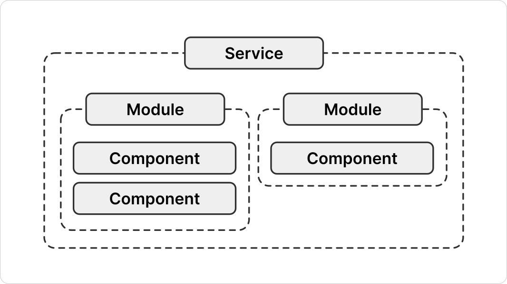
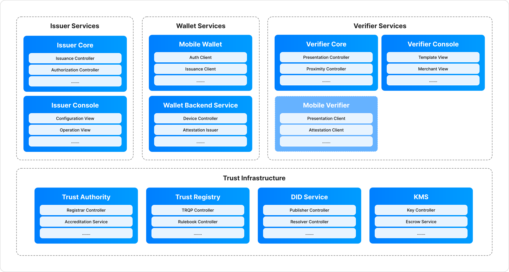

<!-- Sumber: Arsitektur Ekosistem Identitas Digital v0.2, §2.2, §2.3, §3.1; Gambar 1.1 dan 1.2 disediakan user, tidak berasal dari draft -->

# 1. System Models

The ecosystem is described at three scales, and each one sits inside the one
above it. A Service is where responsibility is assigned, a Module is what gets
deployed, and a component is a part inside a Module. This chapter works at the
first two and names the third: which components sit in which Module is part of
the map, while how a component is built, and the layers inside it, belong to
[Software Architecture](../software-architecture/index.md). Most arguments about
what the architecture allows turn out to be arguments about which of the three
the question is really asking about.

<figure markdown="1" id="figure-1-1" class="ekdn-fig-medium" > 
  { loading=lazy }
  <figcaption>Figure 1.1 The system model: Service, Module, and component.</figcaption>
</figure>

- **Service** is a group of functions that belong together, and it is the scale
  at which responsibility is assigned. A role runs a Service. It is not
  something anyone deploys: naming a Service says who answers for a part of the
  ecosystem, not what is installed on a machine.
- **Module** is the scale at which software is deployed and operated. One
  Module ships as one container image, which is the test that separates it from
  everything inside it: if it does not ship on its own, it is not a Module. A
  Service holds one or more.
- **Component** is a part inside a Module, and it never appears on the map by
  itself. It is deployed because the Module around it is deployed. Four of them
  are named often enough to be mistaken for Modules, and
  [Section 3.2, What is not a Module](module-map.md#32-what-is-not-a-module)
  says why each one is not.

There are four Services and eleven Modules. Both counts are decisions rather
than accidents of the drawing, and
[Section 1.5, Why the counts are what they are](#15-why-the-counts-are-what-they-are)
is about what they protect.

<figure markdown="1" id="figure-1-2">
  { loading=lazy }
  <figcaption>Figure 1.2 The same three scales with their real names: four Services, eleven Modules, and a sample of the components inside each Module.</figcaption>
</figure>

- **The rows inside each Module are its components**, shown as a sample rather
  than a list, which is what the dots at the foot of each Module mean. They are
  a reminder that the third scale is real. What every Module is actually built
  from is [Section 3, Module Map](module-map.md).
- **Mobile Verifier carries a lighter shade** because it works without a server
  of its own. A merchant, or a Relying Party at its counter, verifies online and
  offline from the device alone, with the keys on the device and the result on
  its screen. The Verifier Core it checks in with belongs to whoever answers for
  the device: the RP Intermediary for a merchant, the Relying Party itself for a
  counter device.

## 1.1 Issuer Services

Issuer Services is where a credential is created. An institution that already
holds records about people turns what it holds into a signed credential and
hands it to a citizen's wallet. Issuing is the smaller half of the job: the
Service also carries the credential for the rest of its life, which means
reissuing it, revoking it, and publishing the status list that tells a verifier
whether it still stands.

Every issuer runs its own. There is no arrangement where a small issuer rides
on a larger one's software, because a credential's signature has to trace back
to the institution that stands behind the record, and a shared signer would
break that line.

- **How many:** Many.
- **Roles:** [Identity Issuer](../roles/role-map.md#121-identity-issuer),
  [Attribute Issuer](../roles/role-map.md#122-attribute-issuer)
- **Modules:** [Issuer Core](module-map.md#311-issuer-core),
  [Issuer Console](module-map.md#312-issuer-console)

## 1.2 Wallet Services

Wallet Services is the citizen's side of the ecosystem, and it runs on a device
nobody in the ecosystem owns. It receives credentials, holds them, shows the
citizen who is asking for one, and signs the presentation once the citizen
agrees. Nothing here decides what a credential says or whether it is still
valid. Those are the issuer's answers, and the wallet carries them
rather than forming them.

The backend behind the wallet holds no credentials at all. Its job is to vouch
that an installation is a genuine one on genuine hardware, and to handle what
happens when a device is lost or replaced.

- **How many:** Many.
- **Roles:** [Wallet Provider](../roles/role-map.md#123-wallet-provider)
- **Modules:** [Mobile Wallet](module-map.md#313-mobile-wallet),
  [Wallet Backend Service](module-map.md#314-wallet-backend-service)

## 1.3 Verifier Services

Verifier Services is where a credential is checked and turned into a decision.
A party asks for the attributes its accreditation covers, tests what comes back
against both chains of trust, and hands the result to its own service system.
What it may ask for is fixed before the transaction, and the request it sends is
bounded by it.

This is the only Service with a party riding on it that was never accredited. A
business too small for accreditation verifies through the Verifier Core of an
intermediary, using a certificate that intermediary issued and can revoke, and
the intermediary answers for what that business does.
[Section 3, RP Intermediary and merchant](../roles/rp-intermediary-and-merchant.md)
is how that works.

- **How many:** Many.
- **Roles:** [Relying Party](../roles/role-map.md#124-relying-party),
  [Relying Party Intermediary](../roles/role-map.md#125-relying-party-intermediary), [Merchant](../roles/role-map.md#126-merchant) 
- **Modules:** [Verifier Core](module-map.md#315-verifier-core),
  [Verifier Console](module-map.md#316-verifier-console),
  [Mobile Verifier](module-map.md#317-mobile-verifier)

## 1.4 Trust Infrastructure

Trust Infrastructure decides who may take part and what each participant may
then do, and it publishes those answers so that everybody else can read them
without asking. Accreditation and authorization are settled here. So are the
trusted list, the identifiers entities are known by, the lifecycle of their
keys, and the two certificate roots the whole ecosystem hangs from.

Publishing rather than answering is the whole point. What the other three
Services consume from this one is a file that was signed and cached in advance,
which is why [Section 1.5.1](#151-trust-infrastructure-is-not-a-role) can say
that this Service is never present at the moment a credential is issued or
verified.

- **How many:** One.
- **Roles:** [Root Authority](../roles/role-map.md#111-root-authority)
- **Modules:** [Trust Authority](module-map.md#318-trust-authority),
  [Trust Registry](module-map.md#319-trust-registry),
  [DID Service](module-map.md#3110-did-service),
  [KMS](module-map.md#3111-kms)

## 1.5 Why the counts are what they are

Every section above ends with a count, and two of them are the counts that get
questioned: one Trust Infrastructure for a whole country, and no ceiling at all
on the rest. Both are deliberate, and they hold for opposite reasons.

### 1.5.1 Trust Infrastructure is not a role

The first three Services are roles in a transaction. Someone issues, someone
holds, someone verifies, and each of the three appears in the exchange. Trust
Infrastructure appears in none of them. It is the foundation that lets the other
three be trusted, and it is **never on the transaction path**.

A credential is issued and verified without a single call reaching it. Every
artifact it produces was published as a file and copied into a local cache
before the transaction began, so what a verifier consults at the moment of use
is its own cache. This is
[Principle 1, The two paths never cross](index.md#1-the-two-paths-never-cross),
and it is enforced rather than intended: four calls are forbidden outright and
the build fails if any of them appears, which
[Section 3.3, Who may call whom](module-map.md#33-who-may-call-whom) lists.

That absence is what makes the **one** in this Service's count affordable. A
single national instance of anything is a single point of failure only if
something waits on it. Because nothing does, its outage stops no verification
until the caches age out, which is
[Principle 2, The center may be down](index.md#2-the-center-may-be-down). Put
Trust Infrastructure on the transaction path and the same single instance
becomes the thing that can stop every verification in the country at once.

The separation is drawn Module by Module in
[Section 2, The transaction path and the trust path](transaction-path-and-trust-path.md).

### 1.5.2 The counts are the design

Issuer Services, Wallet Services, and Verifier Services are **many**, and that
is how the ecosystem scales. Any accredited entity runs its own instance, so
capacity grows by admitting participants rather than by enlarging a central
system, and no participant's load is anyone else's problem. It also means
failure stays local: an issuer whose Issuer Core is down stops issuing its own
credentials and nothing else.

Trust Infrastructure is **one**, and the reason is the opposite of scale. Part
of its job is to be the thing everybody else agrees on. Two trusted lists would
be two answers to the question of who is accredited, and an ecosystem that can
answer that question twice has not answered it. Singleness is the property, not
a limitation waiting to be lifted.

One more count sits underneath the others: the wallet's protocol layer is kept
separable from the interface a citizen sees, so it can be lifted out as an SDK.
That is what makes **many** Wallet Providers realistic rather than nominal. The
second provider builds on an implementation the first one already proved in the
field, instead of writing the protocol again and introducing a second set of
bugs into the same exchange. The shared library that carries this is
[Section 2.5, Trust SDK](../software-architecture/components-inside-a-module.md#25-trust-sdk).

The eleven Modules named here, with what each is built as and who may call
whom, are [Section 3, Module Map](module-map.md). What sits inside each one
is [Section 2, Components inside a Module](../software-architecture/components-inside-a-module.md).
