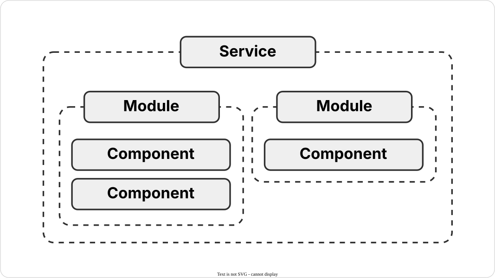
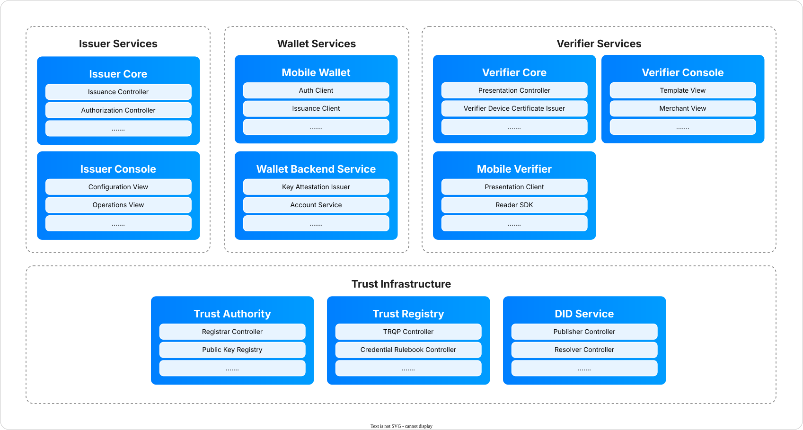

<!-- Sumber: Arsitektur Ekosistem Identitas Digital v0.2, §2.2, §2.3, §3.1; Gambar 1.1 dan 1.2 disediakan user, tidak berasal dari draft -->

# System Models {#system-models}

The ecosystem is described at three scales, and each one sits inside the one
above it. A System Model is where responsibility is assigned, a Module is what gets
deployed, and a component is a part inside a Module. This chapter works at the
first two and names the third: which components sit in which Module is part of
the map, while how a component is built, and the layers inside it, belong to
[Software Architecture](../software-architecture/index.md).
[The system model][fig-service-module-component] draws the three sitting
inside one another.

{ #fig-service-module-component }

<figure markdown="1" class="ekdn-fig-medium">
  { loading=lazy }
  <figcaption> The system model: System Model, Module, and component.</figcaption>
</figure>

- **System Model** is a group of functions that belong together, and it is the scale
  at which responsibility is assigned. A role runs a System Model. It is not
  something anyone deploys: naming a System Model says who answers for a part of the
  ecosystem, not what is installed on a machine.
- **Module** is the scale at which software is deployed and operated. One
  Module ships as one container image, which is the test that separates it from
  everything inside it: if it does not ship on its own, it is not a Module. A
  System Model holds one or more.
- **Component** is a part inside a Module, and it never appears on the map by
  itself. It is deployed because the Module around it is deployed. Six things
  are named often enough to be mistaken for Modules, and
  [what is not a Module][what-is-not-a-module] says why each one is not.

There are four System Models and ten Modules, which
[the four System Models and the ten Modules][fig-four-services-and-ten-modules]
lays out with a sample of the components inside each Module. Both counts are
decisions rather than accidents of the drawing, and
[why the counts are what they are][why-the-counts-are-what-they-are] is about
what they protect.

{ #fig-four-services-and-ten-modules }

<figure markdown="1">
  { loading=lazy }
  <figcaption> The same three scales with their real names: four System Models, ten Modules, and a sample of the components inside each Module.</figcaption>
</figure>

- **The rows inside each Module are its components**, shown as a sample rather
  than a list, which is what the dots at the foot of each Module mean. They are
  a reminder that the third scale is real. What every Module is actually built
  from is [Module Map](module-map.md).
- **Mobile Verifier carries a lighter shade** because it works without a server
  of its own.

## Issuer Services {#issuer-services}

Issuer Services is where a credential is created. An institution that already
holds records about people turns what it holds into a signed credential and
hands it to a citizen's wallet. Issuing is the smaller half of the job: the
System Model also carries the credential for the rest of its life, which means
reissuing it, revoking it, and publishing the status list that tells a verifier
whether it still stands.

Every issuer runs its own. There is no arrangement where a small issuer rides
on a larger one's software, because a credential's signature has to trace back
to the institution that stands behind the record, and a shared signer would
break that line.

- **How many:** Many.
- **Roles:** [Identity Issuer][identity-issuer],
  [Attribute Issuer][attribute-issuer]
- **Modules:** [Issuer Core][hla-issuer-core],
  [Issuer Console][hla-issuer-console]

## Wallet Services {#wallet-services}

Wallet Services is the citizen's side of the ecosystem, and it runs on a device
nobody in the ecosystem owns. It receives credentials, holds them, shows the
citizen who is asking for one, and signs the presentation once the citizen
agrees. Nothing here decides what a credential says or whether it is still
valid. Those are the issuer's answers, and the wallet carries them
rather than forming them.

The backend behind the wallet holds no credentials at all. Its job is to vouch
that an installation is a genuine one on genuine hardware, and to handle what
happens when a device is lost or replaced.

- **How many:** Many.
- **Roles:** [Wallet Provider][wallet-provider]
- **Modules:** [Mobile Wallet][hla-mobile-wallet],
  [Wallet Backend Service][hla-wallet-backend-service]

## Verifier Services {#verifier-services}

Verifier Services is where a credential is checked and turned into a decision.
A party asks for the attributes its accreditation covers, tests what comes back
against both chains of trust, and hands the result to its own service system.
What it may ask for is fixed before the transaction, and the request it sends is
bounded twice over: by the Authority Statement of the entity (its accreditation scope),
and by the narrower Use Statement of the [registered use][registered-use] the
request runs under. (A merchant is bounded three times over, adding the ReaderAuthRole in
its Verifier Device Certificate.)

This is the only System Model with a party riding on it that was never accredited. A
business too small for accreditation verifies through the Verifier Core of an
intermediary, using a certificate that intermediary issued and can revoke, and
the intermediary answers for what that business does. Both are arrangements of
one role rather than roles of their own.
[RP Intermediary and merchant](../roles/rp-intermediary-and-merchant.md) is how
that works.

- **How many:** Many.
- **Roles:** [Relying Party][relying-party], with its two subtypes,
  [RP Intermediary and merchant][the-two-subtypes-of-relying-party]
- **Modules:** [Verifier Core][hla-verifier-core],
  [Verifier Console][hla-verifier-console],
  [Mobile Verifier][hla-mobile-verifier]

## Trust Infrastructure {#trust-infrastructure}

Trust Infrastructure decides who may take part and what each participant may
then do, and it publishes those answers so that everybody else can read them
without asking. Accreditation and authorization are settled here. So are the
trusted list, the identifiers entities are known by, the witness on every
change to their keys, and the two certificate roots the whole ecosystem hangs from.

Publishing rather than answering is the whole point. What the other three
Services consume from this one is a file that was signed and cached in advance,
which is why [Trust Infrastructure is not a
role][trust-infrastructure-is-not-a-role] can say that this System Model is never
present at the moment a credential is issued or verified.

- **How many:** One.
- **Roles:** [Root Authority][root-authority]
- **Modules:** [Trust Authority][hla-trust-authority],
  [Trust Registry][hla-trust-registry],
  [DID Service][hla-did-service]

The other two governance roles run no Module of their own:
[Assessment Body][assessment-body] works through the conformance test suite,
and what a [Credential Rulebook Provider][credential-rulebook-provider]
proposes lives in the Credential Rulebook repository inside
[Trust Registry][hla-trust-registry].

## Why the counts are what they are {#why-the-counts-are-what-they-are}

Every section above ends with a count, and two of them are the counts that get
questioned: one Trust Infrastructure for a whole country, and no ceiling at all
on the rest. Both are deliberate, and they hold for opposite reasons.

### Trust Infrastructure is not a role {#trust-infrastructure-is-not-a-role}

The first three System Models are roles in a transaction. Someone issues, someone
holds, someone verifies, and each of the three appears in the exchange. Trust
Infrastructure appears in none of them. It is the foundation that lets the other
three be trusted, and it is **never on the transaction path**.

That absence is what makes the **one** in this System Model's count affordable: a
single national instance is a point of failure only if something waits on it,
and [the trust path][the-trust-path] sets out why nothing does.

The separation is drawn Module by Module in
[The transaction path and the trust path](transaction-path-and-trust-path.md).

### The counts are the design {#the-counts-are-the-design}

Issuer Services, Wallet Services, and Verifier Services are **many**, and that
is how the ecosystem scales. Any accredited entity runs its own instance, so
capacity grows by admitting participants rather than by enlarging a central
system, and no participant's load is anyone else's problem. It also means
failure stays local: an issuer whose Issuer Core is down stops issuing its own
credentials and nothing else.

Trust Infrastructure is **one**, and the reason is the opposite of scale. Part
of its job is to be the thing everybody else agrees on. Two trusted lists would
be two answers to the question of who is accredited, and an ecosystem that can
answer that question twice has not answered it. Singleness is the property, not
a limitation waiting to be lifted.

One more count sits underneath the others: the wallet's protocol layer is kept
separable from the interface a citizen sees, so it can be lifted out as an SDK.
That is what makes **many** Wallet Providers realistic rather than nominal. The
second provider builds on an implementation the first one already proved in the
field, instead of writing the protocol again and introducing a second set of
bugs into the same exchange. The shared library that carries this is
[Trust SDK][sa-trust-sdk].

The ten Modules named here, with what each is built as and who may call
whom, are [Module Map](module-map.md). What sits inside each one is
[Components inside a Module](../software-architecture/components-inside-a-module.md).
