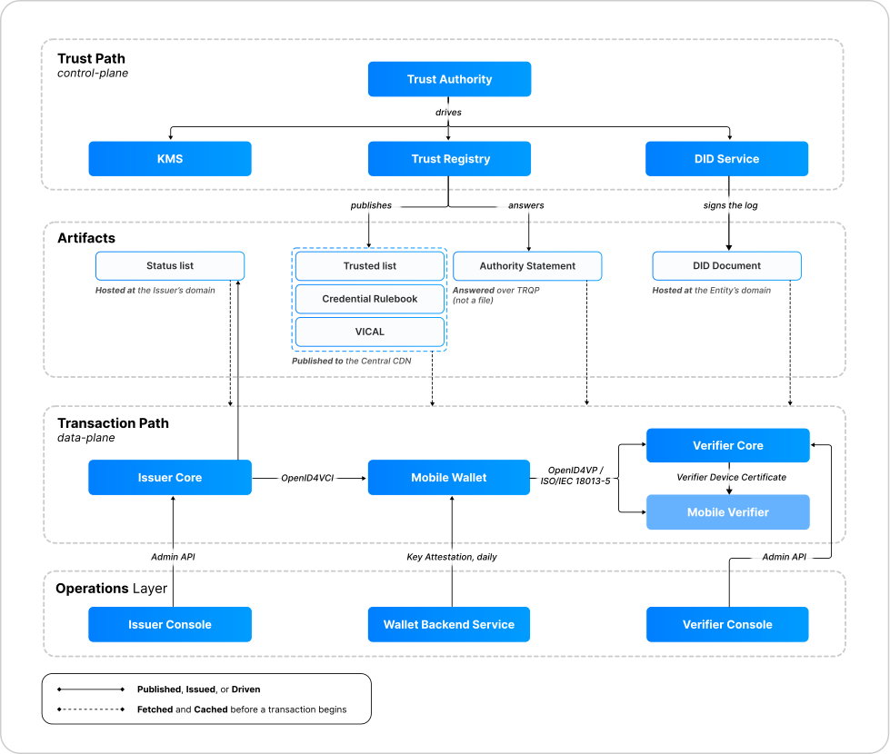

<!-- Sumber: Arsitektur Ekosistem Identitas Digital v0.2, §3 (pengantar dan diagram), Kep. 12 -->

# 2. The transaction path and the trust path

Four Services, eleven Modules. The separation that shapes everything else is
between the transaction path, which is the data plane, and the trust path,
which is the control plane. They do not meet at runtime, which the chapter
overview states as
[Principle 1, The two paths never cross](index.md#1-the-two-paths-never-cross).
This page is the mechanism: which Module sits on which plane, what each plane
is allowed to carry, and what passes between them.

A third group falls out of the same split and is easy to miss, because it is
neither. Issuer Console, Verifier Console, and Wallet Backend Service configure
and vouch for the parties on the transaction path without ever issuing or
verifying anything themselves. They are the operations layer.

| Plane | Modules | What it does |
|---|---|---|
| Transaction path (data plane) | Issuer Core, Mobile Wallet, Verifier Core, Mobile Verifier | Issues and presents credentials |
| Trust path (control plane) | Trust Authority, Trust Registry, DID Service, KMS | Decides who is trusted, and publishes the answer |
| Operations layer | Issuer Console, Verifier Console, Wallet Backend Service | Configures an entity's own Module, and vouches for its devices |

<figure markdown="1" class="ekdn-fig-wide" id="figure-2-1">
  { loading=lazy }
  <figcaption>Figure 2.1 The trust path, the artifact lane, the transaction path, and the operations layer.</figcaption>
</figure>

The figure reads downward, and each of its four bands has a section. The trust
path is [Section 2.2](#22-the-trust-path), the artifact lane
[Section 2.4](#24-what-connects-the-two-planes), the transaction path
[Section 2.1](#21-the-transaction-path), and the operations layer
[Section 2.3](#23-the-operations-layer).

The artifact lane draws the six artifacts a party fetches from an address and
caches before a transaction, which is what the dashed arrows in the figure
mean. Six more are never fetched at all, traveling with a party or with a
message instead. All twelve are in
[Section 4, Artifacts exchanged](../data-model-and-protocols/artifacts-exchanged.md).

## 2.1 The transaction path

Three protocol exchanges carry every credential in the ecosystem, and there are
no others.

| From | To | Protocol |
|---|---|---|
| Issuer Core | Mobile Wallet | OpenID4VCI |
| Mobile Wallet | Verifier Core | OpenID4VP, online only |
| Mobile Wallet | Mobile Verifier | OpenID4VP for online, ISO/IEC 18013-5 for proximity |

The wallet is the only Module that appears on both sides. It receives from an
issuer and presents to a verifier, and nothing moves between an issuer and a
verifier directly. That absence is deliberate and is the third of the three
statements in [Section 2.4](#24-what-connects-the-two-planes).

Both verifier Modules appear because each covers a different setting. Verifier
Core receives a presentation online, at the Relying Party's own endpoint.
Mobile Verifier reads on a device, online or in proximity: a merchant with no
server uses it, and so does a Relying Party at its counter. Proximity reading
happens on that device alone, so an offline check makes no network call on
either side.

## 2.2 The trust path

Trust Authority drives the other three Trust Infrastructure Modules and nothing
else. It tells Trust Registry what to publish, DID Service which entity
identifiers to create and resolve, and KMS which keys to generate, rotate, or
revoke. The direction is one way in a second sense too: no Module in Trust
Infrastructure ever calls a Module outside it, and none of them calls an entity
back.

This is why the plane can be one instance nationally without being a single
point of failure. It is absent at the moment of use, so its availability is not
the ecosystem's availability. The four call prohibitions that hold the line,
including the one forbidding Trust Infrastructure from reaching outward, are in
[Section 3.3, Who may call whom](module-map.md#33-who-may-call-whom).

## 2.3 The operations layer

Three Modules configure and vouch. None of them issues a credential or verifies
one, and each is reached differently from the Module it serves.

Issuer Console and Verifier Console are web applications used by staff inside
an entity. Each reaches its own Core through that Core's Admin API and through
nothing else, with no database connection of its own. An operator configures
credential types, onboards merchants, sets `allowed_attrs`, revokes, and reads
reports, and every one of those actions travels the same documented API that
any other client would use.

Wallet Backend Service does something different. It vouches. It issues a Key
Attestation to each Mobile Wallet daily, binds the installation to its
device, and can revoke that device. It holds no credentials, which is the point:
it can disown a wallet without being able to read what the wallet carries.
Verifier Core plays the same vouching role toward Mobile Verifier. It issues a
Verifier Device Certificate to each device it answers for, a merchant's or the
Relying Party's own counter device, and the Governance Profile sets how long
that certificate lives.

Each of these two artifacts has three parties rather than two. Wallet Backend
Service issues a Key Attestation, Mobile Wallet carries it, and Issuer Core
reads it before issuing a credential that demands one. Verifier Core issues a
Verifier Device Certificate, Mobile Verifier carries it, and Mobile Wallet
reads it before releasing an attribute to that device. In both cases the
artifact travels to the party being vouched for, and is read by the party on
the other side of the transaction, which is the party that needed the
assurance.

On the wallet side the daily cadence is itself the revocation mechanism. An
installation that stops being reissued stops working when its current
attestation expires, with no revocation list to distribute and no message that
has to arrive. A merchant certificate lives longer than a day, so it is
withdrawn the ordinary X.509 way instead: the operator publishes a CRL, and a
reader checks its cached copy.

## 2.4 What connects the two planes

The two planes are connected by published artifacts and by one query. Both are
answered before a transaction begins and read from a cache during one, so
nothing crosses while a credential is being issued or verified.

Six artifacts carry that connection, and they are the six drawn in the artifact
lane of [Figure 2.1](#figure-2-1). Each does the same job in a different form:
it settles, from a local copy, a question the trust path decided earlier, so
that no Module has to call the trust path to ask.

- The trusted list, published by Trust Registry to a central content delivery
  network (CDN), tells a Module that the party in front of it is accredited at
  all. It is the copy the
  tolerance limit is really about: when it ages out, the transaction stops. See
  [Section 4.1.1, Trusted list](../data-model-and-protocols/artifacts-exchanged.md#411-trusted-list).
- The Credential Rulebook, from the same CDN, is why an issuer and a verifier
  that have never spoken agree on what a credential of a given type contains.
  See [Section 4.1.2, Credential Rulebook](../data-model-and-protocols/artifacts-exchanged.md#412-credential-rulebook).
- VICAL, from the same CDN, lets a proximity reader accept an issuer it has
  never met with the network switched off, which is the hardest case this
  chapter has to serve. See [Section 4.1.3, VICAL](../data-model-and-protocols/artifacts-exchanged.md#413-vical).
- The DID Document, signed by DID Service and served by the entity itself, turns
  a signature into proof that a named entity made it. See
  [Section 4.2.1, DID Document](../data-model-and-protocols/artifacts-exchanged.md#421-did-document).
- The status list, published by each issuer at its own domain, is the only thing
  that ever passes from an issuer to a verifier, and it is a file rather than a
  call, which is what keeps the two from speaking. See
  [Section 4.2.2, Status list](../data-model-and-protocols/artifacts-exchanged.md#422-status-list).
- The Authority Statement is published nowhere at all. It is the query. See
  [Section 4.3.1, Authority Statement](../data-model-and-protocols/artifacts-exchanged.md#431-authority-statement).

No artifact on the central CDN carries citizen data.

The query is the sixth, the one that is no file. A participant asks Trust
Registry over TRQP whether a given party may do a given thing and caches the
answer like everything else, so a permission check survives an unreachable
registry exactly as a cached file does. What a statement covers, and how one is
granted, is in
[Section 2.3, Authorization](../roles/three-stages-of-authority.md#23-authorization).

What each of the six contains, and the six further artifacts that nobody
publishes to an address at all, are in
[Section 4, Artifacts exchanged](../data-model-and-protocols/artifacts-exchanged.md).

Two properties follow, and they are the first two of the three statements the
architecture makes about this split.

Trust Infrastructure is not on the transaction path. Every artifact a
transaction needs was fetched and cached before the transaction began, so a
verification that starts while Trust Infrastructure is unreachable still
completes. Issuance and verification continue from cache until the tolerance
limit expires, and the limit is a policy decision rather than a network
condition. The targets are in
[Quality goals](../software-architecture/quality-targets.md) and the
tolerance is set by the
[Governance Framework](../../governance-framework/index.md).

The status list is published by the issuer, not by the center. Revocation data
scales with the number of issuers rather than accumulating in one national
service, and it survives a central outage because it never lived there. Keeping
it off the center also keeps a count off the center: were revocation data
collected nationally, Trust Infrastructure would know how many credentials are
in circulation. The third statement follows from it. The only connection an
issuer has to a verifier is a static file that the verifier fetches, so the two
never speak.
