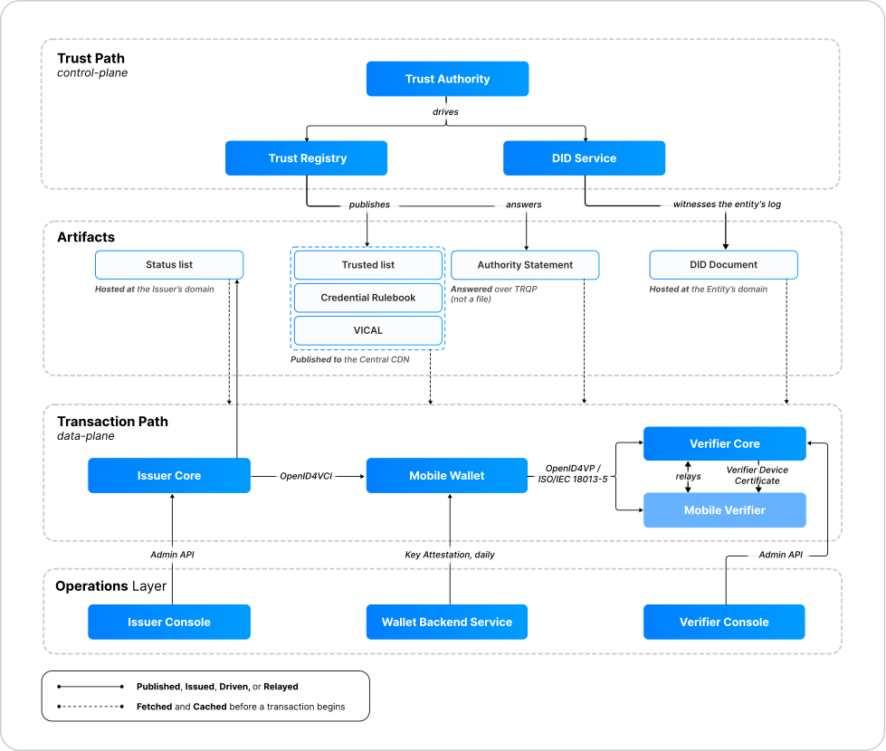

<!-- Sumber: Arsitektur Ekosistem Identitas Digital v0.2, §3 (pengantar dan diagram), §4.6, Kep. 9, 12, 28, 30 -->

# The transaction path and the trust path {#the-transaction-path-and-the-trust-path}

Four Services, ten Modules. The separation that shapes everything else is
between the transaction path, which is the data plane, and the trust path,
which is the control plane. They do not meet at runtime, which the chapter overview
states as the design principle
[the two paths never cross][the-two-paths-never-cross]. This page is the
mechanism: which Module sits on which plane, what each plane is allowed to
carry, and what passes between them.

A third group falls out of the same split and is easy to miss, because it is
neither. Issuer Console, Verifier Console, and Wallet Backend Service configure
and vouch for the parties on the transaction path without ever issuing or
verifying anything themselves. They are the operations layer.

<figure markdown="1" class="ekdn-table">

| Plane | Modules | What it does |
|---|---|---|
| Transaction path (data plane) | Issuer Core, Mobile Wallet, Verifier Core, Mobile Verifier | Issues and presents credentials |
| Trust path (control plane) | Trust Authority, Trust Registry, DID Service | Decides who is trusted, and publishes the answer |
| Operations layer | Issuer Console, Verifier Console, Wallet Backend Service | Configures an entity's own Module, and vouches for its devices |

</figure>

{ #fig-planes-and-artifact-lane }

<figure markdown="1" class="ekdn-fig-wide">
  { loading=lazy }
  <figcaption> The trust path, the band Artifacts, the transaction path, and the operations layer.</figcaption>
</figure>

The figure reads downward, and each of its four bands has a section:
[the trust path][the-trust-path], the band Artifacts in
[what connects the two planes][what-connects-the-two-planes],
[the transaction path][the-transaction-path], and
[the operations layer][the-operations-layer].

The band Artifacts draws the seven artifacts that settle a question before a
transaction runs. Five are fetched from an address and cached, which is what the
dashed arrows in the figure mean; one is answered over Trust Registry Query
Protocol (TRQP) rather than published as a file; and one, the Use Statement, is
carried by the verifier inside the request itself. Six more are never fetched at
all, traveling with a party or with a message instead. All thirteen are in
[Artifacts exchanged](../data-model-and-protocols/artifacts-exchanged.md).

## The transaction path {#the-transaction-path}

Three protocol exchanges carry every credential in the ecosystem, and there are
no others.

<figure markdown="1" class="ekdn-table">

| From | To | Protocol |
|---|---|---|
| Issuer Core | Mobile Wallet | [OpenID4VCI][exchange-protocols] |
| Mobile Wallet | Verifier Core | [OpenID4VP][exchange-protocols], online only |
| Mobile Wallet | Mobile Verifier | OpenID4VP for online, relayed by the RP Intermediary's Verifier Core; [ISO/IEC 18013-5][exchange-protocols] for proximity |

</figure>

The wallet is the only Module that appears on both sides. It receives from an
issuer and presents to a verifier, and nothing moves between an issuer and a
verifier directly. That absence is deliberate and is the third of the three
statements in [what connects the two planes][what-connects-the-two-planes].

Both verifier Modules appear because each covers a different setting. Verifier
Core receives a presentation online, at the Relying Party's own endpoint.
Mobile Verifier reads on a device, online or in proximity: a merchant with no
server uses it, and so does a Relying Party at its counter. Online, a merchant's
device leaves its signed request with the RP Intermediary's Verifier Core and
collects the encrypted response from it, and Verifier Core passes both along
without opening them. Proximity reading happens on the device alone, in Mobile
Verifier or in a Relying Party's own app built on the Reader SDK, so an offline
check makes no network call on either side.

## The trust path {#the-trust-path}

Trust Authority drives the other two Trust Infrastructure Modules and nothing
else. It tells Trust Registry what to publish, while DID Service witnesses every
entry an entity adds to its own identifier log using the witness key held in a
separate partition of Trust Authority's HSM. The keys themselves are generated
and held by each entity; Trust Infrastructure receives only public keys and
certificate requests. The direction is one way in a second sense too: no Module in Trust
Infrastructure ever calls a Module outside it, and none of them calls an entity
back.

One call runs the other way. A Core calls Trust Authority and DID Service
only to register or rotate its own keys, never during a transaction: the one
call the transaction path makes into the trust path, stated for each Core
Module in [who may call whom][who-may-call-whom].

This is why the plane can be one instance nationally without being a single
point of failure. It is absent at the moment of use, so its availability is not
the ecosystem's availability. The four call prohibitions that hold the line,
including the one forbidding Trust Infrastructure from reaching outward, are in
[who may call whom][who-may-call-whom].

## The operations layer {#the-operations-layer}

Three Modules configure and vouch. None of them issues a credential or verifies
one, and each is reached differently from the Module it serves.

Issuer Console and Verifier Console are web applications used by staff inside
an entity. Each reaches its own Core through that Core's Admin API and through
nothing else, with no database connection of its own. An operator configures
credential types, onboards merchants, sets `allowed_attrs`, revokes, and reads
reports, and every one of those actions travels the same documented API that
any other client would use.

Wallet Backend Service does something different. It vouches. It issues a Key
Attestation to each Mobile Wallet daily, binds the installation to its
device, and can revoke that device. It holds no credentials, which is the point:
it can disown a wallet without being able to read what the wallet carries.
Verifier Core plays the same vouching role toward Mobile Verifier. It issues a
Verifier Device Certificate to each device it answers for, a merchant's or the
Relying Party's own counter device, and the Governance Profile sets how long
that certificate lives. Provisioning and every renewal hand over both at once:
the certificate, and, for a merchant, the [Use Statements][use-statement] for
the business categories its device is bound to.

Each of these two artifacts has three parties rather than two. Wallet Backend
Service issues a Key Attestation, Mobile Wallet carries it, and Issuer Core
reads it before issuing a credential that demands one. Verifier Core issues a
Verifier Device Certificate, Mobile Verifier carries it, and Mobile Wallet
reads it before releasing an attribute to that device.

On the wallet side the daily cadence is itself the revocation mechanism, and it
reaches issuance alone. An installation that stops being reissued can obtain no
further credential once its current attestation expires, with no revocation list
to distribute and no message that has to arrive. The credentials it already
holds go on being presented, because no verifier reads a Key Attestation, and
reaching those is the issuer's job through its status list. A merchant
certificate lives longer than a day, so it is
withdrawn the ordinary [X.509][certificates-and-revocation]
way instead: the intermediary publishes a certificate revocation list (CRL),
and the wallet checks its cached copy.

## What connects the two planes {#what-connects-the-two-planes}

The two planes are connected by published artifacts, by one query, and by one
artifact a verifier carries into the transaction itself. All three are settled
before a transaction begins, so nothing reaches across while a credential is
being issued or verified.

Seven artifacts carry that connection, and they are the ones drawn in the
band Artifacts of [the diagram of the two planes][fig-planes-and-artifact-lane].
Each does the same job in a different form: it settles a question the trust path
decided earlier, so that no Module has to call the trust path to ask.

- The trusted list, published by Trust Registry to a central content delivery
  network (CDN), tells a Module that the party in front of it is accredited at
  all. It is the copy the tolerance limit is really about: when it ages out,
  the transaction stops. See [Trusted
  list][trusted-list].
- The Credential Rulebook, from the same CDN, is why an issuer and a verifier
  that have never spoken agree on what a credential of a given type contains.
  See [Credential
  Rulebook][credential-rulebook].
- Verified Issuer Certificate Authority List (VICAL), from the same CDN, lets an
  offline verifier accept an issuer it has never met with the network switched
  off, which is the hardest case this chapter has to serve. See
  [VICAL][vical].
- The DID Document, signed by DID Service and served by the entity itself,
  turns a signature into proof that a named entity made it. See [DID
  Document][did-document].
- The status list, published by each issuer at its own domain, is the only
  thing that ever passes from an issuer to a verifier, and it is a file rather
  than a call, which is what keeps the two from speaking. See [Status
  list][status-list].
- The Authority Statement is published nowhere at all. It is the query. See
  [Authority
  Statement][authority-statement].
- The Use Statement is published nowhere either, and it is not a query. The
  verifier carries it in the request it sends, so a wallet reads an approved
  purpose out of the message already in front of it; only the status list that
  withdraws one sits on the central CDN. See [Use
  Statement][use-statement].

No artifact on the central CDN carries citizen data.

Two of the seven are not files a participant fetches, and they fail differently for
it. The Authority Statement is the query: a participant asks Trust Registry over
[TRQP][exchange-protocols] whether a given party may do a given thing and caches the answer like
everything else, so a permission check survives an unreachable registry exactly
as a cached file does. The Use Statement is neither fetched nor asked for; it
arrives inside the request, which is what lets a wallet check an approved purpose
without the center learning that the transaction happened. What each covers, and
how one is granted, is in [Authorization][authorization] and
[Registered use][registered-use].

What each of the seven contains, and the six further artifacts that nobody
publishes to an address at all, are in
[Artifacts exchanged](../data-model-and-protocols/artifacts-exchanged.md).

Two properties follow, and they are the first two of the three statements the
architecture makes about this split.

Trust Infrastructure is not on the transaction path. Every artifact a
transaction needs was fetched and cached before the transaction began, so a
verification that starts while Trust Infrastructure is unreachable still
completes. Issuance and verification continue from cache until the tolerance
limit expires, and the limit is a policy decision rather than a network
condition. The targets are in
[Quality goals](../software-architecture/quality-targets.md) and the
tolerance is set by the
[Governance Framework](../../governance-framework/index.md).

Keeping the status list off the center also keeps a count off the center: were revocation data
collected nationally, Trust Infrastructure would know how many credentials are
in circulation. The third statement follows from it. The only connection an
issuer has to a verifier is a static file that the verifier fetches, so the two
never speak.
