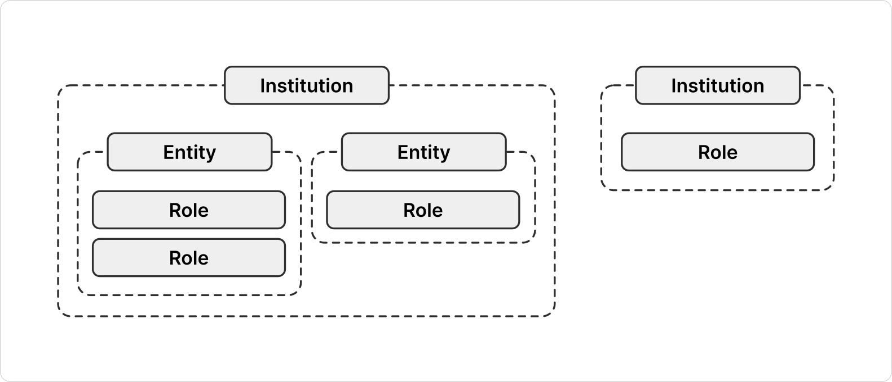
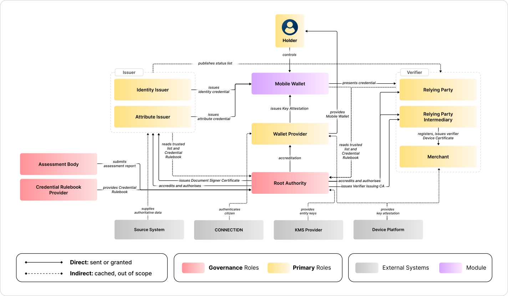
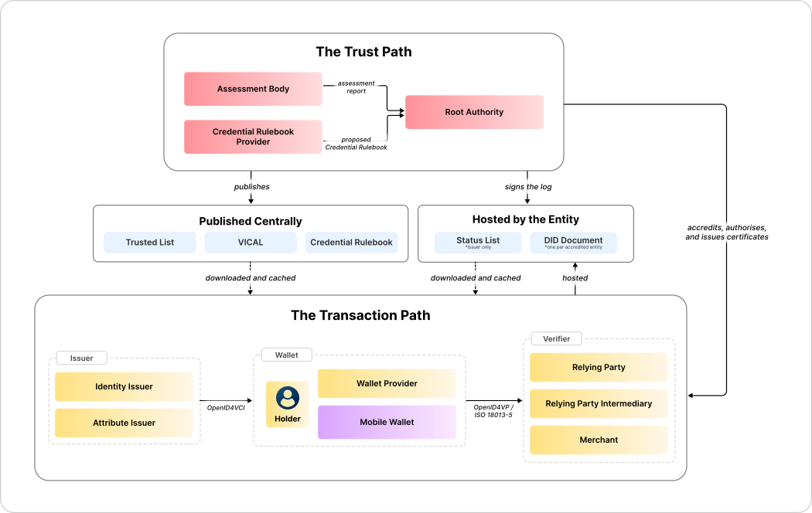

<!-- Sumber: Arsitektur Ekosistem Identitas Digital v0.2, §2.1, §2.2, §2.6, §3 (pengantar), §4.6 (lokasi artefak, dasar §1.4), §4.7, §5.3, §6.2; Peta Alur Penerbitan dan Presentasi, §1; Gambar 1.1, 1.2 dan 1.3 disediakan user, tidak berasal dari draft; §1.2.3 menamai peran saja, bukan institusinya (tracks/0031) -->

# 1. Role map

A role is a set of responsibilities, not a piece of software and not an
institution. Three layers connect a legal body to what it is allowed to do. An
institution applies to the Root Authority, accreditation produces an entity,
and the Root Authority grants that entity one or more roles.

<figure markdown="1" class="ekdn-fig-medium" id="figure-1-1">
  { loading=lazy }
  <figcaption>Figure 1.1 The participant model: Institution, Entity, and Role.</figcaption>
</figure>

- **Institution** is the legal body: a registered name, an NIB or NPWP, a deed
  of incorporation, and a person answerable for it. It exists before it ever
  approaches the ecosystem, and registering creates nothing at this layer. It is
  what applies to the Root Authority. One institution may register several
  entities, which is how a ministry keeps two of its units apart. It changes on
  a merger, a change of name, or a change of the person answerable.
- **Entity** is what accreditation produces: one DID, its keys and
  certificates, an accreditation status, and one row in the trusted list.
  Registration produces none of that. It opens a file and leaves the applicant
  pending, which is why a party that has only registered is one nobody else can
  check yet. This is the layer everyone else actually checks, and they check it
  cryptographically rather than on paper. It changes when a key is rotated, a
  status is suspended, or an accreditation is withdrawn.
- **Role** is the authority the Root Authority grants that entity, recorded in
  an Authority Statement. One entity may hold several at once: a campus that
  issues degree certificates and also verifies the digital identity credential
  registers once, holds one DID and one row in the trusted list, and receives
  two Authority Statements. It changes most often, because adding or dropping a
  credential type or an attribute needs no new accreditation.

**Merchant is a role with no entity.** [Figure 1.1](#figure-1-1) shows it
attached to an institution directly, and it is the only role shaped this way.
An RP Intermediary registers it rather than the Root Authority accrediting it,
verifies the business, and answers for what it does.

- It holds no DID and no row in the trusted list. Listing and auditing millions
  of small businesses is not workable.
- Its identity is borrowed, through a device certificate the intermediary
  issues, which names the merchant and the attributes it may ask for. The
  trusted list carries the intermediary, not the merchant.
- Its key is its own, created on the merchant's device and never leaving it, so
  the intermediary cannot read what a wallet sends back.
- Its institution is its own as well. A small shop is a legal body in its own
  right, and borrows the identity alone.

**The holder sits outside this model.** A holder is a person rather than an
institution, so there is no Institution layer and no Entity layer to register.
Nothing about a holder is recorded centrally: there is no directory of holders
and no record that a given person holds a given credential. What proves the
role is the key in the device's secure element and the Key Attestation the
Wallet Provider issued for it.

**Ten roles, and a test for what counts as one.** Something is a role only if
the Root Authority can accredit it, register it, or recognize it. Everything
that fails that test is drawn in [Figure 1.2](#figure-1-2) so the flow reads
whole, but it is not a role: Mobile Wallet is a Module, and the four gray boxes
are external systems. Both are covered in
[Section 1.3, Others](#13-others).

<figure markdown="1" class="ekdn-fig-wide" id="figure-1-2">
  { loading=lazy }
  <figcaption>Figure 1.2 The role map: ten roles, four external systems, and one module.</figcaption>
</figure>

The table below holds all ten in one place, each with the section that
describes it.

| Role | Group | Who holds it | Primary responsibility | Section |
|---|---|---|---|---|
| Root Authority | Governance | A designated state institution, not yet decided | Accredits and authorizes every entity directly, and anchors the whole trust chain | [Section 1.1.1](#111-root-authority) |
| Assessment Body | Governance | A conformance testing and security audit organization the Root Authority recognizes | Tests and audits implementations, and reports what it finds | [Section 1.1.2](#112-assessment-body) |
| Credential Rulebook Provider | Governance | The authority that proposes a credential type | Owns the Rulebook of that credential type across its versions | [Section 1.1.3](#113-credential-rulebook-provider) |
| Identity Issuer | Primary | The national civil registration authority | Issues the basic identity credential, and roots identity proofing for every other issuer | [Section 1.2.1](#121-identity-issuer) |
| Attribute Issuer | Primary | An organization that already holds the records a credential would assert | Issues everything other than basic identity, from those records | [Section 1.2.2](#122-attribute-issuer) |
| Wallet Provider | Primary | Any accredited organization that provides a wallet | Publishes a Mobile Wallet and vouches that a device is genuine | [Section 1.2.3](#123-wallet-provider) |
| Relying Party | Primary | An accredited organization that relies on a credential to serve someone | Requests and verifies credentials within its accreditation scope | [Section 1.2.4](#124-relying-party) |
| Relying Party Intermediary | Primary | A Relying Party that also serves merchants | Registers merchants, sets what each one may ask for, and stands behind them | [Section 1.2.5](#125-relying-party-intermediary) |
| Merchant | Primary | A small business or service counter that verifies where the person stands | Verifies credentials at the counter, registered by an RP Intermediary | [Section 1.2.6](#126-merchant) |
| Holder | Primary | The person the credentials are about | Holds the credentials, chooses what to disclose, and approves every presentation | [Section 1.2.7](#127-holder) |

The software each role runs is a separate question, answered in
[High-Level Architecture](../high-level-architecture/index.md).

## 1.1 Governance roles

Governance roles decide who may do what. None of them sits on the path a
credential travels, and none of them sees citizen data during issuance or
verification.

### 1.1.1 Root Authority

The Root Authority is a designated state institution, and which one is still
open. It decides both questions about every entity: whether it may take part,
and what it may then do. It accredits the Wallet Provider, every issuer, every
Relying Party and every RP Intermediary, writes each Authority Statement
itself, holds the `id.go` namespace, and sets the Governance Profile and the
Governance Framework. It also operates the two X.509 roots of the ecosystem,
one for the issuing side and one for the reading side. It recognizes other
ecosystems, such as a partner country's trust registry, through a
`recognition`.

There is no intermediary between it and an entity. An earlier draft gave each
sector its own authority to write Authority Statements for the entities in it.
The ecosystem now registers institutions directly, and absorbs the long tail of
small businesses through merchant registration instead. A shop therefore never
applies to anyone but the RP Intermediary that registers it. What registration
reads and what accreditation then decides are set out in
[Section 2, Three stages of authority](three-stages-of-authority.md).

It is trusted in a way nothing else is. Its anchor ships inside every
application at build time, so a wallet that has never fetched the trusted list
can still tell a genuine issuer signature from a forged one. The chain
terminates at a key the application already carries, and everything else hangs
off that one fact. The two anchor paths, DID and X.509, are set out in
[Two trust anchor paths](../trust-model/two-trust-anchor-paths.md).

### 1.1.2 Assessment Body

An Assessment Body is a conformance testing and security audit organization the
Root Authority recognizes. It tests an implementation against the Governance
Profile, audits its security, and hands the report over. It decides nothing: it
produces evidence, and the Root Authority decides what to do with it. That
separation is what keeps testing independent of the decision it feeds. The list
of recognized bodies lives in the
[Governance Framework](../../governance-framework/index.md).

### 1.1.3 Credential Rulebook Provider

A Credential Rulebook Provider is the authority that proposes one credential
type and then owns its Rulebook: the schema, the attributes, the minimization
class of each attribute, and the assurance demanded of the holder key. It stays
the authority for every later version of that Rulebook. Its role is to propose;
approving and publishing stays with the Root Authority, after which issuers,
wallets and Relying Parties cache what was published. The Root Authority holds
this role itself for the credential types in the `id.go` namespace.

## 1.2 Primary roles

Primary roles sit on the path a credential travels. Six of them are held by
institutions. The seventh, the holder, is held by a person, and it is the only
role that is.

### 1.2.1 Identity Issuer

The Identity Issuer is the national civil registration authority, the issuer of
basic identity. It issues the digital identity credential at the highest issuer
assurance. It is also the root of identity proofing for every other issuer: a
campus that needs to know who a student is relies, directly or indirectly, on
an identity this issuer already established. The Root Authority accredits it
itself, through
[Approval Tier C](three-stages-of-authority.md#23-authorization), and it
appears in the trusted list.

### 1.2.2 Attribute Issuer

An Attribute Issuer issues everything other than basic identity: a degree
certificate, a professional license, an account, an employment record. It
issues credentials from records it already holds, signs them with its own key,
and publishes the revocation status of what it has issued. The Root Authority
accredits it on the evidence it attaches at registration.

The two issuer roles are told apart by what they issue, not by how large they
are. Both run their own issuing infrastructure and hold their own signing key;
no issuer issues through another one's. Each signs with a Document Signer
Certificate the Root Authority issues, which chains to the Issuer Root CA.

### 1.2.3 Wallet Provider

The Wallet Provider is answerable for the wallet a citizen carries. It publishes
a Mobile Wallet, issues the Key Attestation that vouches for a device and for
the keys held inside it, binds each installation to the citizen who enrolled it,
restores credentials when that citizen changes phones, and revokes a device that
is lost.

**The role is held by many.** Every accredited Wallet Provider publishes a
Mobile Wallet of its own, and a citizen chooses among them. What makes that
workable is that an issuer never trusts a particular provider: it checks the
signer of a Key Attestation against the trusted list, so any accredited provider
is accepted and no other is, however many there are.

Enrollment is where the role reaches outside the framework. A citizen signs in
through an identity provider, and each Mobile Wallet may use a different one so
long as it meets the identity proofing the Governance Profile requires.
CONNECTIDN is the one the ecosystem already depends on and does not govern,
described in [Section 1.3.1, External systems](#131-external-systems).

It then steps out of the way. It holds no credentials and is not called during
issuance or verification. If it is unreachable, credentials already held still
present and still verify, because the current attestation is already in the
wallet. What stops is enrolling a new device and issuing a credential that
demands a fresh attestation.

### 1.2.4 Relying Party

A Relying Party is the party that relies on a credential to serve someone. It
requests and verifies credentials within the scope of its accreditation,
`restricted` attributes included where
[Approval Tier C](three-stages-of-authority.md#23-authorization) approved them.
It hands the result to its own service system over OpenID Connect or Security
Assertion Markup Language (SAML). It runs verifying infrastructure of its own
and appears in the trusted list.

*Relying Party* is the organizational role. *Verifier* is the name of the
software it runs: Verifier Core, Verifier Console, Mobile Verifier. The
split is deliberate. The Relying Party is the party that answers for the
request, and the verifier is the infrastructure that carries it to a wallet,
so one institution can replace its software without its accreditation
changing.

### 1.2.5 Relying Party Intermediary

A Relying Party Intermediary is a Relying Party that also serves merchants. It
registers merchants, sets the attribute scope of each one, issues their
Verifier Device Certificates and the certificate revocation list (CRL) that
withdraws them, and bears the consequences of what they do. Its Verifier Issuing CA is listed in the trusted
list alongside the entity itself.

Its own authority is that of any Relying Party, reaching as far as its
accreditation scope and no further. Serving merchants adds a power rather than
taking one away, so an intermediary keeps everything it could already ask for.
What it may hand on is narrower than what it may hold: the Governance Framework
bars a merchant's scope from carrying `restricted` attributes, whatever the
intermediary was accredited for. See
[Section 3, RP Intermediary and merchant](rp-intermediary-and-merchant.md).

### 1.2.6 Merchant

A merchant verifies credentials where the person is standing, both online and
face to face, reads the result on a screen, and never sends it anywhere. Its
key is generated on its own device and never leaves it. A merchant is
**registered by an RP Intermediary, not accredited**, and is trusted through a
certificate with a limited lifetime that the intermediary can withdraw early
through a CRL. Nothing about a merchant appears in the trusted list.

### 1.2.7 Holder

The holder is the person the credentials are about, and the only role a person
holds. They receive credentials into the wallet, keep them on their own device,
choose which attributes to disclose, and approve every presentation. They sign
in to the wallet through CONNECTIDN.

A holder registers nowhere. There is no Institution, no Entity, and no account
anywhere in the ecosystem. What a verifier checks is a signature made by a key
in the device's secure element, bound to a credential signed by an accredited
issuer.

## 1.3 Others

Two kinds of box in [Figure 1.2](#figure-1-2) are drawn because the flow would
be incomplete without them, and neither is a role. Neither can be accredited,
registered, or revoked by the Root Authority.

### 1.3.1 External systems

External systems sit outside the boundary of the framework. The ecosystem
depends on them, reaches each through a fixed interface, and governs none of
them.

Four systems fit that description, and the table below is the whole list.

| External system | What it supplies | Interface |
|---|---|---|
| Source System | The authoritative record an issuer copies from, read-only and never written to | Whatever each register already offers |
| CONNECTIDN | Authentication of the citizen signing in to the wallet, and an authenticated session that can serve as identity proofing during issuance | OpenID Connect |
| Device Platform | Proof that a key was generated inside hardware and that the application asking is the genuine one | The platform API of each mobile operating system |
| KMS Provider | Storage for the keys of entities and of the trust infrastructure itself | PKCS#11, KMIP |

Reading a source system and never writing to it keeps the register
authoritative: a credential is a signed copy of what the register already
holds, so correcting an error means correcting it there and reissuing. It also
means an issuer can join the ecosystem without asking the owner of a register
to accept writes from a new system.

The device platform is the dependency with no second supplier. Nothing in the
ecosystem can substitute for it, and reaching the secure element, key
attestation, and short-range radio from a cross-platform application needs
work specific to each platform. That is one of the two standing risks recorded
in
[Section 11, Technology risks and mitigation](../software-architecture/technology-risks-and-mitigation.md).
The KMS providers are a milder dependency, because they are reached through
PKCS#11 and KMIP, so one vendor can be exchanged for another without changing
anything above.

### 1.3.2 Module

The wallet on the citizen's phone is a Module, not a role. It is called Mobile
Wallet, the Wallet Provider publishes it and the holder installs it, so the
software answers to the Wallet Provider and the credentials inside it belong to
the holder. It is drawn in [Figure 1.2](#figure-1-2) because every credential
passes through it, both on the way in from an issuer and on the way out to a
verifier.

The eleven Modules of the ecosystem, this one included, are described in
[Module map](../high-level-architecture/module-map.md).

## 1.4 How the roles fit together

<figure markdown="1" class="ekdn-fig-wide" id="figure-1-3">
  { loading=lazy }
  <figcaption>Figure 1.3 The ten roles across the trust path and the transaction path.</figcaption>
</figure>

Two paths run through the role map, drawn in [Figure 1.3](#figure-1-3), and no
role stands on both while a transaction is happening.

- **The trust path is where the ecosystem decides who may take part and what
  they may do.** No credential travels it and no citizen appears on it. It runs
  on its own schedule, months before a transaction and years after, and what it
  produces is a decision recorded about a party. Assessment Bodies test
  implementations and hand their reports to the Root Authority. Credential
  Rulebook Providers draft schemas and submit them for approval. The Root
  Authority accredits and authorizes every entity itself, issuers, the Wallet
  Provider, Relying Parties and RP Intermediaries alike, and issues their
  certificates. There is no layer in between. The one thing arriving from
  outside is a sector license, which an applicant attaches as evidence rather
  than as authority of its own. The roles that sit on this path are in
  [Section 1.1, Governance roles](#11-governance-roles), and what their
  decisions produce is in
  [Section 2, Three stages of authority](three-stages-of-authority.md).
- **The transaction path is the route a credential actually travels.** It runs
  only while somebody is being served, it carries a citizen's data from end to
  end, and every party standing on it was cleared by a decision taken on the
  other path. A source system supplies authoritative data to an issuer,
  read-only. The issuer sends the credential to the holder's wallet. The holder
  presents it to a Relying Party, an RP Intermediary or a merchant, online or
  face to face, and chooses what to disclose each time. Which role can handle which
  credential format is in
  [Section 1, Credential formats](../data-model-and-protocols/credential-formats.md).

A role on one path never waits on a role from the other. Everything the trust
path decides has already reached the parties that need it before a transaction
starts, so a wallet and a Relying Party check each other without the Root
Authority being reachable. What travels between the two paths to make that
possible, and when it travels, is
[Section 2.4, What connects the two planes](../high-level-architecture/transaction-path-and-trust-path.md#24-what-connects-the-two-planes).
