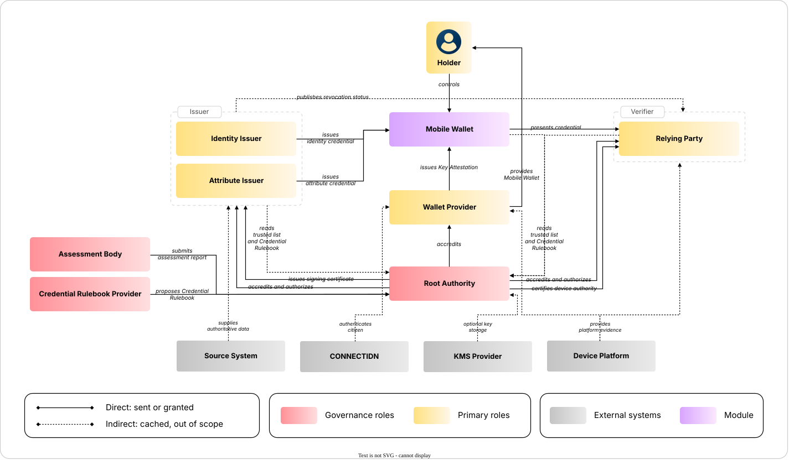
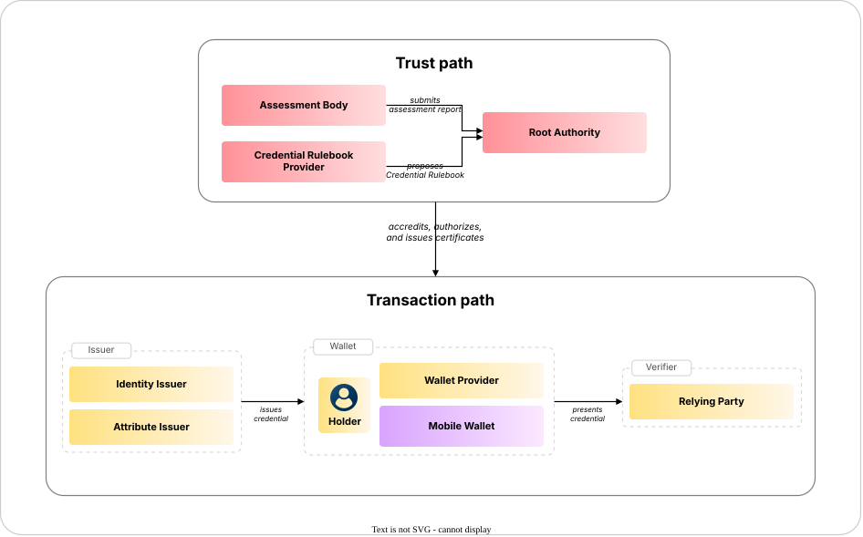

<!-- Sumber: Arsitektur Ekosistem Identitas Digital v0.2, §2.1, §2.2, §2.4, §2.5, §2.6, §4.4, §4.6, §4.7, §5.1-§5.7, §7.1-§7.7, §9.4, §10; Peta Alur Penerbitan dan Presentasi, §1, §2.3, §3.1, §3.2, §4, §5.1, §6; Rincian Module dan Operasi, §1.1-§1.4, §2.3-§2.5; Glosarium dan Konvensi IDCTF, C.1-C.7, E, F, G, H -->

# Role map {#role-map}

A role is a set of responsibilities the Root Authority has granted, not a
piece of software and not the whole of what a party is. A legal body exists in
its own right before it ever approaches the ecosystem, and approaching it
changes nothing about that body on its own. **A role test decides what counts
as a role, and it needs no support beyond itself**: something is a role only
if the Root Authority can accredit it, register it, or recognize it.
Everything that fails the test is still drawn in
[the role map figure][fig-role-map], because the flow would be incomplete
without it, but none of it is a role; both kinds are covered in
[Others][others].

The same test is what leaves the verifying side with one role rather than
three. An RP Intermediary is accredited as a Relying Party and nothing
further, and a merchant holds no permission of its own: the Root Authority
neither accredits it, registers it, nor recognizes it, since the intermediary
is what does all three in its place. Neither sits beside Relying Party as a
role of its own; both are its subtypes, set out in
[the two subtypes of Relying Party][the-two-subtypes-of-relying-party].

The test also settles a question the role map figure raises just by being
drawn full of boxes. A sector regulator, a university's own accreditation
body, a health ministry, a financial authority, is not one of the boxes, and
it fails the test in a different way: it is evidence, never authority. Its
license is attached at registration, read once as part of the applicant's
file, and never checked again on any later path. The role map does not draw a
notary, and it does not draw a sector regulator either.

{ #fig-role-map }

<figure markdown="1" class="ekdn-fig-wide">
  { loading=lazy }
  <figcaption> The role map: the eight roles, the external systems, and the wallet on the citizen's phone.</figcaption>
</figure>

Each arrow in the figure carries a label naming what passes along it, and the
section on each role below names the arrows that belong to it. A solid arrow is
something sent or granted directly. A dashed arrow is something read from a
cache, or supplied from outside the scope of the framework, which is why every
arrow leaving an external system is dashed.

[One table][tbl-roles] holds all eight in one place, each with the section that
describes it.

{ #tbl-roles }

<figure markdown="1" class="ekdn-table">

| Role | Group | Who holds it | Primary responsibility | Details |
|---|---|---|---|---|
| Root Authority | Governance | A designated state institution, not yet decided | Accredits and authorizes every entity directly, and anchors the whole trust chain | [See Details][root-authority] |
| Assessment Body | Governance | A conformance testing and security audit organization the Root Authority recognizes | Tests and audits implementations, and reports what it finds | [See Details][assessment-body] |
| Credential Rulebook Provider | Governance | The authority that proposes a credential type | Owns the Rulebook of that credential type across its versions | [See Details][credential-rulebook-provider] |
| Identity Issuer | Primary | The national civil registration authority | Issues the basic identity credential, and roots identity proofing for every other issuer | [See Details][identity-issuer] |
| Attribute Issuer | Primary | An organization that already holds the records a credential would assert | Issues everything other than basic identity, from those records | [See Details][attribute-issuer] |
| Wallet Provider | Primary | Any accredited organization that provides a wallet | Publishes a wallet, and vouches that a device and its keys are genuine | [See Details][wallet-provider] |
| Relying Party | Primary | An accredited organization that relies on a credential to serve someone | Requests and verifies credentials within its accreditation scope | [See Details][relying-party] |
| Holder | Primary | The person the credentials are about | Holds the credentials, chooses what to disclose, and approves every presentation | [See Details][holder] |

</figure>

The software each role runs is a separate question, answered in
[High-Level Architecture](../high-level-architecture/index.md).

## Governance roles {#governance-roles}

Governance roles decide who may do what. None of them sits on the path a
credential travels, and none of them sees citizen data during issuance or
verification.

### Root Authority {#root-authority}

The Root Authority is a designated state institution, and which one is still
open. It decides both questions about every entity, directly: whether a party
may take part, and what it may then do. There is no sectoral authority sitting
between it and an entity; an earlier design gave each sector its own body with
power to admit entities in its own field, and the ecosystem abandoned that
arrangement in favor of registering institutions directly and absorbing the
long tail of small businesses through merchant registration instead. What
registration reads and what accreditation then decides are set out in
[Three stages of authority](three-stages-of-authority.md).

**The top layer approves the approvers, rather than approving everything**,
and the volumes involved make the point concrete rather than abstract.
Citizen transactions run into the millions a day, with the Root Authority
involved in none of them. New entities register at a rate of thousands across
the whole life of the system, each one only once. New credential types appear
at a rate of tens a year, and new registered uses at a rate of hundreds to
thousands a year. New merchants arrive in the millions, again with the Root
Authority involved in none of them, because an RP Intermediary is what
registers them. The heavy work is a first years' backlog rather than a
permanent queue, and that is what lets one institution decide everything
without becoming the ecosystem's bottleneck.

It runs registration intake itself: receiving applications, verifying the legal
body behind each one, reading the report an Assessment Body files, and setting a
party's status before issuing its permission records. It issues an Accreditation
Credential that an accredited party carries as its own evidence, while the
trusted list, not that credential, stays what everybody else actually checks. It
publishes the trusted list, and it keeps that list's history rather than only
its current state, because during an incident, and again in a dispute raised
years later, the question that matters is what a party's status was at that
moment, not what it is now. The decision it reaches is the arrow *accredits and
authorizes* in [the role map figure][fig-role-map], drawn to the issuers and to
the Relying Party, and *accredits* alone to the Wallet Provider. The dashed
arrows marked *reads trusted list and Credential Rulebook* run from the issuers,
the wallet and the Relying Party: each of them reads what it publishes from a
cache.

It operates two separate roots of trust, one for the issuing side and one for
the reading side, and keeps each in its own offline hardware, never signing one
from the other. The reason stands on its own: a breach on the reading side must
not let anyone forge a credential, and a breach on the issuing side must not let
anyone read one they were never shown. From these two roots it issues, on
request, the certificate an issuer signs credentials with, and the certificate
an RP Intermediary, or a Relying Party that reads face to face, uses to certify
its own devices; it publishes and hosts the list by which either kind of
certificate can be withdrawn early. The first certificate is the arrow *issues
signing certificate* to the issuers in [the role map figure][fig-role-map], and
the second is *certifies device authority* to the Relying Party. It holds the
ecosystem's own family of credential types, distinct from any type another body
already owns elsewhere.

It sets the Governance Profile: the technical settings that apply across every
credential type and every party, such as how long a certificate lives and how
strong a key has to be for a given assurance level, and the point after which
a request that was never registered is refused outright. It sets the
Governance Framework: who decides what, what an entity owes the ecosystem, the
routes an application can take, the sanctions available, and the deadline
within which an intermediary must remove a merchant that abuses its
arrangement. It reviews and approves every Credential Rulebook before
publishing it, the attribute list, the legal basis behind each attribute, the
sensitivity class assigned to it, and the strength demanded of the holder's
key, then assigns the type's identifier and freezes that version. It can
recognize another country's registry, so that a credential issued there can be
evaluated here.

**Nobody can rotate a key quietly.** Every new key an entity registers is
countersigned by the Root Authority as its witness, and an entry that arrives
without that countersignature is rejected by every party that later tries to
resolve it. The Root Authority keeps a record of every entity's public keys,
what each is for, evidence of how it is stored, and its status, and it holds
none of their private keys: its own hardware carries only its own two roots,
its trusted-list signing key, the key that signs the list of issuer roots it
publishes for face-to-face readers, its Accreditation Credential key, the key
that maintains its own identifier, and its witness key. It also keeps an append-only log of entity events, registrations,
accreditations, key rotations, incidents, and nothing about a citizen ever
enters it.

Approval up front is not the whole of how it works. **It monitors after the
fact as well**, because front-loaded approval alone does not scale to every
entity forever. It fetches what each issuer and each verifier publishes about
itself, compares that against the scope actually granted, and watches for a
key entry that arrived without its witness. A discrepancy goes into the
incident process: a warning first, and suspension if the entity does not
correct it.

An incident runs to a schedule rather than to however long it takes to notice.
Within an hour of being confirmed, the entity's status is suspended, an
emergency trusted list goes out, issuance from it stops, and verifiers are
notified directly rather than waiting for their next cache refresh. The same
day, the entity rotates its key under an emergency procedure, the old
certificate goes on the withdrawal list, and the witness refuses any further
entry signed with the old key. Every credential that key signed is then
revoked, which is possible because the issuer's own records name which key
signed which credential. A new key and a new certificate follow, the entity's
status is restored, credentials are reissued, and a wallet can be told to ask
for fresh ones. What is left afterward is a post-mortem written into the
public log and a fresh look at how that entity stores its keys.

It runs two separate faces. One is its own back office, reached only by its
own staff under multi-factor sign-in, where registrations are approved, scope
is granted, an accreditation is withdrawn, and the two roots are operated. The
other is a self-service portal for entity staff: a body registers there,
watches its own status, downloads its own certificates, requests a key
rotation, applies for a registered use, reports an incident, and reads its own
audit trail. A citizen has access to neither. The reason is deliberate: the
moment a citizen's wallet held a login to the center, every transaction that
citizen made would become traceable back to them, and the ecosystem is built
specifically so that it does not learn that.

It is trusted in a way nothing else in the ecosystem is. Its anchor ships
inside every wallet and every verifier device at build time and is never downloaded
afterward, because a chain of trust cannot be circular: it has to terminate
somewhere the application already carries, and that somewhere is the Root
Authority. The two anchor paths are set out in
[Two trust anchor paths][two-trust-anchor-paths].

**What it refuses to do is as much a part of the role as what it does.** It
never accepts a party's own published description as the source of that
party's scope, because a party that could edit its own file could widen
itself, and authority declared by the party that holds it is no authority at
all. It holds no entity's private key, receiving only public keys, proof of
possession, and certificate requests. It never issues a device certificate to
a merchant or a counter device; certifying a device is the job of the entity
that vouches for it. It never registers a merchant directly. It never approves
a Credential Rulebook that pairs the most sensitive class of attribute with a
form unable to disclose part of a document while withholding the rest,
because that pairing makes minimization impossible by construction. It never
lets an entity issue a credential type that demands stronger key storage than
the entity actually uses. And it never stands inside the transaction path
itself: a design that routed every verification through a central
intermediary was considered and rejected, because it would have created both
a single point of failure and a single point from which every transaction
could be watched.

A campus shows most of this role in one continuous story. It applies with its
founding documents, the name of the person answerable for it, and its sector
operating license attached as evidence rather than as a reason to be waved
through. Because it is a first-time applicant, the application takes the
committee route no matter how mild what it wants to issue turns out to be. An
Assessment Body tests its implementation and audits its security, and its
report goes to the Root Authority, which grants it standing, publishes it in
the trusted list, and authorizes exactly one thing: to issue degree
certificates. Three years later the campus applies to add transcripts. It is
not reassessed, because being judged fit and being allowed to do one
particular thing are different findings, and the new application is reviewed
at whatever depth its own attributes deserve rather than at the depth its
first one needed; it is granted within days. Later still, the campus
mishandles the transcript type and that one permission is withdrawn, leaving
its standing and everything else it does untouched.

A leaked signing key shows the same authority reaching into a live incident
rather than stopping at a certificate. Within the hour the Root Authority
suspends the entity, publishes an emergency list, and notifies verifiers
directly, so issuance from that key stops immediately. The same day the
entity rotates under emergency procedure, the old certificate is withdrawn,
and the witness refuses to countersign anything more from the compromised
key. Every credential that key signed is revoked, which the issuer can do
because it kept a record naming which key signed which credential, and
reissuance begins once a new key and certificate are in place. What is left is
a public post-mortem and a second look at how that entity keeps its keys,
which is exactly what a scheduled rotation limits the damage to.

It is never on the transaction path, and the measurement backs the design:
zero involvement, not merely low involvement, in a citizen's transaction. It
never sees a credential, a presentation, or a citizen, and it does not learn
who dealt with whom, because wallets and verifiers work from a bulk download
they cache rather than asking about one party at a time; a lookup made once
per transaction would tell the center exactly who a citizen was dealing with.
It does not host any issuer's revocation status either, for the same reason:
each issuer publishes its own, so the center never learns how many credentials
are in circulation. It does not test implementations itself, does not act as
an intermediary during an issuance (a wallet always talks to an issuer
directly), does not operate the citizen sign-in service, and gives a citizen
no account or access of any kind.

### Assessment Body {#assessment-body}

An Assessment Body is a conformance testing and security audit organization the
Root Authority recognizes. **Its role is deliberately thin, and the thinness is
the substance of it.** It tests whether an entity's implementation conforms to
the Governance Profile, measuring every applicant against a written profile it
did not author and cannot change, so the test is identical whoever is being
tested and cannot be negotiated case by case. It audits that entity's security.
It hands its findings to the Root Authority as a report and stops there. That
hand-off is its one arrow in [the role map figure][fig-role-map], *submits
assessment report*. It runs no infrastructure of its own inside the ecosystem
and holds no key, and its standing rests entirely on being on the list the Root
Authority keeps.

**It decides nothing about participation.** What it produces is a finding:
conforms, does not conform, and with what defects, never a verdict on whether
the party may take part, what scope it should receive, or whether a given
defect is one the Root Authority should tolerate. The party that measures is
never the party that decides. A report full of defects cannot be argued into
an approval by the body that wrote it, and a clean report does not by itself
admit anyone; only the Root Authority's own decision does that, described in
[Accreditation][accreditation].

Its report is not only the price of a first accreditation. When a Relying
Party accredited for years applies for a restricted attribute, the committee
review that application takes will not proceed without a current report from
an Assessment Body alongside it, so the body is pulled back into a case years
after the party it is examining first joined, without that party being
reaccredited from scratch.

A campus's first accreditation, told from this side, is the whole role in one
pass: it books an assessment, the body runs its conformance suite against the
profile, audits the security of what it actually runs, and files what it
found, then stops. The Root Authority reads the report and decides; if the
report lists defects, deciding whether they matter is not this role's to make.

It runs no infrastructure, is not a regulator, never sees citizen data, is not
itself listed as a transacting participant in the trusted list, and does not
write the profile it measures against. The list of bodies it recognizes is the
Root Authority's own decision, recorded in the
[Governance Framework](../../governance-framework/index.md).

### Credential Rulebook Provider {#credential-rulebook-provider}

A Credential Rulebook Provider is the authority that proposes one credential
type and then owns its Rulebook across every later version: the schema, the
attribute list, the sensitivity class of each attribute, and the assurance
demanded of the holder's key. **Its job is to propose; approving and publishing
the Rulebook stays with the Root Authority**, after which issuers, wallets and
Relying Parties all cache what was published. The proposal is the arrow
*proposes Credential Rulebook* in [the role map figure][fig-role-map]. The Root
Authority holds this role itself for the ecosystem's own credential types. What
a Rulebook actually contains is set out in [The Credential
Rulebook][the-credential-rulebook].

**The classification decision is the one that matters most, and it is made
once for the life of the type.** The class assigned to an attribute decides,
for as long as that type exists, how hard it is for any Relying Party ever to
be granted the right to ask for it: marking an attribute restricted routes
every future request for it to the committee route, permanently. Minimization
is the default a Rulebook is expected to design toward: a derived attribute,
an over-17 flag computed from a birth date rather than the date itself, is
preferred wherever one is possible, so that a Relying Party never has to ask
for the fact underneath. A Rulebook also has to be designed around one hard
constraint, that a type carrying the most sensitive class of attribute cannot
be offered in a form that signs a whole document at once, because that form
cannot hide any part of it, and a second one, that a type which has to be
checkable with no network reaching the verifier device at all has to include a
representation built for that.

**A published Rulebook is frozen.** Any later change becomes a new version
rather than an edit, because credentials already issued keep pointing at the
version they were issued under, and reissuing them under a changed one would
break that pointer. Who may issue the type is never this role's to decide; it
is a separate permission the Root Authority grants to a particular
institution once the Rulebook already exists. Who may ask for its attributes
is likewise set through ordinary authorization, not through this role. One
boundary is worth stating on its own because the two are often confused: this
role sets the assurance demanded of the citizen's own key for a given type,
not the assurance recorded against an issuer's signing key, which is a
separate governance finding about how that issuer stores its own key. The two
scales are compared in
[Two assurance levels](../trust-model/two-assurance-levels.md).

A professional body proposing a license credential runs the whole cycle. It
drafts what the license asserts, which attributes it carries, which of them
are sensitive, and how strong the citizen's key must be to hold it, then
submits the draft. Because this is a credential type nobody has issued before,
review takes the committee route regardless of how mild the attributes turn
out to be. The Root Authority reviews the attribute list, the legal basis, the
classifications, and the key demand, assigns the type's identifier, publishes,
and freezes the version. Only afterward does any particular institution apply
for permission to issue it, and that is a separate decision about that
institution rather than about the type. The identity credential itself is the
clearest illustration of what one classification decision produces: a birth
date classed normal, a national identity number classed restricted, and a
derived over-17 flag classed open, all in one Rulebook, and each later
request for one of the three takes a different route through authorization
purely because of that one choice made once.

No source names who is eligible to hold this role beyond the Root Authority
itself for its own types; the credential type's owner becomes its Credential
Rulebook Provider, and this page does not attempt a list of eligible bodies
beyond that.

## Primary roles {#primary-roles}

Primary roles sit on the path a credential travels. Four of them are held by
institutions. The fifth, the holder, is held by a person, and it is the only
role that is.

### Identity Issuer {#identity-issuer}

The Identity Issuer is the national civil registration authority, the issuer of
basic identity. It runs its own issuing infrastructure and holds its own signing
key, exactly as every issuer does; no issuer issues through another's
infrastructure, and there is no arrangement anywhere on the issuing side that
lets one stand in for another. It signs with a certificate the Root Authority
issued to it from a request it submitted, which traces back to the ecosystem's
own issuing root. It publishes and hosts the revocation status of everything it
has issued, on its own systems, and it reads its source register without ever
writing to it: its software reaches into the institution's own closed system
rather than that register being opened up to outside writes. **It is the root of
identity proofing for every other issuer in the ecosystem.** Any other issuer
that needs to know who a person is relies, directly or indirectly, on an
identity this issuer already established. What it issues reaches the wallet
along the arrow *issues identity credential* in [the role map
figure][fig-role-map].

**"Who is this?" is decided before "what to issue?", and the answer never
comes from the wallet.** This is the single most important fact about how
this role works, and it holds in one of three ways only: the citizen has
already signed in to the institution's own system, so the issuer already
knows whose record to read; an officer at the institution has selected the
record and created the offer directly; or the request chains from a
credential the citizen already holds, one the issuer verifies for itself
first rather than taking on trust. A wallet asserting who its holder is, on
its own, is never one of the three.

It issues at the highest assurance an issuer can hold, which is a hard
precondition rather than a preference: the identity credential cannot be
issued at all from the weakest class of key storage, whatever else that
issuer might be permitted. It always demands that the wallet's provider vouch
for the device receiving the credential; a plain proof with no vouching
behind it is never accepted for this type. What it checks about that vouching
is that the provider behind it is in the trusted list at all, that its
vouching is current, that the key it names is the one the wallet will
actually use, and that the key's own storage meets what the Rulebook demands;
any accredited provider is accepted this way, and none is checked by name.

It computes a derived attribute itself, such as an over-17 flag, rather than
asking its register to supply one, and it keeps an issuance record per
credential that deliberately holds no claims and no plain identity number: a
pseudonym for the credential, which key signed it, which revocation slot it
holds, and how the holder's key was stored. That record is what makes it
possible, during an incident, to identify exactly which credentials a
particular leaked key signed, without the record itself ever holding what
those credentials said. When its source register cannot answer in time, it
defers rather than refusing outright, handing the wallet a ticket it can
return with once the register catches up.

**What it refuses to decide is what the Rulebook already settled.** It
supplies only the attributes the Rulebook names, and does not decide which
attributes exist or what sensitivity class each carries. It does not create a
second population database of its own; a wrong entry is corrected in the
source register and reissued, never edited in the credential directly. It
never learns where a credential is later presented, because a verifier
calling an issuer during verification is forbidden on two separate grounds,
the citizen's own privacy and the ecosystem's availability if every
verification depended on an issuer being reachable. And it never calls a
Wallet Provider during issuance either, so that no provider can learn what
credential its own device just received.

Issuing to a newly enrolled citizen carries every one of these facts at once.
The citizen signs in to the issuer's own system, which is how the issuer
knows whose record to open. It demands the strongest holder key, with the
wallet's provider vouching for it; the wallet obtains fresh vouching, and the
issuer checks that the voucher is in the trusted list, that the vouching is
current, and that the key's storage is strong enough. It reads only the
fields the Rulebook names, read-only, computes the over-17 flag itself, signs
with its own key from its own strongest storage, and records an issuance
entry holding no claims at all. The same device, asking for two different
credentials, shows the boundary that matters: a phone whose provider is
accredited but whose hardware offers only the weakest class of key storage is
refused the identity credential and granted a membership credential from
another issuer without any change to the phone itself, because the refusal
belongs to the credential type, never to the party asking.

### Attribute Issuer {#attribute-issuer}

An Attribute Issuer issues everything other than basic identity, a degree
certificate, a professional license, an account, an employment record, from
records it already holds. Its arrow in [the role map figure][fig-role-map] is
*issues attribute credential*, into the wallet. Registration is where a sector
license is attached as evidence, never as authority in itself; nothing in the
process depends on that license going unchanged afterward, which is a known gap
worth naming rather than papering over. Nothing in the ecosystem currently
notices when a sector regulator later withdraws a license it once relied on, so
an institution whose sector accreditation lapses can keep issuing until its own
accreditation is separately reviewed. That gap is recorded as unresolved technical debt.

**Its key storage may start at the weakest class and rise later by an
ordinary rotation, and rising is what widens what it may issue.** What it may
issue is capped twice over: by the permission it was actually granted, and by
where its own signing key lives. A credential type demanding hardware-backed
storage cannot be issued from a software keystore whatever permission the
issuer holds, and moving from one to the other is an ordinary key rotation
rather than a reaccreditation, so an entity that upgrades its own storage
becomes able to issue more without being reassessed.

**Whether it demands vouching at all is a proportionality decision, set by
the credential type rather than by the issuer.** The strongest and middle
classes of holder key require the wallet's provider to vouch for the device,
exactly as the Identity Issuer requires; the weakest class asks for nothing
beyond a plain proof, and the provider is never contacted for it, because the
cost is not worth it for a membership card. It may offer the
whole-document-signed form of a credential, unlike the Identity Issuer, but
only for types whose attributes are all open or normal, never where the most
sensitive class is present. It cannot widen what it may issue by editing its
own published description, because that description is generated from the
Rulebook it was actually granted and the Root Authority's own monitoring
compares the two.

The campus that carried the Root Authority's own worked example through
registration and accreditation carries this role's logic too, end to end.
Once accredited for degree certificates alone, its signing key starts in the
software keystore its own software ships with, which the type demands nothing
stronger than. It issues a degree by first verifying the graduate's own
identity credential, the same "who is this" chaining every other issuer
relies on, then reading its own student record read-only. Three years on it
is granted transcripts as an added permission, without being reassessed, and
later still it moves its key onto dedicated hardware through an ordinary
rotation to become eligible for a type that demands it, again without being
reassessed. The same institution, under the same registration, is also a
Relying Party checking the identity credential of its own applicants at the
admissions counter, which is the plainest demonstration available that one
legal body may hold roles on both the issuing and the verifying side at once.

A membership card shows the opposite end of the same logic: a type classed at
the lowest assurance, issued on a plain proof with no vouching demanded and no
contact with any Wallet Provider, because not every credential is worth the
same ceremony.

Every negative that applies to the Identity Issuer applies here as well: no
issuing through another issuer's infrastructure, no hosting another's revocation
status, and no arrangement that lets one issuer stand in as another's tenant.
**Both issuer roles are told apart by what they are permitted to issue, never by
how large the institution behind them is.** Each signs with a certificate the
Root Authority issued to it from its own request, which traces back to the
ecosystem's own issuing root, and each publishes the revocation status of what
it has issued on its own systems rather than through the center, so that the
center never learns how many credentials are in circulation. That publication is
the dashed arrow *publishes revocation status*, from the issuers to the Relying
Party, which reads it from a cache and never asks the issuer.

### Wallet Provider {#wallet-provider}

The Wallet Provider is answerable for the wallet a citizen carries. It publishes
a wallet of its own, vouches daily, or at each issuance, that a device and the
keys held inside it are genuine, binds each installation to the citizen who
enrolled it, restores credentials when that citizen changes phones, and revokes
an installation that is lost. Two arrows in [the role map figure][fig-role-map]
are its own: *provides Mobile Wallet*, to the holder, and *issues Key
Attestation*, to the wallet. A Key Attestation is the vouching statement itself.
**The role is held by many at once.** Every accredited Wallet Provider publishes
a wallet of its own, the operator of the national identity service publishes the
first, and a citizen chooses freely among them. What makes many providers
workable is that no issuer ever trusts a named one: an issuer checks the signer
of a vouching statement against the trusted list, so any accredited provider is
accepted and no other is, however many appear later.

A provider reaches that list the way every other accredited party does, and the
sameness is the point. An Assessment Body tests its implementation against the
Governance Profile and audits its security, the Root Authority decides on that
report, and the provider is added to the trusted list. Nothing in those stages
is particular to this role, so the first provider and the tenth face one test
written by neither of them. The stages are in
[Three stages of authority](three-stages-of-authority.md), and what the test
itself covers is a question for the Governance Framework rather than this
document.

Enrollment is the one point where this role reaches outside the framework: a
citizen signs in through an identity provider to enroll, and each wallet may
use a different one, so long as it meets the identity-proofing requirement
the Governance Profile sets. Once enrolled, this role knows the account and
the device, and nothing about credentials, issuers, or verifiers; it is never
called during an issuance and never called by a verifier at all, so it cannot
learn what a citizen holds or where a citizen presents it.

**Whether to vouch, asked every day, is where nearly all of its actual work
sits.** It checks that the device's own platform evidence traces back to the
manufacturer, that the application asking is the official build, and that the
installation is still active, and it refuses if any of the three fails.
**That refusal is the entire revocation design for a lost device, and it is
worth a paragraph on its own.** A device that should be cut off simply stops
receiving tomorrow's vouching. Nothing has to be published anywhere and
nothing has to be distributed to anyone: every issuer that would otherwise
have been asked to vouch for that device refuses on its own the next time it
checks, on the same logic that lets a
[short-lived attestation][short-lived-attestations] do the
work a published list would otherwise have to do. It never decides whether a
particular credential may be issued, because it never learns what was issued
in the first place, by design.

**Changing phone has one hard consequence: every credential is issued again
rather than restored from anywhere**, because a hardware-bound key cannot be
moved from one device to another. A citizen who enrolls, then later loses the
phone, shows the whole arrangement in one pass: the provider registers the
installation and issues fresh vouching daily; the phone is lost and the
citizen reports it; the provider marks the installation revoked; and the next
day's vouching simply does not arrive, so every issuer that would have been
asked refuses without anyone publishing anything and without the ecosystem's
center being told a thing happened. A second provider appearing later changes
nothing at any issuer, for the same reason many providers already work: an
issuer checks the signer against the list, never against a name.

If the provider itself becomes unreachable, credentials already held still
present and still verify, because the current vouching is already inside the
wallet; what stops is enrolling a new device, or issuing a credential that
demands fresh vouching from that moment forward.

It holds no credentials of its own, is never a national point of failure
precisely because no issuer is allowed to call it, does not run the citizen
sign-in service, which is an external system, described in
[External systems][external-systems], issues no certificate to a citizen
(holders have no certificates at all), and does not decide what a citizen may
hold. Whether it also holds a permission record of its own, beyond being
accredited and listed, is a question this page leaves open rather than
answers either way, because the source material gives no answer.

### Relying Party {#relying-party}

A Relying Party is the party that relies on a credential to serve someone. It
requests and verifies credentials within the scope of its accreditation,
restricted attributes included where [Authorization][authorization] granted
them, and it runs its own verifying infrastructure and appears in the trusted
list. It hands the result to its own service system, and it stops there: its
verifying infrastructure does not itself keep the attributes it read, and
whether the service system it hands them to keeps them is that system's own
responsibility under its own obligations, not this role's. A Relying Party
that reads credentials face to face also holds an authority of its own that
issues certificates to its own counter devices, listed in the trusted list
alongside its ordinary entry; on that one point it stands exactly where an RP
Intermediary stands, for its own devices rather than a merchant's.

**What it may ask is bounded twice over, and the narrower bound always
wins.** The widest bound is its accreditation scope as an entity. Inside that, it
registers each intended use separately, naming a purpose, a legal basis, and
the attributes that particular use may reach, always a subset of what its
accreditation allows; every request template it runs points at exactly one
registered use, and its own verifying software checks that before the request
ever goes out, described further in [Registered use][registered-use]. A
merchant is bounded three times over, because its Verifier Device Certificate
adds a third boundary through `ReaderAuthRole`. The registered use travels
carried inside the request itself, so a wallet reads the approved purpose
without asking anyone else, and nothing about the transaction reaches the
center at all. **The purpose shown to the citizen comes from what was
registered, never from whatever the requester typed into the request at that
moment.** At presentation time, whatever the architectural bounds allow, the
citizen still decides what to release, and there is no silent consent.

**It evaluates two separate chains on every transaction, and it needs both,
because either alone can be fooled.** One chain is about the party doing the
asking, worked from a cache that is hours to days old: that party's
identifier resolves, it is listed with a granted status, it is authorized to
ask for this credential, its certificate traces to the right root, and, where
the credential comes from outside the ecosystem, the authority behind it is
one the Root Authority recognizes. The other chain is about this particular
presentation, seconds old: the signature is valid, the credential has not
expired or been revoked, the holder proves the key the credential was bound
to, the challenge matches, the request falls inside scope, and the
transaction is recorded. The fast chain alone would accept a credential from
a party nobody ever accredited; the slow chain alone would accept a genuine
credential replayed after being stolen. Only both together catch both
failures.

It works from a bulk download it caches rather than looking up one party at a
time, because a lookup made once per transaction would tell the center
exactly who a citizen was dealing with, and it verifies the signature on that
cached material every time it reads it, not only when it first fetched it, so
material that was quietly poisoned is still caught later. It runs on a cache
that has gone stale up to a set tolerance limit, and refuses once that limit
passes rather than trusting data it can no longer vouch for.

**It records a transaction identifier, a consent receipt, and a digest of the
presentation rather than the presentation itself**, enough to prove
afterward that a citizen presented something without ever holding what was
presented, and it records which version of the trusted list it was working
from at the time. The reason for that last record is easy to forget and
important to keep: in a dispute raised two years later, the question that
matters is whether the other party was trusted at that moment, not whether it
is trusted now.

**Accreditation scope is the only thing separating one Relying Party from
another.** There is no class, no level, no tier attached to a party as such;
the three approval tiers grade a single request, never the party that made
it. A bank permitted to ask for a national identity number and a shop
permitted only to ask whether someone is old enough are both Relying Parties
in exactly the same standing, differing only in what each may ask for; the
shop's own request is granted automatically, review reserved for cases that
need it, and it never waits behind the bank's. It cannot widen its own scope
by editing its own published description, because the Root Authority's
monitoring compares that description against what was actually granted. It
never calls the issuer of a credential during verification, on the same two
grounds an issuer refuses that call from its own side: the citizen's privacy,
and the ecosystem's availability if verification depended on an issuer being
reachable. And it has no equivalent arrangement on the issuing side at all,
because issuing demands its own key, its own certificate, and its own listing
in a way that cannot be lent to somebody else.

A bank with one ceiling and two registered uses is the clearest single
illustration of how the three bounds interact. Accredited, through the
committee route, to ask for the national identity number, the bank registers
two separate uses under that one ceiling: opening an account, and checking a
beneficiary, each with its own purpose, its own legal basis, and its own
narrower attribute list. At the counter it runs the account-opening template,
and the wallet shows the citizen the purpose the bank registered for that
use, not whatever the bank typed into that particular request. The citizen
discloses, and the bank keeps a digest of what was presented and the version
of the trusted list it checked against, nothing more.

A hospital that starts reading face to face shows the boundary people get
wrong most often. Fully accredited online, it is identifiable without
anything extra: it is in the trusted list, and a wallet can check it there
without asking. The moment it wants to read at a counter with no network
reaching that counter, it has to stand up its own device-certifying authority
and certify its own counter devices, exactly as an RP Intermediary does for
its merchants, because a verifier device with no network cannot consult a list of any
kind. Being accredited online does not exempt it from that.

#### Relying Party Instance {#relying-party-instance}

An accreditation names who answers for a request. It does not fix how many
places that party actually runs from, and most run from more than one. **A
Relying Party Instance is the software and hardware a Relying Party actually
operates to talk to a wallet, and one Relying Party may run several of them
at once.** Some are central, reached over a network from wherever a citizen
happens to be; some sit in the hands of a person at a counter, with no
network reaching that counter at the moment of the transaction. A Relying
Party or an RP Intermediary that reads face to face runs both kinds at once,
a central one and one on a device, and each proves who is behind it in
whatever way its kind allows. A merchant, having no accreditation of its own,
runs only the second kind, which is why its identity is borrowed rather than
its own, described in
[the two subtypes of Relying Party][the-two-subtypes-of-relying-party]. How
each kind is actually recognized is set out in
[Two trust anchor paths][two-trust-anchor-paths].

#### The two subtypes of Relying Party {#the-two-subtypes-of-relying-party}

An **RP Intermediary** is a Relying Party that also serves merchants. It is
accredited once, as a Relying Party, and serving merchants adds permissions to
that one accreditation rather than a second accreditation: to register
merchants, and to hold the authority that vouches for their devices.

A **merchant** is an intermediated Relying Party. It is registered by an RP
Intermediary rather than accredited, holds no permission record of its own,
and never appears in the trusted list. It fails the role test on its own
terms: the Root Authority never accredits it, registers it, or recognizes it,
because the intermediary is what does all three in its place.

What each of them may ask for, how a merchant is provisioned, and what an
intermediary answers for are in
[RP Intermediary and merchant](rp-intermediary-and-merchant.md), which is
where this arrangement is described in full.

### Holder {#holder}

The holder is the person the credentials are about, and the only role held by a
person rather than an institution. They receive credentials into their wallet,
keep them on their own device and nowhere else, choose which attributes to
disclose, and approve every presentation. In [the role map figure][fig-role-map]
they hold the wallet through the arrow *controls*, and every presentation they
approve leaves the wallet along *presents credential*, to the Relying Party.
They sign in through the identity provider of whichever wallet they chose,
covered in [Wallet Provider][wallet-provider].

**A holder registers nowhere, and there is no account for them anywhere in
the ecosystem, on purpose.** No file is opened, no status is set,
and no record exists anywhere that a given person holds a given credential.
The reason is stated plainly rather than left implied: the moment a citizen's
wallet held a login to the center, every transaction that citizen made would
become traceable back to them, and the ecosystem is built specifically so
that it does not learn that. **The holder bears no obligations either.**
Every requirement anywhere in the framework names an institution as the party
responsible for it, never the citizen, as a matter of principle rather than
an oversight.

**One key, created once per wallet installation, is used for every credential
and every presentation that installation ever makes**, rather than a fresh
key being generated for each credential separately. The ecosystem has
accepted two consequences of that choice rather than avoiding them. First,
presentations made with different credentials, to different Relying Parties,
can in principle be correlated back to the same key, and so to the same
person, if anyone were positioned to compare them. Second, if that one key is
ever lost or leaked, every credential in that installation has to be revoked
and reissued together, because all of them depended on it. Changing phone
carries the same consequence a lost key does: because a hardware-bound key
cannot be moved, every credential is issued again onto the new device rather
than restored from anywhere.

**Consent is the only decision a holder makes, and it is made fresh every
single time.** Before being asked to decide, the citizen is shown who is
asking, by that party's own name; what the purpose is, taken from what that
party registered rather than from whatever it typed into the request; and
which attributes are wanted. A request that carries no registered use at all
is still served during the transition the Governance Profile allows, with
the wallet telling the citizen plainly that the request was never
registered; after the cut-off that transition ends, that same request is
refused outright. **The wallet refuses on the citizen's behalf before the
question is even put**, stripping anything that falls outside the asker's own
certificate or registered use, because the citizen's defense has to be
immediate rather than something audited afterward. What is left after that
stripping is what the citizen actually chooses among, and a derived attribute
is offered by default wherever one exists, so a citizen releases an over-17
flag rather than a birth date whenever that choice is available.

At the shop, all of this runs in one pass that the citizen barely notices.
The wallet reads who is asking, follows that party's certificate back to
whoever issued it, checks the registered purpose against what is actually
being requested, strips anything outside it, and only then shows the citizen
the shop's name and the purpose. The citizen approves a single age flag. The
shop learns nothing else, and never learns the birth date underneath it.

Losing the phone shows what the absence of any central record costs, and
what it buys. The provider revokes the lost installation, tomorrow's vouching
never arrives, and every credential is reissued onto the new device rather
than restored from anywhere, because nothing was ever held centrally to
restore it from. That is the price of there being no account anywhere for
anyone to break into.

A presentation cannot be denied afterward by the holder who made it:
whichever Relying Party received it can prove to a third party that this
citizen presented it. That is an accepted trade rather than an oversight,
made for the sake of an audit or a dispute that is easier to settle when the
record cannot be disowned.

The holder registers nowhere, holds no certificate of any kind, appears on no
list, and presents through nobody else; nobody chooses a purpose on their
behalf, and nobody can ask them for anything outside what was already
approved.

## Others {#others}

Two kinds of box in [the role map figure][fig-role-map] are drawn because the
flow would be incomplete without them, and neither is one of the eight roles.
Neither can be accredited, registered, or recognized by the Root Authority.

### External systems {#external-systems}

External systems sit outside the boundary of the framework. The ecosystem
depends on each of them and governs none of them: none can be accredited,
registered, or recognized, because none of them ever applied to be. Four
systems fit that description, and
[the table of external systems][tbl-external-systems] is the whole list.

{ #tbl-external-systems }

<figure markdown="1" class="ekdn-table">

| External system | What it supplies |
|---|---|
| Source System | The authoritative record an issuer already keeps and already trusts, such as a civil registry, a student record system, a hospital record system, or a bank's own records, reached read-only and never written to |
| CONNECTIDN | Authentication of the citizen signing in to a wallet, and an authenticated session that can serve as identity proofing behind an issuance |
| Device Platform | Evidence that a key was generated inside a device's hardware, and a verdict that the application asking is the genuine build rather than a modified copy |
| KMS Provider | Optional storage for an entity's own keys, and the hardware that holds the Root Authority's own |

</figure>

Reading a source system and never writing to it keeps the register
authoritative: a credential is a signed copy of what the register already holds,
so correcting an error means correcting it there and reissuing, not editing a
credential directly. It also means an issuer can join the ecosystem without ever
asking the register's owner to accept writes from a new piece of software it did
not build. The dashed arrow *supplies authoritative data* in [the role map
figure][fig-role-map] is that read, from the source system to the issuers.

CONNECTIDN's relationship with the ecosystem stops at authenticating an account;
it never sees a credential or a presentation, and any wallet may use a different
identity provider instead so long as it meets the identity-proofing requirement
the Governance Profile sets. Its arrow in [the role map figure][fig-role-map],
*authenticates citizen*, ends at the Wallet Provider, because enrollment is the
one step that uses it.

The device platform is the dependency with no second supplier anywhere. Nothing
in the ecosystem can substitute for it, and reaching a device's own hardware
evidence from an application built to run on more than one kind of phone takes
work specific to each platform; that is one of the two standing risks recorded
in [Technology risks and
mitigation](../software-architecture/technology-risks-and-mitigation.md). Its
dashed arrow, *provides platform evidence*, reaches two boxes: the Wallet
Provider, which checks the evidence before vouching for a citizen's phone, and
the Relying Party, which checks it before certifying a counter device, described
in [Device activation][device-activation]. A KMS provider is a milder dependency
by comparison, because one vendor can be exchanged for another without anything
above it changing, and it is optional in the real sense: an entity that uses
none of them keeps its keys in the encrypted keystore its own software ships
with, at the lowest issuer assurance, and choosing one is what raises the class
of credential it may issue. The dashed arrow *optional key storage* in [the role
map figure][fig-role-map] runs from the KMS provider to the Root Authority,
whose own keys sit in that provider's hardware.

One more fact belongs to a Relying Party rather than to this table, so it is
stated here and owned there: a Relying Party's verifying infrastructure does
not itself keep the attributes it reads. It hands them to its own service
system, and whether that system keeps them is that system's own
responsibility, described in [Relying Party][relying-party].

### The wallet on the citizen's phone {#the-wallet-on-the-citizens-phone}

The wallet on the citizen's phone is drawn in [the role map
figure][fig-role-map] for the same reason the external systems are: the flow
would be incomplete without it. It is software, not a role. The figure draws it
as Mobile Wallet, colored as a Module. The Root Authority cannot accredit it,
register it, or recognize it, because there is no institution behind it for any
of those three to attach to; it is published by a Wallet Provider and installed
by a holder, and each of those two is a role already named above.

It earns its place in the figure because every credential passes through it,
on the way in from an issuer and on the way out to a Relying Party, and
nothing else in the ecosystem sits on both halves of that path. What it does
once installed, and how it is built, is a separate question, answered in
[High-Level Architecture](../high-level-architecture/index.md).

## How the roles fit together {#how-the-roles-fit-together}

{ #fig-roles-across-both-paths }

<figure markdown="1" class="ekdn-fig-wide">
  { loading=lazy }
  <figcaption> The eight roles across the trust path and the transaction path.</figcaption>
</figure>

Two paths run through the role map, drawn in
[the figure of the two paths][fig-roles-across-both-paths], and no role stands
on both while a transaction is happening.

- **The trust path is where the ecosystem decides who may take part and what
  they may do.** No credential travels it and no citizen appears on it. It runs
  on its own schedule, months before a transaction and years after, and what it
  produces is a decision recorded about a party. Assessment Bodies test
  implementations and hand their reports to the Root Authority, the arrow
  *submits assessment report*. Credential Rulebook Providers draft schemas and
  submit them for approval along *proposes Credential Rulebook*. The Root
  Authority accredits and authorizes every entity itself, issuers, Wallet
  Providers and Relying Parties alike, and issues their certificates. That
  decision is the one arrow crossing from this path to the other, *accredits,
  authorizes, and issues certificates*. There is no layer in between. The one
  thing arriving from outside is a sector license, which an applicant attaches
  as evidence rather than as authority of its own. The roles that sit on this
  path are in [Governance roles][governance-roles], and what their decisions
  produce is in [Three stages of authority](three-stages-of-authority.md).
- **The transaction path is the route a credential actually travels.** It runs
  only while somebody is being served, it carries a citizen's data from end to
  end, and every party standing on it was cleared by a decision taken on the
  other path. A source system supplies authoritative data to an issuer,
  read-only. The issuer sends the credential to the holder's wallet along
  *issues credential*. The holder presents it to a Relying Party along *presents
  credential*, online or face to face, and chooses what to disclose each time.
  Which subtype of Relying Party is on the other side changes how it proves who
  it is, not what the path looks like. Which role can handle which credential
  format is in [Credential
  formats](../data-model-and-protocols/credential-formats.md).

A role on one path never waits on a role from the other. Everything the trust
path decides has already reached the parties that need it before a transaction
starts, so a wallet and a Relying Party check each other without the Root
Authority being reachable. What travels between the two paths to make that
possible, and when it travels, is
[what connects the two planes][what-connects-the-two-planes].
