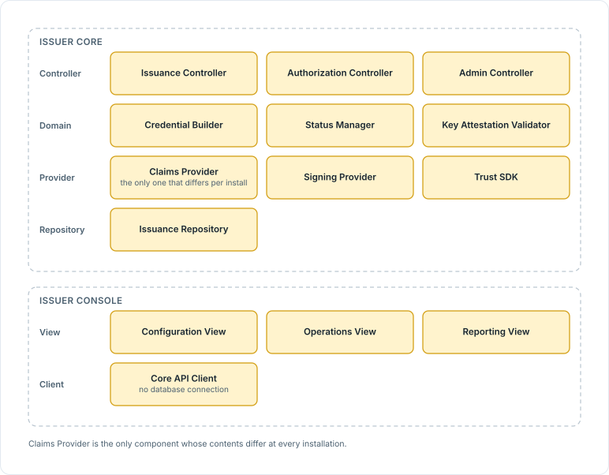
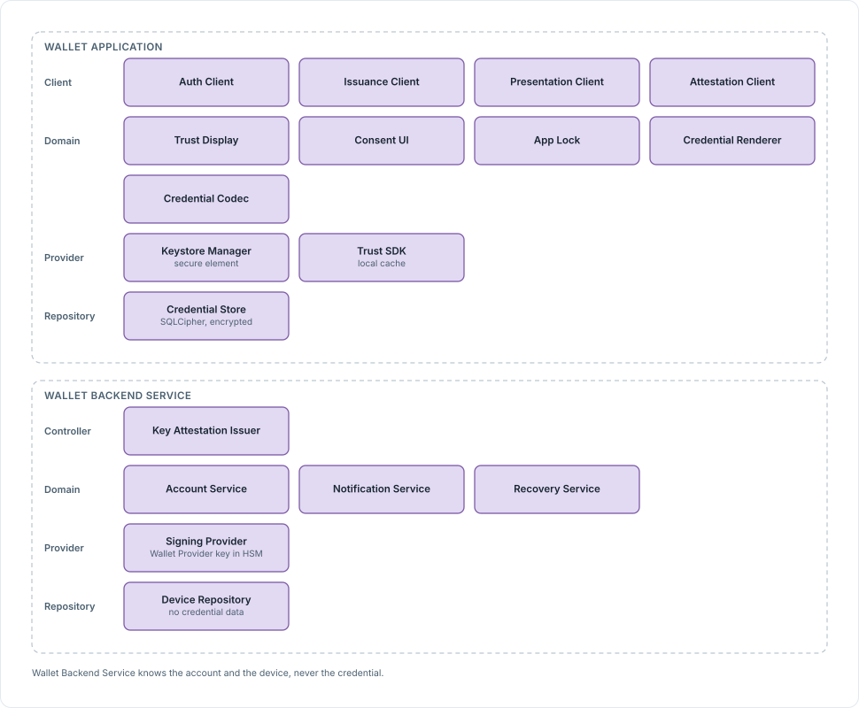
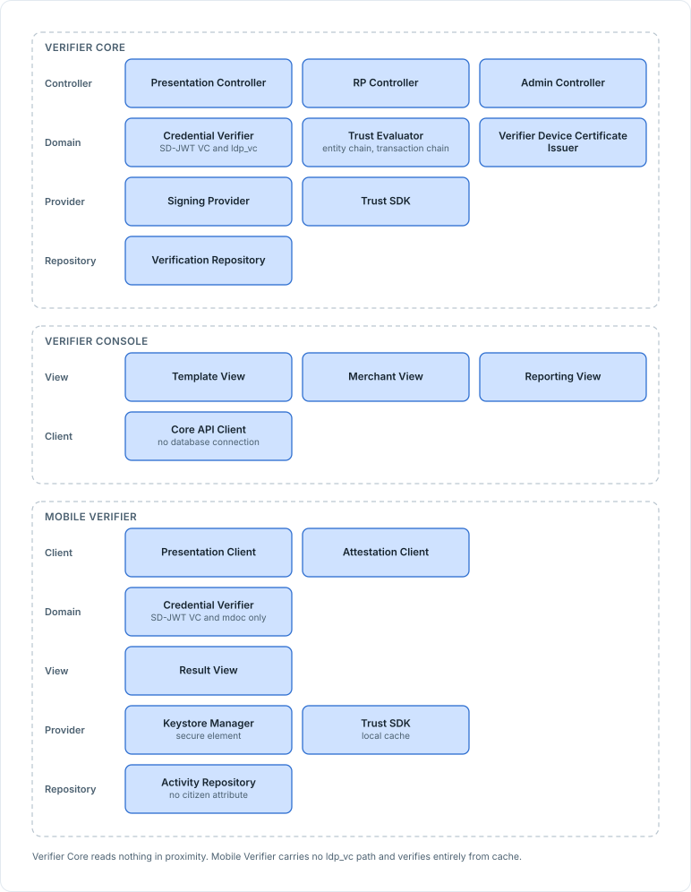
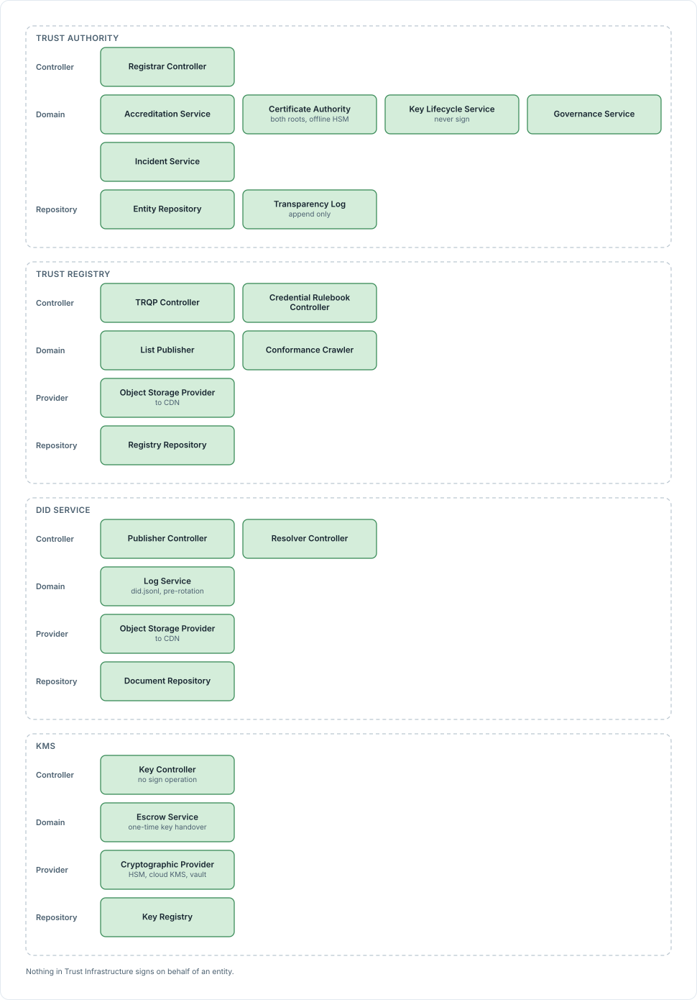
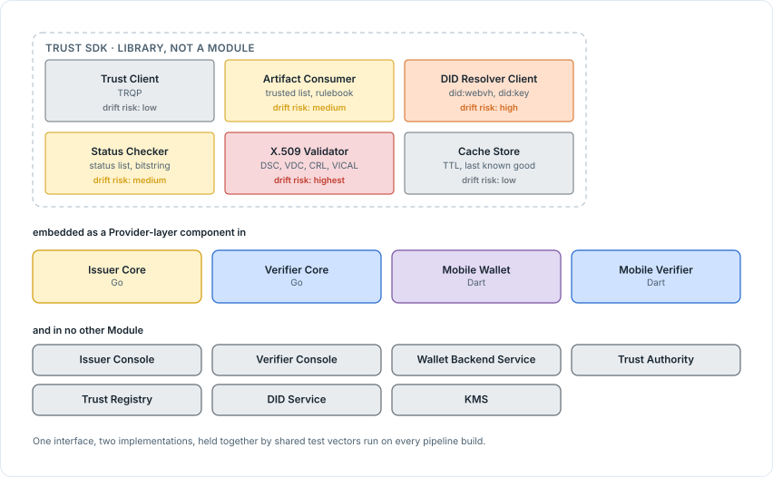

<!-- Sumber: Arsitektur Ekosistem Identitas Digital v0.2, §9 -->

# 2. Components inside a Module

A component is a part of a Module that is not deployed on its own. Where
[Section 3, Module Map](../high-level-architecture/module-map.md) names the
eleven units that ship, this section opens each one and names what is inside.

Every component sits in one of the layers
[Section 1, Layers inside a Module](layers-inside-a-module.md) defines, and the
layer is given for each, because what a component may call depends on which
layer it is in rather than on what it does.

## 2.1 Issuer Services

Every server Module divides into the same four layers: Controller, Domain,
Repository, and Provider. A console or application Module uses a different pair,
Client and View, plus Domain, Provider, or Repository wherever one applies. In
both cases a component is drawn where it is because of what it does, not because
of the layer it happens to sit in: it holds one responsibility, removing it
leaves a functional hole, and the full set of components together covers
everything the Module does.

<figure markdown="1" id="figure-2-1">
  { loading=lazy }
  <figcaption>Figure 2.1 Issuer Core and Issuer Console by layer. Claims Provider sits in the Provider layer because that is where the architecture puts everything facing outward.</figcaption>
</figure>

### 2.1.1 Issuer Core

Issuer Core is where credentials come from. It runs the OpenID4VCI endpoint,
assembles a credential in whichever of the three formats the Credential Rulebook
specifies for that credential type, signs it with the entity's local keystore,
and manages and hosts that entity's status list. Every accredited issuer runs
its own, which is why the count is many.

| Component | Layer | What it does | Standards |
|---|---|---|---|
| Issuance Controller | Controller | Credential offer, `/credential`, nonce, deferred issuance, notification, and the `.well-known` and JWKS metadata | OpenID4VCI 1.0, RFC 8414 |
| Authorization Controller | Controller | Pre-authorized code with `tx_code`, under an attempt limit; authorization code with PKCE | OAuth 2.0, RFC 7636, RFC 9396 |
| Admin Controller | Controller | The internal endpoint for Issuer Console; the only path by which configuration is changed | None |
| Credential Builder | Domain | Assembles SD-JWT VC (salt, disclosure, `cnf`), mdoc (MSO, `valueDigests`, `deviceKey`, `x5chain` in the unprotected header), and VCDM 2.0 `ldp_vc` (JSON-LD, a Data Integrity `proof` in `ecdsa-jcs-2019`, RFC 8785 canonicalization); computes derived attributes as the Credential Rulebook specifies | IETF SD-JWT VC, ISO/IEC 18013-5, W3C VCDM 2.0, VC Data Integrity, ECDSA Cryptosuites v1.0, RFC 8785 |
| Status Manager | Domain | Random index allocation inside a partition, revocation, reissuing the Status List Token and the Bitstring Status List, hosted on the issuer's own domain | IETF Token Status List, W3C Bitstring Status List |
| Key Attestation Validator | Domain | When the Credential Rulebook requires `substantial` or `high`: validates the Key Attestation (the signer is on the trusted list, the nonce matches, it has not expired, the proof key is present in `attested_keys`, `key_storage` meets the `min_assurance` mapping in the Governance Profile). When `low`: an ordinary proof JWT is enough | OpenID4VCI 1.0 App. D.1, F.1, F.3 |
| Claims Provider | Provider | The extension point into the source system, `getClaims(subjectRef, credentialType)`; read-only; returns only the fields listed in the Credential Rulebook; has no notion of credential format; stores no PII. Built from a Source Connector (REST, SOAP, JDBC, CDC), a Mapping Service (normalizes to the Credential Rulebook schema, `data_as_of`), and a Staging Repository (periodic replication only) | JSON Schema |
| Signing Provider | Provider | JWS with the `issuance-jose` key; `COSE_Sign1` with the `issuance-cose` key and the DSC in `x5chain`; the institution's own local keystore | PKCS#11, RFC 7515, RFC 9052 |
| Trust SDK | Provider | Trusted list, Credential Rulebook, DID resolution, TRQP; the library's own contents are in [Section 2.5](#25-trust-sdk) | ETSI TS 119 602, ToIP TRQP v2.0 |
| Issuance Repository | Repository | `issuance_record` (pseudonym, holder key thumbprint, status index, `signing_key_ref`, digest, `holder_key_storage`, `data_as_of`), the status list, deferred requests, a local copy of the Credential Rulebook, the local key registry | None |

The restrictions on Claims Provider are load-bearing rather than incidental. It
is read-only against the source system, so nothing it does can write back into
an institution's own records. It returns only the fields the Credential Rulebook
lists for that credential type, and nothing else the source system might hold.
It stores no PII of its own. And it has no notion of which credential format
Credential Builder will assemble from what it returns, because the mapping to
SD-JWT VC, mdoc, or `ldp_vc` happens one layer up. Those four together are what
let a component whose contents differ at every installation sit inside a Module
whose behavior must not.

### 2.1.2 Issuer Console

Issuer Console is what staff use. Credential types are configured from the
Credential Rulebook here, batches are issued, credentials are revoked, and
reports are read. It reaches Issuer Core through the Admin API and holds no
database connection of its own, so an operator's console session cannot reach
around the API to the data underneath.

Issuer Console's four components cover the three views an operator works in,
plus the client that reaches the Admin Controller.

| Component | Layer | What it does | Standards |
|---|---|---|---|
| Configuration View | View | Selecting a credential type from the Credential Rulebook, display templates, credential configuration | OpenID4VCI credential configuration |
| Operations View | View | Batch issuance, single and bulk revocation, the deferred queue | None |
| Reporting View | View | Issuance reports, status list monitoring, the audit trail | None |
| Core API Client | Client | Calls the Admin Controller. Opens no database connection of its own | None |

## 2.2 Wallet Services

Wallet Services is two Modules: the application on the citizen's phone,
and the backend that vouches for it.

<figure markdown="1" id="figure-2-2">
  { loading=lazy }
  <figcaption>Figure 2.2 The wallet's four layers, and the backend that vouches for it. Nothing in the backend's Repository layer can hold a credential.</figcaption>
</figure>

### 2.2.1 Mobile Wallet

Mobile Wallet is the citizen's. It stores credentials, creates a fresh
credential key for each one, shows who is requesting a presentation and what
they are asking for, and signs presentations both online and in proximity. Every
accredited Wallet Provider publishes one, and each has millions of
installations, which is the count that matters.

Mobile Wallet is an application Module, so its components are Clients and
Domain services over a Provider and a Repository rather than the server layout
above.

| Component | Layer | What it does | Standards |
|---|---|---|---|
| Auth Client | Client | Logs the citizen into CONNECTIDN as a Service Provider; session and token handling; links the account to the device | OpenID Connect Core, PKCE |
| Issuance Client | Client | Receives the credential offer and runs PAR with PKCE and DPoP; selects the proof type according to `proof_types_supported` and `key_attestations_required` in the issuer's metadata | OpenID4VCI 1.0 |
| Presentation Client | Client | Receives the authorization request, parses DCQL, matches credentials, produces the Key Binding JWT, handles engagement and the BLE or NFC session, and both variants of SessionTranscript | OpenID4VP 1.0, ISO/IEC 18013-5 |
| Attestation Client | Client | Registers the instance; exchanges the platform attestation and integrity verdict for a Key Attestation bound to the issuer's nonce. Called only when `key_attestations_required` is present in the issuer's metadata | OpenID4VCI 1.0 App. D.1, Play Integrity, App Attest |
| Trust Display | Domain | For an accredited verifier: resolves the `client_id` did:webvh from cache and checks scope through TRQP. For a merchant: validates the `x5c` or `x5chain` chain up to the Verifier Root CA, confirms the Issuing CA is on the trusted list, matches the certificate hash against `client_id`, and rejects any attribute outside `ReaderAuthRole`. For both: shows the requester's official name before consent | OpenID4VP 1.0 (`decentralized_identifier`, `x509_hash`), did:webvh, ISO/IEC 18013-5, RFC 5280 |
| Consent UI | Domain | Per-request attribute selection, selective disclosure | IETF SD-JWT, ISO/IEC 18013-5 |
| App Lock | Domain | Authenticates the citizen by biometrics, enforces a session timeout, and locks the app in the background; kept separate from the CONNECTIDN login | BiometricPrompt, LocalAuthentication |
| Credential Renderer | Domain | Displays a credential according to the Credential Rulebook's display metadata, with localization | OCA, SD-JWT VC Type Metadata |
| Credential Codec | Domain | Parses and reassembles SD-JWT VC, mdoc, and `ldp_vc`: disclosures, IssuerSigned, DeviceAuth, the Data Integrity proof | IETF SD-JWT VC, ISO/IEC 18013-5, W3C VCDM 2.0, VC Data Integrity |
| Keystore Manager | Provider | The device key, one per device, and each credential key, one per credential, in the secure element; platform attestation; the credential key doubles as `DeviceKey` in the MSO | Android Keystore, iOS Secure Enclave |
| Trust SDK | Provider | Trusted list, status list, and VICAL from local cache; falls back to the last known good copy | ETSI TS 119 602, IETF Token Status List |
| Credential Store | Repository | Encrypted storage for all three formats, an encrypted client-side backup, a local activity history | SQLCipher, Keystore |

### 2.2.2 Wallet Backend Service

Wallet Backend Service proves an installation is genuine. It issues the
daily Key Attestation, binds an installation to its device, holds the CONNECTIDN
account link, sends push notifications, handles recovery when a citizen changes
device, and revokes a device when it must. It stores no credentials at all.
That absence is what lets it disown a wallet without ever being able to read
what the wallet holds.

Wallet Backend Service has six components, and none of them touches a
credential.

| Component | Layer | What it does | Standards |
|---|---|---|---|
| Key Attestation Issuer | Controller | Verifies the platform attestation up to the Google or Apple root and the integrity verdict; issues a Key Attestation carrying `attested_keys`, `key_storage`, `user_authentication`, and `nonce`; rejects a revoked instance | OpenID4VCI 1.0 App. D.1, Android Key Attestation, App Attest, Play Integrity |
| Account Service | Domain | Validates the CONNECTIDN token, links the citizen's account to the device, and forms the basis for recovery | OpenID Connect Core |
| Notification Service | Domain | Pushes the credential offer and notices of revocation or credential updates | None |
| Recovery Service | Domain | Encrypted client-side backup, orchestrating reissuance on a new device, revoking a lost device | None |
| Signing Provider | Provider | Signs the Key Attestation with the Wallet Provider's key in the HSM | PKCS#11, RFC 7515 |
| Device Repository | Repository | The registry of active and revoked devices, device key thumbprints, links to the CONNECTIDN account. Holds no credential data | None |

Device Repository is where holding no credentials stops being a claim and
becomes a schema. It stores the list of active and revoked devices, the device
key thumbprint, and the link to a CONNECTIDN account. There is no column a
credential could go in.

## 2.3 Verifier Services

Verifier Services is three Modules: the Core an accredited verifier runs,
the Console its staff work in, and the application that reads on a device,
carried by a merchant with no server or set on a Relying Party's counter.

<figure markdown="1" id="figure-2-3">
  { loading=lazy }
  <figcaption>Figure 2.3 All three verifying Modules. Verifier Core verifies online formats only, Mobile Verifier reads mdoc in proximity, carries no `ldp_vc` path, and keeps no repository that could hold an attribute.</figcaption>
</figure>

### 2.3.1 Verifier Core

Verifier Core requests credentials over OpenID4VP, verifies both trust chains,
and hands the result to the entity's own Relying Party application over
OpenID Connect or SAML. It also issues the Verifier Device Certificate that
each Mobile Verifier it answers for depends on, a merchant's or its own counter
device, and the CRL that withdraws one early. It reads nothing in proximity; that happens on
[Mobile Verifier](#233-mobile-verifier).

Verifier Core carries nine components: three controllers, three domain
services, two providers, and one repository. The Trust Evaluator row is the
one to read closely, because the two chains it walks are what verification
actually means here.

| Component | Layer | What it does | Standards |
|---|---|---|---|
| Presentation Controller | Controller | Authorization request, DCQL, `request_uri`, accepts `vp_token` through `direct_post.jwt` | OpenID4VP 1.0, RFC 9101 |
| RP Controller | Controller | Bridges OpenID Connect and SAML to the entity's Relying Party application; forwards attributes without storing them | OpenID Connect Core, SAML 2.0 |
| Admin Controller | Controller | Internal endpoint for Verifier Console | None |
| Credential Verifier | Domain | Verifies SD-JWT VC (signature, KB-JWT, disclosures) and `ldp_vc` (Data Integrity proof on the credential and the VP, `challenge` and `domain`). An mdoc is read in proximity, so Mobile Verifier verifies it | RFC 9901, W3C VCDM 2.0, VC Data Integrity |
| Trust Evaluator | Domain | Walks the entity chain E1 to E5 and the transaction chain T1 to T6; enforces accreditation scope and minimization; policy written as Rego | ToIP TRQP, ETSI TS 119 602, IETF Token Status List, OPA/Rego |
| Verifier Device Certificate Issuer | Domain | Onboards each Mobile Verifier device it answers for: a merchant's, after verifying the business's identity, or the entity's own counter device. Binds the device, checks application integrity; issues the Verifier Device Certificate with its ReaderAuthRole, for a lifetime the Governance Profile sets; issues the CRL; rejects revoked devices. Online, an accredited verifier still introduces itself through its DID | OpenID4VP client identifier, ISO/IEC 18013-5 |
| Signing Provider | Provider | Signs the Request Object and the Verifier Device Certificate through the Verifier Issuing CA; decrypts responses; keeps the operator's keystore local | PKCS#11, RFC 7515, RFC 7516 |
| Trust SDK | Provider | Trusted list, DID resolution, status list, CRL | ETSI TS 119 602, ToIP TRQP |
| Verification Repository | Repository | `verification_record` (txId, requested attributes, outcome, `trust_list_version`, `vp_digest`, consent receipt), `request_template`, `client_app`, and each merchant's `verifier_instance` | ISO/IEC 29184 |

### 2.3.2 Verifier Console

Verifier Console is the operator's side of that: request templates, merchant
onboarding and each merchant's `allowed_attrs`, revocation of a merchant's
device, the consent receipt archive, and reports. Like Issuer Console it reaches
its Core only through the Admin API.

Verifier Console's four components carry out the operator tasks named above:
template design, merchant management, reporting, and nothing that touches
Verifier Core's database directly.

| Component | Layer | What it does | Standards |
|---|---|---|---|
| Template View | View | Defines request templates with their attributes and purpose, validated against the entity's accreditation scope | OpenID4VP DCQL |
| Merchant View | View | Merchant onboarding, setting each merchant's `allowed_attrs`, device revocation, instance inventory | None |
| Reporting View | View | Consent receipt archive, verification reports | None |
| Core API Client | Client | Calls the Admin Controller. Opens no database connection of its own | None |

### 2.3.3 Mobile Verifier

Mobile Verifier verifies without running a server at all, for a merchant or at a Relying Party's counter.
Keys stay on the device, the result appears on the screen, and there is no web
version, because a browser cannot hold the keys this design requires. It
supports `dc+sd-jwt` and `mso_mdoc` and not `ldp_vc`, for the reasons set out in
[Section 1.5, Which format each role verifies](../data-model-and-protocols/credential-formats.md#15-which-format-each-role-verifies).

Mobile Verifier's Credential Verifier carries the restriction already
named above at the code level: it verifies SD-JWT VC and mdoc, and nothing
verifies `ldp_vc` on this Module. It works from cache rather than reaching
Trust Infrastructure at the moment of verification, checking both trust
chains against whatever the Trust SDK component last downloaded. The
Activity Repository keeps the record of that work on the device, but the
record is the verification itself, not the citizen: it holds no attribute
belonging to the person whose credential was checked.

| Component | Layer | What it does | Standards |
|---|---|---|---|
| Presentation Client | Client | Assembles the request, QR or deeplink, reads an mdoc over BLE or NFC, ReaderAuth with the Verifier Device Certificate | OpenID4VP 1.0, ISO/IEC 18013-5 |
| Attestation Client | Client | Registers the device with the Verifier Core that answers for it (the RP Intermediary's for a merchant, the Relying Party's own for a counter device), retrieves and renews the Verifier Device Certificate | OpenID4VP client identifier |
| Credential Verifier | Domain | Verifies SD-JWT VC and mdoc only, not `ldp_vc`, both trust chains, from cache | RFC 9901, ISO/IEC 18013-5 |
| Result View | View | Shows the verification result to the merchant on screen | None |
| Keystore Manager | Provider | Device key in the secure element; signs the Request Object and decrypts the response on the device | Android Keystore, iOS Secure Enclave |
| Trust SDK | Provider | Trusted list, status list, VICAL from the local cache | ETSI TS 119 602 |
| Activity Repository | Repository | Verification history on the device; holds no citizen attribute | None |

## 2.4 Trust Infrastructure

Trust Infrastructure is four Modules. Only the first has a human at the
controls; the other three carry out what it decides and publish the result.

<figure markdown="1" id="figure-2-4">
  { loading=lazy }
  <figcaption>Figure 2.4 The control plane in full. The Certificate Authority and KMS are the two places a key is created, and neither of them signs on an entity's behalf.</figcaption>
</figure>

### 2.4.1 Trust Authority

Trust Authority is where registration, accreditation, and authorization
happen. It acts as the Certificate Authority for the
Issuer Root CA, the Verifier Root CA, Document Signer Certificates, the Verifier
Issuing CA, and the CRL; it sends key lifecycle commands to KMS; and it holds
the governance registry, incident handling, and the transparency log. Its HSM is
offline.

Its eight components divide into one controller, five domain services, and two
repositories.

| Component | Layer | What it does | Standards |
|---|---|---|---|
| Registrar Controller | Controller | Self-service entity portal (`/entities`, `/entities/me/*`), operator back office with MFA | None |
| Accreditation Service | Domain | Registration, verification of legal-entity status, intake of assessment-body reports, status decisions, issuance of the Authority Statement and the Accreditation Credential; pathways A, B, and C | ToIP TRQP, IETF SD-JWT VC |
| Certificate Authority | Domain | Issuer Root CA and Verifier Root CA, each self-signed in its own offline HSM; issues the Document Signer Certificate (EKU 1.0.18013.5.1.2) and the Verifier Issuing CA from a CSR; issues and hosts the CRL | ISO/IEC 18013-5 Annex B, RFC 5280, RFC 2986 |
| Key Lifecycle Service | Domain | `createKey`, `rotate`, `revoke` sent to KMS. Never `sign` | PKCS#11, KMIP |
| Governance Service | Domain | List of `action` and `resource`, mapping of `issuer_assurance` and `min_assurance` to ISO/IEC 18045 values, cache TTL, tolerance limits, list of Assessment Bodies | None |
| Incident Service | Domain | Freezes an entity, revokes it, issues an emergency trusted list, notifies verifiers directly | None |
| Entity Repository | Repository | Entity data, status, accreditation and authorization history | None |
| Transparency Log | Repository | Append-only, entity events only, no citizen transaction | RFC 6962 / RFC 9162 |

### 2.4.2 Trust Registry

Trust Registry answers TRQP queries for `authorization` and `recognition`,
publishes the trusted list as LoTE JSON along with VICAL, stores the Credential
Rulebook, and runs the conformance crawler. Everything it publishes goes out
through a CDN as a static file, which is how it stays off the transaction path.

Trust Registry's six components are what stands behind the static files it
publishes: two controllers answer queries, two domain services build what
gets published, one provider pushes it to the CDN, and one repository holds
the Authority Statements the rest of it is derived from.

| Component | Layer | What it does | Standards |
|---|---|---|---|
| TRQP Controller | Controller | `POST /authorization`, `POST /recognition`, `/.well-known/trqp-configuration`; errors as Problem Details | ToIP TRQP v2.0, RFC 7807 |
| Credential Rulebook Controller | Controller | `GET /rulebooks`, `GET /rulebooks/{id}`; schema, display, minimization, `min_assurance`; each version frozen once published | JSON Schema, OCA, SD-JWT VC Type Metadata |
| List Publisher | Domain | LoTE JSON, VICAL, JSON-LD Context; status with history (`StatusStartingTime`, `NextUpdate`) | ETSI TS 119 602, ISO/IEC 18013-5 Annex C |
| Conformance Crawler | Domain | Compares an issuer's `.well-known` and a verifier's metadata against its approved scope; findings go to Incident Service | None |
| Object Storage Provider | Provider | Publishes static artifacts to the CDN with refresh jitter | None |
| Registry Repository | Repository | Authority Statement with its status history | None |

### 2.4.3 DID Service

DID Service issues and resolves `did:webvh` identifiers for entities,
including each entity's key history, and publishes through the same CDN.

DID Service's five components issue and resolve `did:webvh`, the entity
identifier fixed by
[Principle 3, Finished specifications only](../high-level-architecture/index.md#3-finished-specifications-only).

| Component | Layer | What it does | Standards |
|---|---|---|---|
| Publisher Controller | Controller | Receives a public key from KMS or from an entity, together with proof of possession | W3C DID Core |
| Resolver Controller | Controller | Replays the `did:webvh` log and verifies the chain; decodes `did:key` locally | did:webvh, W3C DID Resolution |
| Log Service | Domain | Assembles and signs `did.jsonl` entries; pre-rotation `nextKeyHashes`; two active keys during a transition; the old key stays in `verificationMethod` but drops out of `assertionMethod` | did:webvh |
| Object Storage Provider | Provider | Publishes to the CDN and to the entity's own domain | None |
| Document Repository | Repository | Log, versions, validity range | None |

### 2.4.4 KMS

KMS generates, rotates, and revokes entity keys, hands over an encrypted
private key exactly once, and creates CSRs. It has no sign operation. Nothing in
the ecosystem can ask KMS to sign something, which means a compromise of KMS
cannot produce a signature.

KMS's four components carry out the lifecycle commands Key Lifecycle Service
sends it, and nothing beyond that. When a private key does have to leave
KMS, Escrow Service is the only path: it encrypts the key once, the
link to collect it expires within minutes, and the key material is zeroized
afterward, so the same key cannot be handed over twice.

| Component | Layer | What it does | Standards |
|---|---|---|---|
| Key Controller | Controller | `createKey`, `rotate`, `revoke`, `listKeys`. No `sign` operation | PKCS#11, KMIP |
| Escrow Service | Domain | One-time private-key encryption (JWE PBES2-HS512+A256KW, Argon2id), collection link expires within minutes, zeroizes after use; issues a CSR from the `issuance-cose` key; tags `keyOrigin`, `keyStorage`, `purpose` | RFC 9106, RFC 2986 |
| Cryptographic Provider | Provider | Storage driver for pkcs11, a cloud KMS, or a vault; the root key and both CA roots sit in separate profiles | PKCS#11, KMIP |
| Key Registry | Repository | `keyRef`, provider, `keyType`, owner, status, `keyOrigin`, `keyStorage`, `purpose`, validity period | None |

## 2.5 Trust SDK

Trust SDK is not on the Module list in the table at the top of this page,
and [Section 3.2](../high-level-architecture/module-map.md#32-what-is-not-a-module) already says why: it does not
ship as its own container image. It exists in two implementations instead,
Go for Issuer Core and Verifier Core, Dart for Mobile Wallet and
Mobile Verifier, embedded in each as a Provider-layer component. Neither
Console carries it, Wallet Backend Service does not carry it, and no Module
inside Trust Infrastructure carries it either: the
four Modules that read published trust artifacts are the only four that
need to resolve them.

Both implementations expose the same interface: `checkAuthorization`,
`checkRecognition`, `resolveDID`, `getTrustedList`, `getRulebook`,
`verifyX509Chain`, `checkStatus`. Behind that interface are six parts, each
carrying its own risk that the Go and Dart versions drift apart.

| Part | What it does | Go-Dart duplication risk | Standards |
|---|---|---|---|
| Trust Client | `checkAuthorization` and `checkRecognition` against TRQP | Low | ToIP TRQP v2.0 |
| Artifact Consumer | Downloads, verifies the JWS, validates the trusted list and the Credential Rulebook | Medium | ETSI TS 119 602, RFC 7515 |
| DID Resolver Client | Resolves `did:webvh` (replays the log, verifies the hash chain, checks `proof`, handles pre-rotation) and decodes `did:key` | High | did:webvh |
| Status Checker | Status List Token and Bitstring Status List: downloads, verifies, decompresses, checks the bit | Medium | IETF Token Status List, W3C Bitstring Status List |
| X.509 Validator | Chains the Document Signer Certificate to the Issuer Root CA and the Verifier Device Certificate to the Verifier Root CA, against the CRL and VICAL. On Dart it calls the platform's own validator, `CertPathValidator` on Android and the Security framework on iOS, rather than a version written from scratch | Highest | RFC 5280, ISO/IEC 18013-5 Annex B and C |
| Cache Store | Redis on the server, an encrypted file on the device; TTL set by the Governance Framework; last-known-good held until the tolerance limit; signature checked again on every read | Low | None |

The X.509 Validator carries the highest risk of the six, which is why both
implementations lean on a platform validator rather than reimplementing
chain validation independently in two languages. Three requirements hold the pair together regardless: a shared
set of test vectors, including malicious cases, runs against both SDKs on
every pipeline run; a change to verification logic is written into the
Governance Profile before either implementation changes; and each
implementation stays compatible with at least the two previous major
versions.

<figure markdown="1" id="figure-2-5">
  { loading=lazy }
  <figcaption>Figure 2.5 Six parts, two implementations, four Modules. The two parts marked highest risk are where a Go and a Dart implementation are most likely to disagree, which is why both defer to a platform validator for X.509.</figcaption>
</figure>

