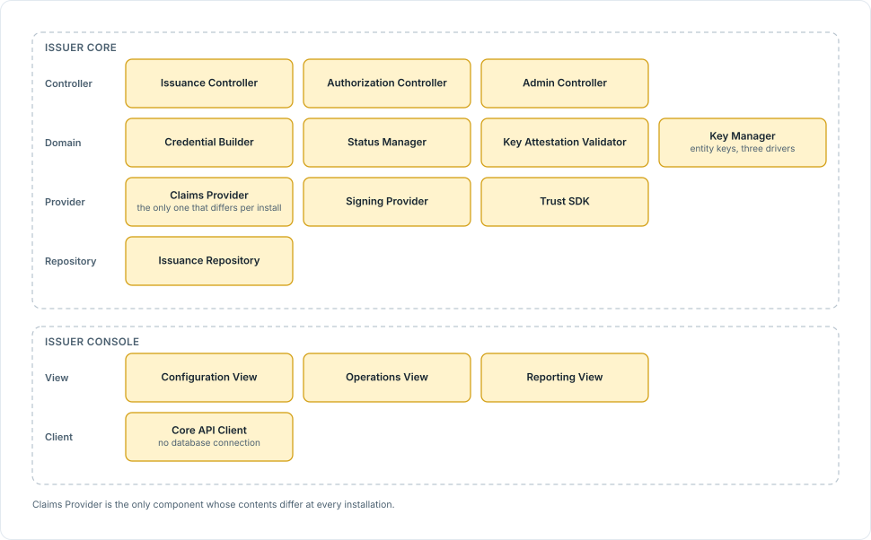
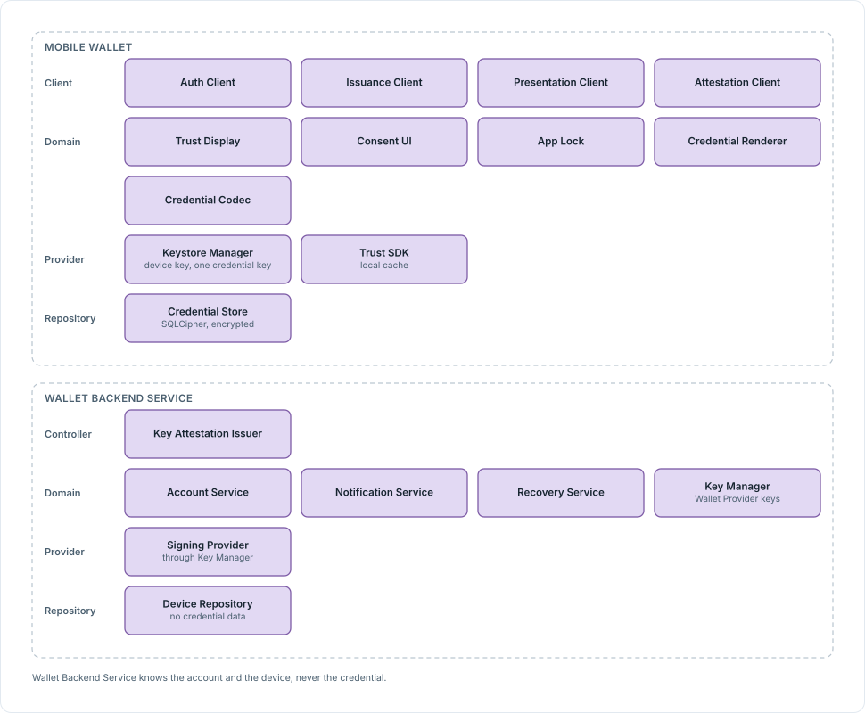
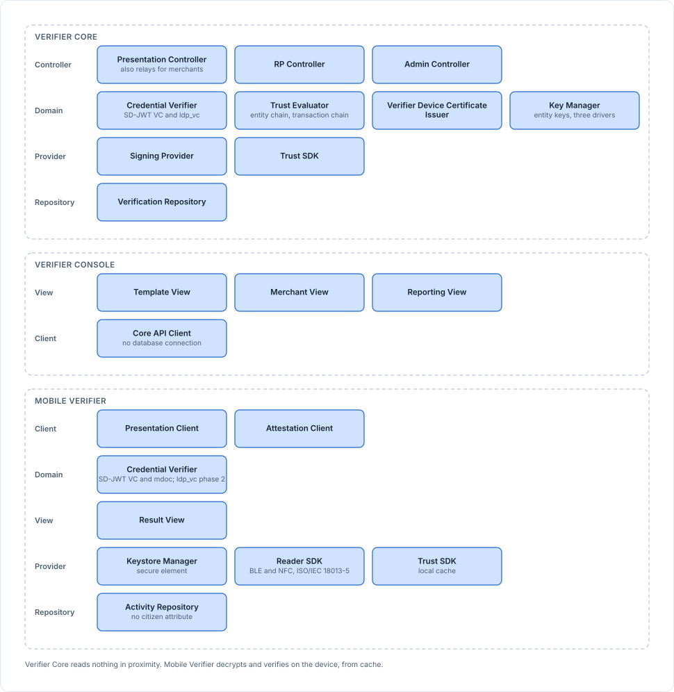
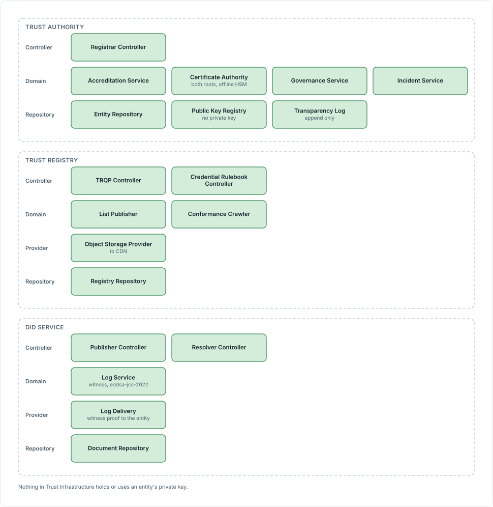
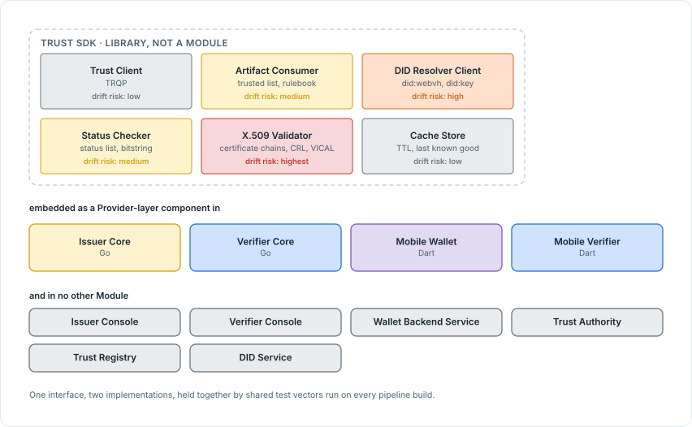

<!-- Sumber: Arsitektur Ekosistem Identitas Digital v0.2, §9, Kep. 5, 9, 28, 29, 30 -->

# Components inside a Module {#components-inside-a-module}

A component is a part of a Module that is not deployed on its own. Where
[Module Map](../high-level-architecture/module-map.md) names the
ten units that ship, this section opens each one and names what is inside.

Every component sits in one of the layers
[Layers inside a Module](layers-inside-a-module.md) defines, and the
layer is given for each, because what a component may call depends on which
layer it is in rather than on what it does.

## Issuer Services {#sa-issuer-services}

Every server Module divides into the same four layers: Controller, Domain,
Repository, and Provider. A console or application Module uses a different pair,
Client and View, plus Domain, Provider, or Repository wherever one applies. In
both cases a component is drawn where it is because of what it does, not because
of the layer it happens to sit in: it holds one responsibility, removing it
leaves a functional hole, and the full set of components together covers
everything the Module does. Claims Provider is the clearest case: it faces the
source system outside the Module, and the Provider layer is where everything
facing outward goes.

{ #fig-issuer-services-components }

<figure markdown="1">
  { loading=lazy }
  <figcaption> Issuer Core and Issuer Console by layer.</figcaption>
</figure>

### Issuer Core {#sa-issuer-core}

Issuer Core is where credentials come from. It runs the OpenID4VCI endpoint,
assembles a credential in whichever of the three formats the Credential Rulebook
specifies for that credential type, signs it through the entity's Key Manager,
and manages and hosts that entity's status list. Every accredited issuer runs
its own, which is why the count is many.

<figure markdown="1" class="ekdn-table">

| Component | Layer | What it does | Standards |
|---|---|---|---|
| Issuance Controller | Controller | Credential offer, `/credential`, nonce, deferred issuance, notification, and the `.well-known` and JWKS metadata | OpenID4VCI 1.0, RFC 8414 |
| Authorization Controller | Controller | Pre-authorized code with `tx_code`, under an attempt limit; authorization code with PKCE | OAuth 2.0, RFC 7636, RFC 9396 |
| Admin Controller | Controller | The internal endpoint for Issuer Console; the only path by which configuration is changed | None |
| Credential Builder | Domain | Assembles SD-JWT VC (salt, disclosure, `cnf`), mdoc (MSO, `valueDigests`, `deviceKey`, `x5chain` in the unprotected header), and VCDM 2.0 `ldp_vc` (JSON-LD, a Data Integrity `proof` in `ecdsa-jcs-2019`, RFC 8785 canonicalization); computes derived attributes as the Credential Rulebook specifies | IETF SD-JWT VC, ISO/IEC 18013-5, W3C VCDM 2.0, VC Data Integrity, ECDSA Cryptosuites v1.0, RFC 8785 |
| Status Manager | Domain | Random index allocation inside a partition, revocation, reissuing the Status List Token and the Bitstring Status List, hosted on the issuer's own domain | IETF Token Status List, W3C Bitstring Status List |
| Key Attestation Validator | Domain | When the Credential Rulebook requires `substantial` or `high`: validates the Key Attestation (the signer is on the trusted list, the nonce matches, it has not expired, the proof key is present in `attested_keys`, `key_storage` meets the `min_assurance` mapping in the Governance Profile). When `low`: an ordinary proof JWT is enough | OpenID4VCI 1.0 App. D.1, F.1, F.3 |
| Claims Provider | Provider | The extension point into the source system, `getClaims(subjectRef, credentialType)`; read-only; returns only the fields listed in the Credential Rulebook; has no notion of credential format; stores no PII. Built from a Source Connector (REST, SOAP, JDBC, CDC), a Mapping Service (normalizes to the Credential Rulebook schema, `data_as_of`), and a Staging Repository (periodic replication only) | JSON Schema |
| Key Manager | Domain | Generates, stores, and rotates `issuance-jose`, `issuance-cose`, `status-list`, and the Ed25519 `did:webvh` update key through a driver: an encrypted software keystore by default, `cloudkms`, or `pkcs11`; registers each public key with Trust Authority (a `did.jsonl` entry, proof of possession, `keyStorage`, and a CSR); scheduled rotation; publishes `did.jsonl` | did:webvh v1.0, `eddsa-jcs-2022`, RFC 2986, PKCS#11 |
| Signing Provider | Provider | JWS with the `issuance-jose` key (also the Data Integrity proof of `ldp_vc`); `COSE_Sign1` with the `issuance-cose` key and the DSC in `x5chain`; the Status List Token and the Bitstring Status List with the `status-list` key; through Key Manager | PKCS#11, RFC 7515, RFC 9052 |
| Trust SDK | Provider | Trusted list, Credential Rulebook, DID resolution, TRQP; the library's own contents are in [Trust SDK][sa-trust-sdk] | ETSI TS 119 602, ToIP TRQP v2.0 |
| Issuance Repository | Repository | `issuance_record` (pseudonym, holder key thumbprint, status index, `signing_key_ref`, digest, `holder_key_storage`, `data_as_of`), the status list, deferred requests, a local copy of the Credential Rulebook | None |

</figure>

The restrictions on Claims Provider are load-bearing rather than incidental. It
is read-only against the source system, so nothing it does can write back into
an institution's own records. It returns only the fields the Credential
Rulebook lists for that credential type, and nothing else the source system
might hold. It stores no personally identifiable information (PII) of its own.
And it has no notion of which credential format Credential Builder will
assemble from what it returns, because the mapping to SD-JWT VC, mdoc, or
`ldp_vc` happens one layer up. Those four together are what let a component
whose contents differ at every installation sit inside a Module whose behavior
must not.

### Issuer Console {#sa-issuer-console}

Issuer Console is what staff use. Credential types are configured from the
Credential Rulebook here, batches are issued, credentials are revoked, and
reports are read. It reaches Issuer Core through the Admin API and holds no
database connection of its own, so an operator's console session cannot reach
around the API to the data underneath.

Issuer Console's four components cover the three views an operator works in,
plus the client that reaches the Admin Controller.

<figure markdown="1" class="ekdn-table">

| Component | Layer | What it does | Standards |
|---|---|---|---|
| Configuration View | View | Selecting a credential type from the Credential Rulebook, display templates, credential configuration | OpenID4VCI credential configuration |
| Operations View | View | Batch issuance, single and bulk revocation, the deferred queue | None |
| Reporting View | View | Issuance reports, status list monitoring, the audit trail | None |
| Core API Client | Client | Calls the Admin Controller. Opens no database connection of its own | None |

</figure>

## Wallet Services {#sa-wallet-services}

Wallet Services is two Modules: the application on the citizen's phone,
and the backend that vouches for it.

{ #fig-wallet-services-components }

<figure markdown="1">
  { loading=lazy }
  <figcaption> The wallet's four layers, and the backend that vouches for it.</figcaption>
</figure>

### Mobile Wallet {#sa-mobile-wallet}

Mobile Wallet is the citizen's. It stores credentials, holds one
credential key that binds all of them, shows who is requesting a presentation and what
they are asking for, and signs presentations both online and in proximity. Every
accredited Wallet Provider publishes one, and each has millions of
installations, which is the count that matters.

Mobile Wallet is an application Module, so its components are Clients and
Domain services over a Provider and a Repository rather than the server layout
above.

<figure markdown="1" class="ekdn-table">

| Component | Layer | What it does | Standards |
|---|---|---|---|
| Auth Client | Client | Logs the citizen into CONNECTIDN as a Service Provider; session and token handling; links the account to the device | OpenID Connect Core, PKCE |
| Issuance Client | Client | Receives the credential offer and runs PAR with PKCE and DPoP; selects the proof type according to `proof_types_supported` and `key_attestations_required` in the issuer's metadata | OpenID4VCI 1.0 |
| Presentation Client | Client | Receives the authorization request, parses DCQL, matches credentials, produces the Key Binding JWT, handles engagement and the BLE or NFC session, and both variants of SessionTranscript | OpenID4VP 1.0, ISO/IEC 18013-5 |
| Attestation Client | Client | Registers the instance; exchanges the platform attestation and integrity verdict for a Key Attestation bound to the issuer's nonce. Called only when `key_attestations_required` is present in the issuer's metadata | OpenID4VCI 1.0 App. D.1, Play Integrity, App Attest |
| Trust Display | Domain | For an accredited verifier: resolves the `client_id` did:webvh from cache and checks scope through TRQP. For a merchant: validates the `x5c` or `x5chain` chain up to the Verifier Root CA, confirms the Issuing CA is on the trusted list, matches the certificate hash against `client_id`, and rejects any attribute outside `ReaderAuthRole`. For both: checks the Use Statement, in `verifier_info` online or `requestInfo` offline, and takes the displayed purpose from it, warning the citizen where none is present during the transition; shows the requester's official name and that purpose before consent | OpenID4VP 1.0 (`decentralized_identifier`, `x509_hash`, `verifier_info`), did:webvh, ISO/IEC 18013-5, RFC 5280 |
| Consent UI | Domain | Per-request attribute selection, selective disclosure | IETF SD-JWT, ISO/IEC 18013-5 |
| App Lock | Domain | Authenticates the citizen by biometrics, enforces a session timeout, and locks the app in the background; kept separate from the CONNECTIDN login | BiometricPrompt, LocalAuthentication |
| Credential Renderer | Domain | Displays a credential according to the Credential Rulebook's display metadata, with localization | OCA, SD-JWT VC Type Metadata |
| Credential Codec | Domain | Parses and reassembles SD-JWT VC, mdoc, and `ldp_vc`: disclosures, IssuerSigned, DeviceAuth, the Data Integrity proof | IETF SD-JWT VC, ISO/IEC 18013-5, W3C VCDM 2.0, VC Data Integrity |
| Keystore Manager | Provider | The device key, one per installation, and the credential key, one per installation and shared by every credential (a temporary decision), in the secure element; platform attestation; the credential key doubles as `DeviceKey` in the MSO | Android Keystore, iOS Secure Enclave |
| Trust SDK | Provider | Trusted list, status list, and VICAL from local cache; the status list and VICAL fall back to the last-known-good copy, the trusted list never does | ETSI TS 119 602, IETF Token Status List |
| Credential Store | Repository | Encrypted storage for all three formats, an encrypted client-side backup, a local presentation history holding each signed request, its Use Statement, the outcome, and the time | SQLCipher, Keystore |

</figure>

### Wallet Backend Service {#sa-wallet-backend-service}

Wallet Backend Service proves an installation is genuine. It issues the
daily Key Attestation, binds an installation to its device, holds the CONNECTIDN
account link, sends push notifications, handles recovery when a citizen changes
device, and revokes a device when it must. It stores no credentials at all.
That absence is what lets it disown a wallet without ever being able to read
what the wallet holds.

Wallet Backend Service has seven components, and none of them touches a
credential.

<figure markdown="1" class="ekdn-table">

| Component | Layer | What it does | Standards |
|---|---|---|---|
| Key Attestation Issuer | Controller | Verifies the platform attestation up to the Google or Apple root and the integrity verdict; issues a Key Attestation carrying `attested_keys`, `key_storage`, `user_authentication`, and `nonce`; rejects a revoked instance | OpenID4VCI 1.0 App. D.1, Android Key Attestation, App Attest, Play Integrity |
| Account Service | Domain | Validates the CONNECTIDN token, links the citizen's account to the device, and forms the basis for recovery | OpenID Connect Core |
| Notification Service | Domain | Pushes the credential offer and notices of revocation or credential updates | None |
| Recovery Service | Domain | Encrypted client-side backup, orchestrating reissuance on a new device, revoking a lost device | None |
| Key Manager | Domain | Generates, stores, and rotates the Wallet Provider's Key Attestation key (P-256) and its Ed25519 `did:webvh` update key through a driver, and registers them with Trust Authority | did:webvh v1.0, `eddsa-jcs-2022`, PKCS#11 |
| Signing Provider | Provider | Signs the Key Attestation with the Wallet Provider's key, through Key Manager | PKCS#11, RFC 7515 |
| Device Repository | Repository | The registry of active and revoked devices, device key thumbprints, links to the CONNECTIDN account. Holds no credential data | None |

</figure>

Device Repository is where holding no credentials stops being a claim and
becomes a schema. It stores the list of active and revoked devices, the device
key thumbprint, and the link to a CONNECTIDN account. There is no column a
credential could go in.

## Verifier Services {#sa-verifier-services}

Verifier Services is three Modules: the Core an accredited verifier runs,
the Console its staff work in, and the application that reads on a device,
carried by a merchant with no server or set on a Relying Party's counter.

{ #fig-verifier-services-components }

<figure markdown="1">
  { loading=lazy }
  <figcaption> All three verifying Modules.</figcaption>
</figure>

### Verifier Core {#sa-verifier-core}

Verifier Core requests credentials over OpenID4VP, verifies both trust chains,
and hands the result to the entity's own Relying Party application over OpenID
Connect or Security Assertion Markup Language (SAML). It is a backend only;
whatever front end sits before it belongs to the Relying Party. It also issues
the Verifier Device Certificate that each reader device it answers for depends
on, a merchant's or its own counter device, from its own Verifier Issuing CA,
and the certificate revocation list (CRL) that withdraws one early. For a
merchant, it also holds the signed request and the encrypted response of an
online check in transit, without opening them. It reads nothing in proximity;
that happens on the device, in [Mobile Verifier][sa-mobile-verifier] or in a
Relying Party's own app built on the Reader SDK.

Verifier Core carries ten components: three controllers, four domain
services, two providers, and one repository. The Trust Evaluator row is the
one to read closely, because the two chains it walks are what verification
actually means here.

<figure markdown="1" class="ekdn-table">

| Component | Layer | What it does | Standards |
|---|---|---|---|
| Presentation Controller | Controller | Authorization request, DCQL, `request_uri`, accepts `vp_token` through `direct_post.jwt`; attaches the Use Statement of the template's registered use in `verifier_info`; also serves as the relayed `request_uri` and `response_uri` for a merchant's Mobile Verifier (ciphertext only, short lifetime, never opened) | OpenID4VP 1.0, RFC 9101 |
| RP Controller | Controller | Bridges OpenID Connect and SAML to the entity's Relying Party application; forwards attributes without storing them | OpenID Connect Core, SAML 2.0 |
| Admin Controller | Controller | Internal endpoint for Verifier Console | None |
| Credential Verifier | Domain | Verifies SD-JWT VC (signature, KB-JWT, disclosures) and `ldp_vc` (Data Integrity proof on the credential and the VP, `challenge` and `domain`). An mdoc is read in proximity, so the reader on the device verifies it, through the Reader SDK | RFC 9901, W3C VCDM 2.0, VC Data Integrity |
| Trust Evaluator | Domain | Walks the entity chain E1 to E5 and the transaction chain T1 to T6; enforces accreditation scope and minimization; policy written as Rego | ToIP TRQP, ETSI TS 119 602, IETF Token Status List, OPA/Rego |
| Verifier Device Certificate Issuer | Domain | Onboards each reader device it answers for: used by a Relying Party for its own devices, for offline reading, and by an RP Intermediary for its merchants, after verifying the business's identity. Binds the device, checks application integrity; issues the Verifier Device Certificate with its ReaderAuthRole, a subset of the Use Statement handed over with it, from this Verifier Core's own Verifier Issuing CA, for a lifetime the Governance Profile sets; issues the CRL; rejects revoked devices. Online, an accredited verifier still introduces itself through its DID | OpenID4VP client identifier, ISO/IEC 18013-5 |
| Key Manager | Domain | Generates, stores, and rotates the Request Object key, the response encryption key, the Verifier Issuing CA key, and the Ed25519 `did:webvh` update key through a driver: an encrypted software keystore by default, `cloudkms`, or `pkcs11`; registers each public key with Trust Authority (a `did.jsonl` entry, proof of possession, `keyStorage`, and a CSR) | did:webvh v1.0, `eddsa-jcs-2022`, RFC 2986, PKCS#11 |
| Signing Provider | Provider | Signs the Request Object and, through the Verifier Issuing CA, the Verifier Device Certificate; decrypts responses; through Key Manager | PKCS#11, RFC 7515, RFC 7516 |
| Trust SDK | Provider | Trusted list, DID resolution, status list, CRL | ETSI TS 119 602, ToIP TRQP |
| Verification Repository | Repository | `verification_record` (txId, requested attributes, outcome, `use_id`, `trust_list_version`, `vp_digest`, consent receipt), `request_template` with the `use_id` it names, `use_statement`, `client_app`, and each merchant's `verifier_instance` | ISO/IEC 29184 |

</figure>

### Verifier Console {#sa-verifier-console}

Verifier Console is the operator's side of that: request templates, merchant
onboarding and each merchant's `allowed_attrs`, revocation of a merchant's
device, the consent receipt archive, and reports. Like Issuer Console it reaches
its Core only through the Admin API.

Verifier Console's four components carry out the operator tasks named above:
template design, merchant management, reporting, and nothing that touches
Verifier Core's database directly.

<figure markdown="1" class="ekdn-table">

| Component | Layer | What it does | Standards |
|---|---|---|---|
| Template View | View | Defines request templates with their attributes and purpose; each names one registered use and is validated against that Use Statement | OpenID4VP DCQL |
| Merchant View | View | Merchant onboarding, setting each merchant's `allowed_attrs`, device revocation, instance inventory | None |
| Reporting View | View | Consent receipt archive, verification reports | None |
| Core API Client | Client | Calls the Admin Controller. Opens no database connection of its own | None |

</figure>

### Mobile Verifier {#sa-mobile-verifier}

Mobile Verifier is the official verifier app for merchants, and it also runs at
a Relying Party's counter. It decrypts and verifies on the device: online, a
merchant's request and response pass through the RP Intermediary's Verifier
Core, which only relays them. Keys stay on the device, the result appears on the
screen, and there is no web version, because a browser cannot hold the keys
this design requires. It supports `dc+sd-jwt`, `mso_mdoc` and `ldp_vc`, as
[which format each role verifies][which-format-each-role-verifies]
sets out.

Its proximity reading lives in the Reader SDK, a Dart library that used to be a
proximity-reading component inside Verifier Core. Reading over Bluetooth Low
Energy (BLE) and Near Field Communication (NFC) has to happen on a physical
device, so the library is embedded here, and a Relying Party may embed the same
library in its own app instead of running Mobile Verifier.

Mobile Verifier's Credential Verifier carries the phase 1 restriction at the
code level: it verifies SD-JWT VC and mdoc, and nothing verifies `ldp_vc` on
this Module yet. It works from cache rather than reaching
Trust Infrastructure at the moment of verification, checking both trust
chains against whatever the Trust SDK component last downloaded. The
Activity Repository keeps the record of that work on the device, but the
record is the verification itself, not the citizen: it holds no attribute
belonging to the person whose credential was checked.

<figure markdown="1" class="ekdn-table">

| Component | Layer | What it does | Standards |
|---|---|---|---|
| Presentation Client | Client | Assembles the request, QR or deeplink; online, leaves the Request Object, with the guarantor's Use Statement in `verifier_info`, with the RP Intermediary's Verifier Core and collects the response from it; offline, reads an mdoc over BLE or NFC through the Reader SDK, with ReaderAuth from the Verifier Device Certificate and the Use Statement in `requestInfo` | OpenID4VP 1.0, ISO/IEC 18013-5 |
| Attestation Client | Client | Registers the device with the Verifier Core that answers for it (the RP Intermediary's for a merchant, the Relying Party's own for a counter device), retrieves and renews the Verifier Device Certificate together with the Use Statement it works under | OpenID4VP client identifier |
| Credential Verifier | Domain | Verifies SD-JWT VC, mdoc and `ldp_vc`; both trust chains, from cache | RFC 9901, ISO/IEC 18013-5 |
| Result View | View | Shows the verification result to the merchant on screen | None |
| Keystore Manager | Provider | Device key in the secure element; signs the Request Object and decrypts the response on the device | Android Keystore, iOS Secure Enclave |
| Reader SDK | Provider | The proximity reading library a Relying Party's own app may also embed: QR or NFC engagement, the BLE session, DeviceRequest with ReaderAuth, verification of the DeviceResponse | ISO/IEC 18013-5 |
| Trust SDK | Provider | Trusted list, status list, VICAL from the local cache | ETSI TS 119 602 |
| Activity Repository | Repository | Verification history on the device; holds no citizen attribute | None |

</figure>

## Trust Infrastructure {#sa-trust-infrastructure}

Trust Infrastructure is three Modules. Only the first has a human at the
controls; the other two carry out what it decides and publish the result. No
entity key is created in any of the three. Entities generate their own, and
Trust Infrastructure certifies, witnesses, and records the public halves.

{ #fig-trust-infrastructure-components }

<figure markdown="1">
  { loading=lazy }
  <figcaption> The control plane in full.</figcaption>
</figure>

### Trust Authority {#sa-trust-authority}

Trust Authority is where registration, accreditation, and authorization happen.
It acts as the Certificate Authority for the Issuer Root CA, the Verifier Root
CA, Document Signer Certificates, the Verifier Issuing CA, and the CRL, each
issued from a certificate signing request (CSR) the entity sends. It records
every entity's public keys in the Public Key Registry and holds none of their
private keys, and it holds the governance registry, incident handling, and the
transparency log. Its hardware security module (HSM) is offline.

Its eight components divide into one controller, four domain services, and three
repositories.

<figure markdown="1" class="ekdn-table">

| Component | Layer | What it does | Standards |
|---|---|---|---|
| Registrar Controller | Controller | Self-service entity portal (`/entities`, `/entities/me/*`, including `POST /entities/me/keys` for a log entry, proof of possession, and a CSR, and `/entities/me/uses` for submitting and collecting a Use Statement), operator back office with MFA | None |
| Accreditation Service | Domain | Registration, verification of legal-entity status, intake of assessment-body reports, status decisions, issuance of the Authority Statement, the Use Statement, and the Accreditation Credential; pathways A, B, and C | ToIP TRQP, IETF SD-JWT VC |
| Certificate Authority | Domain | Issuer Root CA and Verifier Root CA, each self-signed in its own offline HSM; issues the Document Signer Certificate (EKU 1.0.18013.5.1.2) and the Verifier Issuing CA, for an RP Intermediary and for a Relying Party that reads offline, from a CSR; issues and hosts the CRL | ISO/IEC 18013-5 Annex B, RFC 5280, RFC 2986 |
| Governance Service | Domain | List of `action` and `resource`, mapping of `min_assurance` to ISO/IEC 18045 values and of `issuer_assurance` to Key Manager drivers, cache TTL, tolerance limits, the `NextUpdate` horizon of the trusted list, the cut-off date for requests carrying no Use Statement, list of Assessment Bodies | None |
| Incident Service | Domain | Freezes an entity, revokes it, issues an emergency trusted list, notifies verifiers directly | None |
| Entity Repository | Repository | Entity data, status, accreditation and authorization history | None |
| Public Key Registry | Repository | `keyRef`, thumbprint, `purpose`, evidence of `keyStorage`, validity, status; no private key | None |
| Transparency Log | Repository | Append-only, entity events only, no citizen transaction | RFC 6962 / RFC 9162 |

</figure>

### Trust Registry {#sa-trust-registry}

Trust Registry answers Trust Registry Query Protocol (TRQP) queries for
`authorization` and `recognition`, publishes the trusted list as LoTE JSON
along with Verified Issuer Certificate Authority List (VICAL), stores the
Credential Rulebook, and runs the conformance crawler. Everything it publishes
goes out through a content delivery network (CDN) as a static file, which is
how it stays off the transaction path.

Trust Registry's six components are what stands behind the static files it
publishes: two controllers answer queries, two domain services build what
gets published, one provider pushes it to the CDN, and one repository holds
the Authority Statements the rest of it is derived from.

<figure markdown="1" class="ekdn-table">

| Component | Layer | What it does | Standards |
|---|---|---|---|
| TRQP Controller | Controller | `POST /authorization`, `POST /recognition`, `/.well-known/trqp-configuration`; errors as Problem Details | ToIP TRQP v2.0, RFC 7807 |
| Credential Rulebook Controller | Controller | `GET /rulebooks`, `GET /rulebooks/{id}`; schema, display, minimization, `min_assurance`; each version frozen once published | JSON Schema, OCA, SD-JWT VC Type Metadata |
| List Publisher | Domain | LoTE JSON, VICAL, JSON-LD Context, the Use Statement status list; status with history (`StatusStartingTime`, `NextUpdate`) | ETSI TS 119 602, ISO/IEC 18013-5 Annex C |
| Conformance Crawler | Domain | Compares an issuer's `.well-known` and a verifier's metadata against its approved scope, and looks for `did:webvh` log entries without a witness; findings go to Incident Service | None |
| Object Storage Provider | Provider | Publishes static artifacts to the CDN with refresh jitter | None |
| Registry Repository | Repository | Authority Statement and Use Statement, each with its status history | None |

</figure>

### DID Service {#sa-did-service}

DID Service witnesses and resolves `did:webvh` identifiers for entities,
including each entity's key history. The entity signs its own log on its own
domain; DID Service validates each new entry and adds the witness proof without
which no resolver accepts it.

DID Service's five components witness and resolve `did:webvh`, the entity
identifier fixed by
the design principle
[finished specifications only][finished-specifications-only].

<figure markdown="1" class="ekdn-table">

| Component | Layer | What it does | Standards |
|---|---|---|---|
| Publisher Controller | Controller | Receives a new `did:webvh` log entry from Trust Authority, which collected it from the entity, with proof of possession of each new key; an entity never calls it | W3C DID Core |
| Resolver Controller | Controller | Replays the `did:webvh` log and verifies the chain; decodes `did:key` locally | did:webvh, W3C DID Resolution |
| Log Service | Domain | Witness: validates each `did.jsonl` entry the entity signed (the chain, pre-rotation `nextKeyHashes`, proof of possession; Trust Authority has already checked `keyStorage` against `issuer_assurance`), then signs the witness proof in `eddsa-jcs-2022` with the witness key in Trust Authority's HSM; the old key stays in `verificationMethod` but drops out of `assertionMethod` | did:webvh v1.0 |
| Log Delivery | Provider | Returns the witness proof to Trust Authority, which passes it to the entity, and watches that `did.jsonl` stays available on the entity's own domain | None |
| Document Repository | Repository | Log, versions, validity range | None |

</figure>

## Trust SDK {#sa-trust-sdk}

Trust SDK is not on the Module list in [the ten Modules][the-ten-modules], and
[what is not a Module][what-is-not-a-module] already says why: it does not
ship as its own container image. It exists in two implementations instead,
Go for Issuer Core and Verifier Core, Dart for Mobile Wallet and
Mobile Verifier, embedded in each as a Provider-layer component. Neither
Console carries it, Wallet Backend Service does not carry it, and no Module
inside Trust Infrastructure carries it either: the
four Modules that read published trust artifacts are the only four that
need to resolve them.

Both implementations expose the same interface: `checkAuthorization`,
`checkRecognition`, `resolveDID`, `getTrustedList`, `getRulebook`,
`verifyX509Chain`, `checkStatus`. Behind that interface are six parts, each
carrying its own risk that the Go and Dart versions drift apart.

<figure markdown="1" class="ekdn-table">

| Part | What it does | Go-Dart duplication risk | Standards |
|---|---|---|---|
| Trust Client | `checkAuthorization` and `checkRecognition` against TRQP | Low | ToIP TRQP v2.0 |
| Artifact Consumer | Downloads, verifies the JWS, validates the trusted list and the Credential Rulebook | Medium | ETSI TS 119 602, RFC 7515 |
| DID Resolver Client | Resolves `did:webvh` (replays the log, verifies the hash chain, checks `proof`, handles pre-rotation, verifies the `eddsa-jcs-2022` proofs of log entries and witnesses) and decodes `did:key` | High | did:webvh v1.0 |
| Status Checker | Status List Token and Bitstring Status List: downloads, verifies, decompresses, checks the bit | Medium | IETF Token Status List, W3C Bitstring Status List |
| X.509 Validator | Chains the Document Signer Certificate to the Issuer Root CA and the Verifier Device Certificate to the Verifier Root CA, against the CRL and VICAL. On Dart it calls the platform's own validator, `CertPathValidator` on Android and the Security framework on iOS, rather than a version written from scratch | Highest | RFC 5280, ISO/IEC 18013-5 Annex B and C |
| Cache Store | Redis on the server, an encrypted file on the device; TTL set by the Governance Framework; the trusted list discarded at its `NextUpdate`; the status list, CRL, VICAL, and TRQP answers held as last-known-good until the tolerance limit; signature checked again on every read | Low | None |

</figure>

The X.509 Validator carries the highest risk of the six, which is why both
implementations lean on a platform validator rather than reimplementing
chain validation independently in two languages. Three requirements hold the pair together regardless: a shared
set of test vectors, including malicious cases, runs against both SDKs on
every pipeline run; a change to verification logic is written into the
Governance Profile before either implementation changes; and each
implementation stays compatible with at least the two previous major
versions.

{ #fig-trust-sdk-parts }

<figure markdown="1">
  { loading=lazy }
  <figcaption> Six parts, two implementations, four Modules.</figcaption>
</figure>

