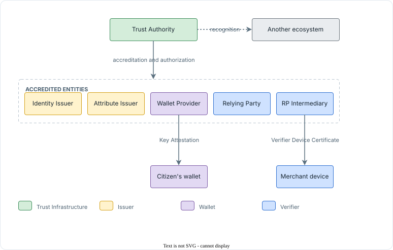
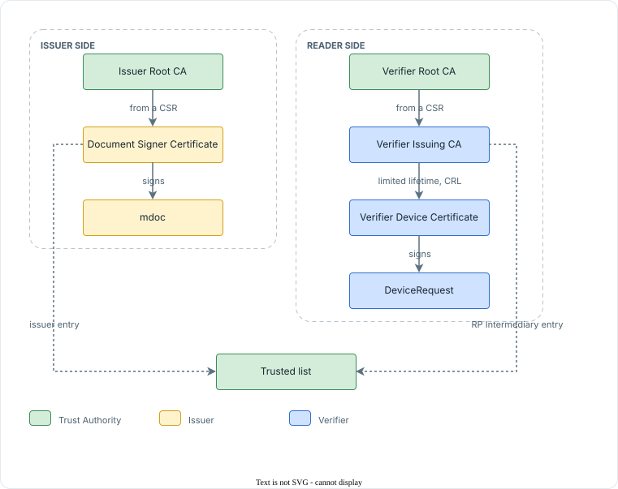
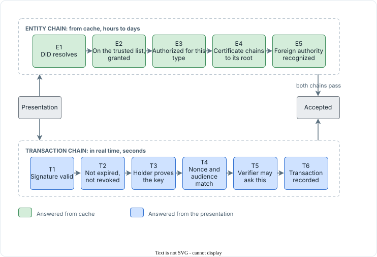

<!-- Sumber: Arsitektur Ekosistem Identitas Digital v0.2, §5 (pengantar), §5.1, §5.2, §5.3, Kep. 8 -->

# Chain of trust {#chain-of-trust}

Trust rests on two things that do not stand in for each other. An entity's
Decentralized Identifier (DID) Document proves that a signature really is the
entity's. Trust Registry proves that the entity is authorized to have made it.
An impostor can mint a DID in five minutes; what stops them is Trust Registry.

Trust Authority accredits and authorizes every entity directly. There is no
intermediate authority: no sector body that accredits on its behalf, and no
delegation to a ministry. The long tail is absorbed on the verifier side
instead. Issuers, Relying Parties, and RP Intermediaries register with Trust
Authority; the millions of merchants are registered by their own RP
Intermediary, which vouches for each merchant's device with a Verifier Device
Certificate. The same pattern holds on the wallet side, where a Wallet Provider
vouches for each wallet installation with a Key Attestation. Which obligations
each of those parties takes on is the subject of
[RP Intermediary and merchant][rp-intermediary-and-merchant] and of
[the Wallet Provider role][wallet-provider].

A sector regulator's license, a university's accreditation, a hospital's
operating permit, a financial authority's business license, is still used, but
as evidence the applicant attaches at registration, in the same class as a
notarial deed. It is never a role in the ecosystem, and the sector regulator
does not need to know the ecosystem exists.

Another ecosystem, such as a partner country's trust registry, is tied in by
recognition rather than by accreditation: Trust Authority recognizes the
foreign authority, and a verifier asks Trust Registry over Trust Registry
Query Protocol (TRQP) whether that ecosystem is recognized, which is
[the second of the two registry queries][entity-to-trust-registry].

[The chain of trust][fig-chain-of-trust] draws who vouches for whom, and
by what.

{ #fig-chain-of-trust }

<figure markdown="1">
  { loading=lazy }
  <figcaption> The chain of trust, from Trust Authority to the devices in the field.</figcaption>
</figure>

- **Trust Authority** accredits and authorizes every entity in the band
  below it, with no authority in between.
- **Another ecosystem** is recognized, drawn dashed because recognition is
  answered on request rather than granted at registration.
- **Identity Issuer, Attribute Issuer, Wallet Provider, Relying Party, and
  RP Intermediary** are the accredited entities, each registered with Trust
  Authority directly.
- **The citizen's wallet** is vouched for by its Wallet Provider, through a
  Key Attestation.
- **The merchant device** is vouched for by its RP Intermediary, through a
  Verifier Device Certificate, and never by Trust Authority.

## Two trust anchor paths: DID and X.509 {#two-trust-anchor-paths}

Three questions get three different answers, and nothing answers more than one
of them.

- **The trusted list** answers whether an entity is recognized at all.
- **The Authority Statement**, answered over TRQP, answers what that entity
  may do, which is the subject of [Authorization][authorization].
- **The DID Document** answers only whether a signing key really belongs to it.

A DID that is absent from the trusted list is rejected however well its DID
Document resolves. Anyone can make a DID in five minutes; what stops them is
the list. Keeping the three separate, and keeping all of them cacheable, is
what lets verification continue when the parties that publish them are
unreachable.

The third question has two answers rather than one, because a verifier reaches
an anchor by one of two routes. This section sets out both: the DID route, and
the X.509 route that proximity reading obliges every reader to hold as well.

<figure markdown="1" class="ekdn-table">

| Route | Anchor | Proof of the issuer's identity | Proof of the verifier's identity |
|---|---|---|---|
| OpenID4VP, carrying SD-JWT VC and `ldp_vc` | DID plus the trusted list | The DID Document and the issuer's entry in the trusted list | `client_id` as `did:webvh` for a Relying Party and an RP Intermediary; the Verifier Device Certificate for a merchant, the same certificate it uses offline |
| ISO/IEC 18013-5, carrying mdoc | The Issuer Root CA, an X.509 root | The Document Signer Certificate in `x5chain`, chained to the Issuer Root CA and distributed through the VICAL | The Verifier Device Certificate, chained to the Verifier Root CA |

</figure>

The DID route is the one every online transaction takes, and the pages on
[the trusted list][trusted-list] and [the DID Document][did-document] cover
its two artifacts. The X.509 route exists because ISO/IEC 18013-5 knows no
DID: an mdoc is signed under a certificate, and a reader authenticates with
one. It is built from two certificate authority (CA) roots, one for each
side of a proximity session, and the rest of this section describes them.
[The two anchor paths][fig-two-trust-anchor-paths] draws both chains side
by side.

{ #fig-two-trust-anchor-paths }

<figure markdown="1">
  { loading=lazy }
  <figcaption> The two X.509 chains, issuer side and reader side, and where each meets the trusted list.</figcaption>
</figure>

- **Issuer Root CA** is Trust Authority's root for the issuer side.
- **Document Signer Certificate** is the issuer's leaf, issued from a CSR.
- **mdoc** is what that leaf signs.
- **Verifier Root CA** is Trust Authority's root for the reader side.
- **Verifier Issuing CA** is the intermediate held by an RP Intermediary,
  or by a Relying Party that reads in proximity, issued from a CSR.
- **Verifier Device Certificate** is the leaf for one reader device, with a
  limited lifetime and a CRL.
- **DeviceRequest** is what that leaf signs.
- **Trusted list** carries the issuer's entry and the RP Intermediary's
  entry, which is how a wallet or reader ties either chain to an accredited
  entity.

### The issuer side: Issuer Root CA and Document Signer Certificate {#the-issuer-side}

The issuer side proves that a credential is genuine. Its root is the
**Issuer Root CA**, a self-signed certificate that Trust Authority holds in an
offline hardware security module (HSM). ISO/IEC 18013-5 calls this root the
Issuing Authority Certificate Authority (IACA), and
[the naming section][naming-and-its-isoiec-18013-5-equivalents] keeps the
two names side by side.

Under the root sits the issuer's leaf, the **Document Signer Certificate**
(DSC). An issuer holds one unless the Governance Profile lets it hold one per
group of credential types, which it may do where the types' certificate
lifetimes differ; the architecture fixes nothing about the count, because the
mdoc carries whichever DSC signed it. The issuer's own Key Manager generates the `issuance-cose` key, signs a
certificate signing request (CSR) with it, and Trust Authority issues the DSC
from that request, so the certificate introduces no new key and Trust
Authority never holds the private half.
[An issuer's keys][an-issuers-keys] sets out that key beside the issuer's
others. The DSC carries the extended key usage (EKU) `1.0.18013.5.1.2`, and
the key it certifies signs the `IssuerAuth` of every mdoc the issuer
produces. The mdoc carries the DSC in `x5chain`, so a reader finds the
certificate inside the credential it is checking.

There is no intermediate certificate between the two. ISO/IEC 18013-5 Annex B
limits the chain to the root and the leaf, and the Issuer Root CA is built
with a path length of zero accordingly. The issuer appears in the trusted
list as itself; its DSC reaches readers in two ways. A reader inside the
ecosystem learns the Issuer Root CA at build time, through Trust SDK, and
reads the issuer's standing from the cached trusted list. A reader abroad,
which never sees the trusted list, learns the root from the Verified Issuer
Certificate Authority List (VICAL) that Trust Registry publishes under
ISO/IEC 18013-5 Annex C, and [the VICAL][vical] says what that list carries.

### The reader side: Verifier Root CA, Verifier Issuing CA, Verifier Device Certificate {#the-reader-side}

The reader side proves that the party asking is authorized to ask. Its root is
the **Verifier Root CA**, a second self-signed certificate that Trust
Authority holds in a second offline HSM.

This side has three levels where the issuer side has two. Under the root sits
a **Verifier Issuing CA** for each RP Intermediary, and for each Relying Party
that reads credentials in proximity at its own counter. The entity generates
the key itself and submits a CSR through Trust Authority, which issues the
Verifier Issuing CA certificate from the Verifier Root CA, in the same way a
DSC is issued on the issuer side. Because that key signs a certificate for
every reader device and the CRL that withdraws one, it may not live in the
software driver; [a verifier's keys][a-verifiers-keys] says which drivers
may hold it. Under each Verifier Issuing CA sits one
**Verifier Device Certificate** per reader device, with a limited lifetime,
the EKU `1.0.18013.5.1.6`, and a `ReaderAuthRole` extension that names the
attributes the device may request. The entity that holds the Verifier Issuing
CA issues these device certificates itself and publishes the certificate
revocation list (CRL) that withdraws one early; Trust Authority issues no
device certificate at all.
[A verifier's keys][a-verifiers-keys] and [keys on devices][keys-on-devices]
cover the key at each level.

The device certificate signs the ReaderAuth of a `DeviceRequest` in
proximity, and online, for a merchant, it signs the Request Object as well,
with `client_id` set to `x509_hash` and the certificate carried in `x5c`. A
merchant therefore holds one certificate for both channels, and
[short-lived attestations][short-lived-attestations] explains why that one
thing is a certificate rather than a DID.

A wallet checks a reader in two steps, in both channels. First it validates
the chain from the Verifier Device Certificate, through the Verifier Issuing
CA, to the Verifier Root CA it carries from build time; the root is never
downloaded. Then it confirms from the cached trusted list that the Verifier
Issuing CA in that chain belongs to an entity whose status is granted, and
from the cached CRL that the device certificate has not been withdrawn. A
merchant is never in the trusted list; what the list carries is the Verifier
Issuing CA of its RP Intermediary. That is how a wallet tells a genuine
intermediary from an invented one, and it is why a stolen Verifier Issuing CA
key is caught by the list even while its certificate still chains correctly.

The X.509 route is not reserved for merchants. Every party that reads an mdoc
in proximity holds a Verifier Device Certificate, an accredited Relying Party
at its counter included, because ISO/IEC 18013-5 gives a reader no other way
to identify itself. The same party, reading online, introduces itself by its
`did:webvh` instead and needs no certificate.

The number inside the limited lifetime, and how long a stale CRL is still
accepted offline, belong to the Governance Profile and are not yet set.

A wallet from another ecosystem reaches the reader side through the trusted
list itself. The list is a List of Trusted Entities (LoTE) under
ETSI TS 119 602, and a wallet that reads one finds each Verifier Issuing CA
beside the entity that holds it, the way a wallet in the European Union finds
its access certificate authorities on a Member State's list. What such a
wallet needs is a pointer to the IDCTF list and the Verifier Root CA to check
the chain against, and both are handed over under recognition, which the
Governance Framework governs. ISO/IEC 18013-5 is adding a reader-side
counterpart of the VICAL in its second edition; the ecosystem will publish
one for mdoc-native wallets once that edition is final, and not before, since
[the technology map][technology-map] admits no draft as a normative basis.

### Two parallel roots that never sign each other {#two-parallel-roots-that-never-sign-each-other}

The two roots are parallel and neither ever signs the other. A key leaked on
the reader side must not let anyone forge a credential, and a key leaked on
the issuer side must not let anyone pose as a reader. Each root therefore
lives in its own offline HSM at Trust Authority, and each chain is validated
to its own root alone. The two sides, level by level:

<figure markdown="1" class="ekdn-table">

| | Issuer side | Reader side |
|---|---|---|
| Root, at Trust Authority | Issuer Root CA | Verifier Root CA |
| Intermediate level | None; ISO/IEC 18013-5 limits the chain length | A Verifier Issuing CA held by an RP Intermediary, and by a Relying Party that reads in proximity |
| Leaf certificate | Document Signer Certificate, held by the issuer | Verifier Device Certificate, one per reader device, with a limited lifetime and a CRL |
| EKU of the leaf | `1.0.18013.5.1.2` | `1.0.18013.5.1.6` |
| What the leaf signs | `IssuerAuth` in a `DeviceResponse` | ReaderAuth in a `DeviceRequest`, and the Request Object of a merchant online |
| In the trusted list | The issuer's entry | The entry of the RP Intermediary, or of the Relying Party that reads in proximity, with its Verifier Issuing CA |
| Carried to another ecosystem | The VICAL, under ISO/IEC 18013-5 Annex C | The trusted list, as a LoTE, under recognition |

</figure>

The two roots are the only certificates in the ecosystem that are not issued
from a CSR, because they are self-signed. How Trust Authority replaces a root
without asking every reader and wallet to trust a new one on sight is set out
under [Trust Authority's own keys][trust-authoritys-own-keys].

### Naming and its ISO/IEC 18013-5 equivalents {#naming-and-its-isoiec-18013-5-equivalents}

The names above are used throughout IDCTF because each says what the
certificate is for. ISO/IEC 18013-5 names the same objects differently, and a
reader of both needs the mapping:

<figure markdown="1" class="ekdn-table">

| In IDCTF | In ISO/IEC 18013-5 |
|---|---|
| Issuer Root CA | IACA, the Issuing Authority Certificate Authority |
| Document Signer Certificate | DSC, the same name |
| Verifier Root CA, Verifier Issuing CA | The reader root, which the standard does not name further |
| Verifier Device Certificate | The mdoc reader authentication certificate |

</figure>

A holder never has a certificate. The two sides above account for every
certificate in the ecosystem, and a citizen's key is bound to a credential by
other means, as [holder binding][what-one-credential-carries] describes.

## Entity chain and transaction chain {#entity-chain-and-transaction-chain}

A verifier evaluates two chains on every presentation, and it needs both. The
**entity chain** is about the party that issued the credential and the party
asking for it. It is worked from cache, and its answers stay good for hours to
days. The **transaction chain** is about this one presentation. It runs in
real time, and its answers are worth seconds.
[The two chains][fig-entity-chain-and-transaction-chain] draws them one
above the other, meeting where a presentation is accepted.

{ #fig-entity-chain-and-transaction-chain }

<figure markdown="1">
  { loading=lazy }
  <figcaption> The entity chain and the transaction chain, and where they meet.</figcaption>
</figure>

The entity chain has five links, and each one closes a different door. The
first three are the DID route, the fourth is the X.509 route, and the fifth
is reached only when a credential comes from outside the ecosystem.

1. **E1, the entity's DID resolves.** The `did:webvh` log is fetched from the
   entity's own domain, every entry carries the witness proof, and the key
   that made the signature is in the DID Document. Without it, nothing ties
   the signature to a named party.
2. **E2, the entity is on the trusted list with status granted.** The cached
   list names it, and its status today is granted rather than suspended or
   withdrawn. Without it, a DID anyone minted in five minutes would pass E1
   and be accepted.
3. **E3, the entity is authorized for this credential type.** The cached
   answer to a TRQP query says its Authority Statement covers this type.
   Without it, an accredited university could sign a KTP Digital.
4. **E4, the X.509 certificate chains to the right root.** On the issuer
   side, the Document Signer Certificate in `x5chain` chains to the Issuer
   Root CA, or to a root in the VICAL; on the reader side, the Verifier
   Device Certificate chains to the Verifier Root CA, with the Verifier
   Issuing CA granted on the trusted list. This is the whole of the entity
   chain for an mdoc read in proximity, where no DID exists.
5. **E5, an authority from another ecosystem is recognized.** For a
   credential issued abroad, the cached answer to a recognition query says
   Trust Authority recognizes the foreign authority behind it.

The transaction chain has six links, and none of them can be answered in
advance, because each is about the presentation in front of the verifier.

1. **T1, the credential's signature is valid.** The signature checks against
   the key that E1 or E4 established.
2. **T2, the credential has not expired and has not been revoked.** Its own
   `exp` has not passed, and the bit the issuer's status list keeps for it is
   clear.
3. **T3, the holder proves the key the credential is bound to.** The Key
   Binding JWT (KB-JWT) is signed with the key in `cnf`, or DeviceAuth with
   the `DeviceKey`. Without it, a copied credential presents as well as the
   original.
4. **T4, the nonce and the audience match the request.** The proof in T3 was
   made for this request and this verifier, so a presentation captured
   elsewhere cannot be replayed here.
5. **T5, the verifier is authorized to request these attributes.** The wallet
   checks the attributes asked for against the Use Statement the request
   carries and, for a device certificate, against its `ReaderAuthRole`, and
   refuses the difference before the citizen is asked.
6. **T6, the transaction is recorded.** The transaction identifier, the
   `use_id` it ran under, and the consent receipt are kept, with the version
   of the trusted list the entity chain was worked from, so that a dispute
   later can ask whether the other party was trusted at that moment.

Each chain catches what the other cannot. A verifier that ran only the
transaction chain would accept a perfectly signed credential from an issuer
nobody ever accredited. A verifier that ran only the entity chain would accept
a genuine credential, stolen and replayed. Only both together catch both.

The step flows for [online verification][online-verification] and
[offline verification][offline-verification] show where each link falls in a
transaction, and [the trusted list and its cache][trusted-list-and-cache]
says how long a cached answer to the entity chain stays good.
