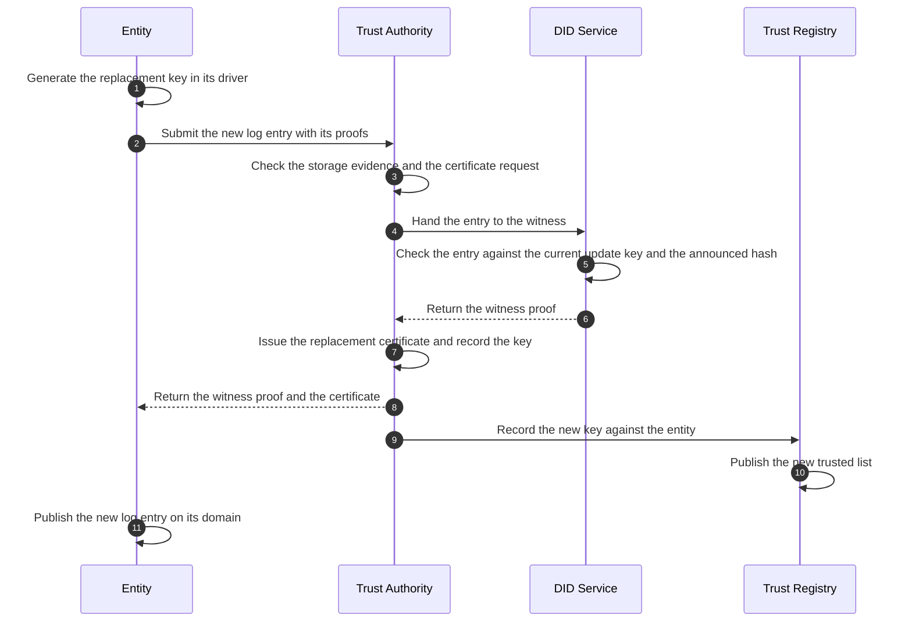

<!-- Sumber: Arsitektur Ekosistem Identitas Digital v0.2, §5.7, §5.5, §7.1, §7.7, Kep. 5, 8, 9; Rincian Module dan Operasi §3.1, §4; Panduan mdoc §8.2, §8.9; Bentuk Data Attestation §1–§3 -->

# Keys: who creates, who signs {#keys-who-creates-who-signs}

A key is born in one of three places and never leaves it. An entity's keys
are born in its own Key Manager. Trust Authority's keys are born in its own
hardware security module (HSM). A citizen's keys, and a merchant device's, are
born in the secure element of the phone. Nobody generates a key on behalf of
somebody else, and nobody holds a private key that is not their own. Trust
Authority in particular receives public keys only, through the witness on a
`did:webvh` log entry and through a certificate signing request (CSR), and
records them in its Public Key Registry.

What follows is the whole inventory, by the place a key lives. Where a
lifetime or an interval is a number, the Governance Profile sets it, and this
page says so rather than setting one.

## Three places a key can live {#three-places-a-key-can-live}

- **The entity's Key Manager.** Issuer Core, Verifier Core, and Wallet
  Backend Service each carry a Key Manager, the Component that generates,
  stores, rotates, and registers that entity's keys. A driver decides where
  the private key physically sits, and the private key never leaves the
  driver: Signing Provider asks Key Manager to sign, and gets a signature
  back, never the key.
- **Trust Authority's HSM.** It holds Trust Authority's own keys and nothing
  else: the two roots, the trusted list key, the Verified Issuer Certificate
  Authority List (VICAL) key, the Accreditation Credential key, the witness
  key in a partition of its own, and Trust Authority's own `did:webvh`
  update key. Trust Authority has no software keystore option.
- **The device's secure element.** A citizen's phone holds a credential key
  and a device key. A merchant's Mobile Verifier holds a device key. These
  keys cannot be exported or backed up, so a replaced device means new keys
  and reissued credentials.

## The entity's keys {#the-entitys-keys}

An entity holds two kinds of key: the keys it signs or decrypts with during
transactions, and one key it uses only to maintain its own identifier. Which
transaction keys it holds depends on its role.

### An issuer's keys {#an-issuers-keys}

An issuer holds four keys, all generated at onboarding in the driver it chose:

1. **`issuance-jose`**, a P-256 key published in its Decentralized
   Identifier (DID) Document. It signs SD-JWT VC credentials and the Data
   Integrity proof of `ldp_vc`.
2. **`issuance-cose`**, a P-256 key that never appears in the DID Document.
   It signs the Mobile Security Object (MSO) of an ISO mdoc, and the
   verifier learns it from the Document Signer Certificate (DSC) carried in
   `x5chain`. Trust Authority issues that certificate from a CSR the Key
   Manager signs with the key itself, which is the proof that the issuer
   holds it.
3. **`status-list`**, a P-256 key published in the DID Document beside
   `issuance-jose`. It signs the issuer's Status List Token and its
   Bitstring Status List, and nothing else.
4. **The `did:webvh` update key**, an Ed25519 key described under
   [the update key][the-update-key].

The two credential signing keys are deliberately not one key, for three
reasons, in order of weight:

- **Their lifetimes differ by an order of magnitude.** A DSC lives at most
  457 days when the mdoc is a Mobile Driving License (mDL) and at most
  3650 days for any other type, and never beyond its root. A key in a DID
  Document carries no such ceiling. One shared key would drag the DID
  Document through every certificate renewal.
- **Their blast radius stays separate.** A defect in the CBOR Object Signing
  and Encryption (COSE) path does not take the JSON Object Signing and
  Encryption (JOSE) path down with it, and the reverse.
- **The certificate stays honest.** The `keyUsage` and extended key usage in
  the DSC describe a key that really is used for that and nothing else.

The status list key is separate from both for one reason that outweighs the
cost of a third key. When a credential signing key leaks, the key is frozen
and every credential it signed has to be revoked, which means republishing the
status list. A status list signed with the frozen key cannot be republished at
the one moment it has to be. With a key of its own, the third phase of
[entity key revocation][entity-key-revocation] runs while the issuing key is
dead. IETF Token Status List allows the status issuer's key to differ from
the issuer's, so nothing in the format has to bend.

The cost is three `keyRef` values and three rotations per issuer, and both
Key Manager and Public Key Registry already carry a `purpose` field to tell
them apart.

### A verifier's keys {#a-verifiers-keys}

A Relying Party holds two transaction keys beside its update key:

1. **The Request Object key**, which signs the presentation request a wallet
   receives. Its public half is in the DID Document, and the wallet resolves
   it through the trusted list.
2. **The response encryption key**, to which the wallet encrypts the
   presentation, so that the data crosses no intermediate party in the clear.

An RP Intermediary, and a Relying Party that reads credentials in proximity,
holds one key more:

3. **The Verifier Issuing CA key**, with which it issues a Verifier Device
   Certificate to each reader device it vouches for, and signs the
   certificate revocation list (CRL) that withdraws one. Trust Authority
   issues the Verifier Issuing CA certificate from a CSR, chaining it to the
   Verifier Root CA. The device certificates themselves are described under
   [keys on devices][keys-on-devices]. This key is a certificate authority
   key, and a leak of it mints reader devices under a granted CA until the
   trusted list strikes the CA, so the Governance Profile requires it to live
   in the `cloudkms` or `pkcs11` driver and never in `software`. The
   verifier's other keys may stay in whichever driver its grade allows.

### A Wallet Provider's keys {#a-wallet-providers-keys}

A Wallet Provider holds one transaction key beside its update key: the
**Key Attestation key**, a P-256 key with which Wallet Backend Service signs
the daily Key Attestation that tells an issuer a wallet installation's keys
really sit in a secure element. It is registered the same way as an issuer's
`issuance-jose`: through the DID log and the trusted list, with no
certificate.

### The update key {#the-update-key}

Every entity holds one Ed25519 key that signs nothing a wallet or verifier
ever sees. It signs the entries of the entity's own `did.jsonl` log, the file
behind its `did:webvh` identifier, and that is its only job. Three properties
follow from the log being append-only and signed:

- **History survives rotation.** Every key the entity ever published stays in
  the log, so a resolver can replay the log and answer which key was valid
  on a given date. An old signature stays verifiable after the key that made
  it has been retired.
- **Pre-rotation closes the door on a thief.** Each entry announces the hash
  of the next update key in `nextKeyHashes`. An attacker who steals the
  current update key cannot rotate to a key of their own choosing, because
  the key they would sign in does not match the hash already committed.
- **Nothing counts without the witness.** An entry is valid only when it
  carries Trust Authority's witness proof, signed `eddsa-jcs-2022`. Every
  resolver built on Trust SDK rejects an entry without one.

The update key is Ed25519 where every other entity key is P-256, and
[where an entity key lives][where-an-entity-key-lives] says what that asks of
a driver. That is the one exception in the
ecosystem: every signature elsewhere is ES256 on P-256, and Ed25519 is
allowed for the `did:webvh` log keys alone, the update key and the witness
key, because `did:webvh` v1.0 requires it there.
[The technology map][technology-map] lists what was rejected with it:
secp256k1, RSA, Ed25519 anywhere else, a key generated anywhere but at the
entity, and an unencrypted software key.

### Where an entity key lives: three drivers {#where-an-entity-key-lives}

Key Manager talks to one of three drivers through a single interface of four
operations, `generate`, `sign`, `publicKey`, and `rotate`:

1. **`software`**, the default built into Issuer Core and Verifier Core. The
   keystore is generated by Key Manager and encrypted under a key encryption
   key (KEK) that comes from a secret manager or the environment, never from
   the same database. A key in it cannot be exported through the Console or
   the API. Recorded as `keyStorage: software`.
2. **`cloudkms`**, optional, a cloud Key Management Service (KMS) for an
   entity hosted in a cloud. Recorded as `keyStorage: cloud-kms`.
3. **`pkcs11`**, optional, an HSM, for a large institution or a high-risk
   credential type. Recorded as `keyStorage: hsm`.

The `keyStorage` value is submitted with the key and recorded in the Public
Key Registry, and it is what the issuer's
[`issuer_assurance`][issuer-assurance] grade is read from: `software` for
`low`, `cloudkms` for `substantial`, `pkcs11` for `high`, with the final
mapping set by the Governance Profile. Trust Authority writes no Authority
Statement for a credential type whose Credential Rulebook demands a higher
grade than the issuer's driver gives it, and Trust Registry answers a
permission query accordingly; KTP Digital at `high` can only be issued from
an HSM.

An entity may start on the software driver and move up later. Moving driver
is an ordinary rotation: a new key born in the new driver, a new log entry,
and a new DSC. No code in Issuer Core changes, because the driver sits behind
a service provider interface.

The update key is the one key the grade does not read. It may stay in the
software driver whatever driver the transaction keys use, because not every
HSM and not every cloud KMS can hold an Ed25519 key, and an entity whose
chosen driver cannot must still be able to maintain its identifier. The grade
loses nothing by it: the update key signs nothing a wallet or verifier ever
sees, and a thief who takes it is held by pre-rotation and by the witness, as
[the update key][the-update-key] explains. `keyStorage` is therefore
recorded, and graded, for the transaction keys.

## How an entity rotates a key {#how-an-entity-rotates-a-key}

Rotation runs the same path as onboarding, and
[entity onboarding][entity-onboarding] shows that path in full. The
difference is that the entity already has an update key, so the new log entry
is signed with it and has to match the hash the previous entry announced.
[One key rotation][fig-one-key-rotation] shows the exchange for one key.

{ #fig-one-key-rotation }

<figure markdown="1">

<figcaption> One key rotation, from the replacement key generated in the entity's driver to the log entry it publishes.</figcaption>
</figure>

1. The entity's Key Manager generates the replacement key in whichever driver
   the entity uses. If the entity is moving to a stronger driver, this is
   where the new key is born in it.

2. The entity submits one request to Trust Authority, through
   `POST /entities/me/keys`. It carries the new `did.jsonl` entry, signed
   with the current update key, naming the new key and announcing the hash
   of the next update key; a proof of possession for each new key, a
   signature over a nonce Trust Authority supplied; the `keyStorage`
   evidence of the driver the key lives in; and, when the rotated key is
   `issuance-cose` or a Verifier Issuing CA key, a CSR signed with the new
   key.

3. Trust Authority checks the governance side: the `keyStorage` value
   against the `issuer_assurance` the entity was granted, and the CSR, if
   there is one, against the certificate profile.

4. Trust Authority hands the entry to DID Service's Log Service. The entity
   never submits an entry to DID Service itself.

5. Log Service checks the chain: the signature against the current update
   key, the new key against the pre-rotation hash the previous entry
   announced, and each proof of possession.

6. Log Service returns the witness proof, signed `eddsa-jcs-2022`, to Trust
   Authority. Without it, the entry is rejected by every resolver.

7. Trust Authority issues the replacement DSC or Verifier Issuing CA
   certificate, chained to the matching root, when a CSR was submitted. It
   records the new key in the Public Key Registry, with its `purpose`, its
   `keyStorage` evidence, and its status, and writes the rotation into its
   transparency log, the append-only record of every entity event.

8. Trust Authority returns the witness proof and the certificate to the
   entity in the same exchange. A key that lives only in the DID Document
   receives the witness proof alone.

9. Trust Authority records the new key against the entity's entry in Trust
   Registry, the same way it recorded the entity's authority at onboarding.

10. Trust Registry publishes a new trusted list carrying the new key.

11. The entity publishes the new entry on its own domain, where resolvers
    read it. From this point the entity signs with the new key.

### What happens to the old key {#what-happens-to-the-old-key}

A rotated key is not deleted, and it is not marked. W3C DID Core has no
`status` property on a verification method, and a standard resolver ignores
one that is written in. The DID Document says the same thing another way: the
old key stays listed under `verificationMethod`, so that a signature it made
last year still verifies, and it leaves `assertionMethod`, so that it can no
longer sign anything new. How long the key was valid is not the DID
Document's business either: the trusted list answers that for the DID path,
and the CRL answers it for the X.509 path.

In the entity's own records a key moves through four states:

- **Active**, from generation until a replacement is issued.
- **Rotating**, while the replacement is already live and the old key is
  still accepted for what it signed before, until the transition period
  ends.
- **Retired**, once the transition period is over. It signs nothing new and
  stays in `verificationMethod`.
- **Revoked**, from any of the other three, when the key is leaked or lost,
  when the accreditation is withdrawn, or when a later finding shows a
  retired key was compromised while it was active.

### Why nobody can rotate quietly {#why-nobody-can-rotate-quietly}

Three layers make sure that Trust Authority always knows about a new key,
and each one catches an entity that skipped the layer before it:

1. **The rotation path runs through one door.** Key Manager calls Trust
   Authority as a step of the `rotate` operation itself, and Trust Authority
   is what hands the entry to the witness. There is no local-only rotation
   to perform by mistake, and no second door to pick instead.
2. **The witness requirement.** An entity that publishes a log entry without
   submitting it first has published an entry without a witness proof, and
   every Trust SDK resolver refuses the key in it.
3. **The conformance crawler.** Trust Authority monitors every entity's
   `did.jsonl` and `.well-known` documents. An unwitnessed entry is detected
   and handed to the incident process.

The same requirement sets what waits when the witness is down. An entity
cannot onboard and cannot rotate a key while DID Service is unreachable,
because an entry nobody witnessed is an entry nobody accepts. Resolution does
not wait, because every resolver replays the log from cache, and containment
does not wait either, because suspending an entity and publishing an
emergency trusted list are Trust Registry's work.
[Trust Infrastructure is not a role][trust-infrastructure-is-not-a-role]
explains why the witness stays a single one on that reasoning.

### Emergency rotation and scheduled rotation {#emergency-rotation-and-scheduled-rotation}

When a signing key leaks, rotation is the second phase of
[entity key revocation][entity-key-revocation]: the same path as above,
run the same day, with the old DSC placed on the CRL and the witness refusing
any further entry signed with the compromised key. Every credential that key
signed is then revoked, which the issuer can do because each
`issuance_record` names the `signing_key_ref` that signed it, and
[scheduled key rotation][scheduled-key-rotation-and-blast-radius] is what
keeps that list short. How often an entity rotates on schedule is a number
per key purpose, and the Governance Profile sets it. The architecture fixes
only that rotation is scheduled, that it runs the same path as above, and
that the DSC ceilings bound `issuance-cose` whatever the schedule says.

## Trust Authority's own keys {#trust-authoritys-own-keys}

Trust Authority holds the keys that every other key chains to, and holds them
in its own HSM. Each is used for one thing.

1. **Issuer Root CA.** The self-signed root of the issuing side, under the
   ISO/IEC 18013-5 name that
   [the naming section][naming-and-its-isoiec-18013-5-equivalents] maps. It
   signs every DSC and the CRL that withdraws one. It lives in an offline HSM, and
   building it to the ISO/IEC 18013-5 profile requires an HSM validated to
   FIPS 140-2 Level 3, so no software HSM is allowed even in a sandbox that
   will later become production.
2. **Verifier Root CA.** The self-signed root of the reading side. It signs
   each Verifier Issuing CA certificate. It lives in a second offline HSM,
   separate from the first, and
   [the two roots never sign each other][two-parallel-roots-that-never-sign-each-other]:
   a leak on the reader side must not let anyone forge a credential, and the
   reverse.
3. **The trusted list key.** It signs each published version of the trusted
   list, which Trust SDK reads and checks against the key it was built with.
4. **The VICAL key.** It signs each published version of the VICAL, the
   list that carries issuer roots to mdoc readers as a COSE_Sign1 structure
   under ISO/IEC 18013-5 Annex C, with an X.509 VICAL signer certificate.
   Its readers are mdoc readers abroad that never see the trusted list, which
   is why it is not the trusted list key: a different format, a different
   reader, and a different blast radius.
5. **The Accreditation Credential key.** It signs the credential an entity
   carries as evidence of its accreditation, valid for the accreditation
   period.
6. **The witness key.** It countersigns every entry of every entity's
   `did.jsonl` log. It sits in a partition of the HSM separate from the
   other six, and DID Service's Log Service is the only user of that
   partition.
7. **Trust Authority's own update key.** Trust Authority has a `did:webvh`
   identifier of its own, maintained with the same kind of Ed25519 key as
   any entity's, because the Accreditation Credential and the Use Statement
   it signs carry an issuer field a verifier resolves. Its log is
   countersigned by its own witness key, which proves nothing. What anchors
   Trust Authority is the self-certifying identifier (SCID) of that
   `did:webvh`, which Trust SDK carries at build time the way it carries the
   two roots: a Trust Authority signature is checked against the keys that
   SCID's log resolves to.

The two roots are the only certificates in the ecosystem not born from a CSR,
because they are self-signed.

### How Trust Authority's keys are replaced {#how-trust-authoritys-keys-are-replaced}

Each of the seven keys is replaced by a mechanism its own readers already
understand. None of them is replaced by asking every reader to trust a new
key on sight.

- **The two roots.** A root reaches the field at build time, so a replacement
  is planned long before it is needed and cut while the old root is still
  valid. The old root signs a link certificate over the new one, the
  mechanism ISO/IEC 18013-5 Annex B defines for an Issuing Authority
  Certificate Authority (IACA) re-key, so a reader that trusts the old root
  can follow it to the new. The new root travels through the trusted list,
  through the VICAL, and through the next release of Mobile Wallet, Mobile
  Verifier, and Trust SDK. Every DSC and every Verifier Issuing CA
  certificate under the old root runs to its own expiry; new ones are issued
  under the new root. ISO/IEC 18013-5 sets the arithmetic for a root's
  lifetime: the longest end-entity certificate it will sign, plus the period
  during which it signs, plus the lead time to distribute it on both ends.
  The numbers that go into that sum are the Governance Profile's.
- **The trusted list key and the VICAL key.** Each list announces its next
  signing key before that key signs anything. Trust SDK accepts a list under
  a new key only when a list it has already verified announced that key, the
  way the EU List of Trusted Lists pivots. A key that appears unannounced is
  refused, which is what keeps a stolen key from publishing a list of its
  own.
- **The Accreditation Credential key and Trust Authority's own update key.**
  Both are keys in Trust Authority's `did:webvh`, so they rotate the way an
  entity's keys do: a new log entry, pre-rotation, and the SCID that Trust
  SDK carries unchanged.
- **The witness key.** Described under [the witness key][the-witness-key],
  because its proofs live in every entity's log.

### The witness key {#the-witness-key}

`did:webvh` identifies a witness by its `did:key`, so a new witness key is a
new witness identifier, and each entity names the witnesses it accepts in the
`witness` parameter of its own log. Trust SDK accepts a witness proof only
from a `did:key` the trusted list names as Trust Authority's witness. That one
rule carries the whole lifecycle:

- **Rotation.** Trust Authority generates the new key in the witness
  partition and publishes its `did:key` in the trusted list beside the old
  one. Each entity's next log entry names both, with a threshold of one, so
  either key may witness it; `did:webvh` applies the change from that entry
  on. Once every entity has moved, the old `did:key` leaves the trusted list.
  There is no global switch: each entity crosses over in an entry of its own,
  on the rotation schedule it already runs.
- **What it already signed.** A witness proof for an entry stays verifiable
  against the public key inside the old `did:key` for as long as the log
  exists, and `did:webvh` keeps only the latest proof per witness, which
  covers every earlier entry. Rotation retires a key from signing and never
  from verifying.
- **Loss.** An entry that changes the witness list is witnessed by the new
  list, so a lost key does not block its own replacement. The witness
  partition is backed up for that reason, and a lost key is an incident
  rather than an outage.
- **Compromise.** A stolen witness key forges nothing on its own, because
  every entry is also signed by the entity's update key and chained to the
  entry before it. What it could do is witness an entry the entity never
  submitted through Trust Authority. Containment is the rotation above run
  the same day, with the stolen `did:key` struck from the trusted list rather
  than left beside the new one, so that no resolver built on Trust SDK counts
  its proofs on any entry after the strike.

## Keys on devices {#keys-on-devices}

A device holds keys that are generated inside its secure element and never
leave it. Nothing rotates them. A device that is lost or replaced takes its
keys with it, and the party that vouched for the device issues nothing further
for them.

### The credential key {#the-credential-key}

A citizen's wallet holds one credential key per installation, minted at the
first issuance and shared by every credential the wallet ever receives, in
every format: it is the `cnf` key of an SD-JWT VC, the `DeviceKey` of an
mdoc, and the `verificationMethod` of an `ldp_vc`. The holder's `did:key` is
derived from it, as [the holder
identifier][holder-one-didkey-per-wallet-installation] sets out. The
Credential Rulebook of a type says how well this key has to be protected,
through [`min_assurance`][min-assurance], and Issuer Core enforces that at
issuance by demanding a Key Attestation.

There is no rotation. A citizen who replaces their phone goes through
[device migration][device-migration]: the old installation's Key Attestation
is revoked, the new device enrolls, and every credential is requested again
from its issuer, because a hardware key cannot be backed up. One key for
everything has two accepted consequences: two verifiers comparing notes can
match the holder through the key, and a compromise of that one key reaches
every credential on the installation at once. Each stored credential records
which key binds it, so a later move to one key per credential would change
the wallet's key handling and nothing in any credential format.

### The device key {#the-device-key}

A wallet installation and a Mobile Verifier each hold one device key, minted
when the installation enrolls or the reader device is provisioned, and used
only in the device's dealings with the party that vouches for it. That party
knows the device by the JSON Web Key (JWK) thumbprint of this key, computed
the way RFC 7638 defines it, and never receives the key itself; [devices][devices]
covers the identifier. A phone carrying ten credentials has one credential key
beside one device key, and the two are never the same key.

### What vouches for a device key {#what-vouches-for-a-device-key}

A device key proves nothing by itself. Three statements, each signed by a
different party and each of a different lifetime, say that it is where it
claims to be and that it may do what it asks:

1. **The attestation platform**, issued by the phone's chip, Google's or
   Apple's, as an X.509 chain that lives as long as the key. It says the key
   really sits in hardware, at StrongBox or Secure Enclave strength. Only the
   vouching party reads it: Wallet Backend Service before issuing a Key
   Attestation, Verifier Core before issuing a Verifier Device Certificate.
2. **The Key Attestation**, issued daily by Wallet Backend Service and signed
   with the Wallet Provider's Key Attestation key. It names the credential
   key and the strength of its storage, and travels with the key to the
   issuer's credential endpoint. An installation whose attestation has
   expired obtains no further credential; what it already holds goes on
   being presented, because expiry
   [blocks issuance only][wallet-registration-and-attestation].
3. **The Verifier Device Certificate**, issued per reader device from the
   Verifier Issuing CA of the RP Intermediary, or of the Relying Party that
   owns the counter device, with a limited lifetime and a CRL for a device
   withdrawn before it expires. The wallet checks it against the Verifier
   Root CA built into the wallet, and
   [short-lived attestations][short-lived-attestations] explains why a
   certificate rather than a DID identifies a merchant.
